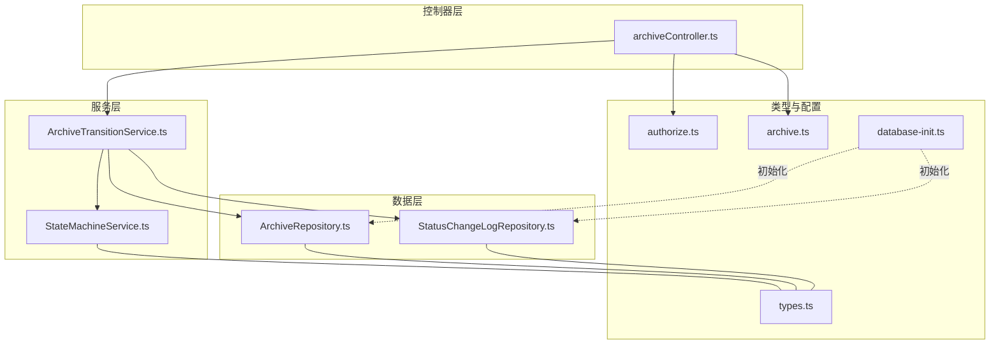
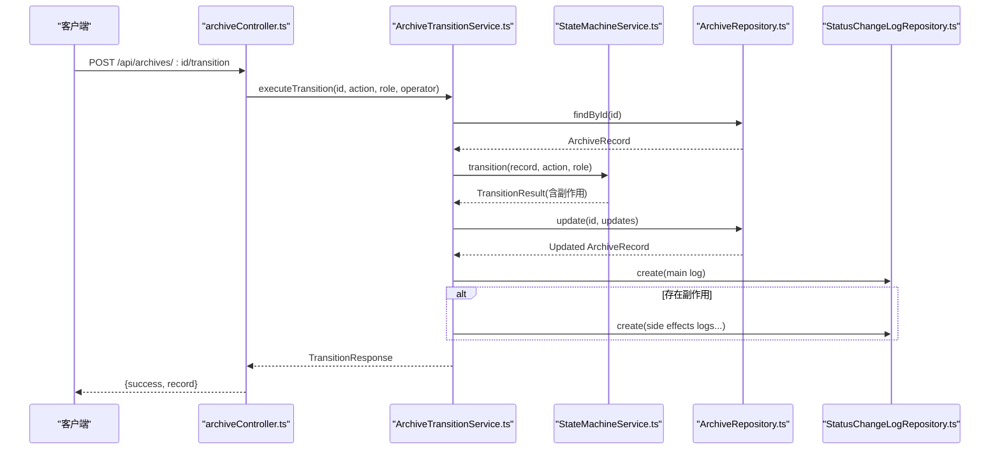
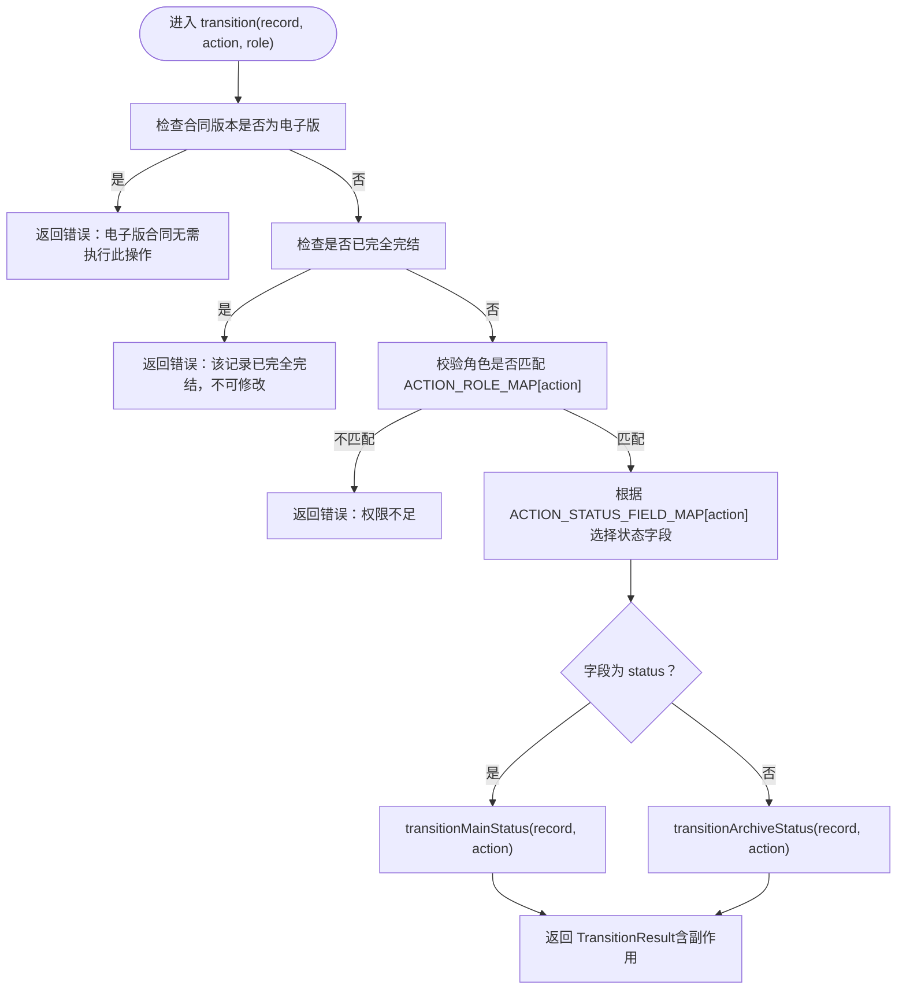
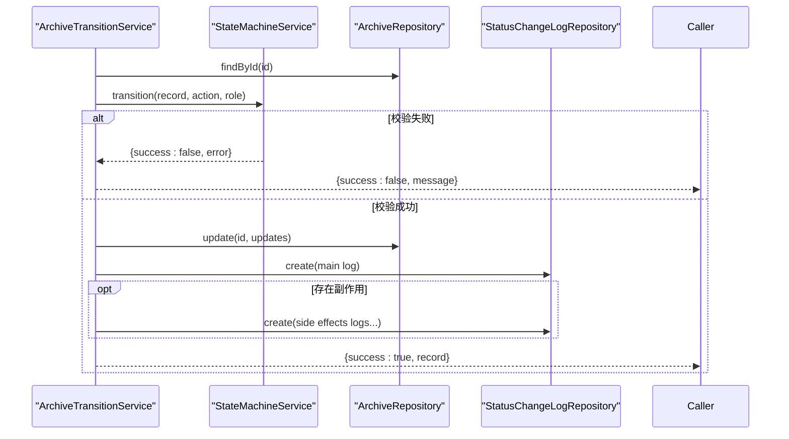
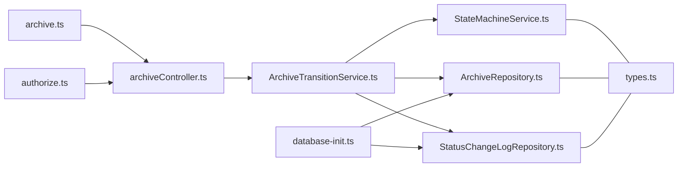
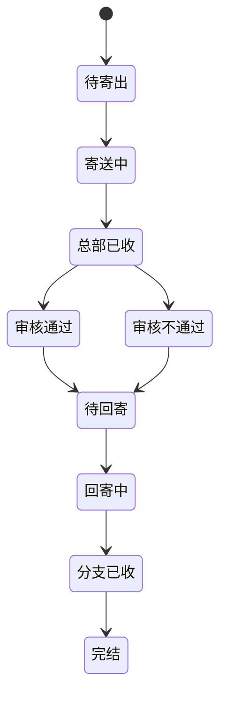

# 状态机服务

<cite>
**本文引用的文件**
- [StateMachineService.ts](file://backend/src/services/StateMachineService.ts)
- [ArchiveTransitionService.ts](file://backend/src/services/ArchiveTransitionService.ts)
- [StatusChangeLogRepository.ts](file://backend/src/models/StatusChangeLogRepository.ts)
- [ArchiveRepository.ts](file://backend/src/models/ArchiveRepository.ts)
- [archiveController.ts](file://backend/src/controllers/archiveController.ts)
- [archive.ts](file://backend/src/routes/archive.ts)
- [types.ts](file://shared/types.ts)
- [database-init.ts](file://backend/src/database-init.ts)
- [authorize.ts](file://backend/src/middlewares/authorize.ts)
- [stateMachine.test.ts](file://backend/tests/unit/stateMachine.test.ts)
- [archiveTransition.test.ts](file://backend/tests/unit/archiveTransition.test.ts)
</cite>

## 目录
1. [简介](#简介)
2. [项目结构](#项目结构)
3. [核心组件](#核心组件)
4. [架构总览](#架构总览)
5. [详细组件分析](#详细组件分析)
6. [依赖关系分析](#依赖关系分析)
7. [性能考量](#性能考量)
8. [故障排查指南](#故障排查指南)
9. [结论](#结论)
10. [附录](#附录)

## 简介
本文件面向状态机服务，系统化阐述档案记录的业务流程控制与状态机设计。重点覆盖：
- 主流程状态管理与归档状态管理的转换规则
- 权限矩阵与条件判断
- 状态变更日志记录与审计追踪
- 批量状态流转与事务处理保证
- API 接口说明与参数校验
- 测试策略与边界条件
- 异常恢复与数据一致性保障
- 可视化流程图与扩展点说明

## 项目结构
状态机服务位于后端工程的业务层与数据层之间，采用清晰的分层职责：
- 控制器层：接收 HTTP 请求，进行参数校验与鉴权，调用服务层
- 服务层：封装状态机校验、档案更新与日志写入的完整流程
- 数据模型层：提供档案记录与状态变更日志的数据访问能力
- 类型定义：前后端共享的状态、动作、角色等类型
- 路由与中间件：注册 API 路由与权限校验

**图表来源**
- [archiveController.ts:1-448](file://backend/src/controllers/archiveController.ts#L1-L448)
- [StateMachineService.ts:1-253](file://backend/src/services/StateMachineService.ts#L1-L253)
- [ArchiveTransitionService.ts:1-156](file://backend/src/services/ArchiveTransitionService.ts#L1-L156)
- [ArchiveRepository.ts:1-307](file://backend/src/models/ArchiveRepository.ts#L1-L307)
- [StatusChangeLogRepository.ts:1-99](file://backend/src/models/StatusChangeLogRepository.ts#L1-L99)
- [archive.ts:1-42](file://backend/src/routes/archive.ts#L1-L42)
- [authorize.ts:1-47](file://backend/src/middlewares/authorize.ts#L1-L47)
- [database-init.ts:1-65](file://backend/src/database-init.ts#L1-L65)
- [types.ts:1-289](file://shared/types.ts#L1-L289)

**章节来源**
- [archiveController.ts:1-448](file://backend/src/controllers/archiveController.ts#L1-L448)
- [archive.ts:1-42](file://backend/src/routes/archive.ts#L1-L42)
- [types.ts:1-289](file://shared/types.ts#L1-L289)

## 核心组件
- 状态机服务：负责主流程与归档状态的合法性校验、角色权限校验、以及联动副作用（如 review_pass 联动 archive_status、confirm_return_received 的自动判断）
- 状态流转服务：整合状态机校验、档案记录更新、状态变更日志写入，并提供批量流转能力
- 数据访问层：
  - 档案记录仓库：提供创建、查询、更新、分页查询等功能
  - 状态变更日志仓库：提供日志写入与按档案 ID 查询
- 控制器与路由：暴露状态流转 API，进行参数校验与鉴权
- 类型定义：统一的状态、动作、角色、权限等类型

**章节来源**
- [StateMachineService.ts:1-253](file://backend/src/services/StateMachineService.ts#L1-L253)
- [ArchiveTransitionService.ts:1-156](file://backend/src/services/ArchiveTransitionService.ts#L1-L156)
- [ArchiveRepository.ts:1-307](file://backend/src/models/ArchiveRepository.ts#L1-L307)
- [StatusChangeLogRepository.ts:1-99](file://backend/src/models/StatusChangeLogRepository.ts#L1-L99)
- [types.ts:1-289](file://shared/types.ts#L1-L289)

## 架构总览
状态机服务遵循“校验-更新-记录”的三段式流程，确保每次状态变更的可追溯性与一致性。

**图表来源**
- [archiveController.ts:208-258](file://backend/src/controllers/archiveController.ts#L208-L258)
- [ArchiveTransitionService.ts:46-125](file://backend/src/services/ArchiveTransitionService.ts#L46-L125)
- [StateMachineService.ts:106-142](file://backend/src/services/StateMachineService.ts#L106-L142)
- [ArchiveRepository.ts:140-174](file://backend/src/models/ArchiveRepository.ts#L140-L174)
- [StatusChangeLogRepository.ts:56-79](file://backend/src/models/StatusChangeLogRepository.ts#L56-L79)

## 详细组件分析

### 状态机服务（StateMachineService）
- 设计原则
  - 双状态字段：主流程状态（status）与综合部归档状态（archive_status）
  - 显式转换表：分别维护主流程与归档状态的合法转换
  - 权限矩阵：每个动作绑定特定角色
  - 前置保护：电子版合同与完全完结记录禁止状态变更
  - 联动副作用：review_pass 自动激活归档流程；confirm_return_received 根据归档状态自动回退或完结
- 关键实现要点
  - 前置校验：电子版合同保护、完全完结保护、角色校验
  - 主流程转换：基于当前状态与动作查找目标状态，必要时返回副作用
  - 归档状态转换：严格限制“已完成转交”后的非法操作
  - 辅助判定：isFullyCompleted 仅当 status === 'completed'

**图表来源**
- [StateMachineService.ts:106-142](file://backend/src/services/StateMachineService.ts#L106-L142)
- [StateMachineService.ts:144-203](file://backend/src/services/StateMachineService.ts#L144-L203)
- [StateMachineService.ts:205-243](file://backend/src/services/StateMachineService.ts#L205-L243)

**章节来源**
- [StateMachineService.ts:1-253](file://backend/src/services/StateMachineService.ts#L1-L253)

### 状态流转服务（ArchiveTransitionService）
- 职责
  - 单条状态流转：查询记录 → 状态机校验 → 更新记录 → 写入日志（主变更 + 副作用）
  - 批量状态流转：逐条执行，汇总结果
- 事务处理保证
  - 采用“先校验，再更新，最后写日志”的顺序，确保失败时不写入日志
  - 由于 SQLite 在单连接下具备 ACID 基本特性，结合上述顺序可满足大多数场景的一致性需求
  - 若需更强一致性，可在上层引入显式事务包装（建议）

**图表来源**
- [ArchiveTransitionService.ts:46-125](file://backend/src/services/ArchiveTransitionService.ts#L46-L125)

**章节来源**
- [ArchiveTransitionService.ts:1-156](file://backend/src/services/ArchiveTransitionService.ts#L1-L156)

### 数据访问层
- 档案记录仓库
  - 提供创建、查询、按资金账号查询、更新、编辑基础信息、分页查询
  - 更新时自动更新 updated_at
- 状态变更日志仓库
  - 写入日志并返回最新记录
  - 支持按档案 ID 查询历史（按时间倒序）

**章节来源**
- [ArchiveRepository.ts:1-307](file://backend/src/models/ArchiveRepository.ts#L1-L307)
- [StatusChangeLogRepository.ts:1-99](file://backend/src/models/StatusChangeLogRepository.ts#L1-L99)

### 控制器与路由
- 单条状态流转
  - 校验 action 是否在合法集合内
  - 调用状态流转服务，返回成功或错误信息
- 批量状态流转
  - 校验 archiveIds 与 action
  - 调用批量执行服务，返回汇总结果
- 权限与鉴权
  - 路由层使用 authenticate 中间件
  - authorize 中间件按权限集合校验角色

**章节来源**
- [archiveController.ts:190-324](file://backend/src/controllers/archiveController.ts#L190-L324)
- [archive.ts:1-42](file://backend/src/routes/archive.ts#L1-L42)
- [authorize.ts:1-47](file://backend/src/middlewares/authorize.ts#L1-L47)

### 类型与约束
- 状态、动作、角色、权限等类型集中定义于共享类型文件
- 数据库初始化脚本定义了表结构与 CHECK 约束，确保状态值域合法

**章节来源**
- [types.ts:1-289](file://shared/types.ts#L1-L289)
- [database-init.ts:1-65](file://backend/src/database-init.ts#L1-L65)

## 依赖关系分析
- 控制器依赖服务层与数据访问层
- 服务层依赖状态机与数据访问层
- 状态机依赖类型定义
- 路由依赖控制器与中间件
- 数据库初始化脚本为数据访问层提供表结构

**图表来源**
- [archiveController.ts:1-448](file://backend/src/controllers/archiveController.ts#L1-L448)
- [ArchiveTransitionService.ts:1-156](file://backend/src/services/ArchiveTransitionService.ts#L1-L156)
- [StateMachineService.ts:1-253](file://backend/src/services/StateMachineService.ts#L1-L253)
- [ArchiveRepository.ts:1-307](file://backend/src/models/ArchiveRepository.ts#L1-L307)
- [StatusChangeLogRepository.ts:1-99](file://backend/src/models/StatusChangeLogRepository.ts#L1-L99)
- [archive.ts:1-42](file://backend/src/routes/archive.ts#L1-L42)
- [authorize.ts:1-47](file://backend/src/middlewares/authorize.ts#L1-L47)
- [database-init.ts:1-65](file://backend/src/database-init.ts#L1-L65)
- [types.ts:1-289](file://shared/types.ts#L1-L289)

**章节来源**
- [archiveController.ts:1-448](file://backend/src/controllers/archiveController.ts#L1-L448)
- [archive.ts:1-42](file://backend/src/routes/archive.ts#L1-L42)

## 性能考量
- 数据库层面
  - 为关键查询字段建立索引（资金账号、营业部、主状态、归档状态、合同版本类型）
  - 使用单连接下的原子性操作，减少锁竞争
- 服务层面
  - 单条流转为 O(1) 操作，批量流转为 O(n)
  - 日志写入为独立事务，避免阻塞主流程
- 建议
  - 对高频批量操作可考虑分批提交与并发度控制
  - 对复杂查询可引入缓存（如状态统计）

[本节为通用性能讨论，不直接分析具体文件]

## 故障排查指南
- 常见错误与定位
  - 电子版合同：状态机直接拒绝，不写入日志
  - 完全完结记录：拒绝所有状态变更
  - 角色不匹配：返回权限不足
  - 非法状态跳转：返回状态流转不合法
  - 记录不存在：返回档案记录不存在
- 审计与溯源
  - 通过按档案 ID 查询状态变更历史，核对每一步操作的时间、操作人、前后状态
- 测试验证
  - 单元测试覆盖状态转换表、角色校验、电子版保护、完结保护、联动副作用、自动判断逻辑
  - 集成测试覆盖成功与失败场景、批量流转、日志写入

**章节来源**
- [archiveTransition.test.ts:365-447](file://backend/tests/unit/archiveTransition.test.ts#L365-L447)
- [stateMachine.test.ts:409-468](file://backend/tests/unit/stateMachine.test.ts#L409-L468)
- [StatusChangeLogRepository.ts:90-97](file://backend/src/models/StatusChangeLogRepository.ts#L90-L97)

## 结论
状态机服务以清晰的转换表、严格的权限矩阵与完善的日志体系，实现了档案记录主流程与归档流程的可控流转。通过“校验-更新-记录”的三段式流程，确保了业务逻辑的正确性与审计的完整性。建议在高并发与强一致性的场景下引入显式事务与分批处理策略，进一步提升稳定性与性能。

[本节为总结性内容，不直接分析具体文件]

## 附录

### 状态转换规则与权限矩阵
- 主流程状态（8 个）
  - pending_shipment → in_transit → hq_received → review_passed/review_rejected → pending_return → return_in_transit → branch_received
  - review_pass 联动：archive_status 从 archive_not_started → pending_transfer
  - confirm_return_received 自动判断：
    - archive_status = archive_not_started → 回退到 pending_shipment
    - archive_status = archived → 完结为 completed
- 归档状态（4 个）
  - archive_not_started → pending_transfer → pending_archive → archived
  - 已归档后禁止 transfer_general 与 confirm_archive
- 权限矩阵（部分）
  - confirm_shipment：branch
  - confirm_received / review_pass / review_reject / return_branch / confirm_shipped_back：operator
  - confirm_return_received：branch
  - transfer_general：operator
  - confirm_archive：general_affairs

**章节来源**
- [StateMachineService.ts:29-81](file://backend/src/services/StateMachineService.ts#L29-L81)
- [types.ts:14-43](file://shared/types.ts#L14-L43)

### API 接口说明
- 单条状态流转
  - 方法：POST
  - 路径：/api/archives/:id/transition
  - 请求体：action（TransitionAction）
  - 鉴权：authenticate + 状态机内部角色校验
  - 响应：{success, record}
- 批量状态流转
  - 方法：POST
  - 路径：/api/archives/batch-transition
  - 请求体：{archiveIds: string[], action: TransitionAction}
  - 鉴权：authenticate
  - 响应：{successCount, failureCount, results}

**章节来源**
- [archiveController.ts:208-324](file://backend/src/controllers/archiveController.ts#L208-L324)
- [archive.ts:26-36](file://backend/src/routes/archive.ts#L26-L36)

### 参数验证规则
- 单条流转
  - action 必填且在合法集合内
- 批量流转
  - archiveIds 必填且非空数组
  - action 必填且在允许集合内（与单条一致）

**章节来源**
- [archiveController.ts:221-307](file://backend/src/controllers/archiveController.ts#L221-L307)

### 审计与日志
- 日志字段：archive_id、status_field、previous_value、new_value、action、operator_id、operator_name、operated_at
- 查询：按档案 ID 查询历史（倒序）

**章节来源**
- [StatusChangeLogRepository.ts:38-97](file://backend/src/models/StatusChangeLogRepository.ts#L38-L97)
- [types.ts:62-73](file://shared/types.ts#L62-L73)

### 批量状态流转实现与事务处理
- 实现方式：逐条执行状态机校验，汇总成功/失败
- 事务处理：采用“先校验，再更新，最后写日志”的顺序，失败不写日志
- 建议：在需要强一致性的场景引入显式事务包装

**章节来源**
- [ArchiveTransitionService.ts:127-154](file://backend/src/services/ArchiveTransitionService.ts#L127-L154)

### 测试策略与边界条件
- 单元测试
  - 覆盖状态转换表、角色校验、电子版保护、完结保护、联动副作用、自动判断逻辑
- 集成测试
  - 覆盖成功与失败场景、批量流转、日志写入、自动回退与完结
- 边界条件
  - 电子版合同、完全完结记录、角色不匹配、非法状态跳转、记录不存在

**章节来源**
- [stateMachine.test.ts:1-561](file://backend/tests/unit/stateMachine.test.ts#L1-L561)
- [archiveTransition.test.ts:1-608](file://backend/tests/unit/archiveTransition.test.ts#L1-L608)

### 异常恢复与数据一致性
- 异常恢复
  - 失败时不写入日志，避免脏数据
  - 审核不通过路径支持回退到 pending_shipment
  - 归档完成后自动完结（branch_received → completed）
- 数据一致性
  - 采用 SQLite 的原子性与持久性
  - 建议在高并发场景引入显式事务与重试策略

**章节来源**
- [StateMachineService.ts:106-142](file://backend/src/services/StateMachineService.ts#L106-L142)
- [archiveTransition.test.ts:295-360](file://backend/tests/unit/archiveTransition.test.ts#L295-L360)

### 可视化图表与流程图示例
- 主流程状态转换（示意）

- 归档状态转换（示意）

[本节为概念性流程图，不直接映射具体源文件]

### 扩展点与自定义状态添加方法
- 新增状态
  - 在类型定义中扩展枚举值
  - 在状态转换表中补充合法转换
  - 在权限矩阵中绑定角色
  - 在控制器与路由中校验新增动作
- 新增动作
  - 在类型定义中扩展动作枚举
  - 在状态转换表中定义转换
  - 在权限矩阵中绑定角色
  - 在控制器中校验动作合法性
- 注意事项
  - 保持转换表与权限矩阵一致
  - 为新状态与动作编写单元测试与集成测试
  - 确保日志字段与数据库约束兼容

**章节来源**
- [types.ts:14-43](file://shared/types.ts#L14-L43)
- [StateMachineService.ts:29-81](file://backend/src/services/StateMachineService.ts#L29-L81)
- [archiveController.ts:190-201](file://backend/src/controllers/archiveController.ts#L190-L201)