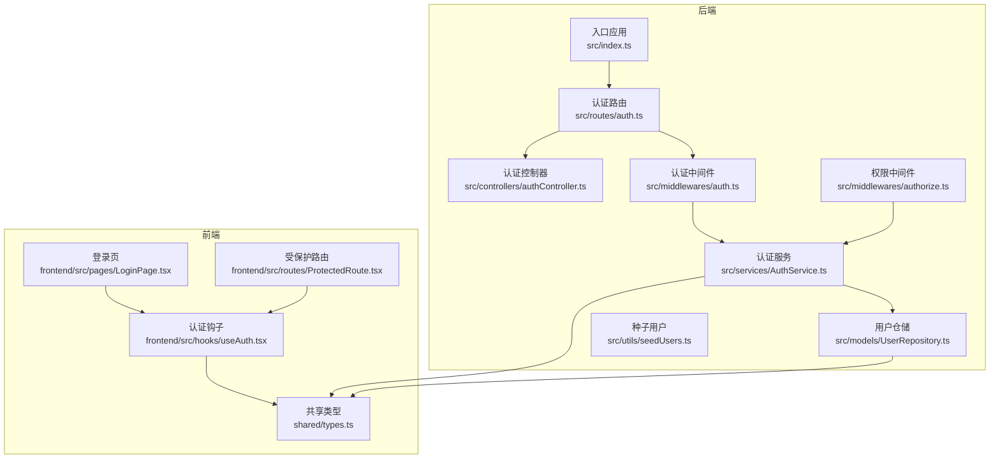
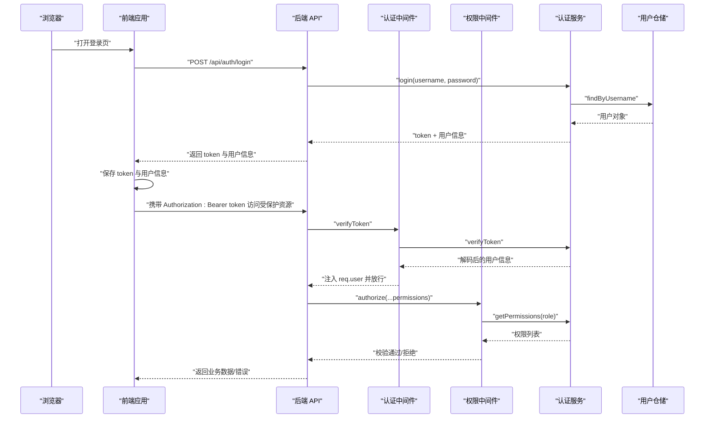
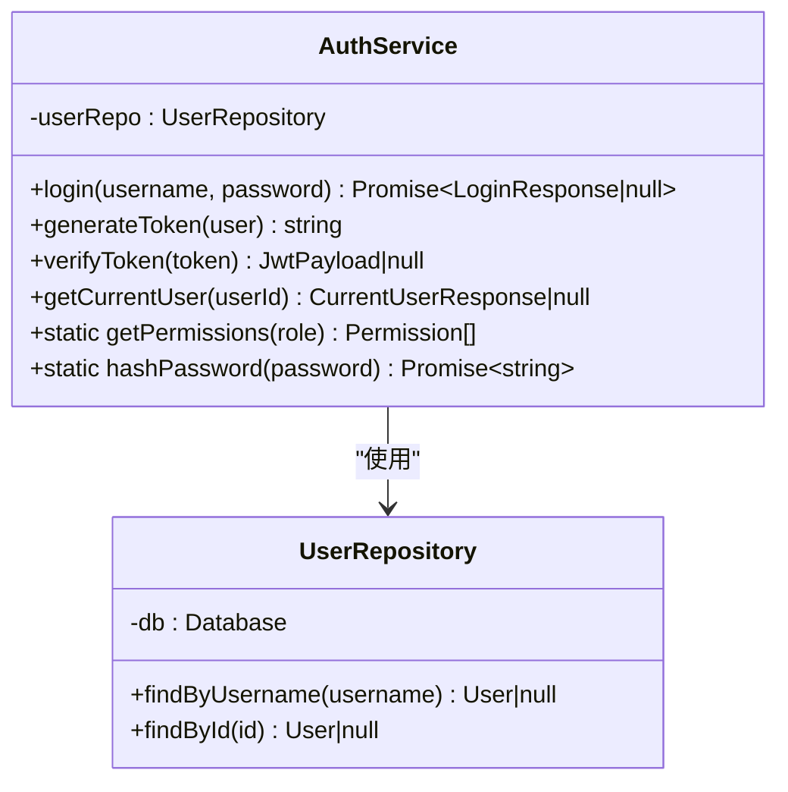
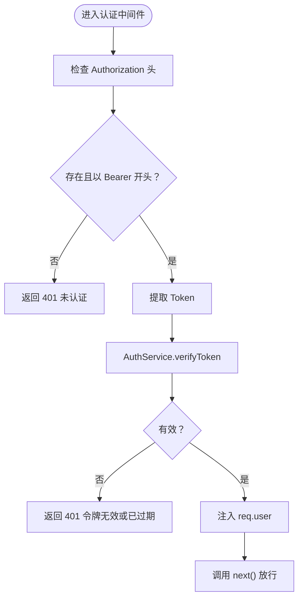
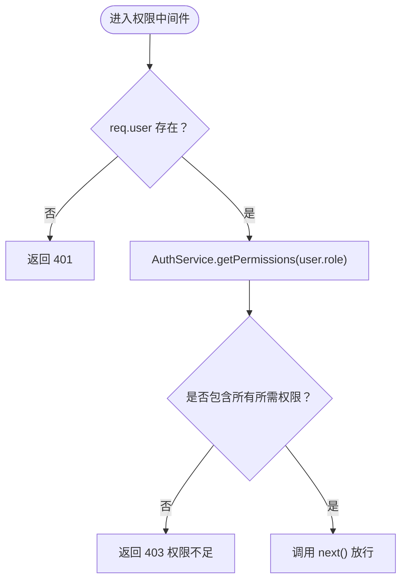
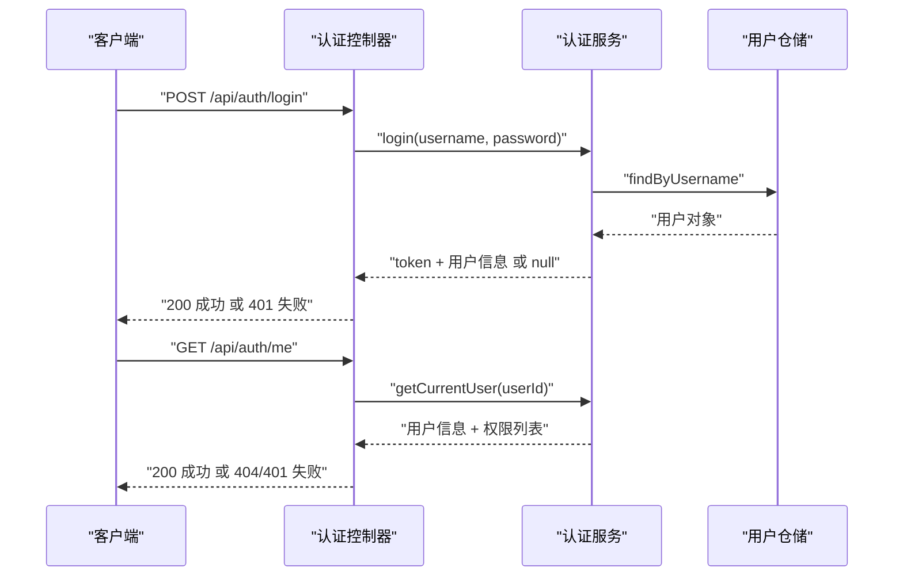
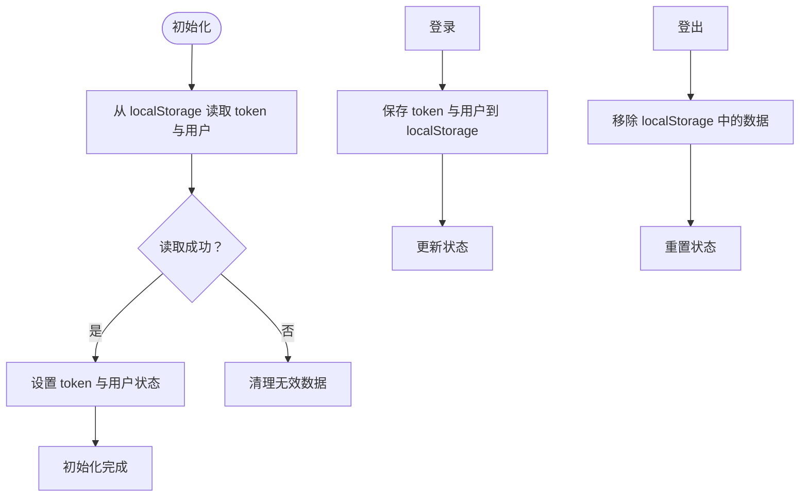
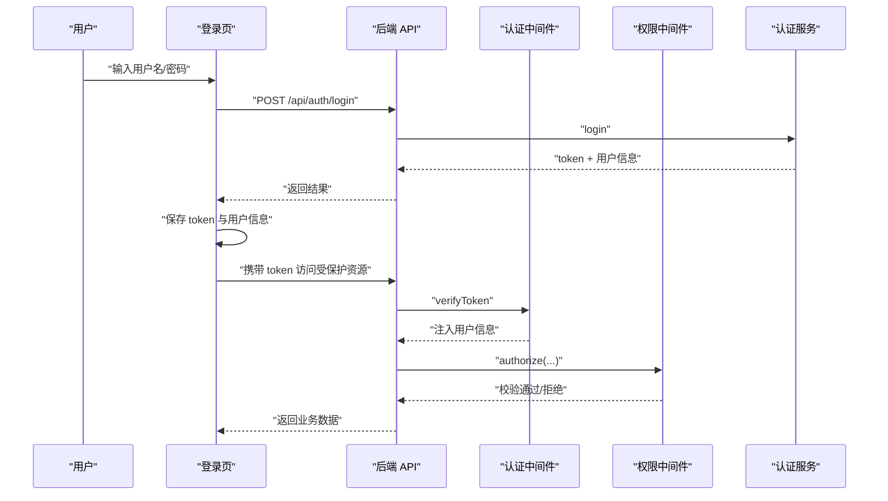
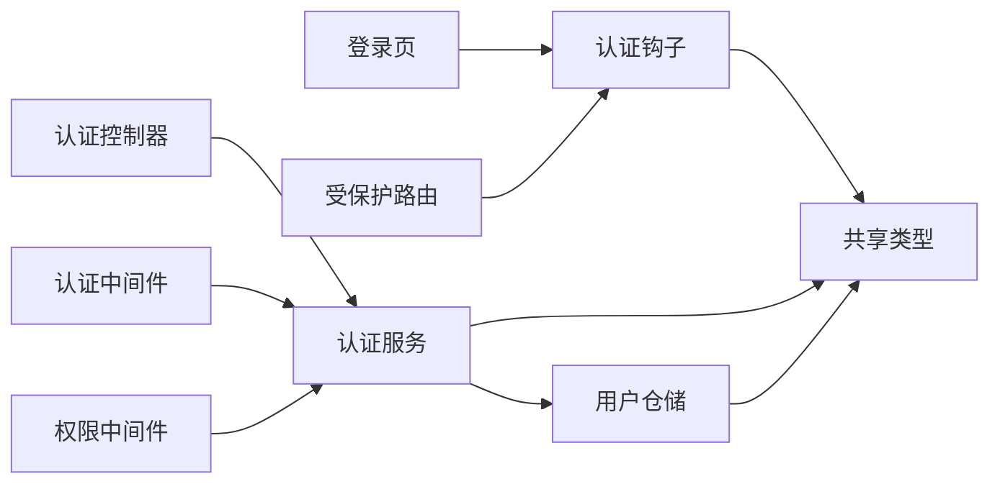

# 用户认证模块

<cite>
**本文档引用的文件**
- [backend/src/controllers/authController.ts](file://backend/src/controllers/authController.ts)
- [backend/src/middlewares/auth.ts](file://backend/src/middlewares/auth.ts)
- [backend/src/middlewares/authorize.ts](file://backend/src/middlewares/authorize.ts)
- [backend/src/services/AuthService.ts](file://backend/src/services/AuthService.ts)
- [backend/src/models/UserRepository.ts](file://backend/src/models/UserRepository.ts)
- [backend/src/routes/auth.ts](file://backend/src/routes/auth.ts)
- [backend/src/utils/seedUsers.ts](file://backend/src/utils/seedUsers.ts)
- [backend/src/index.ts](file://backend/src/index.ts)
- [backend/tests/unit/auth.test.ts](file://backend/tests/unit/auth.test.ts)
- [backend/tests/unit/authorize.test.ts](file://backend/tests/unit/authorize.test.ts)
- [frontend/src/hooks/useAuth.tsx](file://frontend/src/hooks/useAuth.tsx)
- [frontend/src/pages/LoginPage.tsx](file://frontend/src/pages/LoginPage.tsx)
- [frontend/src/routes/ProtectedRoute.tsx](file://frontend/src/routes/ProtectedRoute.tsx)
- [shared/types.ts](file://shared/types.ts)
</cite>

## 目录
1. [简介](#简介)
2. [项目结构](#项目结构)
3. [核心组件](#核心组件)
4. [架构总览](#架构总览)
5. [详细组件分析](#详细组件分析)
6. [依赖关系分析](#依赖关系分析)
7. [性能考虑](#性能考虑)
8. [故障排除指南](#故障排除指南)
9. [结论](#结论)
10. [附录](#附录)

## 简介
本文件为用户认证模块的全面安全认证文档，覆盖以下内容：
- JWT 令牌认证机制：令牌生成、验证与失效处理
- 用户登录、登出与会话管理
- 多角色权限控制：运营人员、分支机构、综合部的权限差异
- 认证中间件与权限拦截机制
- 前端身份验证钩子与状态管理
- 密码加密算法、安全令牌配置与会话超时设置
- 认证失败的错误处理与用户体验优化
- 完整的登录流程示例与安全最佳实践

## 项目结构
认证系统由前后端协作实现，后端负责认证与授权逻辑，前端负责用户交互与状态持久化。

**图表来源**
- [backend/src/index.ts:1-39](file://backend/src/index.ts#L1-L39)
- [backend/src/routes/auth.ts:1-19](file://backend/src/routes/auth.ts#L1-L19)
- [backend/src/controllers/authController.ts:1-77](file://backend/src/controllers/authController.ts#L1-L77)
- [backend/src/middlewares/auth.ts:1-56](file://backend/src/middlewares/auth.ts#L1-L56)
- [backend/src/middlewares/authorize.ts:1-47](file://backend/src/middlewares/authorize.ts#L1-L47)
- [backend/src/services/AuthService.ts:1-126](file://backend/src/services/AuthService.ts#L1-L126)
- [backend/src/models/UserRepository.ts:1-56](file://backend/src/models/UserRepository.ts#L1-L56)
- [frontend/src/pages/LoginPage.tsx:1-81](file://frontend/src/pages/LoginPage.tsx#L1-L81)
- [frontend/src/hooks/useAuth.tsx:1-90](file://frontend/src/hooks/useAuth.tsx#L1-L90)
- [frontend/src/routes/ProtectedRoute.tsx:1-31](file://frontend/src/routes/ProtectedRoute.tsx#L1-L31)
- [shared/types.ts:1-289](file://shared/types.ts#L1-L289)

**章节来源**
- [backend/src/index.ts:1-39](file://backend/src/index.ts#L1-L39)
- [backend/src/routes/auth.ts:1-19](file://backend/src/routes/auth.ts#L1-L19)
- [frontend/src/pages/LoginPage.tsx:1-81](file://frontend/src/pages/LoginPage.tsx#L1-L81)
- [frontend/src/hooks/useAuth.tsx:1-90](file://frontend/src/hooks/useAuth.tsx#L1-L90)
- [frontend/src/routes/ProtectedRoute.tsx:1-31](file://frontend/src/routes/ProtectedRoute.tsx#L1-L31)
- [shared/types.ts:1-289](file://shared/types.ts#L1-L289)

## 核心组件
- 认证服务：提供登录验证、JWT 令牌生成与校验、权限查询、密码哈希
- 认证中间件：从请求头提取 Bearer Token，校验有效性并将用户信息注入请求上下文
- 权限中间件：基于角色权限映射表校验用户是否具备所需权限
- 用户仓储：提供用户查询能力（按用户名与 ID）
- 认证控制器：处理登录与获取当前用户信息的请求
- 前端认证钩子：管理 token 与用户状态，支持本地持久化与恢复
- 受保护路由：基于角色的前端路由级权限守卫

**章节来源**
- [backend/src/services/AuthService.ts:1-126](file://backend/src/services/AuthService.ts#L1-L126)
- [backend/src/middlewares/auth.ts:1-56](file://backend/src/middlewares/auth.ts#L1-L56)
- [backend/src/middlewares/authorize.ts:1-47](file://backend/src/middlewares/authorize.ts#L1-L47)
- [backend/src/models/UserRepository.ts:1-56](file://backend/src/models/UserRepository.ts#L1-L56)
- [backend/src/controllers/authController.ts:1-77](file://backend/src/controllers/authController.ts#L1-L77)
- [frontend/src/hooks/useAuth.tsx:1-90](file://frontend/src/hooks/useAuth.tsx#L1-L90)
- [frontend/src/routes/ProtectedRoute.tsx:1-31](file://frontend/src/routes/ProtectedRoute.tsx#L1-L31)

## 架构总览
认证系统采用“后端签发令牌 + 前端携带令牌”的无状态认证模式，配合中间件实现请求级鉴权与授权。

**图表来源**
- [backend/src/controllers/authController.ts:16-43](file://backend/src/controllers/authController.ts#L16-L43)
- [backend/src/middlewares/auth.ts:26-55](file://backend/src/middlewares/auth.ts#L26-L55)
- [backend/src/middlewares/authorize.ts:16-46](file://backend/src/middlewares/authorize.ts#L16-L46)
- [backend/src/services/AuthService.ts:43-92](file://backend/src/services/AuthService.ts#L43-L92)
- [backend/src/models/UserRepository.ts:38-54](file://backend/src/models/UserRepository.ts#L38-L54)
- [frontend/src/pages/LoginPage.tsx:36-59](file://frontend/src/pages/LoginPage.tsx#L36-L59)
- [frontend/src/hooks/useAuth.tsx:59-73](file://frontend/src/hooks/useAuth.tsx#L59-L73)

## 详细组件分析

### 认证服务（AuthService）
- 职责
  - 登录验证：校验用户名与密码，成功后生成 JWT 令牌
  - 令牌生成：基于用户信息生成签名令牌，设置过期时间
  - 令牌验证：校验令牌有效性，异常时返回空
  - 权限查询：根据角色返回权限列表
  - 密码哈希：对明文密码进行哈希处理
- 关键配置
  - JWT 密钥：优先从环境变量读取，否则使用默认密钥
  - 令牌过期时间：默认 8 小时
- 角色-权限映射
  - 运营人员：多项导入、查询、审核、回寄、转交、上传扫描、OCR 等权限
  - 分支机构：查看自身档案、确认寄出、确认回寄等权限
  - 综合部：仅确认归档权限

**图表来源**
- [backend/src/services/AuthService.ts:32-125](file://backend/src/services/AuthService.ts#L32-L125)
- [backend/src/models/UserRepository.ts:31-55](file://backend/src/models/UserRepository.ts#L31-L55)

**章节来源**
- [backend/src/services/AuthService.ts:11-125](file://backend/src/services/AuthService.ts#L11-L125)
- [backend/src/models/UserRepository.ts:31-55](file://backend/src/models/UserRepository.ts#L31-L55)
- [shared/types.ts:8-130](file://shared/types.ts#L8-L130)

### 认证中间件（authenticate）
- 职责
  - 从 Authorization 请求头提取 Bearer Token
  - 调用认证服务验证令牌有效性
  - 成功则将用户信息注入 req.user，继续后续处理；失败返回 401
- 错误处理
  - 缺失或格式不正确的 Authorization 头：返回 401
  - 令牌无效或已过期：返回 401

**图表来源**
- [backend/src/middlewares/auth.ts:26-55](file://backend/src/middlewares/auth.ts#L26-L55)
- [backend/src/services/AuthService.ts:85-92](file://backend/src/services/AuthService.ts#L85-L92)

**章节来源**
- [backend/src/middlewares/auth.ts:26-55](file://backend/src/middlewares/auth.ts#L26-L55)

### 权限中间件（authorize）
- 职责
  - 在认证中间件之后执行
  - 根据所需权限列表与用户角色权限进行校验
  - 用户缺少任一所需权限时返回 403
- 特性
  - 支持多权限同时校验（必须全部满足）
  - 未注入用户信息时返回 401

**图表来源**
- [backend/src/middlewares/authorize.ts:16-46](file://backend/src/middlewares/authorize.ts#L16-L46)
- [backend/src/services/AuthService.ts:115-117](file://backend/src/services/AuthService.ts#L115-L117)

**章节来源**
- [backend/src/middlewares/authorize.ts:16-46](file://backend/src/middlewares/authorize.ts#L16-L46)

### 认证控制器（authController）
- 登录接口
  - 校验请求体参数
  - 调用认证服务执行登录
  - 登录失败返回 401
- 获取当前用户信息接口
  - 依赖认证中间件前置
  - 返回用户信息与权限列表

**图表来源**
- [backend/src/controllers/authController.ts:16-76](file://backend/src/controllers/authController.ts#L16-L76)
- [backend/src/services/AuthService.ts:43-110](file://backend/src/services/AuthService.ts#L43-L110)
- [backend/src/models/UserRepository.ts:38-54](file://backend/src/models/UserRepository.ts#L38-L54)

**章节来源**
- [backend/src/controllers/authController.ts:16-76](file://backend/src/controllers/authController.ts#L16-L76)

### 前端认证钩子（useAuth）
- 功能
  - 管理 token 与用户状态
  - 初始化时从本地存储恢复登录状态
  - 提供登录与登出方法，自动同步本地存储
  - 根据角色补全权限列表
- 使用建议
  - 在应用根组件包裹 Provider
  - 通过 useAuth 获取用户信息与登录/登出方法

**图表来源**
- [frontend/src/hooks/useAuth.tsx:34-79](file://frontend/src/hooks/useAuth.tsx#L34-L79)

**章节来源**
- [frontend/src/hooks/useAuth.tsx:1-90](file://frontend/src/hooks/useAuth.tsx#L1-L90)

### 受保护路由（ProtectedRoute）
- 功能
  - 基于角色的前端路由级权限守卫
  - 未登录重定向至登录页
  - 角色不匹配重定向至无权限页
- 使用建议
  - 为不同角色的页面配置允许访问的角色列表

**章节来源**
- [frontend/src/routes/ProtectedRoute.tsx:10-30](file://frontend/src/routes/ProtectedRoute.tsx#L10-L30)

### 登录流程（完整示例）
- 步骤
  1) 用户在登录页输入凭据并提交
  2) 前端调用后端登录接口
  3) 后端验证用户名与密码，生成 JWT 令牌
  4) 前端保存令牌与用户信息
  5) 后续请求携带 Authorization: Bearer token
  6) 后端认证中间件验证令牌并注入用户信息
  7) 权限中间件校验角色权限
  8) 返回业务数据或错误

**图表来源**
- [frontend/src/pages/LoginPage.tsx:36-59](file://frontend/src/pages/LoginPage.tsx#L36-L59)
- [backend/src/controllers/authController.ts:16-43](file://backend/src/controllers/authController.ts#L16-L43)
- [backend/src/middlewares/auth.ts:26-55](file://backend/src/middlewares/auth.ts#L26-L55)
- [backend/src/middlewares/authorize.ts:16-46](file://backend/src/middlewares/authorize.ts#L16-L46)
- [backend/src/services/AuthService.ts:43-92](file://backend/src/services/AuthService.ts#L43-L92)

**章节来源**
- [frontend/src/pages/LoginPage.tsx:24-59](file://frontend/src/pages/LoginPage.tsx#L24-L59)
- [backend/src/controllers/authController.ts:16-43](file://backend/src/controllers/authController.ts#L16-L43)

## 依赖关系分析
- 后端依赖
  - jsonwebtoken：JWT 令牌生成与验证
  - bcryptjs：密码哈希
  - better-sqlite3：本地数据库访问
- 前端依赖
  - React 上下文：状态管理
  - Ant Design：UI 组件
  - axios：HTTP 客户端

**图表来源**
- [backend/src/controllers/authController.ts:7-30](file://backend/src/controllers/authController.ts#L7-L30)
- [backend/src/middlewares/auth.ts:7-41](file://backend/src/middlewares/auth.ts#L7-L41)
- [backend/src/middlewares/authorize.ts:7-29](file://backend/src/middlewares/authorize.ts#L7-L29)
- [backend/src/services/AuthService.ts:6-8](file://backend/src/services/AuthService.ts#L6-L8)
- [frontend/src/pages/LoginPage.tsx:5-7](file://frontend/src/pages/LoginPage.tsx#L5-L7)
- [frontend/src/hooks/useAuth.tsx:1-2](file://frontend/src/hooks/useAuth.tsx#L1-L2)
- [shared/types.ts:1-4](file://shared/types.ts#L1-L4)

**章节来源**
- [backend/package.json:14-22](file://backend/package.json#L14-L22)
- [frontend/src/pages/LoginPage.tsx:5-7](file://frontend/src/pages/LoginPage.tsx#L5-L7)
- [frontend/src/hooks/useAuth.tsx:1-2](file://frontend/src/hooks/useAuth.tsx#L1-L2)

## 性能考虑
- 令牌过期时间：默认 8 小时，平衡安全性与用户体验
- 密码哈希成本：bcrypt 成本因子为 10，在安全性与性能间取得平衡
- 数据库查询：用户查询使用索引字段（用户名），避免全表扫描
- 前端状态：本地存储仅保存必要信息，减少内存占用

[本节为通用指导，无需特定文件来源]

## 故障排除指南
- 登录失败
  - 检查用户名与密码是否正确
  - 确认后端日志与错误响应
- 401 未认证
  - 确认请求头 Authorization 是否为 Bearer token
  - 检查令牌是否过期或被篡改
- 403 权限不足
  - 确认用户角色与所需权限是否匹配
  - 检查权限中间件的权限列表
- 前端无法保持登录状态
  - 检查浏览器本地存储是否可用
  - 确认初始化时是否正确恢复状态

**章节来源**
- [backend/src/controllers/authController.ts:20-42](file://backend/src/controllers/authController.ts#L20-L42)
- [backend/src/middlewares/auth.ts:29-50](file://backend/src/middlewares/auth.ts#L29-L50)
- [backend/src/middlewares/authorize.ts:17-45](file://backend/src/middlewares/authorize.ts#L17-L45)
- [frontend/src/hooks/useAuth.tsx:39-57](file://frontend/src/hooks/useAuth.tsx#L39-L57)

## 结论
本认证模块通过 JWT 实现无状态认证，结合认证与权限中间件确保请求级安全；前端通过认证钩子与受保护路由实现良好的用户体验。角色-权限模型清晰，便于扩展与维护。建议在生产环境中进一步强化安全配置与监控告警。

[本节为总结，无需特定文件来源]

## 附录

### 多角色权限对照表
- 运营人员：拥有导入、查询、审核、回寄、转交、上传扫描、OCR 等权限
- 分支机构：拥有查看自身档案、确认寄出、确认回寄等权限
- 综合部：仅拥有确认归档权限

**章节来源**
- [backend/src/services/AuthService.ts:25-30](file://backend/src/services/AuthService.ts#L25-L30)
- [shared/types.ts:87-102](file://shared/types.ts#L87-L102)

### 安全配置清单
- JWT 密钥：建议从环境变量读取，避免硬编码
- 令牌过期时间：默认 8 小时，可根据业务调整
- 密码哈希：bcrypt 成本因子 10，兼顾安全与性能
- 传输安全：建议启用 HTTPS 与安全的 Cookie 属性（如适用）

**章节来源**
- [backend/src/services/AuthService.ts:11-15](file://backend/src/services/AuthService.ts#L11-L15)
- [backend/src/utils/seedUsers.ts:11-19](file://backend/src/utils/seedUsers.ts#L11-L19)

### 前端身份验证钩子使用方法
- 在应用根组件包裹认证 Provider
- 使用 useAuth 获取用户信息与登录/登出方法
- 在受保护路由中使用受保护路由组件进行角色校验

**章节来源**
- [frontend/src/hooks/useAuth.tsx:34-79](file://frontend/src/hooks/useAuth.tsx#L34-L79)
- [frontend/src/routes/ProtectedRoute.tsx:10-30](file://frontend/src/routes/ProtectedRoute.tsx#L10-L30)

### 单元测试要点
- 登录：用户名/密码正确与错误、分支机构用户 branchName 返回
- 令牌：生成与验证、无效令牌处理
- 权限：角色权限列表、多权限校验、缺失权限返回 403
- 哈希：密码哈希后可正确校验

**章节来源**
- [backend/tests/unit/auth.test.ts:45-162](file://backend/tests/unit/auth.test.ts#L45-L162)
- [backend/tests/unit/authorize.test.ts:34-204](file://backend/tests/unit/authorize.test.ts#L34-L204)