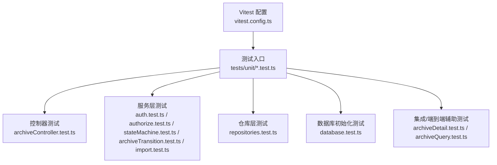
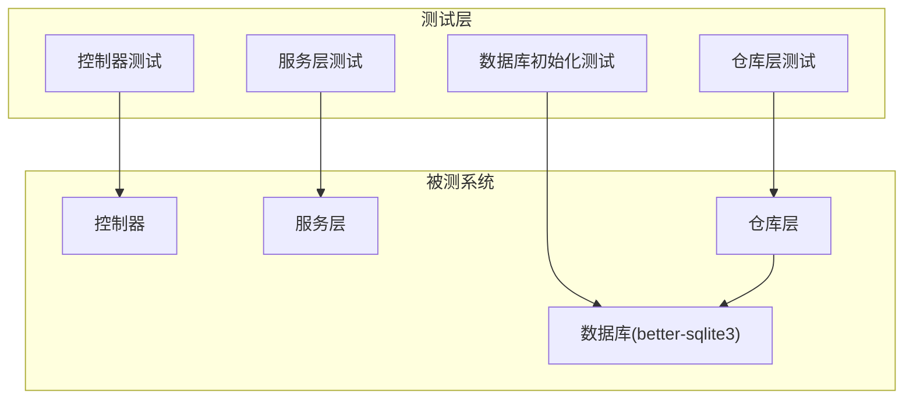
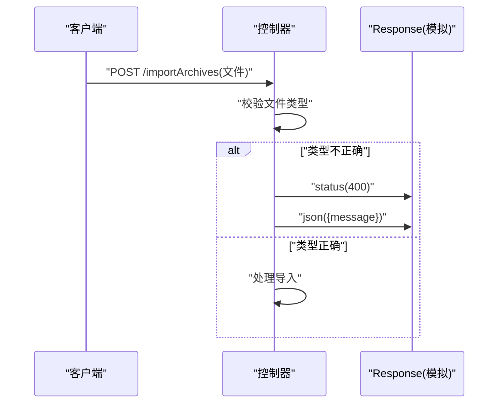
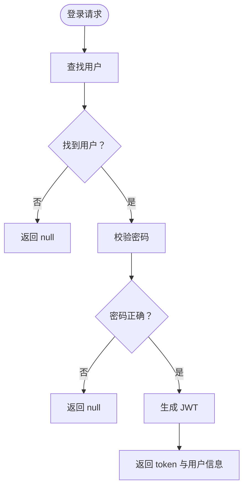
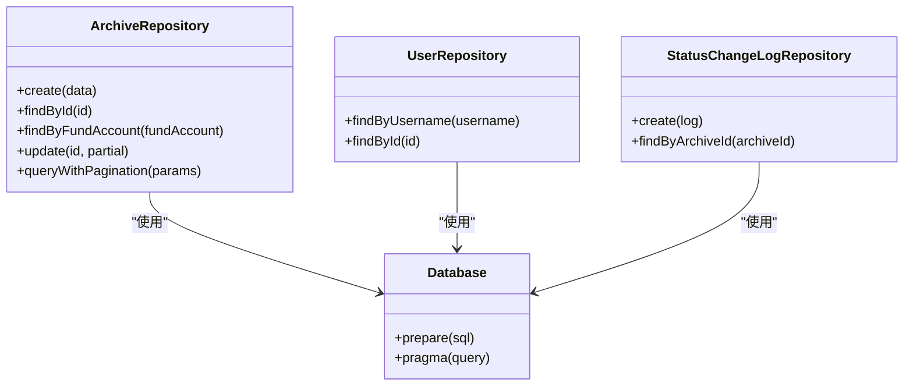
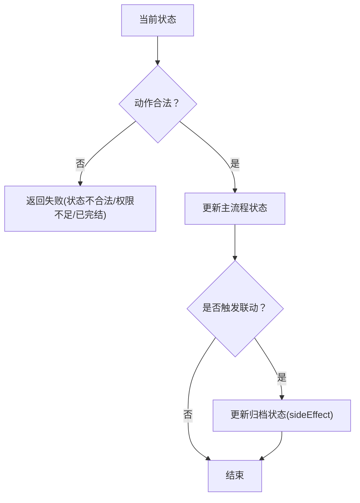
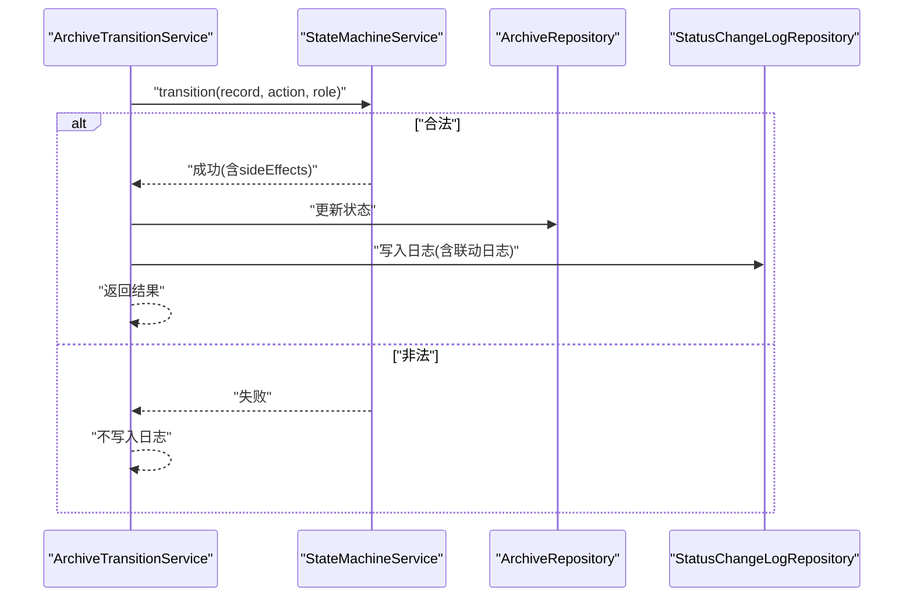
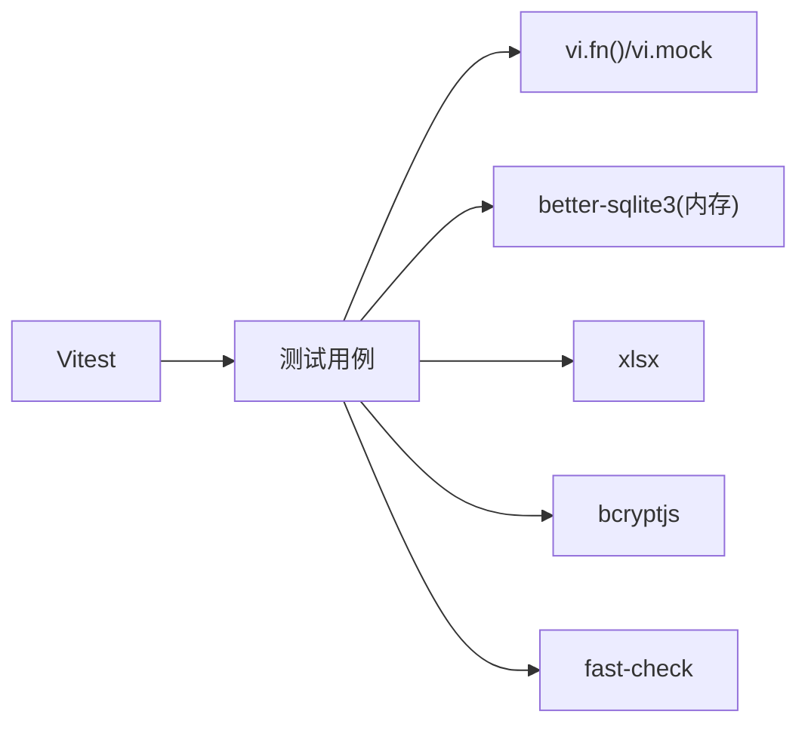

# 单元测试

<cite>
**本文引用的文件**
- [vitest.config.ts](file://backend/vitest.config.ts)
- [package.json](file://backend/package.json)
- [setup.test.ts](file://backend/tests/unit/setup.test.ts)
- [repositories.test.ts](file://backend/tests/unit/repositories.test.ts)
- [database.test.ts](file://backend/tests/unit/database.test.ts)
- [auth.test.ts](file://backend/tests/unit/auth.test.ts)
- [authorize.test.ts](file://backend/tests/unit/authorize.test.ts)
- [archiveController.test.ts](file://backend/tests/unit/archiveController.test.ts)
- [archiveDetail.test.ts](file://backend/tests/unit/archiveDetail.test.ts)
- [archiveQuery.test.ts](file://backend/tests/unit/archiveQuery.test.ts)
- [import.test.ts](file://backend/tests/unit/import.test.ts)
- [stateMachine.test.ts](file://backend/tests/unit/stateMachine.test.ts)
- [archiveTransition.test.ts](file://backend/tests/unit/archiveTransition.test.ts)
</cite>

## 目录
1. [简介](#简介)
2. [项目结构](#项目结构)
3. [核心组件](#核心组件)
4. [架构总览](#架构总览)
5. [详细组件分析](#详细组件分析)
6. [依赖关系分析](#依赖关系分析)
7. [性能考量](#性能考量)
8. [故障排查指南](#故障排查指南)
9. [结论](#结论)
10. [附录](#附录)

## 简介
本文件系统性地文档化了该项目后端的单元测试体系，涵盖 Vites 框架的配置与使用、测试文件组织与命名约定、各模块（控制器、服务层、仓库层、中间件、数据库初始化）的测试实现与设计原则，并提供测试数据准备与清理策略、模拟对象与测试替身的使用方法、覆盖率要求与提升建议，以及针对认证逻辑、状态机服务、档案管理等关键功能的具体测试示例。

## 项目结构
- 测试目录采用按“功能域”划分的层次：backend/tests/unit 下按模块拆分测试文件，如 auth.test.ts、authorize.test.ts、archiveController.test.ts、archiveQuery.test.ts、archiveTransition.test.ts、import.test.ts、repositories.test.ts、database.test.ts、stateMachine.test.ts 等。
- 测试文件命名规范：统一以 .test.ts 结尾，便于 Vitest 自动发现与执行。
- Vitest 配置通过 vitest.config.ts 定义，包含别名、全局钩子、覆盖率与包含模式等。

**图表来源**
- [vitest.config.ts:1-21](file://backend/vitest.config.ts#L1-L21)
- [setup.test.ts:1-18](file://backend/tests/unit/setup.test.ts#L1-L18)

**章节来源**
- [vitest.config.ts:1-21](file://backend/vitest.config.ts#L1-L21)
- [package.json:1-41](file://backend/package.json#L1-L41)

## 核心组件
- 测试框架与工具链
  - Vitest：提供测试运行、断言、覆盖率与模拟能力。
  - fast-check：用于属性驱动测试，增强边界与随机性覆盖。
  - better-sqlite3：用于内存数据库测试，确保隔离与快速执行。
- 测试脚本与命令
  - package.json 中定义了 test、test:watch、test:coverage 等脚本，便于本地开发与持续集成。
- 覆盖率配置
  - 使用 v8 提供程序，覆盖 src 目录下所有 TypeScript 文件，排除入口文件，确保业务代码覆盖率。

**章节来源**
- [package.json:6-12](file://backend/package.json#L6-L12)
- [vitest.config.ts:14-18](file://backend/vitest.config.ts#L14-L18)

## 架构总览
单元测试围绕“控制器-服务-仓库-数据库”分层进行，通过模拟外部依赖与内存数据库，保证测试的独立性与可重复性；同时通过状态机与事务式日志记录，验证复杂业务流程的正确性与一致性。

**图表来源**
- [archiveController.test.ts:1-185](file://backend/tests/unit/archiveController.test.ts#L1-L185)
- [auth.test.ts:1-163](file://backend/tests/unit/auth.test.ts#L1-L163)
- [repositories.test.ts:1-404](file://backend/tests/unit/repositories.test.ts#L1-L404)
- [database.test.ts:1-157](file://backend/tests/unit/database.test.ts#L1-L157)

## 详细组件分析

### 控制器测试（archiveController）
- 目标：验证导入文件格式校验、模板下载、创建档案记录的输入校验。
- 关键点：
  - 使用 vi.fn() 模拟 Response 对象，断言状态码与 JSON 输出。
  - 使用第三方库解析返回的 Excel 内容，验证表头与内容。
  - 针对缺失字段与非法类型进行错误断言。
- 示例路径：
  - [importArchives 文件格式校验:22-88](file://backend/tests/unit/archiveController.test.ts#L22-L88)
  - [downloadTemplate 响应头与表头:90-140](file://backend/tests/unit/archiveController.test.ts#L90-L140)
  - [createArchive 必填字段与类型校验:142-183](file://backend/tests/unit/archiveController.test.ts#L142-L183)

**图表来源**
- [archiveController.test.ts:22-88](file://backend/tests/unit/archiveController.test.ts#L22-L88)

**章节来源**
- [archiveController.test.ts:1-185](file://backend/tests/unit/archiveController.test.ts#L1-L185)

### 服务层测试（认证与授权）
- 认证服务（AuthService）
  - 登录：正确凭据返回 token 与用户信息；不存在或密码错误返回空。
  - Token 校验：生成与验证双向校验；无效 token 返回空。
  - 权限矩阵：按角色返回不同权限集合。
  - 密码哈希：使用 bcrypt 校验哈希有效性。
- 授权中间件（authorize）
  - 多权限与单权限校验；权限不足返回 403；未提供令牌返回 401。
  - 分支机构与综合部用户的权限差异验证。

**图表来源**
- [auth.test.ts:46-76](file://backend/tests/unit/auth.test.ts#L46-L76)

**章节来源**
- [auth.test.ts:1-163](file://backend/tests/unit/auth.test.ts#L1-L163)
- [authorize.test.ts:1-205](file://backend/tests/unit/authorize.test.ts#L1-L205)

### 仓库层测试（Repository）
- ArchiveRepository：CRUD、分页查询、多条件筛选（客户名、资金账号、营业部、合同版本类型、状态、日期范围）。
- UserRepository：按用户名与 ID 查询用户，角色与营业部字段验证。
- StatusChangeLogRepository：创建日志、按档案 ID 查询日志，支持 previousValue 为 null 的创建场景。
- 内存数据库：每个测试用例使用独立内存库，避免共享状态；beforeEach 初始化，afterEach 关闭数据库。

**图表来源**
- [repositories.test.ts:9-11](file://backend/tests/unit/repositories.test.ts#L9-L11)

**章节来源**
- [repositories.test.ts:1-404](file://backend/tests/unit/repositories.test.ts#L1-L404)

### 数据库初始化测试（database）
- 验证表结构：users、archive_records、status_change_logs 的列定义。
- 验证索引：archive_records 的多字段索引与 status_change_logs 的外键索引。
- 约束校验：CHECK 约束拒绝非法枚举值；UNIQUE 约束拒绝重复资金账号；外键约束拒绝不存在的引用。
- 特殊字段：电子版合同 status 允许为 NULL。

**章节来源**
- [database.test.ts:1-157](file://backend/tests/unit/database.test.ts#L1-L157)

### Excel 导入服务测试（ImportService）
- 功能：解析 Excel、字段校验、重复与冲突检测、导入统计与错误记录。
- 场景：纸质版与电子版初始状态差异；必填字段缺失、非法类型、重复资金账号、空文件与仅表头文件。
- 断言：总数、成功数、失败数与错误行号一致。

**章节来源**
- [import.test.ts:1-117](file://backend/tests/unit/import.test.ts#L1-L117)

### 状态机服务测试（StateMachineService）
- 覆盖主流程 8 个状态与综合部归档 4 个状态的转换表定义与角色映射。
- 合法路径：逐段转换并断言状态字段与 sideEffects。
- 特殊逻辑：review_pass 联动 archive_status；confirm_return_received 根据 archive_status 自动回退或完结。
- 保护机制：电子版合同拒绝主流程操作；已完结记录拒绝一切修改；角色不匹配拒绝操作。

**图表来源**
- [stateMachine.test.ts:75-179](file://backend/tests/unit/stateMachine.test.ts#L75-L179)

**章节来源**
- [stateMachine.test.ts:1-561](file://backend/tests/unit/stateMachine.test.ts#L1-L561)

### 档案状态流转服务测试（ArchiveTransitionService）
- 整合状态机、档案更新与日志记录，验证成功与失败场景。
- 成功场景：多步流转产生的多条日志；review_pass 联动；confirm_return_received 自动判断。
- 批量流转：统计成功/失败数量，逐条结果断言。
- 失败场景：记录不存在、角色不匹配、非法跳转、已完结记录修改、电子版合同拒绝等均不写入日志。

**图表来源**
- [archiveTransition.test.ts:72-91](file://backend/tests/unit/archiveTransition.test.ts#L72-L91)

**章节来源**
- [archiveTransition.test.ts:1-608](file://backend/tests/unit/archiveTransition.test.ts#L1-L608)

### 档案详情与查询测试（archiveDetail / archiveQuery）
- 档案详情：未认证返回 401；不存在返回 404；存在时返回完整记录与按时间倒序的状态历史。
- 查询服务：分页默认值、分支机构数据隔离、多条件筛选（模糊/精确/范围）、字段完整性校验。

**章节来源**
- [archiveDetail.test.ts:1-263](file://backend/tests/unit/archiveDetail.test.ts#L1-L263)
- [archiveQuery.test.ts:1-232](file://backend/tests/unit/archiveQuery.test.ts#L1-L232)

## 依赖关系分析
- 测试对被测系统的依赖方向：测试文件 -> 控制器/服务/仓库 -> 数据库。
- 模拟与替身：
  - 使用 vi.fn() 模拟 Express Response 对象，断言状态码与 JSON 输出。
  - 使用 vi.doMock 与 vi.resetModules 模拟数据库模块，注入内存数据库实例。
- 外部依赖：
  - better-sqlite3：内存数据库，速度快、隔离好。
  - xlsx：解析与生成 Excel，用于模板下载与导入测试。
  - bcryptjs：密码哈希与校验。
  - fast-check：属性驱动测试，增强随机性与边界覆盖。

**图表来源**
- [archiveController.test.ts:10-19](file://backend/tests/unit/archiveController.test.ts#L10-L19)
- [archiveDetail.test.ts:102-116](file://backend/tests/unit/archiveDetail.test.ts#L102-L116)
- [import.test.ts:12-17](file://backend/tests/unit/import.test.ts#L12-L17)

**章节来源**
- [archiveController.test.ts:1-185](file://backend/tests/unit/archiveController.test.ts#L1-L185)
- [archiveDetail.test.ts:1-263](file://backend/tests/unit/archiveDetail.test.ts#L1-L263)
- [import.test.ts:1-117](file://backend/tests/unit/import.test.ts#L1-L117)

## 性能考量
- 内存数据库：使用 better-sqlite3 的内存模式，避免磁盘 IO，提升测试执行速度。
- 隔离与并发：每个测试用例独立初始化数据库，避免跨用例干扰；合理使用 beforeEach/afterEach。
- 覆盖率：v8 提供程序开销较低，建议在 CI 中开启覆盖率收集，关注热点路径。
- 模拟策略：对外部依赖（HTTP、文件系统）使用模拟，减少真实 I/O。

## 故障排查指南
- 测试无法启动或找不到测试文件
  - 检查 vitest.config.ts 的 include 模式与根目录配置。
  - 确认测试文件以 .test.ts 命名。
- 内存数据库相关错误
  - 确保每个测试用例在 beforeEach 中创建数据库，在 afterEach 中关闭。
  - 避免在测试之间共享数据库连接。
- 模块导入问题
  - 使用 vi.doMock 注入内存数据库模块，结束后 vi.resetModules。
- 权限与角色校验失败
  - 确认用户角色与权限矩阵一致；分支用户强制覆盖为本营业部数据。
- Excel 导入失败
  - 校验表头与字段类型；检查重复资金账号与缺失字段。

**章节来源**
- [vitest.config.ts:10-13](file://backend/vitest.config.ts#L10-L13)
- [archiveDetail.test.ts:102-116](file://backend/tests/unit/archiveDetail.test.ts#L102-L116)
- [import.test.ts:12-23](file://backend/tests/unit/import.test.ts#L12-L23)

## 结论
本项目的单元测试体系以 Vitest 为核心，结合 better-sqlite3、fast-check、xlsx、bcryptjs 等工具，覆盖控制器、服务层、仓库层与数据库初始化等关键模块。通过模拟对象与内存数据库，测试具备高隔离性与可重复性；通过属性驱动测试与详尽的状态机与流转测试，有效保障业务逻辑正确性与边界条件处理。建议在 CI 中开启覆盖率收集，并持续补充边界与异常场景测试，以进一步提升测试质量与信心。

## 附录

### 测试文件组织与命名约定
- 目录：backend/tests/unit
- 命名：模块名.test.ts（如 auth.test.ts、archiveController.test.ts、stateMachine.test.ts 等）
- 发现：由 vitest.config.ts 的 include 模式自动扫描

**章节来源**
- [vitest.config.ts:13](file://backend/vitest.config.ts#L13)

### 测试数据准备与清理策略
- 内存数据库：每个测试用例在 beforeEach 中创建，使用完在 afterEach 关闭。
- 模拟数据库模块：通过 vi.doMock 注入内存数据库实例，测试结束后 vi.resetModules。
- Excel 数据：使用 xlsx 工具动态生成缓冲区，避免外部文件依赖。

**章节来源**
- [repositories.test.ts:17-24](file://backend/tests/unit/repositories.test.ts#L17-L24)
- [archiveDetail.test.ts:102-116](file://backend/tests/unit/archiveDetail.test.ts#L102-L116)
- [import.test.ts:12-17](file://backend/tests/unit/import.test.ts#L12-L17)

### 模拟对象与测试替身使用
- Express Response：使用 vi.fn() 模拟 status/json/send，断言调用与参数。
- 数据库模块：vi.doMock 替换 getDatabase 返回内存数据库。
- 文件解析：使用 xlsx 读取 Buffer，验证表头与行数。

**章节来源**
- [archiveController.test.ts:10-19](file://backend/tests/unit/archiveController.test.ts#L10-L19)
- [archiveDetail.test.ts:105-107](file://backend/tests/unit/archiveDetail.test.ts#L105-L107)
- [archiveController.test.ts:118-122](file://backend/tests/unit/archiveController.test.ts#L118-L122)

### 测试覆盖率要求与提升建议
- 覆盖率配置：v8 提供程序，覆盖 src 目录，排除入口文件。
- 建议目标：关键业务路径（状态机、流转、导入、认证）达到高覆盖率。
- 提升策略：
  - 使用 fast-check 增加随机性与边界覆盖。
  - 补充批量操作、异常路径与并发场景。
  - 对外部依赖（HTTP、文件系统）增加模拟测试。

**章节来源**
- [vitest.config.ts:14-18](file://backend/vitest.config.ts#L14-L18)
- [setup.test.ts:9-16](file://backend/tests/unit/setup.test.ts#L9-L16)