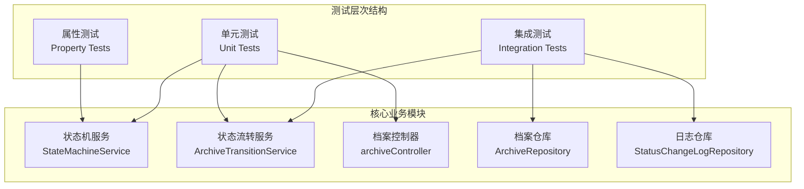
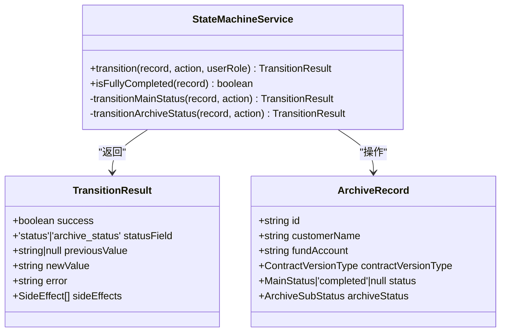
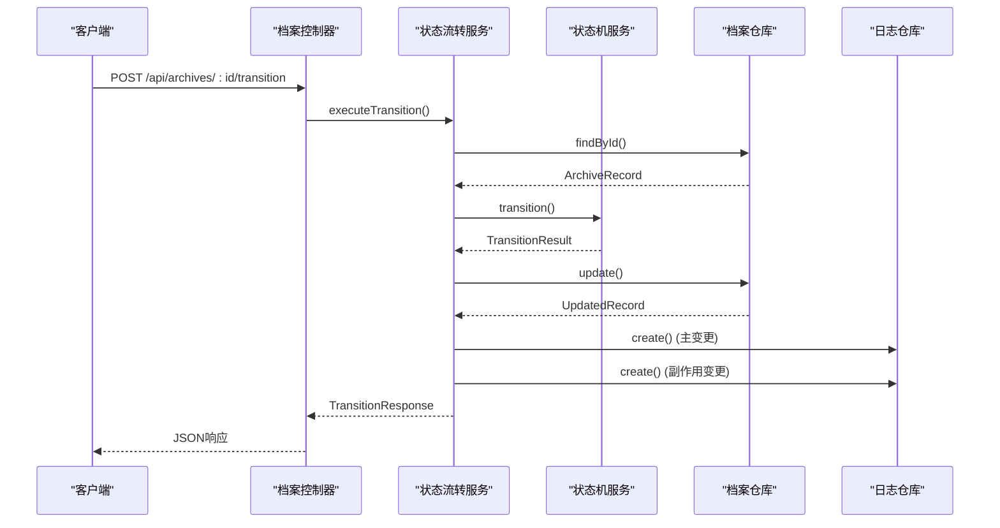
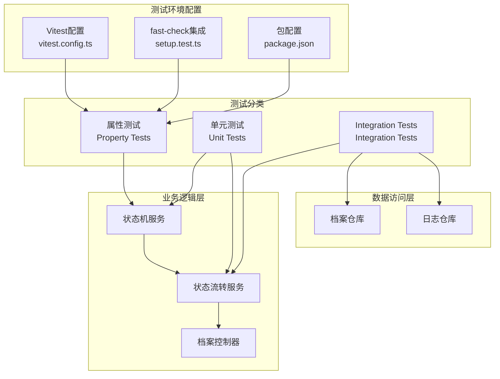
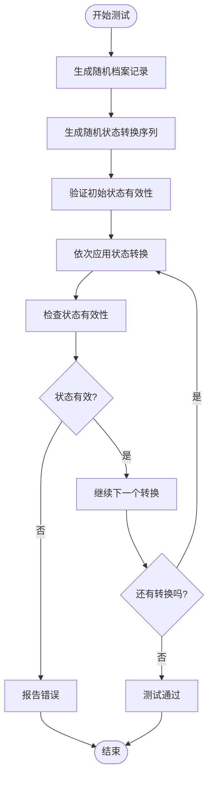
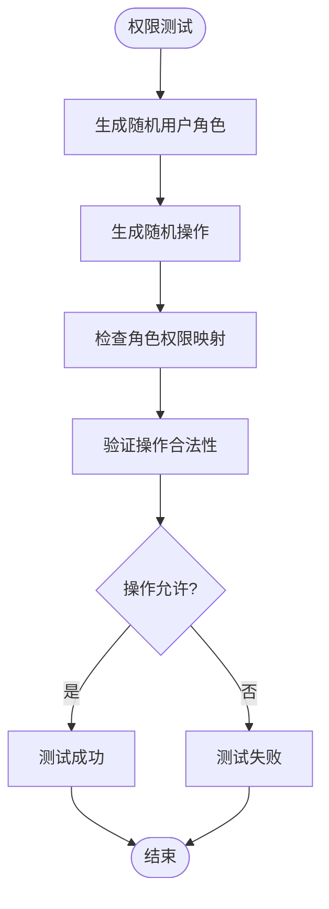
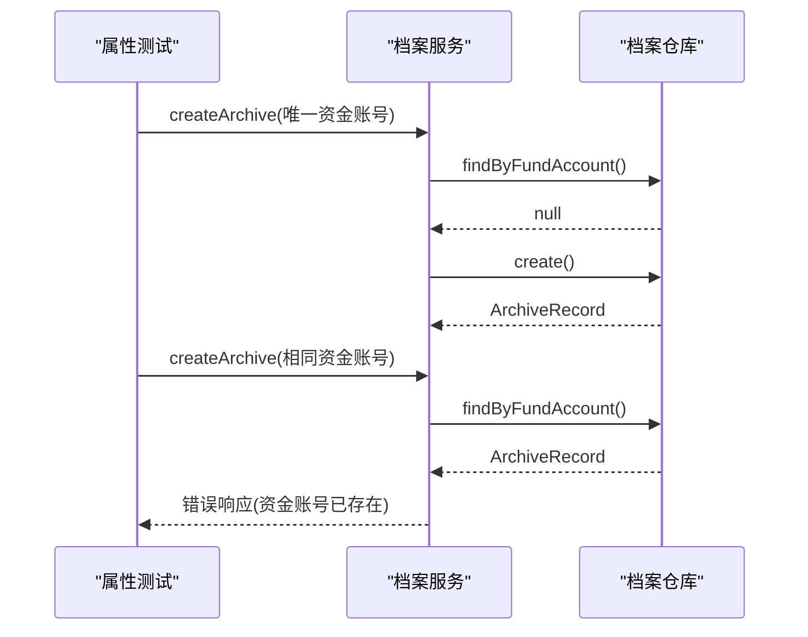
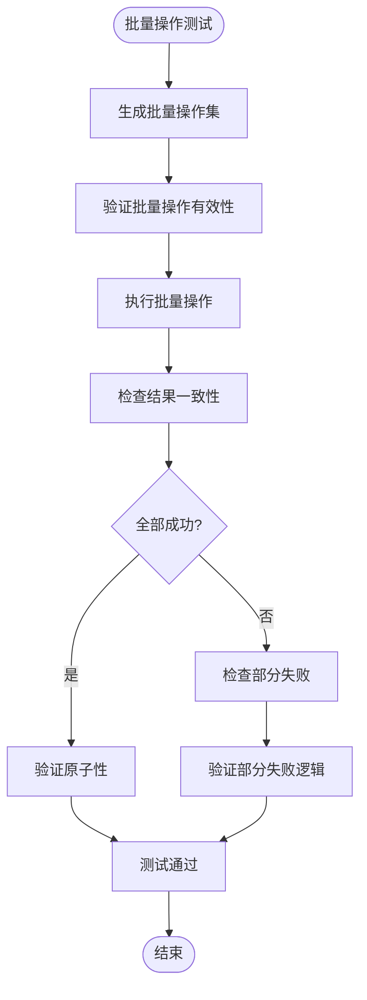
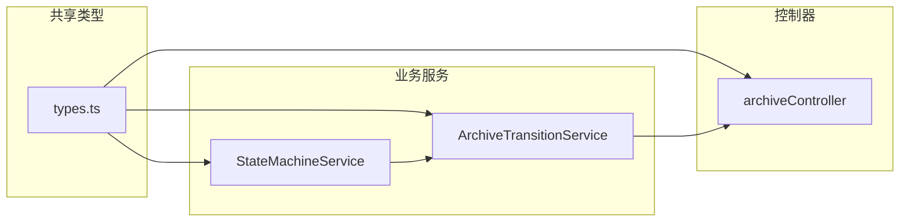
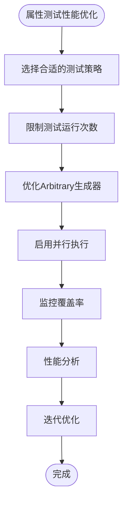

# 属性测试

<cite>
**本文档引用的文件**
- [package.json](file://backend/package.json)
- [vitest.config.ts](file://backend/vitest.config.ts)
- [StateMachineService.ts](file://backend/src/services/StateMachineService.ts)
- [ArchiveTransitionService.ts](file://backend/src/services/ArchiveTransitionService.ts)
- [archiveController.ts](file://backend/src/controllers/archiveController.ts)
- [stateMachine.test.ts](file://backend/tests/unit/stateMachine.test.ts)
- [archiveTransition.test.ts](file://backend/tests/unit/archiveTransition.test.ts)
- [archiveController.test.ts](file://backend/tests/unit/archiveController.test.ts)
- [types.ts](file://shared/types.ts)
- [setup.test.ts](file://backend/tests/unit/setup.test.ts)
</cite>

## 目录
1. [简介](#简介)
2. [项目结构](#项目结构)
3. [核心组件](#核心组件)
4. [架构概览](#架构概览)
5. [详细组件分析](#详细组件分析)
6. [依赖关系分析](#依赖关系分析)
7. [性能考虑](#性能考虑)
8. [故障排除指南](#故障排除指南)
9. [结论](#结论)

## 简介

属性测试（Property-Based Testing，PBT）是一种强大的软件测试方法，它通过定义抽象的数学属性来验证程序的行为，而不是依赖于预定义的具体输入。这种方法能够自动生成大量边界情况和异常输入，从而发现传统单元测试难以发现的缺陷。

在档案管理系统中，属性测试特别适用于验证复杂的业务逻辑，如状态机转换、数据验证规则和权限控制。通过使用fast-check库，我们可以定义测试属性，让测试框架自动生成符合约束条件的随机数据，确保业务逻辑在各种边界情况下都能正确工作。

## 项目结构

档案管理系统采用前后端分离的架构，后端使用TypeScript和Express.js构建RESTful API服务。项目的核心测试策略包括：



**图表来源**
- [StateMachineService.ts:1-253](file://backend/src/services/StateMachineService.ts#L1-L253)
- [ArchiveTransitionService.ts:1-156](file://backend/src/services/ArchiveTransitionService.ts#L1-L156)
- [archiveController.ts:1-448](file://backend/src/controllers/archiveController.ts#L1-L448)

**章节来源**
- [package.json:1-41](file://backend/package.json#L1-L41)
- [vitest.config.ts:1-21](file://backend/vitest.config.ts#L1-L21)

## 核心组件

### 状态机服务（StateMachineService）

状态机服务是系统的核心业务逻辑组件，负责管理档案记录的状态转换。它实现了完整的主流程状态机和综合部归档状态机：



**图表来源**
- [StateMachineService.ts:96-253](file://backend/src/services/StateMachineService.ts#L96-L253)
- [types.ts:47-60](file://shared/types.ts#L47-L60)

### 状态流转服务（ArchiveTransitionService）

状态流转服务整合了状态机校验、档案记录更新和状态变更日志记录三个步骤：



**图表来源**
- [ArchiveTransitionService.ts:46-125](file://backend/src/services/ArchiveTransitionService.ts#L46-L125)
- [archiveController.ts:208-258](file://backend/src/controllers/archiveController.ts#L208-L258)

**章节来源**
- [StateMachineService.ts:1-253](file://backend/src/services/StateMachineService.ts#L1-L253)
- [ArchiveTransitionService.ts:1-156](file://backend/src/services/ArchiveTransitionService.ts#L1-L156)

## 架构概览

档案管理系统的测试架构采用了分层设计，确保每个组件都有明确的职责和测试边界：



**图表来源**
- [vitest.config.ts:1-21](file://backend/vitest.config.ts#L1-L21)
- [setup.test.ts:1-17](file://backend/tests/unit/setup.test.ts#L1-L17)
- [package.json:34-34](file://backend/package.json#L34-L34)

## 详细组件分析

### 状态机属性测试

状态机是属性测试的理想候选对象，因为它具有明确定义的状态空间和转换规则。我们可以定义以下属性：

#### 状态转换闭包属性
任何有效的状态转换序列都应该保持状态机的有效性：



#### 权限验证属性
不同角色应该只能执行其权限范围内的操作：



**图表来源**
- [StateMachineService.ts:70-81](file://backend/src/services/StateMachineService.ts#L70-L81)
- [types.ts:8-12](file://shared/types.ts#L8-L12)

### 数据验证规则属性测试

档案记录的数据验证规则可以通过属性测试确保：

#### 唯一性约束属性
资金账号应该是唯一的，重复的创建操作应该被拒绝：



**图表来源**
- [archiveController.ts:363-371](file://backend/src/controllers/archiveController.ts#L363-L371)

### 批量操作属性测试

批量状态流转操作需要确保原子性和一致性：

#### 批量操作完整性属性
批量操作应该要么全部成功，要么全部失败，不会出现部分成功的情况：



**图表来源**
- [archiveTransition.test.ts:451-607](file://backend/tests/unit/archiveTransition.test.ts#L451-L607)

**章节来源**
- [stateMachine.test.ts:1-561](file://backend/tests/unit/stateMachine.test.ts#L1-L561)
- [archiveTransition.test.ts:1-608](file://backend/tests/unit/archiveTransition.test.ts#L1-L608)
- [archiveController.test.ts:1-185](file://backend/tests/unit/archiveController.test.ts#L1-L185)

## 依赖关系分析

### 测试框架依赖

项目使用Vitest作为主要测试框架，并集成了fast-check用于属性测试：

```mermaid
graph TB
subgraph "开发依赖"
FC[fast-check@^4.6.0]
VT[Vitest@^4.1.0]
V8[@vitest/coverage-v8]
TS[TypeScript]
end
subgraph "测试配置"
VC[vitest.config.ts]
PJ[package.json]
end
subgraph "测试文件"
ST[setup.test.ts]
SM[stateMachine.test.ts]
AT[archiveTransition.test.ts]
end
FC --> ST
VT --> VC
V8 --> VC
PJ --> FC
VC --> ST
VC --> SM
VC --> AT
```

**图表来源**
- [package.json:24-38](file://backend/package.json#L24-L38)
- [vitest.config.ts:1-21](file://backend/vitest.config.ts#L1-L21)
- [setup.test.ts:1-17](file://backend/tests/unit/setup.test.ts#L1-L17)

### 业务逻辑依赖

状态机服务依赖于共享类型定义，确保类型安全：



**图表来源**
- [types.ts:1-289](file://shared/types.ts#L1-L289)
- [StateMachineService.ts:6-12](file://backend/src/services/StateMachineService.ts#L6-L12)

**章节来源**
- [package.json:14-39](file://backend/package.json#L14-L39)
- [vitest.config.ts:10-19](file://backend/vitest.config.ts#L10-L19)

## 性能考虑

### 测试执行优化

1. **并发测试执行**：Vitest支持并行测试执行，可以显著减少测试套件的总执行时间。

2. **内存数据库使用**：集成测试使用内存数据库，避免磁盘I/O开销。

3. **测试数据生成优化**：
   - 使用fast-check的`numRuns`参数控制生成的测试用例数量
   - 实现自定义的Arbitrary类型以提高生成效率
   - 避免生成过于复杂或不相关的测试数据

4. **覆盖率监控**：使用V8覆盖率提供程序监控测试覆盖率，确保关键业务逻辑得到充分测试。

### 属性测试性能最佳实践



## 故障排除指南

### 常见问题诊断

1. **测试超时问题**：检查fast-check的`timeout`配置，适当调整以适应复杂的业务逻辑。

2. **内存泄漏检测**：确保测试结束后正确清理数据库连接和资源。

3. **类型错误排查**：由于使用了严格的TypeScript配置，确保所有类型定义正确无误。

4. **权限验证失败**：检查ACTION_ROLE_MAP映射表是否与实际业务需求一致。

### 调试技巧

1. **使用Vitest的调试模式**：通过`vitest --inspect-brk`启用调试器。

2. **属性测试调试**：利用fast-check的`verbose`选项输出详细的测试执行信息。

3. **状态机调试**：在StateMachineService中添加适当的日志输出，跟踪状态转换过程。

4. **集成测试隔离**：确保每个测试用例都有独立的数据库实例，避免测试间相互影响。

**章节来源**
- [setup.test.ts:9-16](file://backend/tests/unit/setup.test.ts#L9-L16)
- [archiveTransition.test.ts:65-67](file://backend/tests/unit/archiveTransition.test.ts#L65-L67)

## 结论

属性测试为档案管理系统提供了强大的质量保证机制。通过结合fast-check的随机数据生成能力和Vitest的测试框架特性，我们能够：

1. **提高测试覆盖率**：自动生成边界情况和异常输入，发现传统测试难以发现的问题。

2. **增强业务逻辑验证**：通过定义抽象的数学属性，确保业务规则在整个状态空间内都得到正确执行。

3. **改善代码质量**：属性测试促使开发者思考边界条件和异常情况，编写更加健壮的代码。

4. **降低维护成本**：当业务逻辑发生变化时，属性测试能够快速发现破坏性的变更。

5. **提升团队信心**：通过自动化的方式验证复杂的业务流程，减少回归测试的工作量。

建议在项目中继续扩展属性测试的覆盖范围，特别是在以下方面：
- 更复杂的业务规则验证
- 性能基准测试
- 安全性测试
- 国际化和本地化测试

通过持续改进属性测试策略，档案管理系统将能够保持高质量和高可靠性。