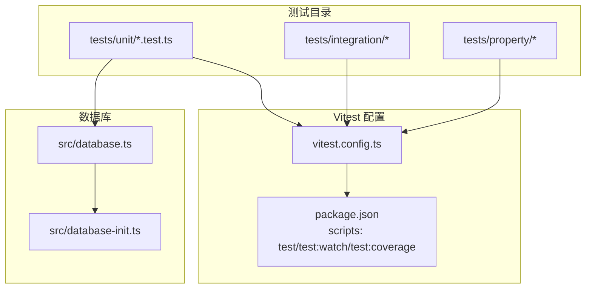
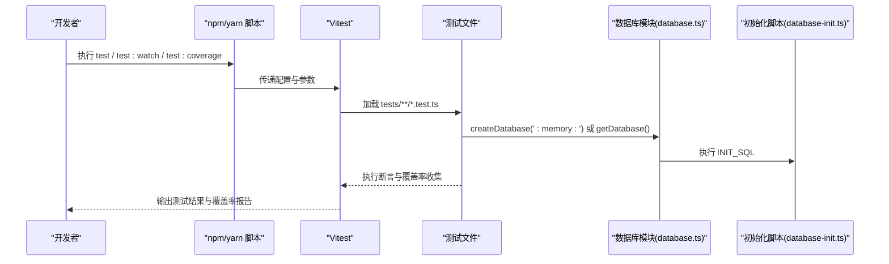
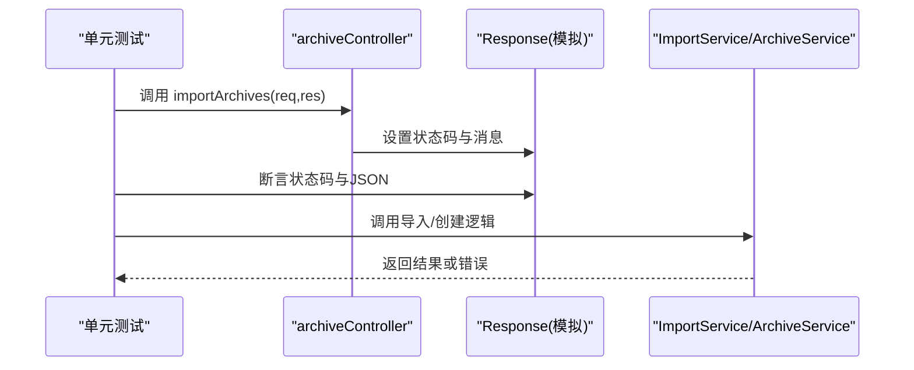
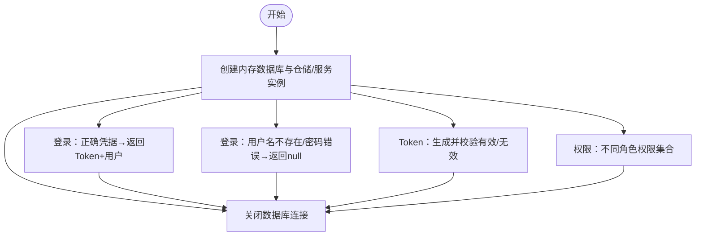
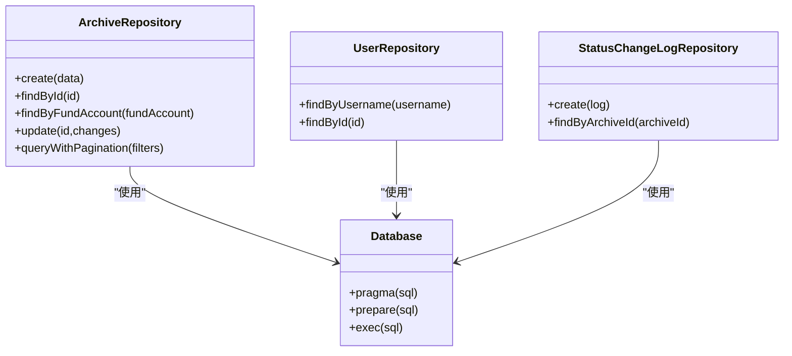
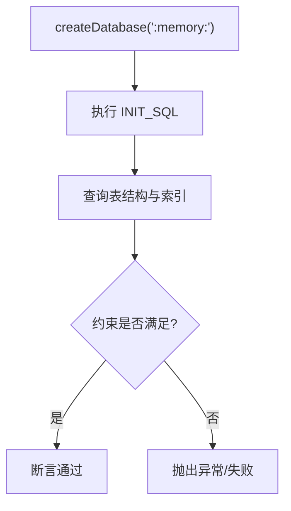
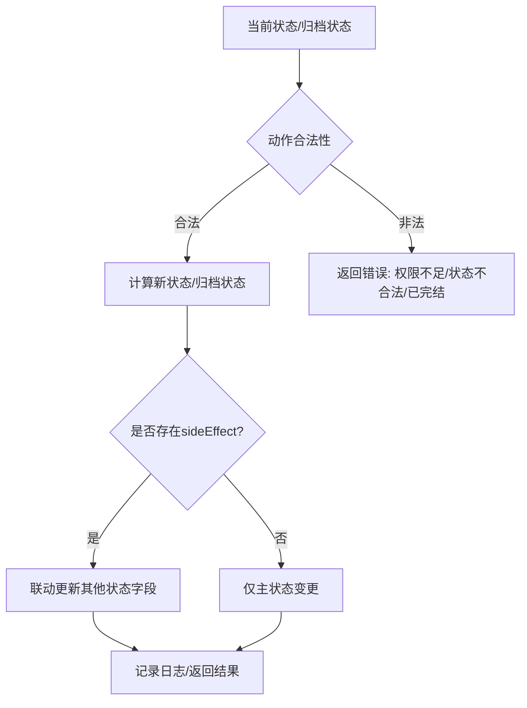
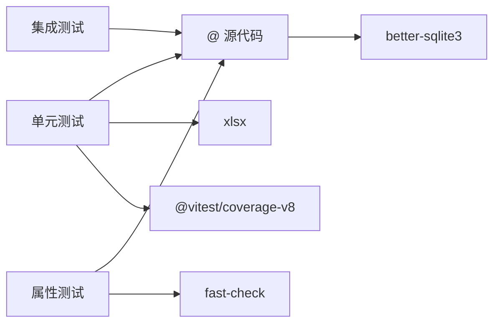

# 测试策略

<cite>
**本文引用的文件**
- [vitest.config.ts](file://backend/vitest.config.ts)
- [package.json](file://backend/package.json)
- [database.ts](file://backend/src/database.ts)
- [database-init.ts](file://backend/src/database-init.ts)
- [archiveController.test.ts](file://backend/tests/unit/archiveController.test.ts)
- [auth.test.ts](file://backend/tests/unit/auth.test.ts)
- [repositories.test.ts](file://backend/tests/unit/repositories.test.ts)
- [database.test.ts](file://backend/tests/unit/database.test.ts)
- [import.test.ts](file://backend/tests/unit/import.test.ts)
- [stateMachine.test.ts](file://backend/tests/unit/stateMachine.test.ts)
- [setup.test.ts](file://backend/tests/unit/setup.test.ts)
</cite>

## 目录
1. 引言
2. 项目结构
3. 核心组件
4. 架构总览
5. 详细组件分析
6. 依赖关系分析
7. 性能考量
8. 故障排查指南
9. 结论
10. 附录

## 引言
本文件系统性阐述本项目的测试策略与实践，围绕 Vitest 测试框架的配置与使用、单元测试/集成测试/属性测试的组织与实施、测试设计原则与覆盖率要求、模拟对象与测试数据准备、测试环境与数据库隔离策略、最佳实践与调试技巧、持续集成中的测试自动化流程、性能与负载测试方法，以及测试报告与质量度量指标。目标是帮助开发者在保证质量的同时，高效推进迭代开发。

## 项目结构
后端采用 TypeScript + Vitest + better-sqlite3 的测试栈，测试文件位于 backend/tests 下，按层级划分为 unit、integration、property 三大类。当前仓库中实际可见的是 unit 测试与基础集成/属性测试目录占位。Vitest 通过配置文件进行全局别名、测试入口与覆盖率配置；数据库初始化脚本集中于 src/database-init.ts，数据库连接与内存数据库能力集中在 src/database.ts，便于测试隔离与快速执行。

图表来源
- [vitest.config.ts:1-21](file://backend/vitest.config.ts#L1-L21)
- [package.json:6-12](file://backend/package.json#L6-L12)
- [database.ts:1-87](file://backend/src/database.ts#L1-L87)
- [database-init.ts:1-65](file://backend/src/database-init.ts#L1-L65)

章节来源
- [vitest.config.ts:1-21](file://backend/vitest.config.ts#L1-L21)
- [package.json:1-41](file://backend/package.json#L1-L41)
- [database.ts:1-87](file://backend/src/database.ts#L1-L87)
- [database-init.ts:1-65](file://backend/src/database-init.ts#L1-L65)

## 核心组件
- 测试框架与配置
  - Vitest 提供了全局测试 API、快照、覆盖率等能力；通过别名 @ 指向 src，简化导入路径；include 指定测试文件扫描范围；覆盖率由 v8 提供器收集，覆盖 src 目录并排除入口文件。
  - 脚本命令：test 运行测试；test:watch 开启监听；test:coverage 生成覆盖率报告。
- 数据库与隔离
  - 生产数据库通过单例模式管理，启用 WAL 与外键约束；测试专用 createDatabase 支持内存数据库（:memory:），每次测试前后可创建/销毁连接，确保隔离。
  - INIT_SQL 在每次创建数据库时执行，保证表结构、索引与约束一致。
- 测试组织
  - 单元测试：聚焦业务逻辑与数据访问层，如控制器、服务、仓库、状态机、认证与导入等。
  - 集成测试：建议以“端到端”或“模块间协作”为主，验证路由、中间件、服务链路与数据库交互。
  - 属性测试：建议结合 fast-check，对输入空间进行大规模随机验证，重点覆盖边界、异常与幂等性。

章节来源
- [vitest.config.ts:10-20](file://backend/vitest.config.ts#L10-L20)
- [package.json:6-12](file://backend/package.json#L6-L12)
- [database.ts:25-86](file://backend/src/database.ts#L25-L86)
- [database-init.ts:8-64](file://backend/src/database-init.ts#L8-L64)

## 架构总览
下图展示测试运行时的关键交互：Vitest 加载配置、扫描测试文件、执行用例、收集覆盖率；数据库模块负责生产与测试两种模式的连接与初始化。

图表来源
- [package.json:6-12](file://backend/package.json#L6-L12)
- [vitest.config.ts:4-20](file://backend/vitest.config.ts#L4-L20)
- [database.ts:25-86](file://backend/src/database.ts#L25-L86)
- [database-init.ts:8-64](file://backend/src/database-init.ts#L8-L64)

## 详细组件分析

### 单元测试：控制器与导入
- 控制器测试要点
  - 使用 vi.fn() 模拟 Express Response 对象，断言状态码与 JSON 返回体；对文件格式校验、模板下载与必填字段校验进行覆盖。
  - 示例路径：[archiveController.test.ts:21-184](file://backend/tests/unit/archiveController.test.ts#L21-L184)
- 导入服务测试要点
  - 通过 xlsx 生成 Excel Buffer，验证纸质/电子版合同导入、状态初始值、重复与唯一性约束、字段缺失与非法值处理、错误行号定位等。
  - 示例路径：[import.test.ts:25-117](file://backend/tests/unit/import.test.ts#L25-L117)

图表来源
- [archiveController.test.ts:21-184](file://backend/tests/unit/archiveController.test.ts#L21-L184)
- [import.test.ts:25-117](file://backend/tests/unit/import.test.ts#L25-L117)

章节来源
- [archiveController.test.ts:1-185](file://backend/tests/unit/archiveController.test.ts#L1-L185)
- [import.test.ts:1-117](file://backend/tests/unit/import.test.ts#L1-L117)

### 单元测试：认证与权限
- 覆盖 AuthService 登录、Token 生成/校验、用户权限集合、角色权限差异、密码哈希等。
- 使用内存数据库与 beforeEach/afterEach 管理测试夹具，确保每个用例独立。
- 示例路径：[auth.test.ts:35-162](file://backend/tests/unit/auth.test.ts#L35-L162)

图表来源
- [auth.test.ts:35-162](file://backend/tests/unit/auth.test.ts#L35-L162)

章节来源
- [auth.test.ts:1-163](file://backend/tests/unit/auth.test.ts#L1-L163)

### 单元测试：数据访问层（Repository）
- 覆盖 ArchiveRepository、UserRepository、StatusChangeLogRepository 的增删改查、分页与多条件查询、外键与唯一性约束、索引存在性等。
- 使用内存数据库与事务级隔离，确保跨用例无副作用。
- 示例路径：[repositories.test.ts:13-403](file://backend/tests/unit/repositories.test.ts#L13-L403)

图表来源
- [repositories.test.ts:13-403](file://backend/tests/unit/repositories.test.ts#L13-L403)
- [database.ts:25-86](file://backend/src/database.ts#L25-L86)

章节来源
- [repositories.test.ts:1-404](file://backend/tests/unit/repositories.test.ts#L1-L404)

### 单元测试：数据库初始化与约束
- 验证表结构、索引、CHECK/UNIQUE/FOREIGN KEY 约束、WAL 与外键开启状态。
- 通过 pragma 查询与插入异常断言，确保数据库初始化脚本正确执行。
- 示例路径：[database.test.ts:10-156](file://backend/tests/unit/database.test.ts#L10-L156)

图表来源
- [database.test.ts:10-156](file://backend/tests/unit/database.test.ts#L10-L156)
- [database-init.ts:8-64](file://backend/src/database-init.ts#L8-L64)

章节来源
- [database.test.ts:1-157](file://backend/tests/unit/database.test.ts#L1-L157)
- [database-init.ts:1-65](file://backend/src/database-init.ts#L1-L65)

### 单元测试：状态机与流程控制
- 覆盖主流程 8 个状态与综合部归档 4 个状态的转换矩阵、角色权限映射、side effect（联动状态变更）、电子版合同保护、完全完结保护等。
- 使用辅助构造函数生成测试记录，确保用例可读与可维护。
- 示例路径：[stateMachine.test.ts:35-560](file://backend/tests/unit/stateMachine.test.ts#L35-L560)

图表来源
- [stateMachine.test.ts:35-560](file://backend/tests/unit/stateMachine.test.ts#L35-L560)

章节来源
- [stateMachine.test.ts:1-561](file://backend/tests/unit/stateMachine.test.ts#L1-L561)

### 属性测试与集成测试建议
- 属性测试（Property Testing）
  - 使用 fast-check 对输入空间进行大规模随机生成，验证：
    - 导入服务对任意 Excel 行数与字段组合的健壮性；
    - 状态机在大量随机状态序列下的幂等性与一致性；
    - 数据访问层查询条件组合的正确性。
  - 建议将属性测试置于 tests/property 目录，命名如 *.property.test.ts。
- 集成测试（Integration Testing）
  - 路由与中间件：验证鉴权、授权中间件在真实请求下的行为；
  - 服务链路：控制器 → 服务 → 仓库 → 数据库的端到端流程；
  - 外部依赖：OCR、文件上传等外部接口的契约验证。
  - 建议将集成测试置于 tests/integration 目录，命名如 *.integration.test.ts。

[本节为概念性内容，不直接分析具体文件，故无章节来源]

## 依赖关系分析
- 测试对源代码的依赖
  - 单元测试通过别名 @ 直接导入 src 中的控制器、服务、仓库与工具模块，减少相对路径复杂度。
  - 数据库模块提供 createDatabase 与 getDatabase 两种模式，测试优先使用内存数据库。
- 外部依赖
  - better-sqlite3：高性能嵌入式数据库，测试中使用内存数据库实现隔离。
  - xlsx：Excel 文件解析与生成，用于导入测试与模板下载验证。
  - fast-check：属性测试引擎，扩展输入空间覆盖。
  - @vitest/coverage-v8：覆盖率收集器，基于 V8 引擎。

图表来源
- [vitest.config.ts:5-9](file://backend/vitest.config.ts#L5-L9)
- [package.json:24-38](file://backend/package.json#L24-L38)
- [database.ts:8-11](file://backend/src/database.ts#L8-L11)

章节来源
- [vitest.config.ts:1-21](file://backend/vitest.config.ts#L1-L21)
- [package.json:14-38](file://backend/package.json#L14-L38)
- [database.ts:1-87](file://backend/src/database.ts#L1-L87)

## 性能考量
- 内存数据库与单测隔离
  - 使用 createDatabase(':memory:') 降低 I/O 并提升执行速度；每个用例独立连接，避免共享状态。
- 覆盖率与性能平衡
  - 覆盖率开关仅在 CI 或本地需要时开启，避免开发阶段的额外开销。
- 大规模属性测试
  - fast-check 的 numRuns 可根据机器性能调整；建议在 CI 上使用固定种子以复现问题。
- 状态机与导入服务
  - 对状态机进行组合状态与边界的穷举/抽样验证；对导入服务进行批量数据与异常路径的性能回归。

[本节为通用指导，不直接分析具体文件，故无章节来源]

## 故障排查指南
- 常见问题与定位
  - 测试超时或不稳定：检查数据库连接是否正确关闭；确认 beforeEach/afterEach 是否覆盖所有用例。
  - 断言失败：优先打印关键上下文（请求体、响应体、错误数组），缩小范围。
  - 覆盖率异常：确认 include/exclude 规则与别名配置一致。
- 调试技巧
  - 使用 test:watch 快速迭代；在关键断言前加入 console.log 或 vi.spyOn 辅助观察。
  - 将大用例拆分为小步骤，使用 describe 分组，提升可读性与定位效率。
- Vitest 调试
  - 使用 --reporter=verbose 输出更详细日志；结合 --inspect-brk 在 IDE 中断点调试。

章节来源
- [setup.test.ts:4-17](file://backend/tests/unit/setup.test.ts#L4-L17)
- [package.json:10-12](file://backend/package.json#L10-L12)

## 结论
本项目的测试策略以 Vitest 为核心，结合 better-sqlite3 的内存数据库实现高隔离与高效率的单元测试；通过 INIT_SQL 保障数据库结构一致性；配合 fast-check 的属性测试与面向集成的端到端验证，形成完整的质量闭环。建议在 CI 中强制执行测试与覆盖率门槛，并将集成/属性测试逐步补齐，持续提升系统的稳定性与可维护性。

## 附录

### 测试设计原则
- 单一职责：每个用例只验证一个行为或边界。
- 可重现：使用固定种子或确定性输入；避免依赖系统时间与随机性。
- 可读性：用例命名清晰表达意图；使用辅助函数构造测试数据。
- 可维护：尽量减少对实现细节的耦合，关注对外行为与契约。

### 覆盖率要求（建议）
- 语句覆盖率：≥80%
- 分支覆盖率：≥70%
- 函数覆盖率：≥85%
- 行覆盖率：≥80%

### 模拟对象与测试数据
- 模拟对象
  - 使用 vi.fn()/vi.spyOn 模拟外部依赖（如 HTTP 客户端、文件系统）与内部方法。
  - 控制器测试中模拟 Response 对象，断言状态码与 JSON。
- 测试数据
  - 使用 xlsx 生成 Excel Buffer；使用内存数据库插入最小必要数据。
  - 使用工厂函数/辅助函数统一构造测试记录，减少重复。

### 测试环境与数据库隔离
- 环境变量
  - 建议在 CI 中设置 NODE_ENV=test；在本地使用 .env.test。
- 数据库隔离
  - 测试使用 createDatabase(':memory:')；每个用例独立连接；在 afterEach 关闭连接。
- 初始化脚本
  - 通过 INIT_SQL 保证表结构、索引与约束一致，避免因迁移导致的测试波动。

章节来源
- [database.ts:71-86](file://backend/src/database.ts#L71-L86)
- [database-init.ts:8-64](file://backend/src/database-init.ts#L8-L64)

### 持续集成中的测试自动化
- 触发策略
  - push 到主分支触发全量测试与覆盖率检查；PR 触发增量测试。
- 步骤建议
  - 安装依赖 → 编译 → 运行 Vitest（带覆盖率）→ 生成报告 → 上传覆盖率。
- 报告与质量门禁
  - 使用覆盖率阈值作为合并门禁；失败时阻断合并。

[本节为通用指导，不直接分析具体文件，故无章节来源]

### 性能测试与负载测试方法
- 单元/集成性能回归
  - 使用 Vitest 的计时与 --reporter=verbose 观察耗时变化；对热点路径增加基准测试。
- 负载测试
  - 使用压测工具（如 k6/Artillery）对关键接口施加压力，观察吞吐、延迟与错误率。
  - 关注数据库连接池、缓存命中率与外部依赖的 SLA。

[本节为通用指导，不直接分析具体文件，故无章节来源]

### 测试报告生成与质量度量指标
- 报告
  - Vitest 默认 HTML/JSON 报告；CI 中建议输出 LCOV/Coverage JSON 以便平台消费。
- 指标
  - 通过覆盖率报告查看各模块与文件的覆盖率；结合缺陷密度与回归率评估质量趋势。

[本节为通用指导，不直接分析具体文件，故无章节来源]