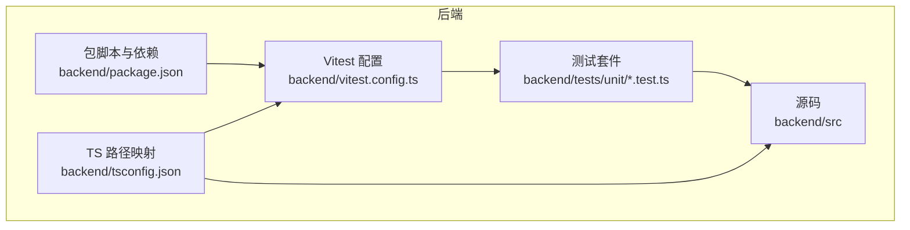
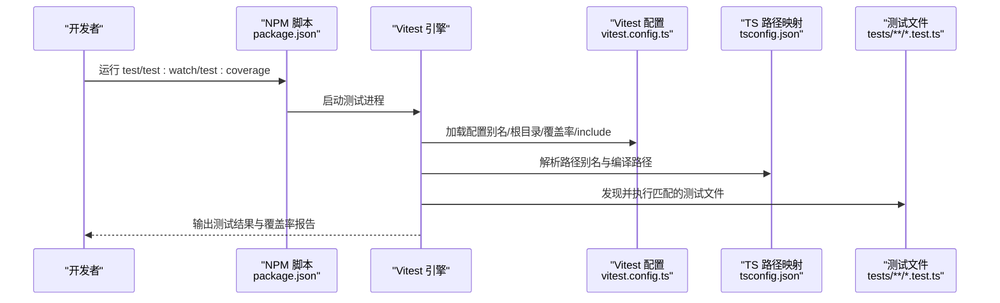
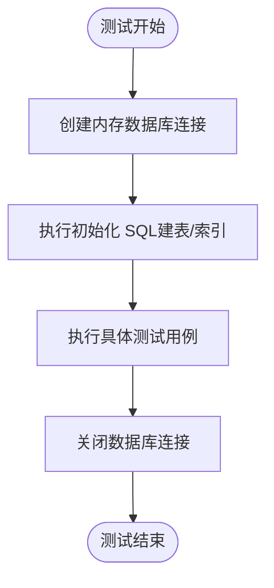
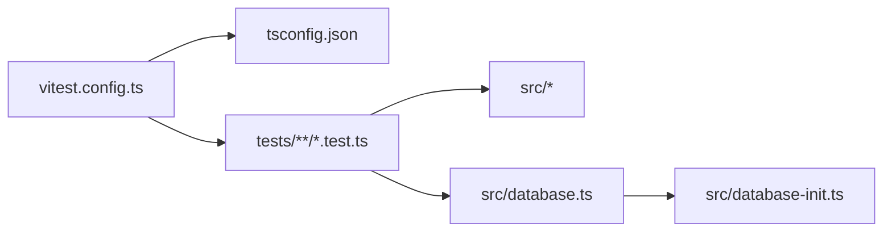

# 测试配置

<cite>
**本文档引用的文件**
- [vitest.config.ts](file://backend/vitest.config.ts)
- [package.json](file://backend/package.json)
- [tsconfig.json](file://backend/tsconfig.json)
- [database.ts](file://backend/src/database.ts)
- [database-init.ts](file://backend/src/database-init.ts)
- [seedUsers.ts](file://backend/src/utils/seedUsers.ts)
- [database.test.ts](file://backend/tests/unit/database.test.ts)
- [repositories.test.ts](file://backend/tests/unit/repositories.test.ts)
- [auth.test.ts](file://backend/tests/unit/auth.test.ts)
- [setup.test.ts](file://backend/tests/unit/setup.test.ts)
</cite>

## 目录
1. [简介](#简介)
2. [项目结构](#项目结构)
3. [核心组件](#核心组件)
4. [架构总览](#架构总览)
5. [详细组件分析](#详细组件分析)
6. [依赖关系分析](#依赖关系分析)
7. [性能考虑](#性能考虑)
8. [故障排查指南](#故障排查指南)
9. [结论](#结论)
10. [附录](#附录)

## 简介
本文件面向后端测试配置与执行，聚焦 Vitest 测试框架在本项目中的配置与实践，涵盖以下主题：
- 别名解析与全局配置、根目录设置
- 代码覆盖率配置（提供者、包含/排除规则）
- 测试文件发现与执行机制（include 模式与命名约定）
- 测试数据库配置与隔离策略（内存数据库、事务级隔离）
- 测试脚本与命令行参数
- CI/CD 环境中的测试执行要点
- 常见配置问题与性能调优建议

## 项目结构
后端测试位于 backend/tests 目录，采用按功能划分的单元测试组织方式。Vitest 配置集中于 backend/vitest.config.ts，TypeScript 路径映射由 backend/tsconfig.json 提供。

图表来源
- [vitest.config.ts:1-21](file://backend/vitest.config.ts#L1-L21)
- [package.json:1-41](file://backend/package.json#L1-L41)
- [tsconfig.json:1-25](file://backend/tsconfig.json#L1-L25)

章节来源
- [vitest.config.ts:1-21](file://backend/vitest.config.ts#L1-L21)
- [package.json:1-41](file://backend/package.json#L1-L41)
- [tsconfig.json:1-25](file://backend/tsconfig.json#L1-L25)

## 核心组件
- 别名解析与路径映射
  - Vitest 通过别名将 @ 映射到 src 目录，便于在测试中以统一前缀导入源码。
  - TypeScript 编译器同样配置了 baseUrl 与 paths，确保开发与测试一致的路径解析。
- 全局配置与根目录
  - 启用全局测试 API（如 describe、it、expect），无需手动导入。
  - 根目录设置为项目根（'.'），测试文件发现从该根开始。
- 测试文件发现与执行
  - include 模式为 tests/**/*.test.ts，符合以 .test.ts 结尾的命名约定。
- 代码覆盖率
  - 提供者为 V8；包含 src/**/*.ts；排除 src/index.ts（入口文件通常不纳入覆盖率统计）。

章节来源
- [vitest.config.ts:4-19](file://backend/vitest.config.ts#L4-L19)
- [tsconfig.json:17-20](file://backend/tsconfig.json#L17-L20)

## 架构总览
下图展示测试执行的关键流程：Vitest 读取配置、解析别名、定位测试文件、加载覆盖率配置、执行测试并生成报告。

图表来源
- [package.json:6-12](file://backend/package.json#L6-L12)
- [vitest.config.ts:4-19](file://backend/vitest.config.ts#L4-L19)
- [tsconfig.json:17-20](file://backend/tsconfig.json#L17-L20)

## 详细组件分析

### 测试配置文件（Vitest）
- 别名解析
  - 将 @ 映射到 src，便于在测试中以 @/models、@/services 等形式导入源码。
- 全局配置
  - 开启 globals，使测试文件内可直接使用 describe、it、expect 等 API。
- 根目录与测试文件发现
  - root 设置为 '.'，include 模式为 tests/**/*.test.ts，遵循以 .test.ts 结尾的命名约定。
- 代码覆盖率
  - provider 为 v8；include 包含 src/**/*.ts；exclude 排除 src/index.ts。

章节来源
- [vitest.config.ts:4-19](file://backend/vitest.config.ts#L4-L19)

### TypeScript 路径映射（TSConfig）
- baseUrl 与 paths
  - 配置 baseUrl 与 @/*、@shared/* 的映射，保证测试与源码一致的模块解析行为。
- include/exclude
  - include 覆盖 src 与 shared；exclude 排除 node_modules 与 dist。

章节来源
- [tsconfig.json:16-23](file://backend/tsconfig.json#L16-L23)

### 测试数据库配置与隔离策略
- 数据库初始化与隔离
  - 单元测试使用内存数据库（':memory:'）创建独立连接，避免跨用例污染。
  - 每个用例前后分别进行连接创建与关闭，实现用例级隔离。
- 外键与约束
  - 内存数据库启用外键约束，确保参照完整性；通过 PRAGMA 验证 WAL 模式与外键开关。
- 初始化脚本
  - 通过 INIT_SQL 创建三张核心表及索引，确保测试环境具备一致的表结构。

图表来源
- [database.ts:71-86](file://backend/src/database.ts#L71-L86)
- [database-init.ts:8-64](file://backend/src/database-init.ts#L8-L64)

章节来源
- [database.ts:25-86](file://backend/src/database.ts#L25-L86)
- [database-init.ts:8-64](file://backend/src/database-init.ts#L8-L64)
- [database.test.ts:10-156](file://backend/tests/unit/database.test.ts#L10-L156)

### 测试脚本与命令行参数
- 脚本命令
  - test：运行所有测试（非 watch 模式）。
  - test:watch：监听文件变化并自动重跑测试。
  - test:coverage：运行测试并生成覆盖率报告。
- 常用参数
  - --coverage：启用覆盖率收集。
  - 其他 Vitest 参数可通过脚本扩展传入（例如 --reporter、--timeout 等）。

章节来源
- [package.json:6-12](file://backend/package.json#L6-L12)

### 测试文件命名与发现机制
- 命名约定
  - 所有测试文件以 .test.ts 结尾，位于 tests 目录下。
- 发现机制
  - include 模式 tests/**/*.test.ts 确保递归发现所有测试文件。
- 示例
  - setup.test.ts 验证 Vitest 与 fast-check 基本能力。
  - database.test.ts 验证表结构、索引与约束。
  - repositories.test.ts 验证仓储层 CRUD 与分页查询。
  - auth.test.ts 验证认证服务与权限分配。

章节来源
- [vitest.config.ts:13](file://backend/vitest.config.ts#L13)
- [setup.test.ts:1-17](file://backend/tests/unit/setup.test.ts#L1-L17)
- [database.test.ts:1-156](file://backend/tests/unit/database.test.ts#L1-L156)
- [repositories.test.ts:1-404](file://backend/tests/unit/repositories.test.ts#L1-L404)
- [auth.test.ts:1-163](file://backend/tests/unit/auth.test.ts#L1-L163)

### 覆盖率配置与报告
- 提供者
  - 使用 V8 提供者，基于内置 JavaScript 引擎进行覆盖率采样。
- 包含与排除
  - 包含 src/**/*.ts；排除 src/index.ts（入口文件）。
- 报告生成
  - 通过 test:coverage 脚本触发覆盖率输出（默认 HTML 或文本报告，取决于 Vitest 默认行为）。

章节来源
- [vitest.config.ts:14-18](file://backend/vitest.config.ts#L14-L18)
- [package.json:10-12](file://backend/package.json#L10-L12)

### CI/CD 环境中的测试执行
- 建议步骤
  - 安装依赖后执行 npm run test 或 npm run test:coverage。
  - 在 CI 中缓存 node_modules 以加速安装。
  - 如需生成覆盖率报告，确保在 CI 任务中保留覆盖率产物以便归档。
- 注意事项
  - 确保 CI 环境变量与本地一致，避免因环境差异导致测试失败。
  - 若使用自定义覆盖率提供者或报告格式，需在 CI 中显式配置。

章节来源
- [package.json:6-12](file://backend/package.json#L6-L12)

## 依赖关系分析
- 配置依赖
  - vitest.config.ts 依赖 tsconfig.json 的路径映射，以确保 @ 别名在测试中可用。
- 测试依赖
  - 单元测试依赖 src/database.ts 的 createDatabase 与 INIT_SQL，确保测试数据库结构一致。
  - 认证与仓储测试依赖内存数据库与外键约束，保障数据一致性。
- 脚本依赖
  - package.json 的 test 脚本依赖 vitest.config.ts 的 include 与 root 设置，决定测试发现范围。

图表来源
- [vitest.config.ts:4-19](file://backend/vitest.config.ts#L4-L19)
- [tsconfig.json:17-20](file://backend/tsconfig.json#L17-L20)
- [database.ts:71-86](file://backend/src/database.ts#L71-L86)
- [database-init.ts:8-64](file://backend/src/database-init.ts#L8-L64)

章节来源
- [vitest.config.ts:4-19](file://backend/vitest.config.ts#L4-L19)
- [tsconfig.json:17-20](file://backend/tsconfig.json#L17-L20)
- [database.ts:71-86](file://backend/src/database.ts#L71-L86)
- [database-init.ts:8-64](file://backend/src/database-init.ts#L8-L64)

## 性能考虑
- 内存数据库优先
  - 单元测试使用内存数据库，避免磁盘 IO，提高执行速度。
- 用例级隔离
  - 每个测试前后创建/销毁连接，减少共享状态带来的额外开销。
- 覆盖率采样
  - 使用 V8 提供者，采样开销较低；仅对 src 目录采样，缩小扫描范围。
- 并发与监听
  - 在 watch 模式下，仅对变更文件重跑，缩短反馈周期。

## 故障排查指南
- 别名无法解析
  - 确认 vitest.config.ts 的 alias 与 tsconfig.json 的 paths 一致。
  - 检查 baseUrl 是否正确指向项目根。
- 测试文件未被发现
  - 确认 include 模式是否为 tests/**/*.test.ts，且测试文件以 .test.ts 结尾。
  - 确认根目录 root 设置为 '.'。
- 覆盖率报告缺失
  - 确认已使用 test:coverage 脚本或在命令行传入 --coverage。
  - 检查 include/exclude 规则是否覆盖到目标源码。
- 数据库相关错误
  - 确认内存数据库初始化逻辑正常，外键约束已启用。
  - 检查测试用例是否在 beforeEach/afterEach 正确创建/关闭连接。
- 权限与角色测试失败
  - 确认 seedUsers 已在应用启动时注入测试所需用户数据。
  - 检查 AuthService 的权限计算逻辑与角色映射。

章节来源
- [vitest.config.ts:4-19](file://backend/vitest.config.ts#L4-L19)
- [tsconfig.json:17-20](file://backend/tsconfig.json#L17-L20)
- [database.ts:71-86](file://backend/src/database.ts#L71-L86)
- [seedUsers.ts:11-19](file://backend/src/utils/seedUsers.ts#L11-L19)

## 结论
本项目的测试配置以 Vitest 为核心，结合 tsconfig 的路径映射与内存数据库的用例级隔离，实现了高效、稳定的单元测试体系。通过明确的 include 模式、覆盖率规则与脚本命令，开发者可以快速定位问题并持续改进测试质量。在 CI/CD 环境中，建议沿用现有脚本与配置，确保测试与覆盖率报告的一致性与可追溯性。

## 附录
- 快速参考
  - 别名：@ -> src
  - 根目录：'.'
  - 测试文件模式：tests/**/*.test.ts
  - 覆盖率提供者：v8
  - 覆盖范围：src/**/*.ts
  - 排除范围：src/index.ts
  - 脚本：test、test:watch、test:coverage