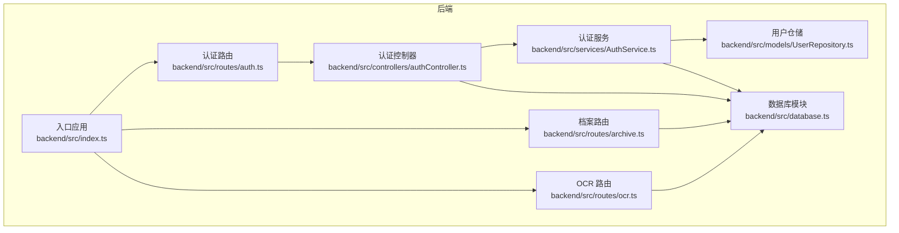
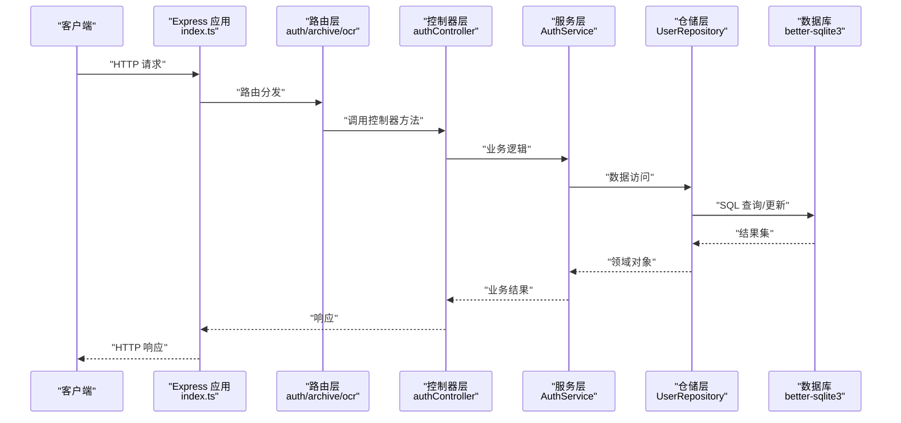
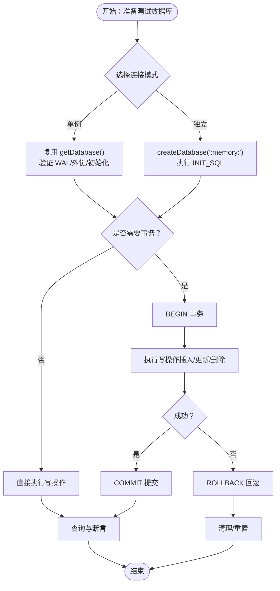
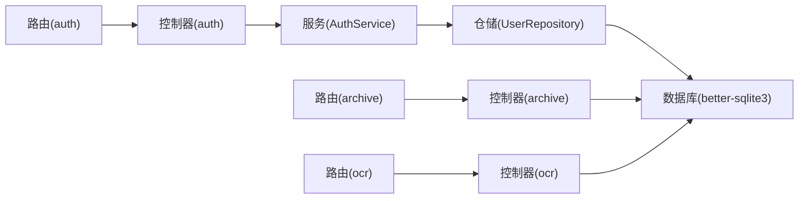

# 集成测试

<cite>
**本文引用的文件**
- [backend/src/index.ts](file://backend/src/index.ts)
- [backend/package.json](file://backend/package.json)
- [backend/vitest.config.ts](file://backend/vitest.config.ts)
- [backend/src/database.ts](file://backend/src/database.ts)
- [backend/src/database-init.ts](file://backend/src/database-init.ts)
- [backend/src/utils/seedUsers.ts](file://backend/src/utils/seedUsers.ts)
- [backend/src/routes/auth.ts](file://backend/src/routes/auth.ts)
- [backend/src/routes/archive.ts](file://backend/src/routes/archive.ts)
- [backend/src/routes/ocr.ts](file://backend/src/routes/ocr.ts)
- [backend/src/controllers/authController.ts](file://backend/src/controllers/authController.ts)
- [backend/src/services/AuthService.ts](file://backend/src/services/AuthService.ts)
- [backend/src/models/UserRepository.ts](file://backend/src/models/UserRepository.ts)
</cite>

## 目录
1. [简介](#简介)
2. [项目结构](#项目结构)
3. [核心组件](#核心组件)
4. [架构总览](#架构总览)
5. [详细组件分析](#详细组件分析)
6. [依赖分析](#依赖分析)
7. [性能考虑](#性能考虑)
8. [故障排查指南](#故障排查指南)
9. [结论](#结论)
10. [附录](#附录)

## 简介
本文件面向“档案管理系统”的集成测试，目标是建立系统级验证策略与实施方法，覆盖以下方面：
- API 端点的集成测试：HTTP 请求发送、响应验证、错误处理测试
- 数据库集成测试：连接测试、事务处理、数据一致性验证
- 外部服务集成测试：OCR 服务、文件存储（通过上传/下载接口）
- 最佳实践：测试环境搭建、测试数据准备、端到端与 API 测试
- 调试与排障：失败定位、日志与断点、常见问题排查

## 项目结构
后端采用 Express + better-sqlite3 架构，使用 Vitest 作为测试运行器，配置了全局别名与覆盖率统计。系统通过单例数据库连接对外提供健康检查、认证、档案管理与 OCR 识别等接口。

图表来源
- [backend/src/index.ts:1-39](file://backend/src/index.ts#L1-L39)
- [backend/src/database.ts:1-87](file://backend/src/database.ts#L1-L87)
- [backend/src/routes/auth.ts:1-19](file://backend/src/routes/auth.ts#L1-L19)
- [backend/src/routes/archive.ts:1-42](file://backend/src/routes/archive.ts#L1-L42)
- [backend/src/routes/ocr.ts:1-21](file://backend/src/routes/ocr.ts#L1-L21)
- [backend/src/controllers/authController.ts:1-77](file://backend/src/controllers/authController.ts#L1-L77)
- [backend/src/services/AuthService.ts:1-126](file://backend/src/services/AuthService.ts#L1-L126)
- [backend/src/models/UserRepository.ts:1-56](file://backend/src/models/UserRepository.ts#L1-L56)

章节来源
- [backend/src/index.ts:1-39](file://backend/src/index.ts#L1-L39)
- [backend/package.json:1-41](file://backend/package.json#L1-L41)
- [backend/vitest.config.ts:1-21](file://backend/vitest.config.ts#L1-L21)

## 核心组件
- 应用入口与路由注册：负责启动服务、注册 /api/* 路由、健康检查
- 数据库模块：提供单例连接、WAL 模式、外键约束、表结构初始化；提供独立连接工厂用于测试
- 认证链路：路由 -> 控制器 -> 服务 -> 仓储 -> 数据库
- 档案与 OCR 路由：提供导入、模板下载、状态流转、识别等端点
- 种子用户：测试环境预置三个角色账户，便于鉴权与权限测试

章节来源
- [backend/src/index.ts:1-39](file://backend/src/index.ts#L1-L39)
- [backend/src/database.ts:1-87](file://backend/src/database.ts#L1-L87)
- [backend/src/database-init.ts:1-65](file://backend/src/database-init.ts#L1-L65)
- [backend/src/utils/seedUsers.ts:1-20](file://backend/src/utils/seedUsers.ts#L1-L20)
- [backend/src/routes/auth.ts:1-19](file://backend/src/routes/auth.ts#L1-L19)
- [backend/src/routes/archive.ts:1-42](file://backend/src/routes/archive.ts#L1-L42)
- [backend/src/routes/ocr.ts:1-21](file://backend/src/routes/ocr.ts#L1-L21)
- [backend/src/controllers/authController.ts:1-77](file://backend/src/controllers/authController.ts#L1-L77)
- [backend/src/services/AuthService.ts:1-126](file://backend/src/services/AuthService.ts#L1-L126)
- [backend/src/models/UserRepository.ts:1-56](file://backend/src/models/UserRepository.ts#L1-L56)

## 架构总览
下图展示从客户端到数据库的典型调用链，以及测试中应关注的集成点。

图表来源
- [backend/src/index.ts:1-39](file://backend/src/index.ts#L1-L39)
- [backend/src/routes/auth.ts:1-19](file://backend/src/routes/auth.ts#L1-L19)
- [backend/src/routes/archive.ts:1-42](file://backend/src/routes/archive.ts#L1-L42)
- [backend/src/routes/ocr.ts:1-21](file://backend/src/routes/ocr.ts#L1-L21)
- [backend/src/controllers/authController.ts:1-77](file://backend/src/controllers/authController.ts#L1-L77)
- [backend/src/services/AuthService.ts:1-126](file://backend/src/services/AuthService.ts#L1-L126)
- [backend/src/models/UserRepository.ts:1-56](file://backend/src/models/UserRepository.ts#L1-L56)
- [backend/src/database.ts:1-87](file://backend/src/database.ts#L1-L87)

## 详细组件分析

### API 端点集成测试策略
- 认证端点
  - 登录：校验用户名/密码参数、错误凭证返回码、成功返回 JWT 与用户信息
  - 获取当前用户：携带有效 Token 的请求应返回用户及权限列表，未认证返回相应错误码
- 档案端点
  - 列表查询：鉴权通过后按条件过滤与分页（若实现）
  - 创建/编辑：权限校验（review 权限），字段校验，状态变更日志
  - 批量导入：multipart/form-data 上传 Excel，解析与入库，异常回滚
  - 模板下载：鉴权通过后返回模板文件
  - 状态流转：单条与批量，结合状态机规则与权限
  - 详情与历史：返回档案详情与状态变更日志
- OCR 端点
  - 上传扫描件并识别：鉴权 + ocr 权限，返回识别结果（文本/元数据）

建议的断言清单
- HTTP 状态码：200、400、401、403、404、500
- 响应体结构：code/message、token/user、数据列表/分页字段
- 错误码一致性：统一的错误响应结构
- 权限与鉴权：未登录/权限不足的明确拒绝
- 文件上传：Content-Type、文件大小限制、扩展名校验

章节来源
- [backend/src/routes/auth.ts:1-19](file://backend/src/routes/auth.ts#L1-L19)
- [backend/src/routes/archive.ts:1-42](file://backend/src/routes/archive.ts#L1-L42)
- [backend/src/routes/ocr.ts:1-21](file://backend/src/routes/ocr.ts#L1-L21)
- [backend/src/controllers/authController.ts:1-77](file://backend/src/controllers/authController.ts#L1-L77)
- [backend/src/services/AuthService.ts:1-126](file://backend/src/services/AuthService.ts#L1-L126)

### 数据库集成测试策略
- 连接测试
  - 单例连接：确保 WAL 模式与外键约束开启，INIT_SQL 成功执行
  - 独立连接：使用内存数据库（:memory:）进行隔离测试，避免并发干扰
- 事务处理
  - 使用事务包裹多步写操作，失败时回滚，成功时提交
  - 在测试中显式提交/回滚，确保测试间不互相污染
- 数据一致性验证
  - 插入后查询：主键唯一性、索引命中、默认值与约束生效
  - 状态变更日志：每次状态变化均产生一条日志记录，字段完整
  - 外键约束：archive_records 引用存在性校验
- 表结构与索引
  - 核对 INIT_SQL 中的建表、CHECK 约束、索引是否存在
  - 验证索引是否被正确使用（可通过 EXPLAIN QUERY PLAN 或日志）

图表来源
- [backend/src/database.ts:1-87](file://backend/src/database.ts#L1-L87)
- [backend/src/database-init.ts:1-65](file://backend/src/database-init.ts#L1-L65)

章节来源
- [backend/src/database.ts:1-87](file://backend/src/database.ts#L1-L87)
- [backend/src/database-init.ts:1-65](file://backend/src/database-init.ts#L1-L65)

### 外部服务集成测试
- OCR 服务
  - 本地模拟：在测试中替换 OCR 服务调用，返回固定结果，验证流程完整性
  - 端到端：真实 OCR 服务可用时，上传图片/扫描件，断言返回文本长度与格式
- 文件存储
  - 上传/下载：构造 multipart/form-data，断言文件保存路径、URL、元数据
  - 存储介质：本地文件系统或内存存储（测试中推荐内存存储以提升速度）

章节来源
- [backend/src/routes/ocr.ts:1-21](file://backend/src/routes/ocr.ts#L1-L21)
- [backend/src/routes/archive.ts:1-42](file://backend/src/routes/archive.ts#L1-L42)

### 测试环境与数据准备
- 环境变量
  - JWT_SECRET：用于 Token 生成与校验
  - PORT：服务监听端口（测试中可随机分配）
- 测试数据
  - 种子用户：operator/branch/general，便于不同角色与权限的测试
  - 档案样例：构造若干条记录，覆盖不同状态与分支
- 测试隔离
  - 使用独立数据库连接或内存数据库，每个测试用例前后清理
  - 使用事务包裹，失败即回滚

章节来源
- [backend/src/services/AuthService.ts:1-126](file://backend/src/services/AuthService.ts#L1-L126)
- [backend/src/utils/seedUsers.ts:1-20](file://backend/src/utils/seedUsers.ts#L1-L20)
- [backend/src/database.ts:1-87](file://backend/src/database.ts#L1-L87)

### 端到端功能测试
- 场景示例
  - 审核员登录 -> 创建档案 -> 批量导入 -> 状态流转 -> 查看历史
  - 分支用户登录 -> 下载模板 -> 上传导入 -> 等待审核
  - 总务用户登录 -> 查看已完成归档 -> 导出报表
- 断言要点
  - 每一步返回码与业务状态一致
  - 状态变更日志完整，操作人与动作匹配
  - 文件上传后可访问，内容与期望一致

章节来源
- [backend/src/routes/archive.ts:1-42](file://backend/src/routes/archive.ts#L1-L42)
- [backend/src/database-init.ts:1-65](file://backend/src/database-init.ts#L1-L65)

## 依赖分析
- 组件耦合
  - 控制器依赖服务，服务依赖仓储，仓储依赖数据库
  - 路由层仅负责参数与鉴权，业务逻辑集中在服务层
- 外部依赖
  - better-sqlite3：本地嵌入式数据库，适合集成测试
  - JWT：认证令牌生成与校验
  - Multer：内存存储的文件上传
- 测试框架
  - Vitest：提供测试运行、覆盖率与别名解析

图表来源
- [backend/src/routes/auth.ts:1-19](file://backend/src/routes/auth.ts#L1-L19)
- [backend/src/routes/archive.ts:1-42](file://backend/src/routes/archive.ts#L1-L42)
- [backend/src/routes/ocr.ts:1-21](file://backend/src/routes/ocr.ts#L1-L21)
- [backend/src/controllers/authController.ts:1-77](file://backend/src/controllers/authController.ts#L1-L77)
- [backend/src/services/AuthService.ts:1-126](file://backend/src/services/AuthService.ts#L1-L126)
- [backend/src/models/UserRepository.ts:1-56](file://backend/src/models/UserRepository.ts#L1-L56)
- [backend/src/database.ts:1-87](file://backend/src/database.ts#L1-L87)

章节来源
- [backend/src/routes/auth.ts:1-19](file://backend/src/routes/auth.ts#L1-L19)
- [backend/src/routes/archive.ts:1-42](file://backend/src/routes/archive.ts#L1-L42)
- [backend/src/routes/ocr.ts:1-21](file://backend/src/routes/ocr.ts#L1-L21)
- [backend/src/controllers/authController.ts:1-77](file://backend/src/controllers/authController.ts#L1-L77)
- [backend/src/services/AuthService.ts:1-126](file://backend/src/services/AuthService.ts#L1-L126)
- [backend/src/models/UserRepository.ts:1-56](file://backend/src/models/UserRepository.ts#L1-L56)
- [backend/src/database.ts:1-87](file://backend/src/database.ts#L1-L87)

## 性能考虑
- 数据库性能
  - WAL 模式提升并发读写吞吐
  - 合理索引（状态、分支、资金账号）减少查询延迟
- 测试性能
  - 内存数据库加速测试执行
  - 并行测试时注意连接池与事务隔离
- API 性能
  - 批量导入与状态流转应分批处理，避免长事务
  - 上传文件大小与超时设置合理化

## 故障排查指南
- 常见问题
  - 401 未认证：检查 Token 是否携带、格式是否正确、是否过期
  - 403 权限不足：确认用户角色与所需权限（import/review/ocr 等）
  - 400 请求错误：检查必填字段、JSON 格式、文件类型与大小
  - 500 服务器错误：查看服务日志，定位数据库异常或业务异常
- 调试步骤
  - 启用服务日志输出，观察请求路径与参数
  - 在控制器与服务层添加断点，逐步跟踪
  - 使用独立数据库连接执行相同 SQL，验证约束与索引
  - 对比错误响应结构，确保与前端约定一致
- 排查清单
  - 数据库连接：WAL/外键是否开启，INIT_SQL 是否执行
  - 路由与中间件：鉴权/授权中间件是否正确挂载
  - 文件上传：内存存储配置、文件大小限制、Content-Type
  - JWT：密钥是否正确、过期时间是否合理

章节来源
- [backend/src/controllers/authController.ts:1-77](file://backend/src/controllers/authController.ts#L1-L77)
- [backend/src/services/AuthService.ts:1-126](file://backend/src/services/AuthService.ts#L1-L126)
- [backend/src/database.ts:1-87](file://backend/src/database.ts#L1-L87)

## 结论
通过明确的集成测试策略与实施方法，可以系统性地验证认证、档案管理与 OCR 等核心业务链路。结合数据库连接测试、事务与一致性验证、外部服务模拟与端到端场景，能够有效提升系统稳定性与交付质量。建议在 CI 中引入自动化测试与覆盖率统计，持续保障系统演进过程中的集成质量。

## 附录
- 测试命令
  - 运行全部测试：参见脚本定义
  - 监听模式：便于开发调试
  - 覆盖率：启用 v8 提供器，统计 src 目录覆盖率
- 最佳实践摘要
  - 使用内存数据库进行单元与集成测试
  - 显式事务管理，失败即回滚
  - 统一错误响应结构，便于断言
  - 为不同角色准备种子数据，覆盖权限场景
  - 对文件上传与 OCR 识别进行边界与异常测试

章节来源
- [backend/package.json:1-41](file://backend/package.json#L1-L41)
- [backend/vitest.config.ts:1-21](file://backend/vitest.config.ts#L1-L21)