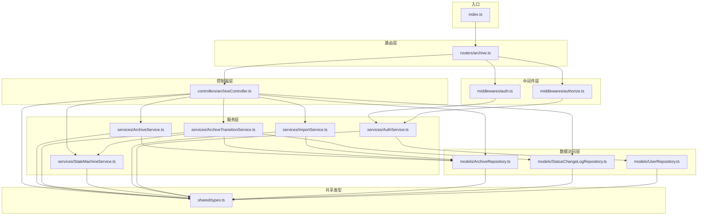
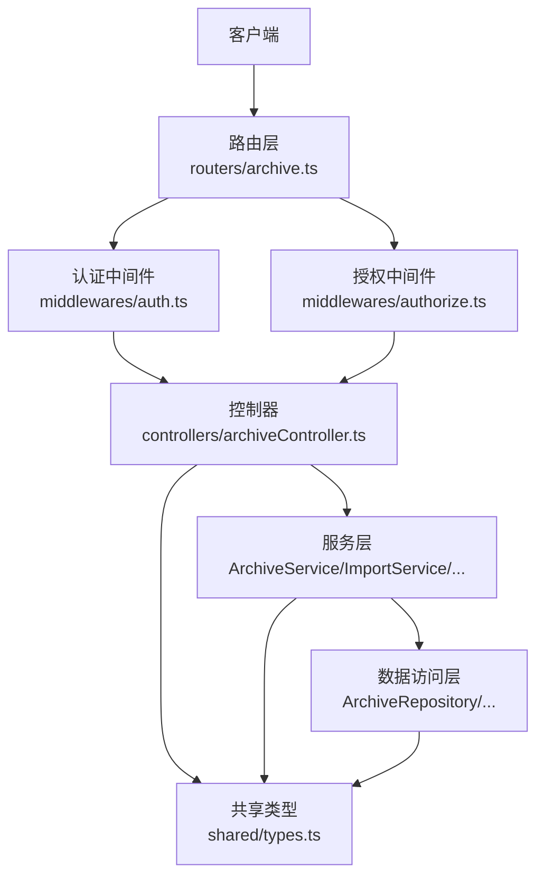
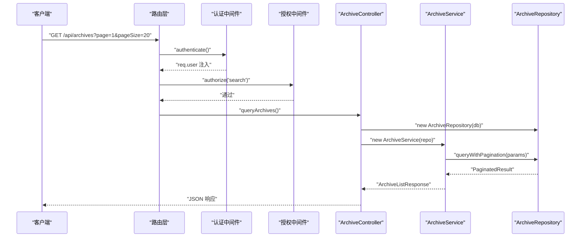
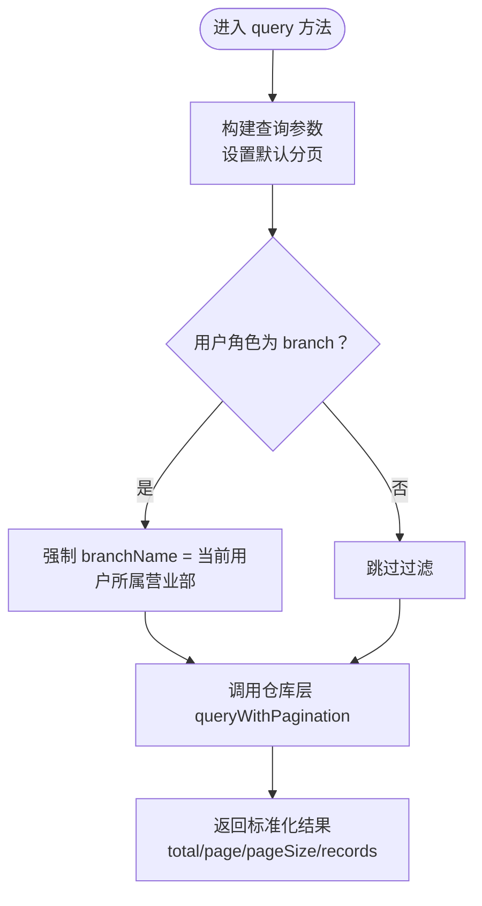
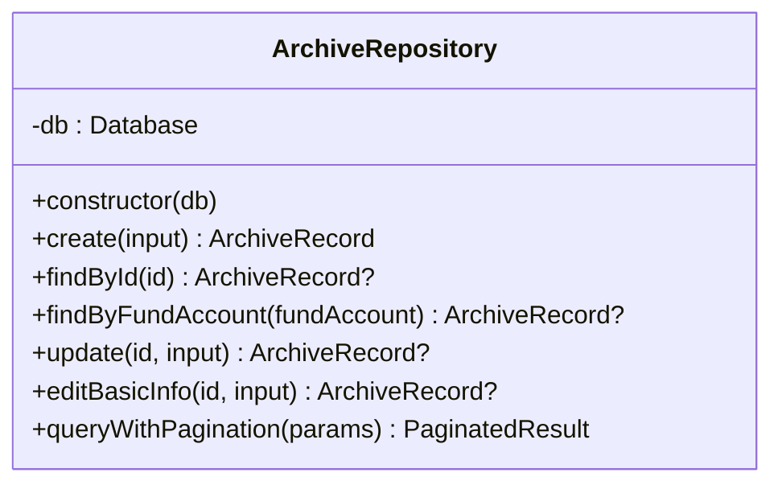
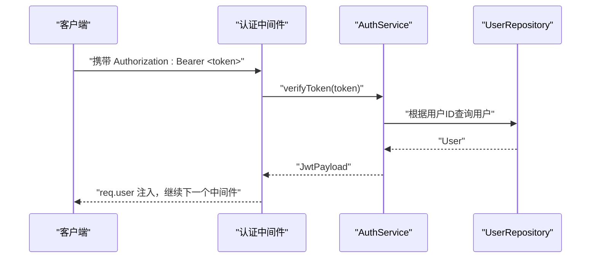
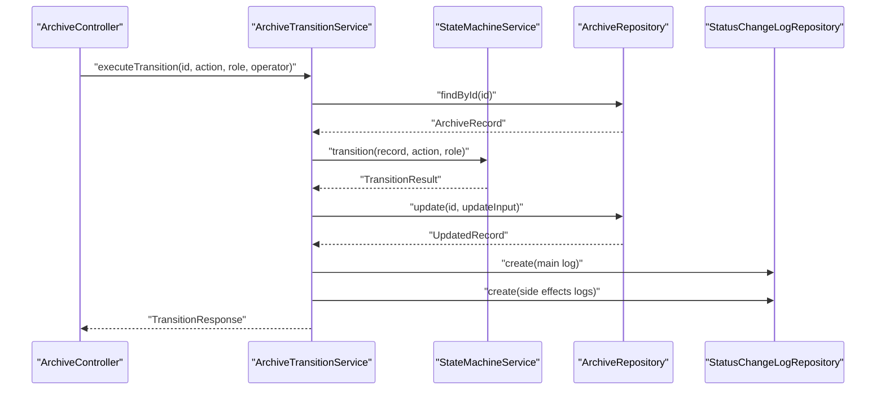
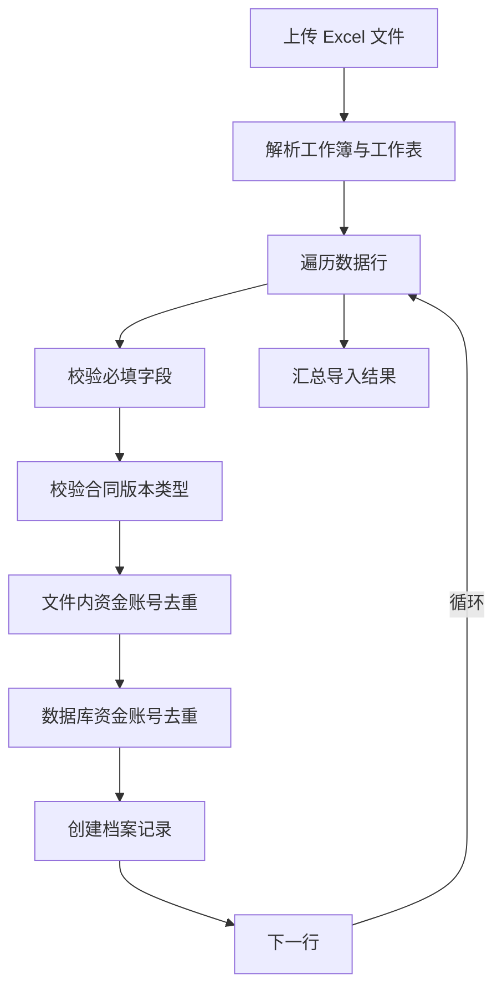
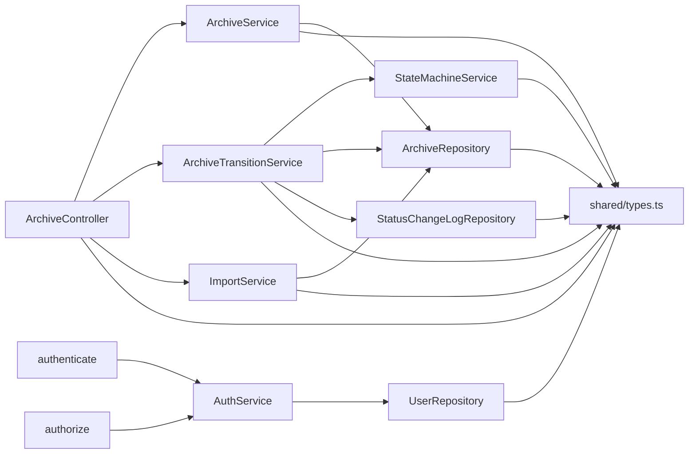

# MVC分层架构

<cite>
**本文引用的文件**
- [backend/src/controllers/archiveController.ts](file://backend/src/controllers/archiveController.ts)
- [backend/src/services/ArchiveService.ts](file://backend/src/services/ArchiveService.ts)
- [backend/src/models/ArchiveRepository.ts](file://backend/src/models/ArchiveRepository.ts)
- [backend/src/middlewares/auth.ts](file://backend/src/middlewares/auth.ts)
- [backend/src/middlewares/authorize.ts](file://backend/src/middlewares/authorize.ts)
- [backend/src/services/ArchiveTransitionService.ts](file://backend/src/services/ArchiveTransitionService.ts)
- [backend/src/services/StateMachineService.ts](file://backend/src/services/StateMachineService.ts)
- [backend/src/routers/archive.ts](file://backend/src/routers/archive.ts)
- [backend/src/index.ts](file://backend/src/index.ts)
- [shared/types.ts](file://shared/types.ts)
- [backend/src/services/AuthService.ts](file://backend/src/services/AuthService.ts)
- [backend/src/models/UserRepository.ts](file://backend/src/models/UserRepository.ts)
- [backend/src/models/StatusChangeLogRepository.ts](file://backend/src/models/StatusChangeLogRepository.ts)
- [backend/src/services/ImportService.ts](file://backend/src/services/ImportService.ts)
</cite>

## 目录
1. [简介](#简介)
2. [项目结构](#项目结构)
3. [核心组件](#核心组件)
4. [架构概览](#架构概览)
5. [详细组件分析](#详细组件分析)
6. [依赖分析](#依赖分析)
7. [性能考虑](#性能考虑)
8. [故障排查指南](#故障排查指南)
9. [结论](#结论)
10. [附录](#附录)

## 简介
本文件系统采用经典的MVC分层架构，围绕“档案管理”业务目标构建。系统清晰划分控制器层（Controllers）、服务层（Services）、数据访问层（Repositories）与中间件层（Middlewares），并通过统一的共享类型定义确保前后端一致性。本文重点阐述以下内容：
- 控制器层如何接收HTTP请求、参数校验与响应封装
- 服务层如何编排业务规则、状态机与事务边界
- 数据访问层如何抽象数据库操作、提供CRUD与分页查询
- 中间件层在认证与授权中的职责与协作
- ArchiveController、ArchiveService、ArchiveRepository的协作机制
- 依赖注入模式与模块化设计原则
- 典型MVC调用链路与序列图

## 项目结构
后端采用按职责分层的目录组织方式：
- controllers：HTTP请求入口，负责参数解析、调用服务、返回响应
- services：业务逻辑编排，整合状态机、仓库与日志
- models：数据访问对象，封装SQL与实体映射
- middlewares：认证与授权中间件
- routers：路由注册与中间件装配
- shared：前后端共享的类型定义
- index.ts：应用入口，初始化数据库、种子用户与路由注册

图表来源
- [backend/src/index.ts:1-39](file://backend/src/index.ts#L1-L39)
- [backend/src/routers/archive.ts:1-42](file://backend/src/routers/archive.ts#L1-L42)
- [backend/src/middlewares/auth.ts:1-56](file://backend/src/middlewares/auth.ts#L1-L56)
- [backend/src/middlewares/authorize.ts:1-47](file://backend/src/middlewares/authorize.ts#L1-L47)
- [backend/src/controllers/archiveController.ts:1-448](file://backend/src/controllers/archiveController.ts#L1-L448)
- [backend/src/services/ArchiveService.ts:1-71](file://backend/src/services/ArchiveService.ts#L1-L71)
- [backend/src/services/ArchiveTransitionService.ts:1-156](file://backend/src/services/ArchiveTransitionService.ts#L1-L156)
- [backend/src/services/StateMachineService.ts:1-253](file://backend/src/services/StateMachineService.ts#L1-L253)
- [backend/src/services/ImportService.ts:1-146](file://backend/src/services/ImportService.ts#L1-L146)
- [backend/src/services/AuthService.ts:1-126](file://backend/src/services/AuthService.ts#L1-L126)
- [backend/src/models/ArchiveRepository.ts:1-307](file://backend/src/models/ArchiveRepository.ts#L1-L307)
- [backend/src/models/StatusChangeLogRepository.ts:1-99](file://backend/src/models/StatusChangeLogRepository.ts#L1-L99)
- [backend/src/models/UserRepository.ts:1-56](file://backend/src/models/UserRepository.ts#L1-L56)
- [shared/types.ts:1-289](file://shared/types.ts#L1-L289)

章节来源
- [backend/src/index.ts:1-39](file://backend/src/index.ts#L1-L39)
- [backend/src/routers/archive.ts:1-42](file://backend/src/routers/archive.ts#L1-L42)

## 核心组件
- 控制器层（Controllers）
  - 职责：接收HTTP请求、参数校验、调用服务层、封装响应
  - 关键控制器：档案导入、模板下载、查询、详情、状态流转、批量流转、创建、编辑
- 服务层（Services）
  - 职责：编排业务规则、状态机校验、日志记录、分页与数据隔离
  - 关键服务：ArchiveService、ArchiveTransitionService、StateMachineService、ImportService、AuthService
- 数据访问层（Repositories）
  - 职责：封装数据库操作、实体映射、分页查询、唯一性校验
  - 关键仓库：ArchiveRepository、StatusChangeLogRepository、UserRepository
- 中间件层（Middlewares）
  - 职责：认证（提取JWT、校验）、授权（角色权限检查）
  - 关键中间件：authenticate、authorize

章节来源
- [backend/src/controllers/archiveController.ts:1-448](file://backend/src/controllers/archiveController.ts#L1-L448)
- [backend/src/services/ArchiveService.ts:1-71](file://backend/src/services/ArchiveService.ts#L1-L71)
- [backend/src/models/ArchiveRepository.ts:1-307](file://backend/src/models/ArchiveRepository.ts#L1-L307)
- [backend/src/middlewares/auth.ts:1-56](file://backend/src/middlewares/auth.ts#L1-L56)
- [backend/src/middlewares/authorize.ts:1-47](file://backend/src/middlewares/authorize.ts#L1-L47)

## 架构概览
系统以Express作为Web框架，通过路由层装配中间件与控制器，控制器调用服务层，服务层再调用仓库层完成数据库操作。认证中间件负责注入用户信息，授权中间件基于角色与权限进行访问控制。

图表来源
- [backend/src/routers/archive.ts:1-42](file://backend/src/routers/archive.ts#L1-L42)
- [backend/src/middlewares/auth.ts:1-56](file://backend/src/middlewares/auth.ts#L1-L56)
- [backend/src/middlewares/authorize.ts:1-47](file://backend/src/middlewares/authorize.ts#L1-L47)
- [backend/src/controllers/archiveController.ts:1-448](file://backend/src/controllers/archiveController.ts#L1-L448)
- [shared/types.ts:1-289](file://shared/types.ts#L1-L289)

## 详细组件分析

### 控制器层：ArchiveController
- 职责与能力
  - 导入Excel：校验文件类型、调用ImportService批量导入
  - 下载模板：生成Excel模板并返回文件流
  - 查询档案：构造查询参数、调用ArchiveService并返回分页结果
  - 获取详情：查询档案记录与状态变更历史
  - 单条状态流转：调用ArchiveTransitionService执行状态机校验与更新
  - 批量状态流转：逐条执行并汇总结果
  - 创建档案：校验必填字段与合同版本类型，设置初始状态
  - 编辑档案：校验唯一性与完结状态，更新基础信息
- 关键调用链
  - 控制器 -> 服务层 -> 仓库层 -> 数据库
  - 控制器 -> 状态机服务 -> 仓库层 -> 日志仓库
- 参数与响应
  - 使用共享类型定义请求/响应结构，确保前后端一致

图表来源
- [backend/src/routers/archive.ts:17-18](file://backend/src/routers/archive.ts#L17-L18)
- [backend/src/middlewares/auth.ts:26-55](file://backend/src/middlewares/auth.ts#L26-L55)
- [backend/src/middlewares/authorize.ts:16-46](file://backend/src/middlewares/authorize.ts#L16-L46)
- [backend/src/controllers/archiveController.ts:99-147](file://backend/src/controllers/archiveController.ts#L99-L147)
- [backend/src/services/ArchiveService.ts:33-69](file://backend/src/services/ArchiveService.ts#L33-L69)
- [backend/src/models/ArchiveRepository.ts:228-305](file://backend/src/models/ArchiveRepository.ts#L228-L305)

章节来源
- [backend/src/controllers/archiveController.ts:1-448](file://backend/src/controllers/archiveController.ts#L1-L448)
- [backend/src/routers/archive.ts:17-18](file://backend/src/routers/archive.ts#L17-L18)
- [backend/src/middlewares/auth.ts:26-55](file://backend/src/middlewares/auth.ts#L26-L55)
- [backend/src/middlewares/authorize.ts:16-46](file://backend/src/middlewares/authorize.ts#L16-L46)

### 服务层：ArchiveService
- 职责
  - 构造查询参数，设置分页默认值
  - 强制分支机构用户仅能查询本营业部数据
  - 调用仓库层执行分页查询并返回标准化结果
- 设计要点
  - 服务层不直接操作数据库，仅协调仓库层
  - 通过参数透传实现数据隔离与分页策略

图表来源
- [backend/src/services/ArchiveService.ts:33-69](file://backend/src/services/ArchiveService.ts#L33-L69)
- [backend/src/models/ArchiveRepository.ts:228-305](file://backend/src/models/ArchiveRepository.ts#L228-L305)

章节来源
- [backend/src/services/ArchiveService.ts:1-71](file://backend/src/services/ArchiveService.ts#L1-L71)

### 数据访问层：ArchiveRepository
- 职责
  - 提供档案记录的CRUD与编辑基础信息
  - 实现多条件组合查询与分页
  - 统一时间戳更新逻辑
- 关键方法
  - create：插入新记录并返回最新记录
  - findById/findByFundAccount：按主键与资金账号查询
  - update/editBasicInfo：部分字段更新与基础信息编辑
  - queryWithPagination：动态拼接WHERE条件与COUNT统计

图表来源
- [backend/src/models/ArchiveRepository.ts:85-307](file://backend/src/models/ArchiveRepository.ts#L85-L307)

章节来源
- [backend/src/models/ArchiveRepository.ts:1-307](file://backend/src/models/ArchiveRepository.ts#L1-L307)

### 中间件层：认证与授权
- 认证中间件（authenticate）
  - 从Authorization头提取Bearer Token
  - 调用AuthService校验Token并注入req.user
- 授权中间件（authorize）
  - 基于用户角色计算权限集合
  - 校验是否具备所需权限，否则返回403

图表来源
- [backend/src/middlewares/auth.ts:26-55](file://backend/src/middlewares/auth.ts#L26-L55)
- [backend/src/services/AuthService.ts:85-92](file://backend/src/services/AuthService.ts#L85-L92)
- [backend/src/models/UserRepository.ts:38-54](file://backend/src/models/UserRepository.ts#L38-L54)

章节来源
- [backend/src/middlewares/auth.ts:1-56](file://backend/src/middlewares/auth.ts#L1-L56)
- [backend/src/middlewares/authorize.ts:1-47](file://backend/src/middlewares/authorize.ts#L1-L47)
- [backend/src/services/AuthService.ts:1-126](file://backend/src/services/AuthService.ts#L1-L126)
- [backend/src/models/UserRepository.ts:1-56](file://backend/src/models/UserRepository.ts#L1-L56)

### 状态机与状态流转服务
- StateMachineService
  - 定义主流程状态与归档状态的合法转换矩阵
  - 校验电子版合同保护、完结记录保护、角色权限
  - 支持副作用联动（如review_pass联动archive_status）
- ArchiveTransitionService
  - 单条与批量状态流转编排
  - 调用状态机校验、更新档案记录、写入状态变更日志
  - 支持主变更与副作用变更的日志记录

图表来源
- [backend/src/controllers/archiveController.ts:208-258](file://backend/src/controllers/archiveController.ts#L208-L258)
- [backend/src/services/ArchiveTransitionService.ts:46-125](file://backend/src/services/ArchiveTransitionService.ts#L46-L125)
- [backend/src/services/StateMachineService.ts:106-142](file://backend/src/services/StateMachineService.ts#L106-L142)
- [backend/src/models/ArchiveRepository.ts:140-174](file://backend/src/models/ArchiveRepository.ts#L140-L174)
- [backend/src/models/StatusChangeLogRepository.ts:56-79](file://backend/src/models/StatusChangeLogRepository.ts#L56-L79)

章节来源
- [backend/src/services/StateMachineService.ts:1-253](file://backend/src/services/StateMachineService.ts#L1-L253)
- [backend/src/services/ArchiveTransitionService.ts:1-156](file://backend/src/services/ArchiveTransitionService.ts#L1-L156)

### 导入服务与Excel模板
- ImportService
  - 解析Excel工作表，逐行校验必填字段与值域
  - 资金账号唯一性校验（文件内+数据库）
  - 根据合同版本类型设置初始状态
- 模板下载
  - 生成包含标准列头的Excel工作簿并返回文件流

图表来源
- [backend/src/controllers/archiveController.ts:77-92](file://backend/src/controllers/archiveController.ts#L77-L92)
- [backend/src/services/ImportService.ts:52-144](file://backend/src/services/ImportService.ts#L52-L144)
- [backend/src/models/ArchiveRepository.ts:92-120](file://backend/src/models/ArchiveRepository.ts#L92-L120)

章节来源
- [backend/src/controllers/archiveController.ts:39-92](file://backend/src/controllers/archiveController.ts#L39-L92)
- [backend/src/services/ImportService.ts:1-146](file://backend/src/services/ImportService.ts#L1-L146)

## 依赖分析
- 控制器依赖服务层，服务层依赖仓库层
- 中间件依赖认证服务与用户仓库
- 共享类型贯穿所有层，保证契约一致
- 路由层装配中间件与控制器，形成清晰的职责边界

图表来源
- [backend/src/controllers/archiveController.ts:1-448](file://backend/src/controllers/archiveController.ts#L1-L448)
- [backend/src/services/ArchiveService.ts:1-71](file://backend/src/services/ArchiveService.ts#L1-L71)
- [backend/src/services/ArchiveTransitionService.ts:1-156](file://backend/src/services/ArchiveTransitionService.ts#L1-L156)
- [backend/src/services/StateMachineService.ts:1-253](file://backend/src/services/StateMachineService.ts#L1-L253)
- [backend/src/services/ImportService.ts:1-146](file://backend/src/services/ImportService.ts#L1-L146)
- [backend/src/middlewares/auth.ts:1-56](file://backend/src/middlewares/auth.ts#L1-L56)
- [backend/src/middlewares/authorize.ts:1-47](file://backend/src/middlewares/authorize.ts#L1-L47)
- [backend/src/services/AuthService.ts:1-126](file://backend/src/services/AuthService.ts#L1-L126)
- [backend/src/models/ArchiveRepository.ts:1-307](file://backend/src/models/ArchiveRepository.ts#L1-L307)
- [backend/src/models/StatusChangeLogRepository.ts:1-99](file://backend/src/models/StatusChangeLogRepository.ts#L1-L99)
- [backend/src/models/UserRepository.ts:1-56](file://backend/src/models/UserRepository.ts#L1-L56)
- [shared/types.ts:1-289](file://shared/types.ts#L1-L289)

章节来源
- [backend/src/routers/archive.ts:1-42](file://backend/src/routers/archive.ts#L1-L42)
- [backend/src/index.ts:1-39](file://backend/src/index.ts#L1-L39)

## 性能考虑
- 分页查询：仓库层使用LIMIT/OFFSET实现分页，建议结合索引优化高频查询字段（如branch_name、fund_account、created_at）
- 唯一性校验：导入流程先做文件内去重，再做数据库去重，避免重复I/O
- 状态机校验：在服务层集中校验，减少重复计算
- 日志写入：状态变更日志按需写入，注意批量场景下的事务与性能权衡

## 故障排查指南
- 认证失败
  - 检查Authorization头格式与Token有效性
  - 确认AuthService.verifyToken返回有效负载
- 权限不足
  - 确认用户角色与所需权限映射
  - 检查authorize中间件是否正确装配
- 状态流转失败
  - 检查StateMachineService前置保护（电子版合同、完结记录）
  - 核对ACTION_ROLE_MAP与当前用户角色
- 导入异常
  - 校验Excel列名与值域映射
  - 检查资金账号唯一性与空值校验

章节来源
- [backend/src/middlewares/auth.ts:26-55](file://backend/src/middlewares/auth.ts#L26-L55)
- [backend/src/middlewares/authorize.ts:16-46](file://backend/src/middlewares/authorize.ts#L16-L46)
- [backend/src/services/StateMachineService.ts:106-142](file://backend/src/services/StateMachineService.ts#L106-L142)
- [backend/src/services/ImportService.ts:75-110](file://backend/src/services/ImportService.ts#L75-L110)

## 结论
本系统通过清晰的MVC分层与中间件机制，实现了认证授权、业务编排、数据持久化的解耦。ArchiveController、ArchiveService与ArchiveRepository在职责上边界明确，配合状态机与日志体系，保障了业务规则的一致性与可追溯性。建议在生产环境中进一步完善索引、事务与缓存策略，并持续通过单元与集成测试巩固质量。

## 附录
- 典型MVC调用链路（查询档案）
  - 路由层 -> 认证中间件 -> 授权中间件 -> 控制器 -> 服务层 -> 仓库层 -> 数据库
- 依赖注入模式
  - 控制器在本地实例化服务与仓库，便于测试与替换；生产中可引入IoC容器以统一管理生命周期与依赖解析
- 模块化设计原则
  - 每一层只依赖其下游层，共享类型独立于业务逻辑，路由层仅负责装配中间件与控制器