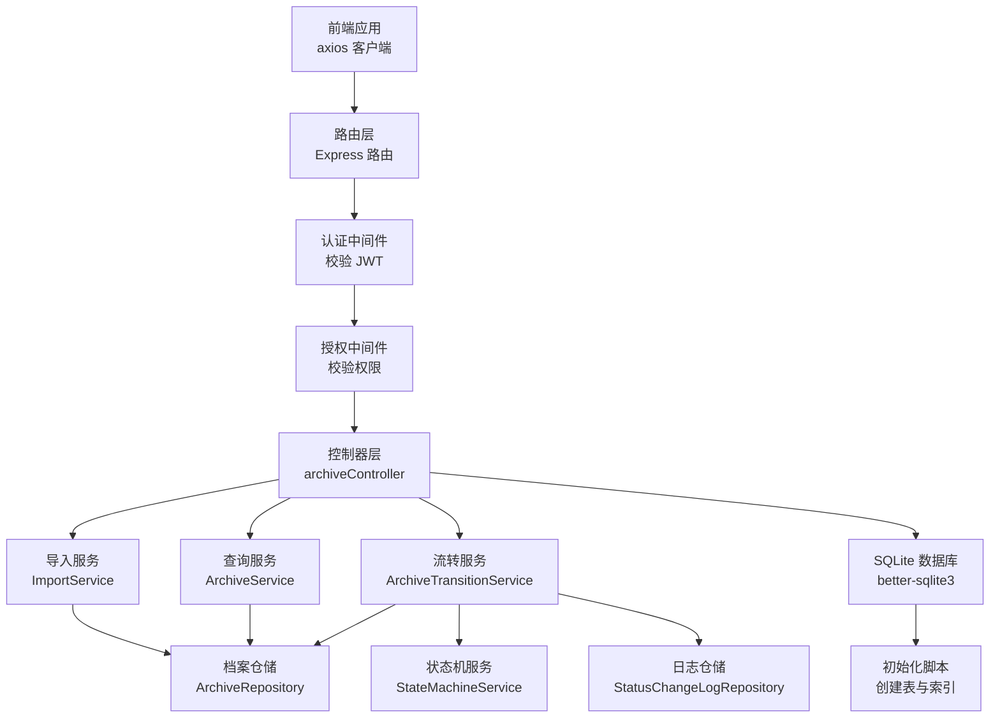
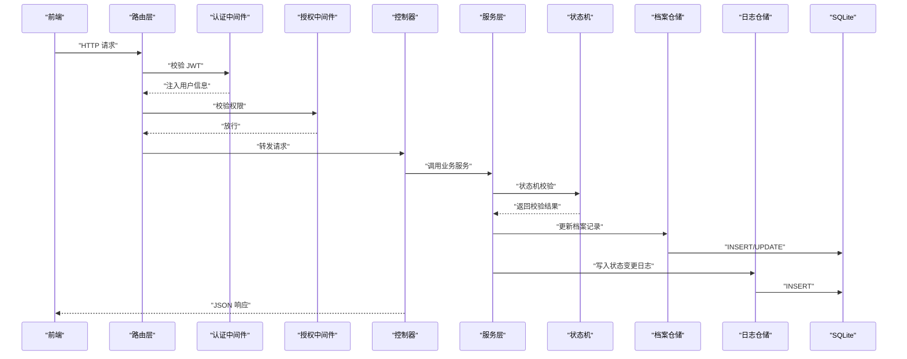
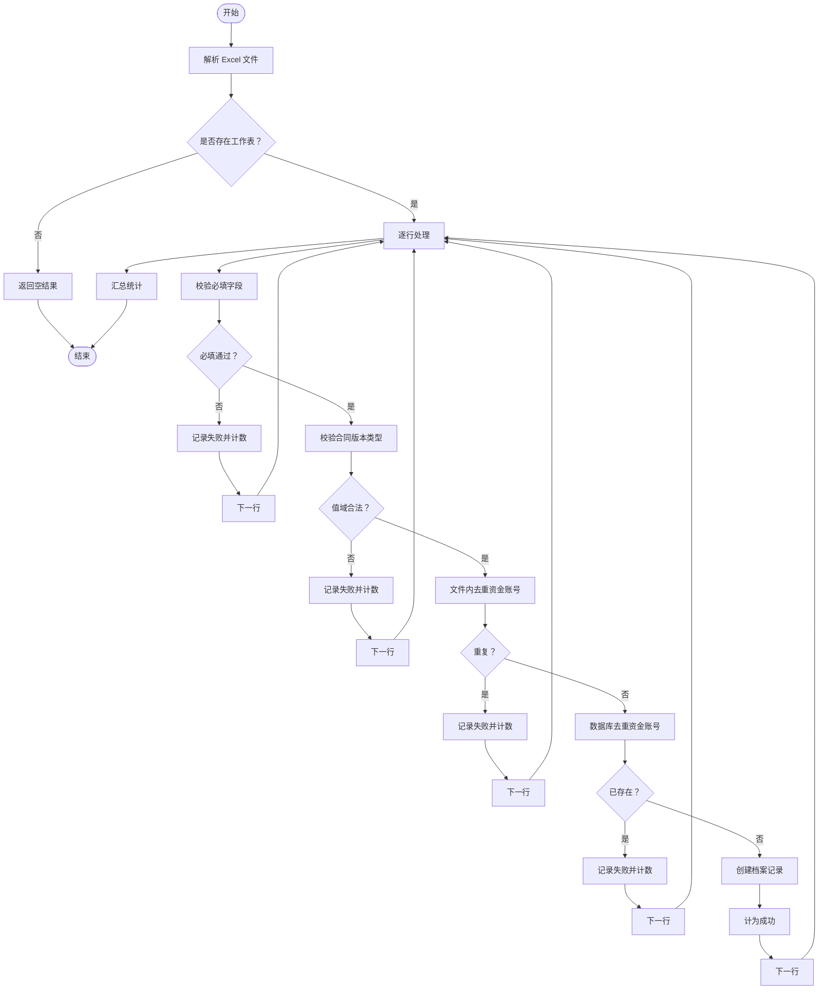
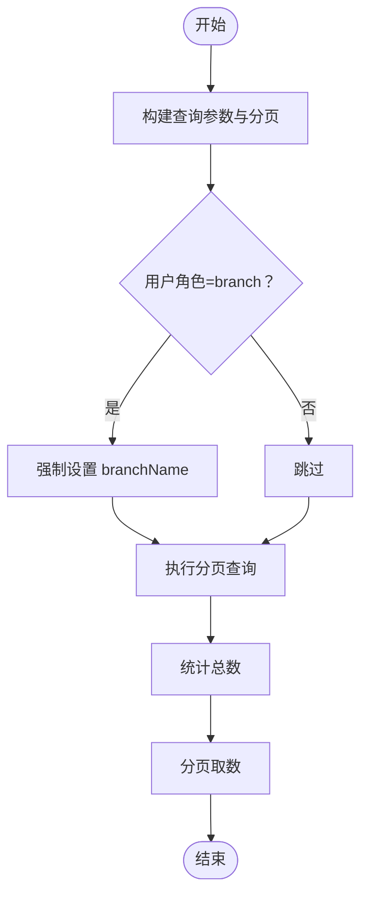
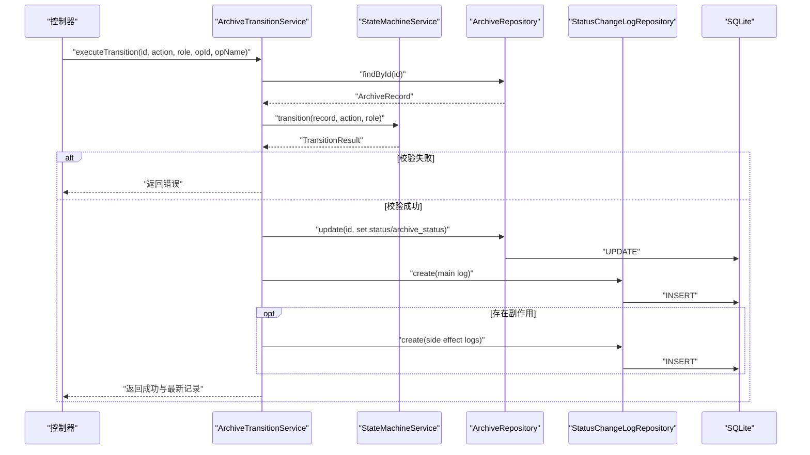
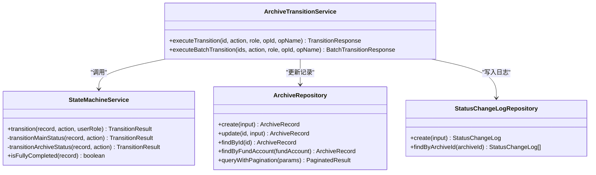
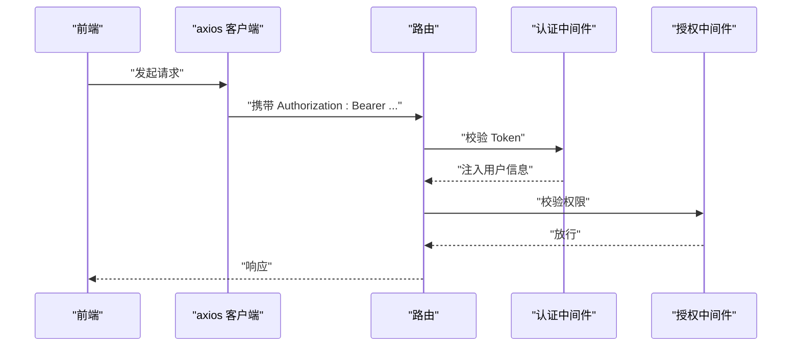
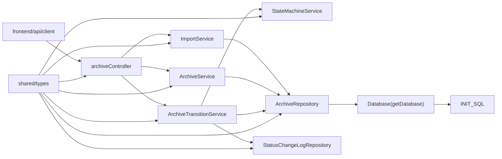

# 数据流设计

<cite>
**本文引用的文件**
- [backend/src/index.ts](file://backend/src/index.ts)
- [backend/src/routes/archive.ts](file://backend/src/routes/archive.ts)
- [backend/src/middlewares/auth.ts](file://backend/src/middlewares/auth.ts)
- [backend/src/middlewares/authorize.ts](file://backend/src/middlewares/authorize.ts)
- [backend/src/controllers/archiveController.ts](file://backend/src/controllers/archiveController.ts)
- [backend/src/services/ImportService.ts](file://backend/src/services/ImportService.ts)
- [backend/src/services/ArchiveService.ts](file://backend/src/services/ArchiveService.ts)
- [backend/src/services/StateMachineService.ts](file://backend/src/services/StateMachineService.ts)
- [backend/src/services/ArchiveTransitionService.ts](file://backend/src/services/ArchiveTransitionService.ts)
- [backend/src/models/ArchiveRepository.ts](file://backend/src/models/ArchiveRepository.ts)
- [backend/src/models/StatusChangeLogRepository.ts](file://backend/src/models/StatusChangeLogRepository.ts)
- [backend/src/database.ts](file://backend/src/database.ts)
- [backend/src/database-init.ts](file://backend/src/database-init.ts)
- [shared/types.ts](file://shared/types.ts)
- [frontend/src/api/client.ts](file://frontend/src/api/client.ts)
</cite>

## 目录
1. [简介](#简介)
2. [项目结构](#项目结构)
3. [核心组件](#核心组件)
4. [架构总览](#架构总览)
5. [详细组件分析](#详细组件分析)
6. [依赖关系分析](#依赖关系分析)
7. [性能考量](#性能考量)
8. [故障排查指南](#故障排查指南)
9. [结论](#结论)
10. [附录](#附录)

## 简介
本文件面向“文件管理系统”的数据流设计，围绕从前端请求到数据库持久化的完整链路进行系统化梳理。重点覆盖以下方面：
- 前端请求经由认证与授权中间件，到达控制器与服务层，最终写入 SQLite 数据库；
- 状态机驱动的状态流转过程，包括主流程状态与归档状态的转换规则、角色权限校验与审计日志；
- 数据验证、转换与持久化的各阶段职责与边界；
- 错误处理与异常传播机制；
- 典型业务场景的数据流图与时序图；
- 缓存策略与性能优化建议；
- 数据一致性与并发控制机制说明。

## 项目结构
后端采用 Express + better-sqlite3 的轻量架构，前端通过 axios 发起请求并与后端交互。共享类型定义位于 shared/types.ts，确保前后端一致的契约。

图表来源
- [backend/src/index.ts:14-36](file://backend/src/index.ts#L14-L36)
- [backend/src/routes/archive.ts:12-41](file://backend/src/routes/archive.ts#L12-L41)
- [backend/src/middlewares/auth.ts:26-55](file://backend/src/middlewares/auth.ts#L26-L55)
- [backend/src/middlewares/authorize.ts:16-46](file://backend/src/middlewares/authorize.ts#L16-L46)
- [backend/src/controllers/archiveController.ts:43-71](file://backend/src/controllers/archiveController.ts#L43-L71)
- [backend/src/services/ImportService.ts:52-144](file://backend/src/services/ImportService.ts#L52-L144)
- [backend/src/services/ArchiveService.ts:33-69](file://backend/src/services/ArchiveService.ts#L33-L69)
- [backend/src/services/StateMachineService.ts:106-142](file://backend/src/services/StateMachineService.ts#L106-L142)
- [backend/src/services/ArchiveTransitionService.ts:46-125](file://backend/src/services/ArchiveTransitionService.ts#L46-L125)
- [backend/src/models/ArchiveRepository.ts:93-120](file://backend/src/models/ArchiveRepository.ts#L93-L120)
- [backend/src/models/StatusChangeLogRepository.ts:57-79](file://backend/src/models/StatusChangeLogRepository.ts#L57-L79)
- [backend/src/database.ts:25-52](file://backend/src/database.ts#L25-L52)
- [backend/src/database-init.ts:8-64](file://backend/src/database-init.ts#L8-L64)

章节来源
- [backend/src/index.ts:14-36](file://backend/src/index.ts#L14-L36)
- [backend/src/routes/archive.ts:12-41](file://backend/src/routes/archive.ts#L12-L41)
- [backend/src/middlewares/auth.ts:26-55](file://backend/src/middlewares/auth.ts#L26-L55)
- [backend/src/middlewares/authorize.ts:16-46](file://backend/src/middlewares/authorize.ts#L16-L46)
- [backend/src/controllers/archiveController.ts:43-71](file://backend/src/controllers/archiveController.ts#L43-L71)
- [backend/src/database.ts:25-52](file://backend/src/database.ts#L25-L52)
- [backend/src/database-init.ts:8-64](file://backend/src/database-init.ts#L8-L64)

## 核心组件
- 路由层：集中注册档案相关的 REST 接口，绑定认证与授权中间件。
- 中间件层：认证中间件负责提取并校验 JWT；授权中间件基于角色派生权限集合进行校验。
- 控制器层：实现具体业务接口，协调服务与仓储，组装统一响应。
- 服务层：
  - ImportService：解析 Excel 并执行字段校验与创建。
  - ArchiveService：封装查询与分页逻辑，处理分支机构数据隔离。
  - StateMachineService：定义主流程与归档状态的合法转换及角色映射。
  - ArchiveTransitionService：整合状态机校验、记录更新与日志写入。
- 仓储层：
  - ArchiveRepository：提供档案记录的增删改查与分页查询。
  - StatusChangeLogRepository：提供状态变更日志的写入与查询。
- 数据库层：better-sqlite3 单例连接，WAL 模式与外键约束，初始化脚本创建表与索引。
- 共享类型：统一定义状态、动作、实体与接口，保障前后端契约一致。

章节来源
- [backend/src/routes/archive.ts:12-41](file://backend/src/routes/archive.ts#L12-L41)
- [backend/src/middlewares/auth.ts:26-55](file://backend/src/middlewares/auth.ts#L26-L55)
- [backend/src/middlewares/authorize.ts:16-46](file://backend/src/middlewares/authorize.ts#L16-L46)
- [backend/src/controllers/archiveController.ts:43-71](file://backend/src/controllers/archiveController.ts#L43-L71)
- [backend/src/services/ImportService.ts:52-144](file://backend/src/services/ImportService.ts#L52-L144)
- [backend/src/services/ArchiveService.ts:33-69](file://backend/src/services/ArchiveService.ts#L33-L69)
- [backend/src/services/StateMachineService.ts:106-142](file://backend/src/services/StateMachineService.ts#L106-L142)
- [backend/src/services/ArchiveTransitionService.ts:46-125](file://backend/src/services/ArchiveTransitionService.ts#L46-L125)
- [backend/src/models/ArchiveRepository.ts:93-120](file://backend/src/models/ArchiveRepository.ts#L93-L120)
- [backend/src/models/StatusChangeLogRepository.ts:57-79](file://backend/src/models/StatusChangeLogRepository.ts#L57-L79)
- [backend/src/database.ts:25-52](file://backend/src/database.ts#L25-L52)
- [shared/types.ts:46-73](file://shared/types.ts#L46-L73)

## 架构总览
下图展示从前端到数据库的端到端数据流，涵盖认证、授权、业务处理与持久化。

图表来源
- [backend/src/routes/archive.ts:12-41](file://backend/src/routes/archive.ts#L12-L41)
- [backend/src/middlewares/auth.ts:26-55](file://backend/src/middlewares/auth.ts#L26-L55)
- [backend/src/middlewares/authorize.ts:16-46](file://backend/src/middlewares/authorize.ts#L16-L46)
- [backend/src/controllers/archiveController.ts:208-258](file://backend/src/controllers/archiveController.ts#L208-L258)
- [backend/src/services/StateMachineService.ts:106-142](file://backend/src/services/StateMachineService.ts#L106-L142)
- [backend/src/services/ArchiveTransitionService.ts:46-125](file://backend/src/services/ArchiveTransitionService.ts#L46-L125)
- [backend/src/models/ArchiveRepository.ts:93-120](file://backend/src/models/ArchiveRepository.ts#L93-L120)
- [backend/src/models/StatusChangeLogRepository.ts:57-79](file://backend/src/models/StatusChangeLogRepository.ts#L57-L79)

## 详细组件分析

### 组件一：Excel 导入数据流
- 输入：multipart/form-data，文件名为 file，使用内存存储；
- 处理：解析 Excel -> 校验必填字段与值域 -> 去重（文件内+数据库）-> 创建记录；
- 输出：导入统计结果（总数、成功、失败、错误明细）。

图表来源
- [backend/src/controllers/archiveController.ts:43-71](file://backend/src/controllers/archiveController.ts#L43-L71)
- [backend/src/services/ImportService.ts:52-144](file://backend/src/services/ImportService.ts#L52-L144)
- [backend/src/models/ArchiveRepository.ts:93-120](file://backend/src/models/ArchiveRepository.ts#L93-L120)

章节来源
- [backend/src/controllers/archiveController.ts:43-71](file://backend/src/controllers/archiveController.ts#L43-L71)
- [backend/src/services/ImportService.ts:52-144](file://backend/src/services/ImportService.ts#L52-L144)
- [backend/src/models/ArchiveRepository.ts:93-120](file://backend/src/models/ArchiveRepository.ts#L93-L120)

### 组件二：档案查询与分页
- 输入：查询参数（客户名、资金账号、营业部、合同类型、主状态、归档状态、合同版本类型、开户日期区间）、分页参数；
- 处理：构建查询条件与分页参数，分支机构用户强制按本营业部过滤；
- 输出：总条数、页码、页大小与记录列表。

图表来源
- [backend/src/controllers/archiveController.ts:99-147](file://backend/src/controllers/archiveController.ts#L99-L147)
- [backend/src/services/ArchiveService.ts:33-69](file://backend/src/services/ArchiveService.ts#L33-L69)
- [backend/src/models/ArchiveRepository.ts:228-305](file://backend/src/models/ArchiveRepository.ts#L228-L305)

章节来源
- [backend/src/controllers/archiveController.ts:99-147](file://backend/src/controllers/archiveController.ts#L99-L147)
- [backend/src/services/ArchiveService.ts:33-69](file://backend/src/services/ArchiveService.ts#L33-L69)
- [backend/src/models/ArchiveRepository.ts:228-305](file://backend/src/models/ArchiveRepository.ts#L228-L305)

### 组件三：状态流转与审计（单条）
- 输入：档案 ID、动作、用户角色；
- 处理：查询记录 -> 状态机校验（前置保护、角色校验、转换合法性）-> 更新记录 -> 写入主日志 -> 写入副作用日志；
- 输出：成功/失败与最新记录。

图表来源
- [backend/src/controllers/archiveController.ts:208-258](file://backend/src/controllers/archiveController.ts#L208-L258)
- [backend/src/services/ArchiveTransitionService.ts:46-125](file://backend/src/services/ArchiveTransitionService.ts#L46-L125)
- [backend/src/services/StateMachineService.ts:106-142](file://backend/src/services/StateMachineService.ts#L106-L142)
- [backend/src/models/ArchiveRepository.ts:141-174](file://backend/src/models/ArchiveRepository.ts#L141-L174)
- [backend/src/models/StatusChangeLogRepository.ts:57-79](file://backend/src/models/StatusChangeLogRepository.ts#L57-L79)

章节来源
- [backend/src/controllers/archiveController.ts:208-258](file://backend/src/controllers/archiveController.ts#L208-L258)
- [backend/src/services/ArchiveTransitionService.ts:46-125](file://backend/src/services/ArchiveTransitionService.ts#L46-L125)
- [backend/src/services/StateMachineService.ts:106-142](file://backend/src/services/StateMachineService.ts#L106-L142)
- [backend/src/models/ArchiveRepository.ts:141-174](file://backend/src/models/ArchiveRepository.ts#L141-L174)
- [backend/src/models/StatusChangeLogRepository.ts:57-79](file://backend/src/models/StatusChangeLogRepository.ts#L57-L79)

### 组件四：状态机与状态变更日志模型
- 状态机：定义主流程状态与归档状态的转换矩阵、动作-角色映射、动作-字段映射与副作用逻辑；
- 日志模型：记录每次状态变更的字段、前值、后值、动作、操作人与时间。

图表来源
- [backend/src/services/StateMachineService.ts:96-252](file://backend/src/services/StateMachineService.ts#L96-L252)
- [backend/src/services/ArchiveTransitionService.ts:24-155](file://backend/src/services/ArchiveTransitionService.ts#L24-L155)
- [backend/src/models/ArchiveRepository.ts:85-306](file://backend/src/models/ArchiveRepository.ts#L85-L306)
- [backend/src/models/StatusChangeLogRepository.ts:49-98](file://backend/src/models/StatusChangeLogRepository.ts#L49-L98)

章节来源
- [backend/src/services/StateMachineService.ts:96-252](file://backend/src/services/StateMachineService.ts#L96-L252)
- [backend/src/services/ArchiveTransitionService.ts:24-155](file://backend/src/services/ArchiveTransitionService.ts#L24-L155)
- [backend/src/models/ArchiveRepository.ts:85-306](file://backend/src/models/ArchiveRepository.ts#L85-L306)
- [backend/src/models/StatusChangeLogRepository.ts:49-98](file://backend/src/models/StatusChangeLogRepository.ts#L49-L98)

### 组件五：认证与授权
- 认证中间件：从 Authorization 头提取 Bearer Token，校验后将用户信息注入请求上下文；
- 授权中间件：基于用户角色派生权限集合，校验是否具备所需权限；
- 前端 axios：统一设置 baseURL，自动注入 Token；对 401 响应清理本地凭证并跳转登录。

图表来源
- [frontend/src/api/client.ts:10-54](file://frontend/src/api/client.ts#L10-L54)
- [backend/src/middlewares/auth.ts:26-55](file://backend/src/middlewares/auth.ts#L26-L55)
- [backend/src/middlewares/authorize.ts:16-46](file://backend/src/middlewares/authorize.ts#L16-L46)

章节来源
- [frontend/src/api/client.ts:10-54](file://frontend/src/api/client.ts#L10-L54)
- [backend/src/middlewares/auth.ts:26-55](file://backend/src/middlewares/auth.ts#L26-L55)
- [backend/src/middlewares/authorize.ts:16-46](file://backend/src/middlewares/authorize.ts#L16-L46)

## 依赖关系分析
- 控制器依赖服务与仓储，服务依赖状态机与仓储；
- 仓储依赖数据库连接与初始化脚本；
- 路由依赖中间件与控制器；
- 前端依赖 axios 客户端与共享类型。

图表来源
- [backend/src/controllers/archiveController.ts:6-24](file://backend/src/controllers/archiveController.ts#L6-L24)
- [backend/src/services/ImportService.ts:14](file://backend/src/services/ImportService.ts#L14)
- [backend/src/services/ArchiveService.ts:20](file://backend/src/services/ArchiveService.ts#L20)
- [backend/src/services/ArchiveTransitionService.ts:24-37](file://backend/src/services/ArchiveTransitionService.ts#L24-L37)
- [backend/src/services/StateMachineService.ts:96](file://backend/src/services/StateMachineService.ts#L96)
- [backend/src/models/ArchiveRepository.ts:85](file://backend/src/models/ArchiveRepository.ts#L85)
- [backend/src/models/StatusChangeLogRepository.ts:49](file://backend/src/models/StatusChangeLogRepository.ts#L49)
- [backend/src/database.ts:25-52](file://backend/src/database.ts#L25-L52)
- [backend/src/database-init.ts:8-64](file://backend/src/database-init.ts#L8-L64)
- [frontend/src/api/client.ts:6](file://frontend/src/api/client.ts#L6)
- [shared/types.ts:46-73](file://shared/types.ts#L46-L73)

章节来源
- [backend/src/controllers/archiveController.ts:6-24](file://backend/src/controllers/archiveController.ts#L6-L24)
- [backend/src/services/ImportService.ts:14](file://backend/src/services/ImportService.ts#L14)
- [backend/src/services/ArchiveService.ts:20](file://backend/src/services/ArchiveService.ts#L20)
- [backend/src/services/ArchiveTransitionService.ts:24-37](file://backend/src/services/ArchiveTransitionService.ts#L24-L37)
- [backend/src/services/StateMachineService.ts:96](file://backend/src/services/StateMachineService.ts#L96)
- [backend/src/models/ArchiveRepository.ts:85](file://backend/src/models/ArchiveRepository.ts#L85)
- [backend/src/models/StatusChangeLogRepository.ts:49](file://backend/src/models/StatusChangeLogRepository.ts#L49)
- [backend/src/database.ts:25-52](file://backend/src/database.ts#L25-L52)
- [backend/src/database-init.ts:8-64](file://backend/src/database-init.ts#L8-L64)
- [frontend/src/api/client.ts:6](file://frontend/src/api/client.ts#L6)
- [shared/types.ts:46-73](file://shared/types.ts#L46-L73)

## 性能考量
- 数据库并发与一致性
  - WAL 模式：提升并发读写性能，减少锁竞争；
  - 外键约束：保证参照完整性；
  - 索引：对资金账号、营业部、主状态、归档状态、合同版本类型建立索引，加速查询与去重。
- 事务与批处理
  - 导入服务逐行处理，建议在批量导入时评估事务包裹以减少多次提交开销；
  - 批量状态流转服务逐条执行，若需要更强的一致性，可在上层引入事务包装。
- 前端缓存策略
  - 对查询结果与静态资源进行合理缓存，避免频繁重复请求；
  - 对于高频筛选条件，可考虑前端本地缓存与增量更新。
- I/O 优化
  - Excel 导入使用内存存储，注意大文件内存占用；
  - 响应体尽量精简，避免传输冗余字段。

章节来源
- [backend/src/database.ts:41-45](file://backend/src/database.ts#L41-L45)
- [backend/src/database-init.ts:42-47](file://backend/src/database-init.ts#L42-L47)
- [backend/src/services/ImportService.ts:52-144](file://backend/src/services/ImportService.ts#L52-L144)
- [backend/src/services/ArchiveTransitionService.ts:131-154](file://backend/src/services/ArchiveTransitionService.ts#L131-L154)

## 故障排查指南
- 常见错误与处理
  - 未提供认证令牌：401，前端清除本地凭证并跳转登录；
  - 权限不足：403，检查用户角色与所需权限映射；
  - 参数非法：400，检查必填字段与值域；
  - 资金账号冲突：409，检查数据库与文件内重复；
  - 状态流转不合法：400，检查状态机转换矩阵与角色映射；
  - 记录不存在：404，检查档案 ID。
- 审计与溯源
  - 状态变更日志包含字段、前值、后值、动作、操作人与时间，便于问题追踪；
  - 控制器在状态流转失败时返回统一错误码与消息，便于前端提示与日志记录。

章节来源
- [backend/src/middlewares/auth.ts:29-50](file://backend/src/middlewares/auth.ts#L29-L50)
- [backend/src/middlewares/authorize.ts:32-42](file://backend/src/middlewares/authorize.ts#L32-L42)
- [backend/src/controllers/archiveController.ts:47-62](file://backend/src/controllers/archiveController.ts#L47-L62)
- [backend/src/controllers/archiveController.ts:363-371](file://backend/src/controllers/archiveController.ts#L363-L371)
- [backend/src/controllers/archiveController.ts:244-251](file://backend/src/controllers/archiveController.ts#L244-L251)
- [backend/src/models/StatusChangeLogRepository.ts:57-79](file://backend/src/models/StatusChangeLogRepository.ts#L57-L79)

## 结论
本系统通过清晰的分层与职责划分，实现了从前端请求到数据库持久化的闭环数据流。状态机驱动的状态流转确保了业务规则的可维护性与可审计性，结合完善的日志记录与错误处理机制，为系统的稳定性与可追溯性提供了坚实基础。在性能方面，WAL 模式、索引与合理的前端缓存策略共同提升了整体吞吐与响应速度。

## 附录
- 典型业务场景
  - Excel 导入：文件上传 -> 字段校验 -> 去重 -> 创建记录 -> 统计返回；
  - 档案查询：参数构建 -> 分页查询 -> 分支机构数据隔离 -> 结果返回；
  - 状态流转：记录查询 -> 状态机校验 -> 更新记录 -> 写入日志 -> 成功返回；
  - 批量流转：逐条执行状态机校验 -> 汇总结果 -> 返回统计与明细。