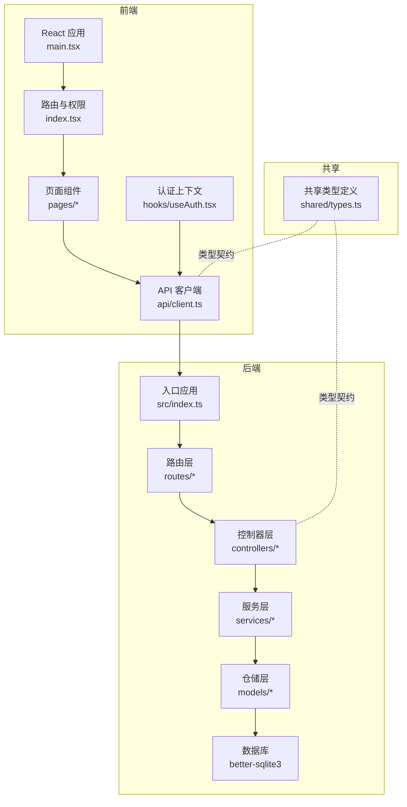
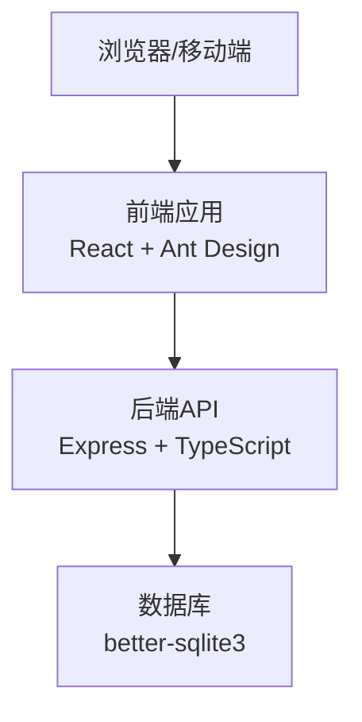
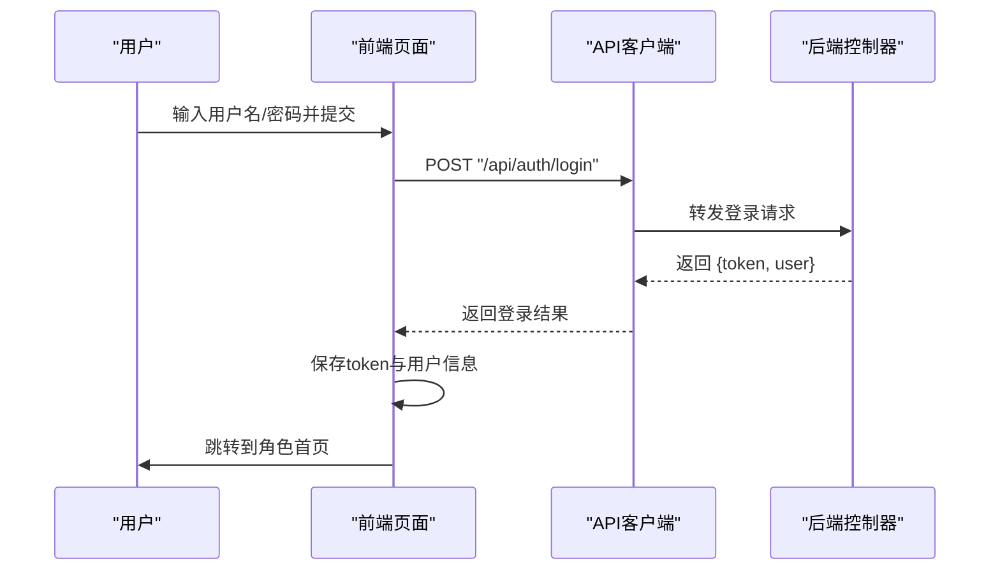
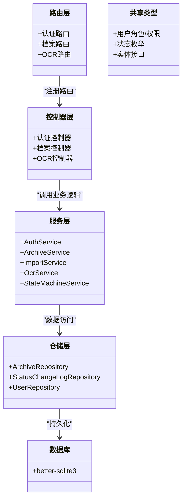
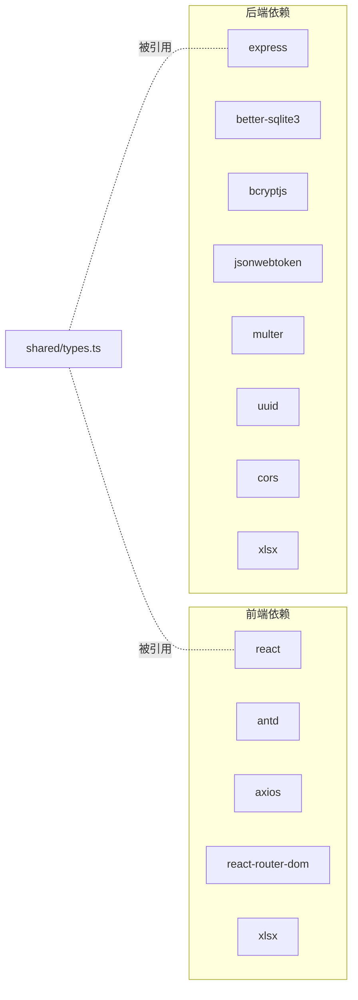

# 整体架构设计

<cite>
**本文引用的文件**
- [backend/package.json](file://backend/package.json)
- [frontend/package.json](file://frontend/package.json)
- [backend/src/index.ts](file://backend/src/index.ts)
- [backend/src/routes/auth.ts](file://backend/src/routes/auth.ts)
- [backend/src/routes/archive.ts](file://backend/src/routes/archive.ts)
- [backend/src/routes/ocr.ts](file://backend/src/routes/ocr.ts)
- [backend/src/controllers/authController.ts](file://backend/src/controllers/authController.ts)
- [backend/src/controllers/archiveController.ts](file://backend/src/controllers/archiveController.ts)
- [backend/src/controllers/ocrController.ts](file://backend/src/controllers/ocrController.ts)
- [backend/src/middlewares/auth.ts](file://backend/src/middlewares/auth.ts)
- [backend/src/middlewares/authorize.ts](file://backend/src/middlewares/authorize.ts)
- [backend/src/services/AuthService.ts](file://backend/src/services/AuthService.ts)
- [backend/src/services/ArchiveService.ts](file://backend/src/services/ArchiveService.ts)
- [backend/src/services/ImportService.ts](file://backend/src/services/ImportService.ts)
- [backend/src/services/OcrService.ts](file://backend/src/services/OcrService.ts)
- [backend/src/services/StateMachineService.ts](file://backend/src/services/StateMachineService.ts)
- [backend/src/models/ArchiveRepository.ts](file://backend/src/models/ArchiveRepository.ts)
- [backend/src/models/StatusChangeLogRepository.ts](file://backend/src/models/StatusChangeLogRepository.ts)
- [backend/src/models/UserRepository.ts](file://backend/src/models/UserRepository.ts)
- [backend/src/database.ts](file://backend/src/database.ts)
- [backend/src/utils/seedUsers.ts](file://backend/src/utils/seedUsers.ts)
- [shared/types.ts](file://shared/types.ts)
- [frontend/src/main.tsx](file://frontend/src/main.tsx)
- [frontend/src/api/client.ts](file://frontend/src/api/client.ts)
- [frontend/src/hooks/useAuth.tsx](file://frontend/src/hooks/useAuth.tsx)
- [frontend/src/pages/LoginPage.tsx](file://frontend/src/pages/LoginPage.tsx)
- [frontend/src/pages/ArchivePage.tsx](file://frontend/src/pages/ArchivePage.tsx)
- [frontend/src/routes/index.tsx](file://frontend/src/routes/index.tsx)
</cite>

## 目录
1. [引言](#引言)
2. [项目结构](#项目结构)
3. [核心组件](#核心组件)
4. [架构总览](#架构总览)
5. [详细组件分析](#详细组件分析)
6. [依赖分析](#依赖分析)
7. [性能考虑](#性能考虑)
8. [故障排查指南](#故障排查指南)
9. [结论](#结论)
10. [附录](#附录)

## 引言
本文件为“文件管理系统”的整体架构设计文档，聚焦于前后端分离架构的实现方式，明确Express.js后端服务与React前端应用的职责划分；阐述RESTful API设计原则与数据交换格式；说明技术栈选择（TypeScript、better-sqlite3、Ant Design等）及其技术考量；梳理系统边界、外部依赖与第三方集成点；并提供部署架构图与组件交互流程图，最后给出架构决策的权衡分析与可扩展性设计原则。

## 项目结构
系统采用前后端分离模式：
- 后端：基于Express.js的REST API服务，使用TypeScript开发，采用分层架构（路由/控制器/服务/仓储/中间件），数据库采用better-sqlite3。
- 前端：基于React 19 + Vite构建，使用Ant Design作为UI框架，Axios进行HTTP通信，React Router v7管理路由与权限保护。
- 共享层：通过shared/types.ts定义前后端共用的类型、枚举与接口，确保契约一致。

图表来源
- [frontend/src/main.tsx:1-18](file://frontend/src/main.tsx#L1-L18)
- [frontend/src/routes/index.tsx:1-98](file://frontend/src/routes/index.tsx#L1-L98)
- [frontend/src/api/client.ts:1-55](file://frontend/src/api/client.ts#L1-L55)
- [frontend/src/hooks/useAuth.tsx:1-90](file://frontend/src/hooks/useAuth.tsx#L1-L90)
- [backend/src/index.ts:1-39](file://backend/src/index.ts#L1-L39)
- [backend/src/routes/auth.ts:1-19](file://backend/src/routes/auth.ts#L1-L19)
- [backend/src/routes/archive.ts:1-42](file://backend/src/routes/archive.ts#L1-L42)
- [backend/src/routes/ocr.ts:1-21](file://backend/src/routes/ocr.ts#L1-L21)
- [backend/src/controllers/authController.ts:1-77](file://backend/src/controllers/authController.ts#L1-L77)
- [backend/src/controllers/archiveController.ts:1-448](file://backend/src/controllers/archiveController.ts#L1-L448)
- [backend/src/controllers/ocrController.ts](file://backend/src/controllers/ocrController.ts)
- [backend/src/services/AuthService.ts](file://backend/src/services/AuthService.ts)
- [backend/src/services/ArchiveService.ts](file://backend/src/services/ArchiveService.ts)
- [backend/src/services/ImportService.ts](file://backend/src/services/ImportService.ts)
- [backend/src/services/OcrService.ts](file://backend/src/services/OcrService.ts)
- [backend/src/services/StateMachineService.ts](file://backend/src/services/StateMachineService.ts)
- [backend/src/models/ArchiveRepository.ts](file://backend/src/models/ArchiveRepository.ts)
- [backend/src/models/StatusChangeLogRepository.ts](file://backend/src/models/StatusChangeLogRepository.ts)
- [backend/src/models/UserRepository.ts](file://backend/src/models/UserRepository.ts)
- [backend/src/database.ts](file://backend/src/database.ts)
- [shared/types.ts:1-289](file://shared/types.ts#L1-L289)

章节来源
- [backend/src/index.ts:1-39](file://backend/src/index.ts#L1-L39)
- [frontend/src/main.tsx:1-18](file://frontend/src/main.tsx#L1-L18)
- [shared/types.ts:1-289](file://shared/types.ts#L1-L289)

## 核心组件
- 前端核心组件
  - 应用入口与路由：负责初始化应用、提供认证上下文、配置路由与权限保护。
  - API客户端：统一配置baseURL、请求/响应拦截器，处理鉴权与错误。
  - 页面组件：按角色划分的功能页面，如导入、审核、OCR、寄送、归档等。
  - 认证上下文：管理登录状态、角色与权限，持久化至localStorage。
- 后端核心组件
  - 入口应用：初始化CORS、JSON解析、数据库与种子用户，注册路由并提供健康检查。
  - 路由层：按功能域划分，分别处理认证、档案、OCR。
  - 控制器层：处理具体业务请求，进行参数校验与错误响应。
  - 服务层：封装业务逻辑，如导入、状态机流转、OCR识别、认证等。
  - 仓储层：封装数据访问，提供CRUD与查询方法。
  - 数据库：使用better-sqlite3，结合共享类型定义数据模型。

章节来源
- [frontend/src/main.tsx:1-18](file://frontend/src/main.tsx#L1-L18)
- [frontend/src/routes/index.tsx:1-98](file://frontend/src/routes/index.tsx#L1-L98)
- [frontend/src/api/client.ts:1-55](file://frontend/src/api/client.ts#L1-L55)
- [frontend/src/hooks/useAuth.tsx:1-90](file://frontend/src/hooks/useAuth.tsx#L1-L90)
- [backend/src/index.ts:1-39](file://backend/src/index.ts#L1-L39)
- [backend/src/routes/auth.ts:1-19](file://backend/src/routes/auth.ts#L1-L19)
- [backend/src/routes/archive.ts:1-42](file://backend/src/routes/archive.ts#L1-L42)
- [backend/src/routes/ocr.ts:1-21](file://backend/src/routes/ocr.ts#L1-L21)
- [backend/src/controllers/authController.ts:1-77](file://backend/src/controllers/authController.ts#L1-L77)
- [backend/src/controllers/archiveController.ts:1-448](file://backend/src/controllers/archiveController.ts#L1-L448)
- [backend/src/controllers/ocrController.ts](file://backend/src/controllers/ocrController.ts)
- [backend/src/services/AuthService.ts](file://backend/src/services/AuthService.ts)
- [backend/src/services/ArchiveService.ts](file://backend/src/services/ArchiveService.ts)
- [backend/src/services/ImportService.ts](file://backend/src/services/ImportService.ts)
- [backend/src/services/OcrService.ts](file://backend/src/services/OcrService.ts)
- [backend/src/services/StateMachineService.ts](file://backend/src/services/StateMachineService.ts)
- [backend/src/models/ArchiveRepository.ts](file://backend/src/models/ArchiveRepository.ts)
- [backend/src/models/StatusChangeLogRepository.ts](file://backend/src/models/StatusChangeLogRepository.ts)
- [backend/src/models/UserRepository.ts](file://backend/src/models/UserRepository.ts)
- [backend/src/database.ts](file://backend/src/database.ts)

## 架构总览
系统采用前后端分离的三层架构：
- 前端层：React应用，负责用户界面与交互，通过Axios调用后端REST API。
- 后端层：Express应用，提供REST API，包含认证、档案管理、OCR识别等功能模块。
- 数据层：better-sqlite3本地数据库，配合仓储层实现数据持久化。
- 共享层：TypeScript类型定义，确保前后端契约一致。

图表来源
- [frontend/src/main.tsx:1-18](file://frontend/src/main.tsx#L1-L18)
- [backend/src/index.ts:1-39](file://backend/src/index.ts#L1-L39)
- [backend/src/database.ts](file://backend/src/database.ts)
- [shared/types.ts:1-289](file://shared/types.ts#L1-L289)

## 详细组件分析

### 前端应用组件
- 应用入口与渲染链路
  - main.tsx负责创建根节点、提供Antd App上下文、认证上下文与路由容器。
  - 路由系统使用React Router v7，通过ProtectedRoute实现角色级权限保护。
  - API客户端统一配置baseURL为“/api”，并在请求头注入Authorization。
  - 认证上下文useAuth维护token与用户信息，支持登录、登出与本地持久化。
- 页面组件与交互
  - LoginPage：表单提交登录请求，接收token与用户信息，跳转到对应角色首页。
  - ArchivePage：展示“待综合部入库”档案列表，支持批量“确认入库”操作。
  - 其他页面按角色划分，如导入、审核、OCR、寄送等。

图表来源
- [frontend/src/pages/LoginPage.tsx:1-81](file://frontend/src/pages/LoginPage.tsx#L1-L81)
- [frontend/src/api/client.ts:1-55](file://frontend/src/api/client.ts#L1-L55)
- [backend/src/controllers/authController.ts:1-77](file://backend/src/controllers/authController.ts#L1-L77)

章节来源
- [frontend/src/main.tsx:1-18](file://frontend/src/main.tsx#L1-L18)
- [frontend/src/routes/index.tsx:1-98](file://frontend/src/routes/index.tsx#L1-L98)
- [frontend/src/api/client.ts:1-55](file://frontend/src/api/client.ts#L1-L55)
- [frontend/src/hooks/useAuth.tsx:1-90](file://frontend/src/hooks/useAuth.tsx#L1-L90)
- [frontend/src/pages/LoginPage.tsx:1-81](file://frontend/src/pages/LoginPage.tsx#L1-L81)
- [frontend/src/pages/ArchivePage.tsx:1-181](file://frontend/src/pages/ArchivePage.tsx#L1-L181)

### 后端服务组件
- 入口与路由
  - src/index.ts初始化CORS、JSON解析、数据库与种子用户，注册认证、档案、OCR路由，并提供健康检查端点。
  - 路由层按功能域拆分：auth.ts、archive.ts、ocr.ts，每个路由文件集中声明HTTP方法与路径。
- 控制器与中间件
  - 控制器对请求参数进行校验，调用服务层执行业务逻辑，并返回标准化响应或错误。
  - 中间件auth.ts负责JWT解码与用户注入，authorize.ts负责权限校验。
- 服务与仓储
  - 服务层封装业务规则：AuthService、ArchiveService、ImportService、OcrService、StateMachineService。
  - 仓储层封装数据访问：ArchiveRepository、StatusChangeLogRepository、UserRepository。
- 数据模型与类型
  - shared/types.ts定义用户角色、状态枚举、实体接口、权限与API契约，确保前后端一致性。

图表来源
- [backend/src/index.ts:1-39](file://backend/src/index.ts#L1-L39)
- [backend/src/routes/auth.ts:1-19](file://backend/src/routes/auth.ts#L1-L19)
- [backend/src/routes/archive.ts:1-42](file://backend/src/routes/archive.ts#L1-L42)
- [backend/src/routes/ocr.ts:1-21](file://backend/src/routes/ocr.ts#L1-L21)
- [backend/src/controllers/authController.ts:1-77](file://backend/src/controllers/authController.ts#L1-L77)
- [backend/src/controllers/archiveController.ts:1-448](file://backend/src/controllers/archiveController.ts#L1-L448)
- [backend/src/controllers/ocrController.ts](file://backend/src/controllers/ocrController.ts)
- [backend/src/services/AuthService.ts](file://backend/src/services/AuthService.ts)
- [backend/src/services/ArchiveService.ts](file://backend/src/services/ArchiveService.ts)
- [backend/src/services/ImportService.ts](file://backend/src/services/ImportService.ts)
- [backend/src/services/OcrService.ts](file://backend/src/services/OcrService.ts)
- [backend/src/services/StateMachineService.ts](file://backend/src/services/StateMachineService.ts)
- [backend/src/models/ArchiveRepository.ts](file://backend/src/models/ArchiveRepository.ts)
- [backend/src/models/StatusChangeLogRepository.ts](file://backend/src/models/StatusChangeLogRepository.ts)
- [backend/src/models/UserRepository.ts](file://backend/src/models/UserRepository.ts)
- [shared/types.ts:1-289](file://shared/types.ts#L1-L289)

章节来源
- [backend/src/index.ts:1-39](file://backend/src/index.ts#L1-L39)
- [backend/src/routes/auth.ts:1-19](file://backend/src/routes/auth.ts#L1-L19)
- [backend/src/routes/archive.ts:1-42](file://backend/src/routes/archive.ts#L1-L42)
- [backend/src/routes/ocr.ts:1-21](file://backend/src/routes/ocr.ts#L1-L21)
- [backend/src/controllers/authController.ts:1-77](file://backend/src/controllers/authController.ts#L1-L77)
- [backend/src/controllers/archiveController.ts:1-448](file://backend/src/controllers/archiveController.ts#L1-L448)
- [backend/src/controllers/ocrController.ts](file://backend/src/controllers/ocrController.ts)
- [backend/src/middlewares/auth.ts](file://backend/src/middlewares/auth.ts)
- [backend/src/middlewares/authorize.ts](file://backend/src/middlewares/authorize.ts)
- [backend/src/services/AuthService.ts](file://backend/src/services/AuthService.ts)
- [backend/src/services/ArchiveService.ts](file://backend/src/services/ArchiveService.ts)
- [backend/src/services/ImportService.ts](file://backend/src/services/ImportService.ts)
- [backend/src/services/OcrService.ts](file://backend/src/services/OcrService.ts)
- [backend/src/services/StateMachineService.ts](file://backend/src/services/StateMachineService.ts)
- [backend/src/models/ArchiveRepository.ts](file://backend/src/models/ArchiveRepository.ts)
- [backend/src/models/StatusChangeLogRepository.ts](file://backend/src/models/StatusChangeLogRepository.ts)
- [backend/src/models/UserRepository.ts](file://backend/src/models/UserRepository.ts)
- [backend/src/database.ts](file://backend/src/database.ts)
- [shared/types.ts:1-289](file://shared/types.ts#L1-L289)

### RESTful API 设计与数据交换
- 设计原则
  - 资源命名：使用名词短语，如“/api/auth”、“/api/archives”、“/api/ocr”。
  - 动作表达：使用HTTP动词表达动作，如GET、POST、PUT、DELETE。
  - 状态码：遵循语义化HTTP状态码，如200、400、401、403、404、409。
  - 错误响应：统一使用{code, message, details?}结构，便于前端处理。
- 数据交换格式
  - 请求/响应均采用JSON，日期使用字符串格式，布尔与枚举使用字面量。
  - 共享类型定义了请求/响应接口，确保前后端契约一致。
- 示例端点
  - 认证：POST /api/auth/login、GET /api/auth/me
  - 档案：GET /api/archives、POST /api/archives、POST /api/archives/import、GET /api/archives/template、GET /api/archives/:id、POST /api/archives/:id/transition、POST /api/archives/batch-transition、PUT /api/archives/:id
  - OCR：POST /api/ocr/recognize

章节来源
- [backend/src/routes/auth.ts:1-19](file://backend/src/routes/auth.ts#L1-L19)
- [backend/src/routes/archive.ts:1-42](file://backend/src/routes/archive.ts#L1-L42)
- [backend/src/routes/ocr.ts:1-21](file://backend/src/routes/ocr.ts#L1-L21)
- [shared/types.ts:106-289](file://shared/types.ts#L106-L289)

### 技术栈选择与考量
- 前端
  - React 19：组件化与并发特性，适合复杂交互。
  - Ant Design：丰富的UI组件与设计规范，提升开发效率。
  - Axios：简洁的HTTP客户端，支持拦截器与错误处理。
  - React Router v7：现代路由能力，支持权限保护与嵌套路由。
- 后端
  - Express：轻量、灵活，适合REST API快速开发。
  - better-sqlite3：零依赖、高性能，适合中小型应用与开发环境。
  - TypeScript：强类型保障，提升代码质量与协作效率。
- 共享类型
  - 通过shared/types.ts统一前后端契约，减少沟通成本与错误。

章节来源
- [frontend/package.json:1-35](file://frontend/package.json#L1-L35)
- [backend/package.json:1-41](file://backend/package.json#L1-L41)
- [shared/types.ts:1-289](file://shared/types.ts#L1-L289)

### 系统边界、外部依赖与第三方集成
- 系统边界
  - 前端：负责用户界面、交互与API调用；不直接访问数据库。
  - 后端：负责业务逻辑、数据访问与对外API；不直接渲染UI。
- 外部依赖
  - 前端：antd、axios、react-router-dom、xlsx。
  - 后端：bcryptjs、better-sqlite3、cors、express、jsonwebtoken、multer、uuid、xlsx。
- 第三方集成点
  - OCR识别：通过OCR控制器调用OCR服务（具体实现位于服务层）。
  - Excel导入：使用xlsx解析文件，结合ImportService执行导入逻辑。

章节来源
- [frontend/package.json:1-35](file://frontend/package.json#L1-L35)
- [backend/package.json:1-41](file://backend/package.json#L1-L41)
- [backend/src/controllers/ocrController.ts](file://backend/src/controllers/ocrController.ts)
- [backend/src/services/ImportService.ts](file://backend/src/services/ImportService.ts)

## 依赖分析
- 前端依赖
  - 运行时依赖：react、react-dom、antd、axios、react-router-dom、xlsx。
  - 开发依赖：@types/*、eslint、typescript、vite等。
- 后端依赖
  - 运行时依赖：express、better-sqlite3、bcryptjs、jsonwebtoken、multer、uuid、cors、xlsx。
  - 开发依赖：@types/*、ts-node、tsconfig-paths、typescript、vitest等。
- 共享依赖
  - shared/types.ts被前后端同时引用，确保类型一致性。

图表来源
- [frontend/package.json:1-35](file://frontend/package.json#L1-L35)
- [backend/package.json:1-41](file://backend/package.json#L1-L41)
- [shared/types.ts:1-289](file://shared/types.ts#L1-L289)

章节来源
- [frontend/package.json:1-35](file://frontend/package.json#L1-L35)
- [backend/package.json:1-41](file://backend/package.json#L1-L41)
- [shared/types.ts:1-289](file://shared/types.ts#L1-L289)

## 性能考虑
- 前端
  - 使用React Router v7的懒加载与缓存策略，减少首屏压力。
  - Ant Design组件按需引入，避免打包冗余。
  - Axios拦截器统一处理错误，减少重复逻辑。
- 后端
  - better-sqlite3适用于中小规模数据与高并发读写场景；若未来扩展，可评估分库分表或引入连接池。
  - 控制器层参数校验与错误处理前置，降低服务层异常开销。
  - 状态机与批量操作在服务层集中实现，减少重复校验。
- 共享类型
  - 统一类型定义有助于减少序列化/反序列化错误，提高稳定性。

## 故障排查指南
- 常见问题定位
  - 401未认证：检查前端localStorage中的token是否存在，确认请求头是否携带Authorization。
  - 403权限不足：确认用户角色与所需权限是否匹配，查看角色-权限映射。
  - 400/409业务错误：关注后端返回的{code,message}，按错误码定位问题。
- 前端
  - API客户端在401时自动清除本地凭证并跳转登录页；可在调用处增加消息提示。
  - 认证上下文在初始化时尝试恢复本地状态，若失败则清空并回到未登录状态。
- 后端
  - 控制器对必填参数与格式进行严格校验，错误时返回400/409并附带明确信息。
  - 状态流转与批量操作在服务层进行校验，失败时返回具体原因。

章节来源
- [frontend/src/api/client.ts:1-55](file://frontend/src/api/client.ts#L1-L55)
- [frontend/src/hooks/useAuth.tsx:1-90](file://frontend/src/hooks/useAuth.tsx#L1-L90)
- [backend/src/controllers/archiveController.ts:1-448](file://backend/src/controllers/archiveController.ts#L1-L448)

## 结论
本系统采用前后端分离架构，前端以React+Ant Design构建，后端以Express+TypeScript实现REST API，借助better-sqlite3进行数据持久化。通过共享类型定义统一前后端契约，结合中间件与服务层实现鉴权与业务规则，具备清晰的职责划分与良好的可维护性。未来可根据业务增长在数据库与缓存方面进行演进，同时保持现有分层与契约不变。

## 附录
- 部署建议
  - 前端：构建产物部署至静态服务器或CDN，配置CORS允许跨域。
  - 后端：以PM2或Docker方式运行，配置环境变量与端口映射。
  - 数据库：生产环境建议使用更高可用的数据库方案，并启用备份与监控。
- 可扩展性设计原则
  - 分层清晰：路由/控制器/服务/仓储职责单一，便于替换与扩展。
  - 契约先行：共享类型保证前后端一致性，降低耦合度。
  - 权限与状态机：集中化权限与状态流转，便于审计与合规。