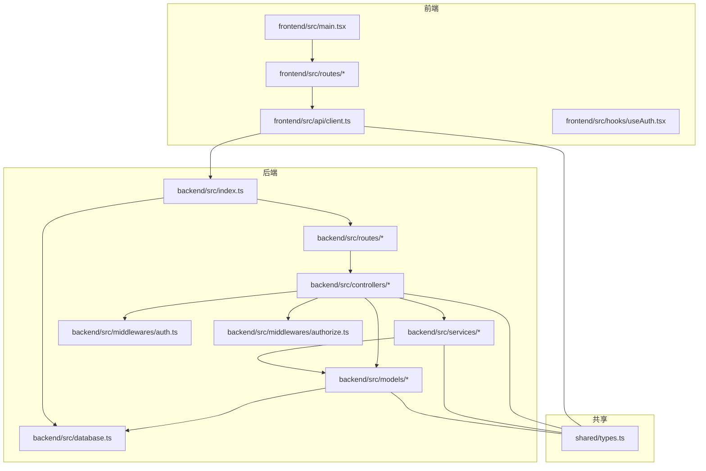
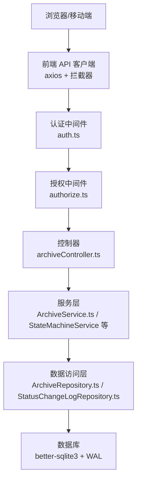
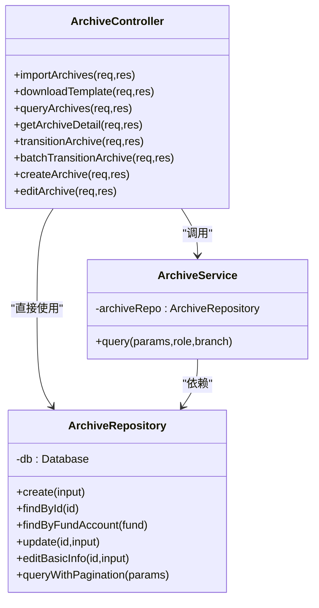
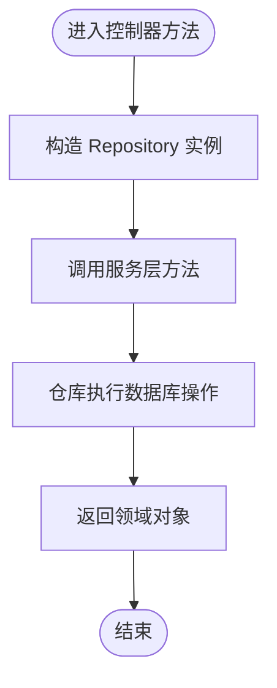
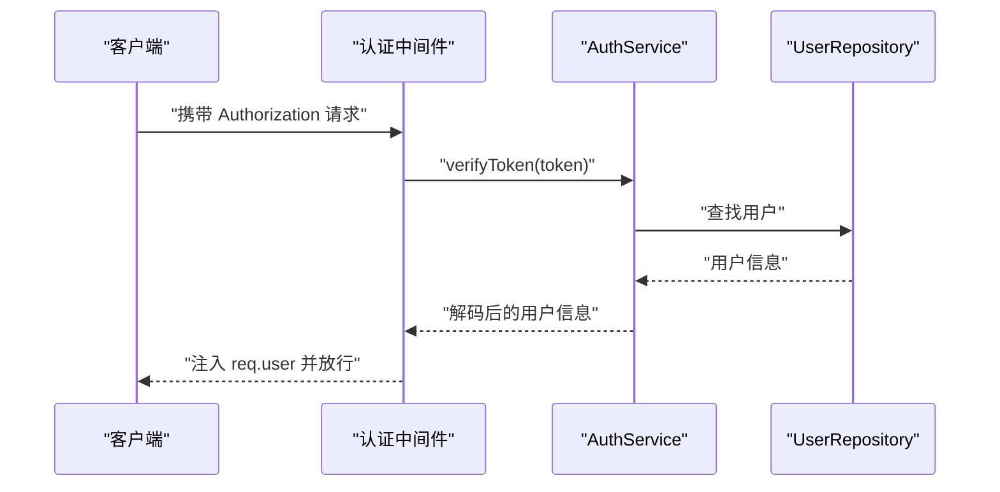
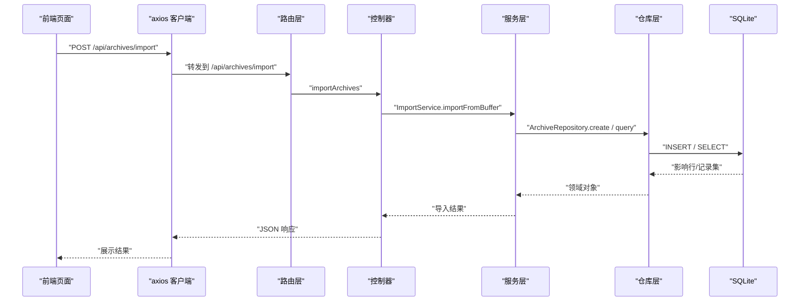
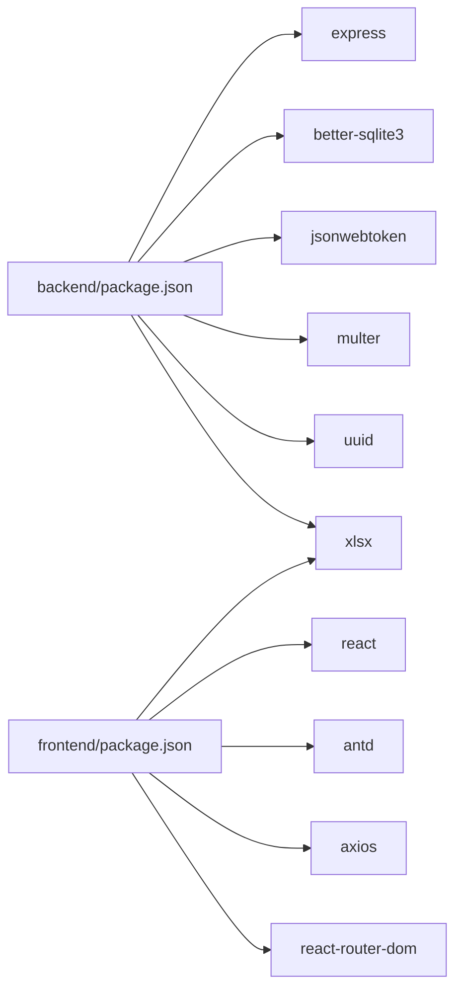

# 系统架构

<cite>
**本文引用的文件**
- [backend/src/index.ts](file://backend/src/index.ts)
- [backend/package.json](file://backend/package.json)
- [frontend/src/main.tsx](file://frontend/src/main.tsx)
- [frontend/package.json](file://frontend/package.json)
- [shared/types.ts](file://shared/types.ts)
- [backend/src/controllers/archiveController.ts](file://backend/src/controllers/archiveController.ts)
- [backend/src/services/ArchiveService.ts](file://backend/src/services/ArchiveService.ts)
- [backend/src/models/ArchiveRepository.ts](file://backend/src/models/ArchiveRepository.ts)
- [backend/src/routes/archive.ts](file://backend/src/routes/archive.ts)
- [backend/src/middlewares/auth.ts](file://backend/src/middlewares/auth.ts)
- [backend/src/middlewares/authorize.ts](file://backend/src/middlewares/authorize.ts)
- [backend/src/services/AuthService.ts](file://backend/src/services/AuthService.ts)
- [backend/src/database.ts](file://backend/src/database.ts)
- [frontend/src/api/client.ts](file://frontend/src/api/client.ts)
- [frontend/src/hooks/useAuth.tsx](file://frontend/src/hooks/useAuth.tsx)
</cite>

## 目录
1. [引言](#引言)
2. [项目结构](#项目结构)
3. [核心组件](#核心组件)
4. [架构总览](#架构总览)
5. [详细组件分析](#详细组件分析)
6. [依赖分析](#依赖分析)
7. [性能考虑](#性能考虑)
8. [故障排查指南](#故障排查指南)
9. [结论](#结论)
10. [附录](#附录)

## 引言
本文件为“文件管理系统”的系统架构文档，聚焦于前后端分离的整体设计、MVC 分层架构的实现、Repository 模式与依赖注入思路、组件间通信与数据流、状态管理策略、系统边界与外部依赖，以及可扩展性设计原则。系统采用 Express.js 作为后端服务框架，React 作为前端应用框架，基于共享类型定义实现前后端契约对齐。

## 项目结构
项目采用“前后端分离 + 共享类型”组织方式：
- 后端 backend：Express 应用、路由、控制器、服务层、数据访问层、中间件、数据库初始化与连接、测试等。
- 前端 frontend：React 应用、页面与组件、API 客户端、认证上下文、路由等。
- 共享 shared：TypeScript 类型定义，确保前后端接口一致性。
- 顶层脚本：开发与启动脚本。

图表来源
- [frontend/src/main.tsx:1-18](file://frontend/src/main.tsx#L1-L18)
- [backend/src/index.ts:1-39](file://backend/src/index.ts#L1-L39)
- [backend/src/routes/archive.ts:1-42](file://backend/src/routes/archive.ts#L1-L42)
- [backend/src/controllers/archiveController.ts:1-448](file://backend/src/controllers/archiveController.ts#L1-L448)
- [backend/src/services/ArchiveService.ts:1-71](file://backend/src/services/ArchiveService.ts#L1-L71)
- [backend/src/models/ArchiveRepository.ts:1-307](file://backend/src/models/ArchiveRepository.ts#L1-L307)
- [backend/src/middlewares/auth.ts:1-56](file://backend/src/middlewares/auth.ts#L1-L56)
- [backend/src/middlewares/authorize.ts:1-47](file://backend/src/middlewares/authorize.ts#L1-L47)
- [backend/src/database.ts:1-87](file://backend/src/database.ts#L1-L87)
- [frontend/src/api/client.ts:1-55](file://frontend/src/api/client.ts#L1-L55)
- [frontend/src/hooks/useAuth.tsx:1-90](file://frontend/src/hooks/useAuth.tsx#L1-L90)
- [shared/types.ts:1-289](file://shared/types.ts#L1-L289)

章节来源
- [backend/src/index.ts:1-39](file://backend/src/index.ts#L1-L39)
- [frontend/src/main.tsx:1-18](file://frontend/src/main.tsx#L1-L18)
- [shared/types.ts:1-289](file://shared/types.ts#L1-L289)

## 核心组件
- 后端入口与路由注册：负责初始化 Express、CORS、JSON 解析、数据库与种子用户、注册路由并监听端口。
- 控制器层：处理 HTTP 请求，编排服务层与仓库层，返回标准化响应。
- 服务层：封装业务规则与流程，如档案查询、导入、状态机流转等。
- 数据访问层（Repository）：封装数据库 CRUD 与复杂查询，屏蔽底层差异。
- 中间件：认证与授权，统一注入用户上下文与权限校验。
- 数据库：better-sqlite3 单例连接，WAL 模式与外键约束，初始化表结构。
- 前端入口与认证上下文：React 应用挂载、路由提供者、认证状态持久化与全局注入。
- API 客户端：统一 baseURL、请求/响应拦截器、错误处理与重定向。
- 共享类型：前后端一致的实体、枚举、请求/响应与权限定义。

章节来源
- [backend/src/index.ts:1-39](file://backend/src/index.ts#L1-L39)
- [backend/src/controllers/archiveController.ts:1-448](file://backend/src/controllers/archiveController.ts#L1-L448)
- [backend/src/services/ArchiveService.ts:1-71](file://backend/src/services/ArchiveService.ts#L1-L71)
- [backend/src/models/ArchiveRepository.ts:1-307](file://backend/src/models/ArchiveRepository.ts#L1-L307)
- [backend/src/middlewares/auth.ts:1-56](file://backend/src/middlewares/auth.ts#L1-L56)
- [backend/src/middlewares/authorize.ts:1-47](file://backend/src/middlewares/authorize.ts#L1-L47)
- [backend/src/database.ts:1-87](file://backend/src/database.ts#L1-L87)
- [frontend/src/main.tsx:1-18](file://frontend/src/main.tsx#L1-L18)
- [frontend/src/api/client.ts:1-55](file://frontend/src/api/client.ts#L1-L55)
- [frontend/src/hooks/useAuth.tsx:1-90](file://frontend/src/hooks/useAuth.tsx#L1-L90)
- [shared/types.ts:1-289](file://shared/types.ts#L1-L289)

## 架构总览
系统采用典型的前后端分离架构：
- 前端：React + Ant Design + React Router，通过 axios 发起 REST 请求，携带 Bearer Token。
- 后端：Express + better-sqlite3，RESTful 路由，中间件链路完成认证与授权，MVC 分层清晰。
- 数据：SQLite（WAL 模式），通过 Repository 层抽象 SQL。
- 共享契约：shared/types.ts 定义实体、状态、权限与 API 接口，避免前后端耦合。

图表来源
- [frontend/src/api/client.ts:1-55](file://frontend/src/api/client.ts#L1-L55)
- [backend/src/middlewares/auth.ts:1-56](file://backend/src/middlewares/auth.ts#L1-L56)
- [backend/src/middlewares/authorize.ts:1-47](file://backend/src/middlewares/authorize.ts#L1-L47)
- [backend/src/controllers/archiveController.ts:1-448](file://backend/src/controllers/archiveController.ts#L1-L448)
- [backend/src/services/ArchiveService.ts:1-71](file://backend/src/services/ArchiveService.ts#L1-L71)
- [backend/src/models/ArchiveRepository.ts:1-307](file://backend/src/models/ArchiveRepository.ts#L1-L307)
- [backend/src/database.ts:1-87](file://backend/src/database.ts#L1-L87)

## 详细组件分析

### MVC 分层架构与职责
- 控制器（Controller）
  - 负责接收 HTTP 请求、参数校验、调用服务层、组装响应。
  - 示例：档案导入、查询、详情、状态流转、批量流转、创建与编辑。
- 服务层（Service）
  - 封装业务规则与流程，如分页查询、数据隔离、状态机校验与执行。
  - 示例：ArchiveService、StateMachineService、ArchiveTransitionService。
- 数据访问层（Repository）
  - 封装数据库操作，提供领域对象的 CRUD 与复杂查询。
  - 示例：ArchiveRepository、StatusChangeLogRepository。
- 模型（Model）
  - 通过 shared/types.ts 定义领域实体与状态枚举，作为跨层契约。

图表来源
- [backend/src/controllers/archiveController.ts:1-448](file://backend/src/controllers/archiveController.ts#L1-L448)
- [backend/src/services/ArchiveService.ts:1-71](file://backend/src/services/ArchiveService.ts#L1-L71)
- [backend/src/models/ArchiveRepository.ts:1-307](file://backend/src/models/ArchiveRepository.ts#L1-L307)

章节来源
- [backend/src/controllers/archiveController.ts:1-448](file://backend/src/controllers/archiveController.ts#L1-L448)
- [backend/src/services/ArchiveService.ts:1-71](file://backend/src/services/ArchiveService.ts#L1-L71)
- [backend/src/models/ArchiveRepository.ts:1-307](file://backend/src/models/ArchiveRepository.ts#L1-L307)

### Repository 模式与依赖注入
- Repository 模式
  - 以 ArchiveRepository 为例，集中封装 SQL 与领域对象映射，提供强类型的 CRUD 与分页查询。
  - 通过构造函数注入 better-sqlite3 连接实例，便于测试替换。
- 依赖注入
  - 控制器内直接 new 仓库与服务实例，形成“构造函数注入”的简单实现；适合小型应用与快速迭代。
  - 测试场景可通过 createDatabase(':memory:') 创建独立连接，避免共享状态干扰。

图表来源
- [backend/src/controllers/archiveController.ts:64-71](file://backend/src/controllers/archiveController.ts#L64-L71)
- [backend/src/models/ArchiveRepository.ts:93-120](file://backend/src/models/ArchiveRepository.ts#L93-L120)

章节来源
- [backend/src/models/ArchiveRepository.ts:1-307](file://backend/src/models/ArchiveRepository.ts#L1-L307)
- [backend/src/controllers/archiveController.ts:1-448](file://backend/src/controllers/archiveController.ts#L1-L448)

### 认证与授权中间件
- 认证中间件 authenticate
  - 从 Authorization 头提取 Bearer Token，校验 JWT，失败返回 401。
  - 成功则将用户信息注入 req.user，供后续中间件与控制器使用。
- 授权中间件 authorize
  - 基于角色计算权限集合，校验是否具备所需权限，缺失则返回 403。
- 前端拦截器
  - 自动注入 Token；对 401 响应清理本地存储并跳转登录页。

图表来源
- [backend/src/middlewares/auth.ts:26-55](file://backend/src/middlewares/auth.ts#L26-L55)
- [backend/src/services/AuthService.ts:85-92](file://backend/src/services/AuthService.ts#L85-L92)
- [backend/src/models/UserRepository.ts](file://backend/src/models/UserRepository.ts)

章节来源
- [backend/src/middlewares/auth.ts:1-56](file://backend/src/middlewares/auth.ts#L1-L56)
- [backend/src/middlewares/authorize.ts:1-47](file://backend/src/middlewares/authorize.ts#L1-L47)
- [backend/src/services/AuthService.ts:1-126](file://backend/src/services/AuthService.ts#L1-L126)
- [frontend/src/api/client.ts:1-55](file://frontend/src/api/client.ts#L1-L55)

### 前后端通信与数据流
- 前端
  - 通过 axios 实例发起请求，统一 baseURL 为 /api。
  - 请求拦截器自动附加 Bearer Token。
  - 响应拦截器处理 401（跳转登录）、403、400/409 等业务错误。
- 后端
  - 路由层注册 REST 接口，绑定控制器方法。
  - 控制器调用服务层与仓库层，返回标准化响应体（含 code/message）。
- 共享类型
  - 前后端通过 shared/types.ts 对齐实体、状态、权限与 API 接口。

图表来源
- [frontend/src/api/client.ts:1-55](file://frontend/src/api/client.ts#L1-L55)
- [backend/src/routes/archive.ts:17-24](file://backend/src/routes/archive.ts#L17-L24)
- [backend/src/controllers/archiveController.ts:43-71](file://backend/src/controllers/archiveController.ts#L43-L71)
- [backend/src/models/ArchiveRepository.ts:93-120](file://backend/src/models/ArchiveRepository.ts#L93-L120)
- [backend/src/database.ts:25-52](file://backend/src/database.ts#L25-L52)

章节来源
- [frontend/src/api/client.ts:1-55](file://frontend/src/api/client.ts#L1-L55)
- [backend/src/routes/archive.ts:1-42](file://backend/src/routes/archive.ts#L1-L42)
- [backend/src/controllers/archiveController.ts:1-448](file://backend/src/controllers/archiveController.ts#L1-L448)
- [backend/src/models/ArchiveRepository.ts:1-307](file://backend/src/models/ArchiveRepository.ts#L1-L307)
- [backend/src/database.ts:1-87](file://backend/src/database.ts#L1-L87)

### 状态管理策略
- 前端状态
  - 使用 React Context（AuthProvider）管理认证状态与权限，持久化至 localStorage。
  - 页面级状态通过组件内部 useState 管理，避免过度上提。
- 后端状态
  - 无服务端会话状态，认证基于 JWT；业务状态通过数据库表维护。
- 前后端契约
  - 通过 shared/types.ts 明确状态枚举与字段，减少沟通成本。

章节来源
- [frontend/src/hooks/useAuth.tsx:1-90](file://frontend/src/hooks/useAuth.tsx#L1-L90)
- [shared/types.ts:1-289](file://shared/types.ts#L1-L289)

## 依赖分析
- 后端依赖
  - Express、better-sqlite3、bcryptjs、jsonwebtoken、multer、uuid、xlsx 等。
  - 通过 package.json 的 scripts 管理开发、构建、测试与覆盖率。
- 前端依赖
  - React、Ant Design、axios、react-router-dom、xlsx 等。
  - Vite 构建工具链，TypeScript 类型检查与 ESLint。

图表来源
- [backend/package.json:1-41](file://backend/package.json#L1-L41)
- [frontend/package.json:1-35](file://frontend/package.json#L1-L35)

章节来源
- [backend/package.json:1-41](file://backend/package.json#L1-L41)
- [frontend/package.json:1-35](file://frontend/package.json#L1-L35)

## 性能考虑
- 数据库
  - WAL 模式提升并发读写性能；外键约束保证数据一致性。
  - 分页查询与条件拼接避免一次性加载大结果集。
- 服务层
  - 控制默认分页大小与边界，防止超大数据集查询。
- 前端
  - 按需加载页面与组件，避免不必要的渲染。
  - 使用拦截器统一处理错误，减少重复逻辑。

## 故障排查指南
- 常见错误与处理
  - 401 未认证：检查前端是否正确保存与注入 Token；后端中间件是否正确校验。
  - 403 权限不足：确认用户角色与所需权限映射；authorize 中间件是否生效。
  - 400/409 业务错误：根据响应中的 code/message 定位问题（如参数非法、重复数据）。
  - 500 服务器错误：查看后端日志与数据库连接状态。
- 前端拦截器
  - 对 401 自动清理本地存储并跳转登录页，避免死循环跳转。
- 后端健康检查
  - /api/health 返回服务状态，便于运维监控。

章节来源
- [frontend/src/api/client.ts:19-52](file://frontend/src/api/client.ts#L19-L52)
- [backend/src/index.ts:28-30](file://backend/src/index.ts#L28-L30)

## 结论
本系统采用清晰的前后端分离架构与 MVC 分层设计，结合 Repository 模式与中间件链路，实现了认证、授权、业务流程与数据持久化的解耦。通过共享类型定义统一前后端契约，提升了协作效率与可维护性。建议在后续演进中引入容器化部署、缓存层与异步任务队列，以进一步增强可扩展性与可观测性。

## 附录
- 系统边界
  - 内部：后端服务、SQLite 数据库、共享类型。
  - 外部：浏览器/移动端客户端、第三方库（Express、better-sqlite3、axios、Antd 等）。
- 第三方集成点
  - Excel 导入/导出：xlsx。
  - 文件上传：multer（内存存储）。
  - 认证：jsonwebtoken + bcryptjs。
- 架构决策与权衡
  - 选择 better-sqlite3 降低运维复杂度，适合中小规模数据。
  - 使用 JWT 无状态认证，简化横向扩展。
  - 控制器内直接 new 依赖，简化 DI，适合小型团队快速迭代。