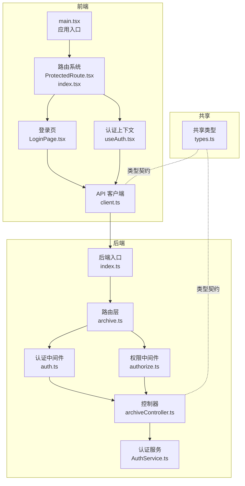
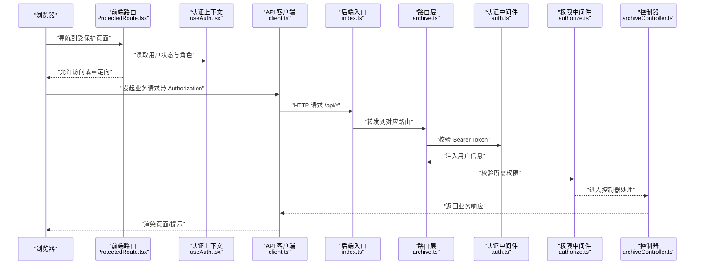
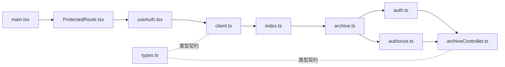

# 组件交互机制

<cite>
**本文引用的文件**
- [后端入口 index.ts](file://backend/src/index.ts)
- [前端入口 main.tsx](file://frontend/src/main.tsx)
- [前端应用 App.tsx](file://frontend/src/App.tsx)
- [档案路由 archive.ts](file://backend/src/routes/archive.ts)
- [认证中间件 auth.ts](file://backend/src/middlewares/auth.ts)
- [权限中间件 authorize.ts](file://backend/src/middlewares/authorize.ts)
- [档案控制器 archiveController.ts](file://backend/src/controllers/archiveController.ts)
- [认证服务 AuthService.ts](file://backend/src/services/AuthService.ts)
- [共享类型定义 types.ts](file://shared/types.ts)
- [API 客户端 client.ts](file://frontend/src/api/client.ts)
- [认证上下文 useAuth.tsx](file://frontend/src/hooks/useAuth.tsx)
- [受保护路由 ProtectedRoute.tsx](file://frontend/src/routes/ProtectedRoute.tsx)
- [登录页 LoginPage.tsx](file://frontend/src/pages/LoginPage.tsx)
</cite>

## 目录
1. [引言](#引言)
2. [项目结构](#项目结构)
3. [核心组件](#核心组件)
4. [架构总览](#架构总览)
5. [详细组件分析](#详细组件分析)
6. [依赖关系分析](#依赖关系分析)
7. [性能考量](#性能考量)
8. [故障排查指南](#故障排查指南)
9. [结论](#结论)
10. [附录](#附录)

## 引言
本文件系统化梳理文件管理系统的组件交互机制，重点覆盖：
- 前后端通信协议与交互模式
- API 客户端实现与请求/响应处理
- 前端路由守卫与权限控制
- 状态管理与全局状态同步策略
- WebSocket 或其他实时通信集成方案建议
- 错误处理与重试机制
- 组件解耦与模块化最佳实践
- 具体代码示例路径，展示组件协作模式

## 项目结构
系统采用前后端分离架构，前端基于 React + Ant Design，后端基于 Express + TypeScript，共享类型定义位于 shared 目录，确保前后端一致的数据契约。

图表来源
- [前端入口 main.tsx:1-18](file://frontend/src/main.tsx#L1-L18)
- [前端路由 ProtectedRoute.tsx:1-31](file://frontend/src/routes/ProtectedRoute.tsx#L1-L31)
- [前端认证上下文 useAuth.tsx:1-90](file://frontend/src/hooks/useAuth.tsx#L1-L90)
- [前端 API 客户端 client.ts:1-55](file://frontend/src/api/client.ts#L1-L55)
- [前端登录页 LoginPage.tsx:1-81](file://frontend/src/pages/LoginPage.tsx#L1-L81)
- [后端入口 index.ts:1-39](file://backend/src/index.ts#L1-L39)
- [档案路由 archive.ts:1-42](file://backend/src/routes/archive.ts#L1-L42)
- [认证中间件 auth.ts:1-56](file://backend/src/middlewares/auth.ts#L1-L56)
- [权限中间件 authorize.ts:1-47](file://backend/src/middlewares/authorize.ts#L1-L47)
- [档案控制器 archiveController.ts:1-448](file://backend/src/controllers/archiveController.ts#L1-L448)
- [认证服务 AuthService.ts:1-126](file://backend/src/services/AuthService.ts#L1-L126)
- [共享类型定义 types.ts:1-289](file://shared/types.ts#L1-L289)

章节来源
- [后端入口 index.ts:1-39](file://backend/src/index.ts#L1-L39)
- [前端入口 main.tsx:1-18](file://frontend/src/main.tsx#L1-L18)
- [前端应用 App.tsx:1-122](file://frontend/src/App.tsx#L1-L122)
- [档案路由 archive.ts:1-42](file://backend/src/routes/archive.ts#L1-L42)
- [认证中间件 auth.ts:1-56](file://backend/src/middlewares/auth.ts#L1-L56)
- [权限中间件 authorize.ts:1-47](file://backend/src/middlewares/authorize.ts#L1-L47)
- [档案控制器 archiveController.ts:1-448](file://backend/src/controllers/archiveController.ts#L1-L448)
- [认证服务 AuthService.ts:1-126](file://backend/src/services/AuthService.ts#L1-L126)
- [共享类型定义 types.ts:1-289](file://shared/types.ts#L1-L289)
- [API 客户端 client.ts:1-55](file://frontend/src/api/client.ts#L1-L55)
- [认证上下文 useAuth.tsx:1-90](file://frontend/src/hooks/useAuth.tsx#L1-L90)
- [受保护路由 ProtectedRoute.tsx:1-31](file://frontend/src/routes/ProtectedRoute.tsx#L1-L31)
- [登录页 LoginPage.tsx:1-81](file://frontend/src/pages/LoginPage.tsx#L1-L81)

## 核心组件
- 前端应用入口负责装配路由、认证上下文与全局样式；路由系统通过受保护路由组件实现角色级权限控制；API 客户端统一注入 Token 并处理通用错误；认证上下文负责用户状态持久化与权限映射。
- 后端入口负责初始化数据库、注册路由与健康检查；路由层聚合业务路由并挂载认证/权限中间件；控制器作为业务入口协调服务层与仓储层；认证服务提供登录、Token 生成与校验、权限映射。

章节来源
- [前端入口 main.tsx:1-18](file://frontend/src/main.tsx#L1-L18)
- [前端路由 ProtectedRoute.tsx:1-31](file://frontend/src/routes/ProtectedRoute.tsx#L1-L31)
- [前端认证上下文 useAuth.tsx:1-90](file://frontend/src/hooks/useAuth.tsx#L1-L90)
- [前端 API 客户端 client.ts:1-55](file://frontend/src/api/client.ts#L1-L55)
- [后端入口 index.ts:1-39](file://backend/src/index.ts#L1-L39)
- [档案路由 archive.ts:1-42](file://backend/src/routes/archive.ts#L1-L42)
- [认证中间件 auth.ts:1-56](file://backend/src/middlewares/auth.ts#L1-L56)
- [权限中间件 authorize.ts:1-47](file://backend/src/middlewares/authorize.ts#L1-L47)
- [档案控制器 archiveController.ts:1-448](file://backend/src/controllers/archiveController.ts#L1-L448)
- [认证服务 AuthService.ts:1-126](file://backend/src/services/AuthService.ts#L1-L126)

## 架构总览
下图展示从前端到后端的关键交互链路，包括认证、权限校验与业务处理。

图表来源
- [前端路由 ProtectedRoute.tsx:1-31](file://frontend/src/routes/ProtectedRoute.tsx#L1-L31)
- [前端认证上下文 useAuth.tsx:1-90](file://frontend/src/hooks/useAuth.tsx#L1-L90)
- [前端 API 客户端 client.ts:1-55](file://frontend/src/api/client.ts#L1-L55)
- [后端入口 index.ts:1-39](file://backend/src/index.ts#L1-L39)
- [档案路由 archive.ts:1-42](file://backend/src/routes/archive.ts#L1-L42)
- [认证中间件 auth.ts:1-56](file://backend/src/middlewares/auth.ts#L1-L56)
- [权限中间件 authorize.ts:1-47](file://backend/src/middlewares/authorize.ts#L1-L47)
- [档案控制器 archiveController.ts:1-448](file://backend/src/controllers/archiveController.ts#L1-L448)

## 详细组件分析

### API 客户端与请求/响应处理
- 统一实例与基地址：通过统一实例封装 baseURL，避免分散配置。
- 请求拦截器：自动从本地存储读取 Token 并注入 Authorization 头。
- 响应拦截器：集中处理 401/403/400/409 等状态码，401 清理本地凭证并强制跳转登录页，403 由调用方或全局消息处理，400/409 保留业务错误信息供调用方使用。
- 与后端约定：前端通过 /api 前缀访问后端路由，后端入口已注册 /api/auth、/api/archives、/api/ocr。

章节来源
- [API 客户端 client.ts:1-55](file://frontend/src/api/client.ts#L1-L55)
- [后端入口 index.ts:1-39](file://backend/src/index.ts#L1-L39)

### 前端路由守卫与权限控制
- 受保护路由组件：在加载阶段返回空内容，未登录重定向至 /login，角色不匹配重定向至 /unauthorized。
- 角色-权限映射：认证上下文中维护角色到权限的映射，登录时补充权限列表。
- 路由配置：不同角色访问不同子路径，父级布局统一由 MainLayout 包裹，子路由进一步细化权限。

章节来源
- [受保护路由 ProtectedRoute.tsx:1-31](file://frontend/src/routes/ProtectedRoute.tsx#L1-L31)
- [认证上下文 useAuth.tsx:1-90](file://frontend/src/hooks/useAuth.tsx#L1-L90)
- [前端路由配置 index.tsx:1-98](file://frontend/src/routes/index.tsx#L1-L98)

### 认证与权限中间件
- 认证中间件：从 Authorization 头提取 Bearer Token，校验后将用户信息注入请求上下文。
- 权限中间件：在认证通过后，基于用户角色计算权限集合，校验是否满足所需权限。
- 控制器侧约束：控制器对关键操作（如创建、编辑、批量流转）进行参数校验与业务规则判断，并返回统一错误码。

章节来源
- [认证中间件 auth.ts:1-56](file://backend/src/middlewares/auth.ts#L1-L56)
- [权限中间件 authorize.ts:1-47](file://backend/src/middlewares/authorize.ts#L1-L47)
- [档案控制器 archiveController.ts:1-448](file://backend/src/controllers/archiveController.ts#L1-L448)

### 状态管理与全局状态同步
- 全局状态：认证上下文提供用户、Token、加载状态与登录/登出方法，状态持久化于本地存储。
- 页面内状态：各页面组件按需使用 React 状态管理（如登录页的 loading），避免跨组件污染。
- 同步策略：登录成功后写入 Token 与用户信息，后续请求拦截器自动携带；路由守卫依据上下文决定页面渲染。

章节来源
- [认证上下文 useAuth.tsx:1-90](file://frontend/src/hooks/useAuth.tsx#L1-L90)
- [登录页 LoginPage.tsx:1-81](file://frontend/src/pages/LoginPage.tsx#L1-L81)

### WebSocket 或实时通信集成方案
- 当前实现未发现 WebSocket 集成。若需引入，建议：
  - 后端：在现有入口基础上增加 WebSocket 服务器，或使用 Socket.IO；对需要实时通知的场景（如状态变更、导入进度）推送事件。
  - 前端：在认证上下文中新增连接管理与事件订阅；在页面组件中订阅事件并更新 UI。
  - 安全：鉴权与权限校验需与 HTTP 层一致，确保只向授权用户推送事件。
- 本节为概念性建议，不对应具体源文件。

### 错误处理与重试机制
- 前端：
  - 401：清理本地凭证并跳转登录页，避免循环跳转。
  - 403：提示权限不足，交由调用方处理。
  - 400/409：保留后端返回的业务错误信息，便于用户理解。
- 后端：
  - 对非法参数、越权、资源不存在等情况返回明确的错误码与消息。
  - 控制器对业务异常进行分类处理，返回合适的 HTTP 状态码。
- 重试建议：可在前端对幂等请求（如查询、模板下载）增加有限重试与退避策略；对非幂等请求谨慎重试。

章节来源
- [API 客户端 client.ts:1-55](file://frontend/src/api/client.ts#L1-L55)
- [档案控制器 archiveController.ts:1-448](file://backend/src/controllers/archiveController.ts#L1-L448)

### 组件解耦与模块化最佳实践
- 路由与权限分离：路由配置仅负责路径与角色，权限逻辑集中在受保护路由组件与中间件。
- 服务与仓储边界：控制器仅编排服务层，服务层再调用仓储层，保持职责单一。
- 共享类型：通过 shared/types.ts 统一前后端类型，减少沟通成本与错误。
- 插件化拦截器：API 客户端拦截器集中处理认证与错误，避免在各页面重复逻辑。
- 可测试性：中间件与服务类职责清晰，便于单元测试与集成测试。

章节来源
- [档案路由 archive.ts:1-42](file://backend/src/routes/archive.ts#L1-L42)
- [认证中间件 auth.ts:1-56](file://backend/src/middlewares/auth.ts#L1-L56)
- [权限中间件 authorize.ts:1-47](file://backend/src/middlewares/authorize.ts#L1-L47)
- [档案控制器 archiveController.ts:1-448](file://backend/src/controllers/archiveController.ts#L1-L448)
- [共享类型定义 types.ts:1-289](file://shared/types.ts#L1-L289)
- [API 客户端 client.ts:1-55](file://frontend/src/api/client.ts#L1-L55)

### 代码示例路径（展示组件协作）
- 登录流程（前端）：登录页发起请求 -> API 客户端拦截器注入 Token -> 认证上下文保存状态 -> 路由守卫放行 -> 页面渲染
  - 示例路径：[登录页 LoginPage.tsx:1-81](file://frontend/src/pages/LoginPage.tsx#L1-L81)，[API 客户端 client.ts:1-55](file://frontend/src/api/client.ts#L1-L55)，[认证上下文 useAuth.tsx:1-90](file://frontend/src/hooks/useAuth.tsx#L1-L90)，[受保护路由 ProtectedRoute.tsx:1-31](file://frontend/src/routes/ProtectedRoute.tsx#L1-L31)
- 档案查询（后端）：路由 -> 认证中间件 -> 权限中间件 -> 控制器 -> 服务层 -> 仓储层 -> 返回结果
  - 示例路径：[档案路由 archive.ts:1-42](file://backend/src/routes/archive.ts#L1-L42)，[认证中间件 auth.ts:1-56](file://backend/src/middlewares/auth.ts#L1-L56)，[权限中间件 authorize.ts:1-47](file://backend/src/middlewares/authorize.ts#L1-L47)，[档案控制器 archiveController.ts:1-448](file://backend/src/controllers/archiveController.ts#L1-L448)

## 依赖关系分析
- 前端依赖链：main.tsx -> 路由系统 -> 受保护路由 -> 认证上下文 -> API 客户端 -> 后端接口
- 后端依赖链：index.ts -> 路由层 -> 中间件（认证/权限）-> 控制器 -> 服务层 -> 仓储层
- 共享类型贯穿前后端，保证契约一致

图表来源
- [前端入口 main.tsx:1-18](file://frontend/src/main.tsx#L1-L18)
- [前端路由 ProtectedRoute.tsx:1-31](file://frontend/src/routes/ProtectedRoute.tsx#L1-L31)
- [前端认证上下文 useAuth.tsx:1-90](file://frontend/src/hooks/useAuth.tsx#L1-L90)
- [前端 API 客户端 client.ts:1-55](file://frontend/src/api/client.ts#L1-L55)
- [后端入口 index.ts:1-39](file://backend/src/index.ts#L1-L39)
- [档案路由 archive.ts:1-42](file://backend/src/routes/archive.ts#L1-L42)
- [认证中间件 auth.ts:1-56](file://backend/src/middlewares/auth.ts#L1-L56)
- [权限中间件 authorize.ts:1-47](file://backend/src/middlewares/authorize.ts#L1-L47)
- [档案控制器 archiveController.ts:1-448](file://backend/src/controllers/archiveController.ts#L1-L448)
- [共享类型定义 types.ts:1-289](file://shared/types.ts#L1-L289)

## 性能考量
- 前端：路由懒加载、组件按需渲染、避免不必要的全局刷新；API 客户端统一缓存策略（如 GET 请求的缓存）。
- 后端：中间件尽早失败（如认证失败立即返回），控制器参数校验前置，避免无效数据库访问；批量操作走事务与批处理优化。
- 网络：对大文件（Excel 导入/模板下载）采用流式传输，减少内存占用。

## 故障排查指南
- 登录失败：检查用户名/密码是否正确；查看后端登录接口返回的错误信息；确认前端 API 客户端拦截器是否正确注入 Token。
- 401 未授权：确认本地存储是否存在有效 Token；检查 Token 是否过期；确认后端 JWT 密钥配置。
- 403 权限不足：确认用户角色与所需权限是否匹配；检查权限中间件是否正确校验。
- 404 资源不存在：确认请求的档案 ID 是否正确；检查控制器对资源存在性判断。
- Excel 导入失败：确认文件扩展名为 .xlsx/.xls；检查模板列头是否符合要求；查看导入服务返回的错误明细。

章节来源
- [API 客户端 client.ts:1-55](file://frontend/src/api/client.ts#L1-L55)
- [认证中间件 auth.ts:1-56](file://backend/src/middlewares/auth.ts#L1-L56)
- [权限中间件 authorize.ts:1-47](file://backend/src/middlewares/authorize.ts#L1-L47)
- [档案控制器 archiveController.ts:1-448](file://backend/src/controllers/archiveController.ts#L1-L448)

## 结论
本系统通过清晰的前后端职责划分、统一的类型契约与中间件权限体系，实现了稳定可靠的组件交互机制。前端以受保护路由与认证上下文为核心，后端以中间件与控制器为边界，配合共享类型与 API 客户端拦截器，形成高内聚、低耦合的架构。未来可在实时通信、重试与缓存等方面进一步增强用户体验与系统韧性。

## 附录
- 常用接口与状态码
  - 登录：POST /api/auth/login，返回 token 与用户信息
  - 档案查询：GET /api/archives，支持多条件与分页
  - 档案详情：GET /api/archives/:id，返回记录与状态变更历史
  - 状态流转：POST /api/archives/:id/transition 或 /api/archives/batch-transition
  - 模板下载：GET /api/archives/template
  - 错误响应：统一包含 code 与 message 字段，结合 HTTP 状态码区分场景

章节来源
- [档案路由 archive.ts:1-42](file://backend/src/routes/archive.ts#L1-L42)
- [共享类型定义 types.ts:1-289](file://shared/types.ts#L1-L289)