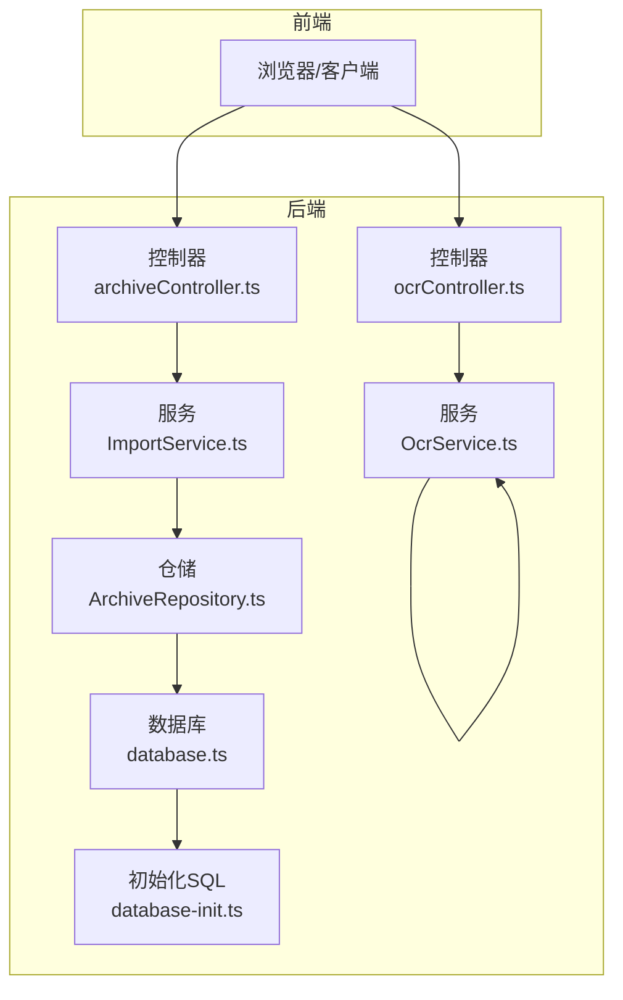
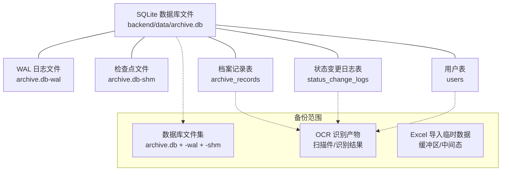
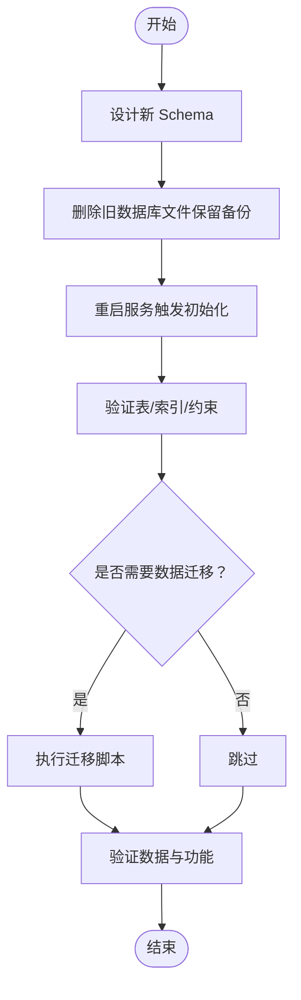
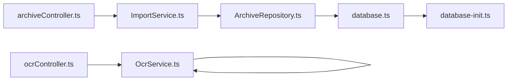

# 备份与恢复

<cite>
**本文引用的文件**
- [backend/src/database.ts](file://backend/src/database.ts)
- [backend/src/database-init.ts](file://backend/src/database-init.ts)
- [backend/src/models/ArchiveRepository.ts](file://backend/src/models/ArchiveRepository.ts)
- [backend/src/services/ImportService.ts](file://backend/src/services/ImportService.ts)
- [backend/src/controllers/archiveController.ts](file://backend/src/controllers/archiveController.ts)
- [backend/src/services/OcrService.ts](file://backend/src/services/OcrService.ts)
- [backend/src/controllers/ocrController.ts](file://backend/src/controllers/ocrController.ts)
- [backend/package.json](file://backend/package.json)
- [backend/tsconfig.json](file://backend/tsconfig.json)
- [backend/vitest.config.ts](file://backend/vitest.config.ts)
- [backend/src/utils/seedUsers.ts](file://backend/src/utils/seedUsers.ts)
- [backend/tests/unit/database.test.ts](file://backend/tests/unit/database.test.ts)
- [.kiro/specs/archive-management-system/design.md](file://.kiro/specs/archive-management-system/design.md)
- [start.sh](file://start.sh)
- [start.ps1](file://start.ps1)
</cite>

## 目录
1. [简介](#简介)
2. [项目结构](#项目结构)
3. [核心组件](#核心组件)
4. [架构总览](#架构总览)
5. [详细组件分析](#详细组件分析)
6. [依赖关系分析](#依赖关系分析)
7. [性能考量](#性能考量)
8. [故障排查指南](#故障排查指南)
9. [结论](#结论)
10. [附录](#附录)

## 简介
本文件面向“备份与恢复”主题，结合当前代码库现状，系统化地给出数据库与文件系统的备份策略、增量/全量备份实施方案、数据迁移与版本升级流程、灾难恢复计划（含RTO/RPO）、备份验证与恢复测试方法、自动化脚本与调度建议，以及备份存储的安全与访问控制策略。由于系统采用 SQLite 文件数据库，备份策略将以“文件级备份”为核心；同时，系统涉及 OCR 识别与 Excel 导入产生的文档与临时文件，亦纳入备份范围。

## 项目结构
- 后端使用 better-sqlite3 作为 SQLite 客户端，数据库文件位于 backend/data/archive.db。
- 控制器负责接收上传的扫描件与 Excel 文件，服务层完成 OCR 识别与导入逻辑，仓储层封装数据库访问。
- 前端通过 HTTP 接口与后端交互，不直接参与备份。

图表来源
- [backend/src/controllers/archiveController.ts:1-448](file://backend/src/controllers/archiveController.ts#L1-L448)
- [backend/src/controllers/ocrController.ts:1-94](file://backend/src/controllers/ocrController.ts#L1-L94)
- [backend/src/services/ImportService.ts:1-146](file://backend/src/services/ImportService.ts#L1-L146)
- [backend/src/services/OcrService.ts:1-192](file://backend/src/services/OcrService.ts#L1-L192)
- [backend/src/models/ArchiveRepository.ts:1-307](file://backend/src/models/ArchiveRepository.ts#L1-L307)
- [backend/src/database.ts:1-87](file://backend/src/database.ts#L1-L87)
- [backend/src/database-init.ts:1-65](file://backend/src/database-init.ts#L1-L65)

章节来源
- [backend/src/database.ts:1-87](file://backend/src/database.ts#L1-L87)
- [backend/src/database-init.ts:1-65](file://backend/src/database-init.ts#L1-L65)
- [backend/src/controllers/archiveController.ts:1-448](file://backend/src/controllers/archiveController.ts#L1-L448)
- [backend/src/controllers/ocrController.ts:1-94](file://backend/src/controllers/ocrController.ts#L1-L94)
- [backend/src/services/ImportService.ts:1-146](file://backend/src/services/ImportService.ts#L1-L146)
- [backend/src/services/OcrService.ts:1-192](file://backend/src/services/OcrService.ts#L1-L192)
- [backend/src/models/ArchiveRepository.ts:1-307](file://backend/src/models/ArchiveRepository.ts#L1-L307)

## 核心组件
- 数据库连接与初始化：负责数据库文件创建、WAL 模式与外键约束启用、表结构初始化。
- 仓储层：封装档案记录的增删改查与分页查询。
- 导入服务：解析 Excel 并批量创建档案记录，包含字段校验与去重。
- OCR 服务：扫描件识别与字段提取。
- 控制器：对外暴露 API，处理文件上传与模板下载。

章节来源
- [backend/src/database.ts:1-87](file://backend/src/database.ts#L1-L87)
- [backend/src/database-init.ts:1-65](file://backend/src/database-init.ts#L1-L65)
- [backend/src/models/ArchiveRepository.ts:1-307](file://backend/src/models/ArchiveRepository.ts#L1-L307)
- [backend/src/services/ImportService.ts:1-146](file://backend/src/services/ImportService.ts#L1-L146)
- [backend/src/services/OcrService.ts:1-192](file://backend/src/services/OcrService.ts#L1-L192)
- [backend/src/controllers/archiveController.ts:1-448](file://backend/src/controllers/archiveController.ts#L1-L448)
- [backend/src/controllers/ocrController.ts:1-94](file://backend/src/controllers/ocrController.ts#L1-L94)

## 架构总览
下图展示备份与恢复的关键交互点：数据库文件、OCR 识别产物、Excel 导入临时数据与状态变更日志。

图表来源
- [backend/src/database.ts:1-87](file://backend/src/database.ts#L1-L87)
- [backend/src/database-init.ts:1-65](file://backend/src/database-init.ts#L1-L65)

## 详细组件分析

### 数据库备份策略（SQLite 文件级）
- 备份对象
  - 主库文件：backend/data/archive.db
  - WAL 日志：archive.db-wal
  - 检查点：archive.db-shm
- 备份方式
  - 全量备份：直接复制上述文件集至安全位置。
  - 增量备份：基于时间戳或校验和对比，仅复制变更文件；或在 WAL 模式下，结合 WAL 文件滚动策略进行增量归档。
- 恢复步骤
  - 停止服务，确保数据库空闲。
  - 备份现有文件集。
  - 将备份文件集覆盖回原位。
  - 启动服务，验证连接与表结构。
- 注意事项
  - WAL 模式下，恢复时需确保 WAL 与主库一致性。
  - 若数据库处于活动状态，建议使用文件系统快照或停机窗口进行复制。

章节来源
- [backend/src/database.ts:1-87](file://backend/src/database.ts#L1-L87)
- [backend/src/database-init.ts:1-65](file://backend/src/database-init.ts#L1-L65)
- [.kiro/specs/archive-management-system/design.md:647-652](file://.kiro/specs/archive-management-system/design.md#L647-L652)

### 数据迁移与版本升级流程
- 版本升级原则
  - schema 变更后必须删除旧数据库文件并重建，以确保一致性。
- 迁移步骤
  1) 设计新 schema（在初始化 SQL 中体现）。
  2) 删除旧数据库文件（确保备份已存档）。
  3) 重启服务触发初始化 SQL，重建表结构与索引。
  4) 如需数据迁移，编写迁移脚本（例如从旧表导出、清洗、导入新表），并在受控环境下执行。
  5) 验证数据完整性与业务功能。
- 单元测试与集成测试
  - 使用内存数据库进行初始化测试，验证表结构、索引与约束。
  - 对导入与 OCR 功能进行端到端测试，确保迁移后业务可用。

图表来源
- [backend/src/database-init.ts:1-65](file://backend/src/database-init.ts#L1-L65)
- [backend/tests/unit/database.test.ts:1-112](file://backend/tests/unit/database.test.ts#L1-L112)
- [.kiro/specs/archive-management-system/tasks.md:229-236](file://.kiro/specs/archive-management-system/tasks.md#L229-L236)

章节来源
- [backend/src/database-init.ts:1-65](file://backend/src/database-init.ts#L1-L65)
- [backend/tests/unit/database.test.ts:1-112](file://backend/tests/unit/database.test.ts#L1-L112)
- [.kiro/specs/archive-management-system/tasks.md:229-236](file://.kiro/specs/archive-management-system/tasks.md#L229-L236)

### 灾难恢复计划（RTO/RPO）
- RPO（恢复点目标）
  - 全量备份：RPO 取决于备份周期（建议每日一次）。
  - 增量备份：可将 RPO 缩小至数分钟（取决于 WAL 滚动与归档频率）。
- RTO（恢复时间目标）
  - 文件级备份恢复：RTO 取决于磁盘带宽与文件数量，通常可在数分钟内完成。
- DR 流程
  1) 触发：检测到数据库损坏或数据丢失。
  2) 隔离：停止服务，标记故障环境。
  3) 恢复：从最近备份恢复文件集，必要时回放 WAL。
  4) 验证：启动服务，运行健康检查与关键查询。
  5) 回归：逐步放量，监控指标与告警。
  6) 复盘：记录事件与改进项。

章节来源
- [backend/src/database.ts:1-87](file://backend/src/database.ts#L1-L87)
- [backend/src/database-init.ts:1-65](file://backend/src/database-init.ts#L1-L65)

### 文件系统备份策略（OCR 文档与 Excel 临时文件）
- OCR 识别产物
  - 扫描件与识别结果属于文档类文件，建议纳入备份范围。
  - 建议对扫描件进行去敏处理或单独加密存储。
- Excel 导入临时文件
  - 导入过程使用内存缓冲区，不落地持久化；若需审计，可将导入前的 Excel 与导入后的状态变更日志纳入备份。
- 备份范围
  - OCR 识别产物目录（如扫描件存储路径）。
  - 系统日志与审计日志目录。
  - 配置文件与密钥文件（如存在）。

章节来源
- [backend/src/controllers/ocrController.ts:1-94](file://backend/src/controllers/ocrController.ts#L1-L94)
- [backend/src/services/ImportService.ts:1-146](file://backend/src/services/ImportService.ts#L1-L146)

### 备份验证与恢复测试
- 验证方法
  - 校验备份文件集完整性（文件数量、大小、哈希）。
  - 从备份恢复到隔离环境，启动服务，执行关键查询与导入/OCR 流程。
  - 对比恢复前后数据一致性（计数、关键字段）。
- 测试工具
  - 文件系统校验工具（如 sha256sum）。
  - 自动化脚本（见“自动化备份脚本与调度”）。
- 回归测试
  - 在测试环境中定期执行“备份 -> 恢复 -> 验证”的闭环测试。

章节来源
- [backend/src/database.ts:1-87](file://backend/src/database.ts#L1-L87)
- [backend/src/database-init.ts:1-65](file://backend/src/database-init.ts#L1-L65)

### 自动化备份脚本与调度
- 脚本建议
  - 全量备份：每日凌晨执行，复制数据库文件集与 OCR 文档目录。
  - 增量备份：每小时执行，基于时间戳或校验和差异复制。
  - 清理策略：保留最近 N 天的备份，定期清理过期文件。
- 调度配置
  - Linux：使用 cron 定时任务。
  - Windows：使用任务计划程序（Task Scheduler）。
- 脚本要点
  - 停止服务或使用文件系统快照。
  - 校验备份输出，记录日志与状态。
  - 发送通知（邮件/IM）报告执行结果。

章节来源
- [backend/src/database.ts:1-87](file://backend/src/database.ts#L1-L87)
- [start.sh:1-34](file://start.sh#L1-L34)
- [start.ps1:1-28](file://start.ps1#L1-L28)

### 备份存储安全与访问控制
- 存储介质
  - 本地磁盘：建议 RAID 保护与异地存放。
  - 云存储：启用加密与访问控制策略。
- 访问控制
  - 最小权限原则：仅授权运维人员访问备份目录。
  - 加密传输与静态加密：防止数据泄露。
  - 审计日志：记录备份与恢复操作。
- 密钥管理
  - 备份文件加密密钥与系统密钥分离管理。
  - 定期轮换密钥，销毁旧密钥。

章节来源
- [backend/package.json:1-41](file://backend/package.json#L1-L41)
- [backend/tsconfig.json:1-25](file://backend/tsconfig.json#L1-L25)
- [backend/vitest.config.ts:1-21](file://backend/vitest.config.ts#L1-L21)

## 依赖关系分析
- 数据库初始化依赖于初始化 SQL 脚本，首次连接时执行。
- 控制器依赖服务层，服务层依赖仓储层，仓储层依赖数据库连接。
- 导入服务依赖 Excel 解析库，OCR 服务依赖引擎与字段提取器接口。

图表来源
- [backend/src/controllers/archiveController.ts:1-448](file://backend/src/controllers/archiveController.ts#L1-L448)
- [backend/src/controllers/ocrController.ts:1-94](file://backend/src/controllers/ocrController.ts#L1-L94)
- [backend/src/services/ImportService.ts:1-146](file://backend/src/services/ImportService.ts#L1-L146)
- [backend/src/services/OcrService.ts:1-192](file://backend/src/services/OcrService.ts#L1-L192)
- [backend/src/models/ArchiveRepository.ts:1-307](file://backend/src/models/ArchiveRepository.ts#L1-L307)
- [backend/src/database.ts:1-87](file://backend/src/database.ts#L1-L87)
- [backend/src/database-init.ts:1-65](file://backend/src/database-init.ts#L1-L65)

章节来源
- [backend/src/controllers/archiveController.ts:1-448](file://backend/src/controllers/archiveController.ts#L1-L448)
- [backend/src/controllers/ocrController.ts:1-94](file://backend/src/controllers/ocrController.ts#L1-L94)
- [backend/src/services/ImportService.ts:1-146](file://backend/src/services/ImportService.ts#L1-L146)
- [backend/src/services/OcrService.ts:1-192](file://backend/src/services/OcrService.ts#L1-L192)
- [backend/src/models/ArchiveRepository.ts:1-307](file://backend/src/models/ArchiveRepository.ts#L1-L307)
- [backend/src/database.ts:1-87](file://backend/src/database.ts#L1-L87)
- [backend/src/database-init.ts:1-65](file://backend/src/database-init.ts#L1-L65)

## 性能考量
- WAL 模式提升并发读写性能，但需关注 WAL 文件滚动与磁盘空间。
- 导入与 OCR 流程为 CPU/内存密集型，建议在低峰时段执行批量操作。
- 备份窗口与恢复窗口需平衡业务影响与数据保护需求。

章节来源
- [backend/src/database.ts:1-87](file://backend/src/database.ts#L1-L87)
- [.kiro/specs/archive-management-system/design.md:647-652](file://.kiro/specs/archive-management-system/design.md#L647-L652)

## 故障排查指南
- 数据库无法启动
  - 检查数据库文件是否存在、权限是否正确。
  - 确认 WAL/SHM 文件完整性，必要时删除损坏文件后重启。
- 导入失败
  - 校验 Excel 列名与值域，检查资金账号唯一性。
  - 查看导入服务返回的错误明细。
- OCR 识别失败
  - 检查文件格式与大小限制，确认识别引擎可用。
- 单元测试失败
  - 使用内存数据库验证初始化逻辑与约束。

章节来源
- [backend/src/controllers/archiveController.ts:1-448](file://backend/src/controllers/archiveController.ts#L1-L448)
- [backend/src/controllers/ocrController.ts:1-94](file://backend/src/controllers/ocrController.ts#L1-L94)
- [backend/src/services/ImportService.ts:1-146](file://backend/src/services/ImportService.ts#L1-L146)
- [backend/src/services/OcrService.ts:1-192](file://backend/src/services/OcrService.ts#L1-L192)
- [backend/tests/unit/database.test.ts:1-112](file://backend/tests/unit/database.test.ts#L1-L112)

## 结论
本方案以 SQLite 文件级备份为核心，结合 WAL 模式与外键约束，提供全量与增量备份路径；通过严格的版本升级与迁移流程保障数据一致性；以 RTO/RPO 目标为导向制定灾难恢复计划；对 OCR 与 Excel 导入相关的文档与临时数据进行统一备份；并通过自动化脚本与安全策略确保备份的可靠性与安全性。

## 附录
- 启动脚本：用于开发环境快速启动后端与前端，便于验证备份与恢复流程。
  
章节来源
- [start.sh:1-34](file://start.sh#L1-L34)
- [start.ps1:1-28](file://start.ps1#L1-L28)