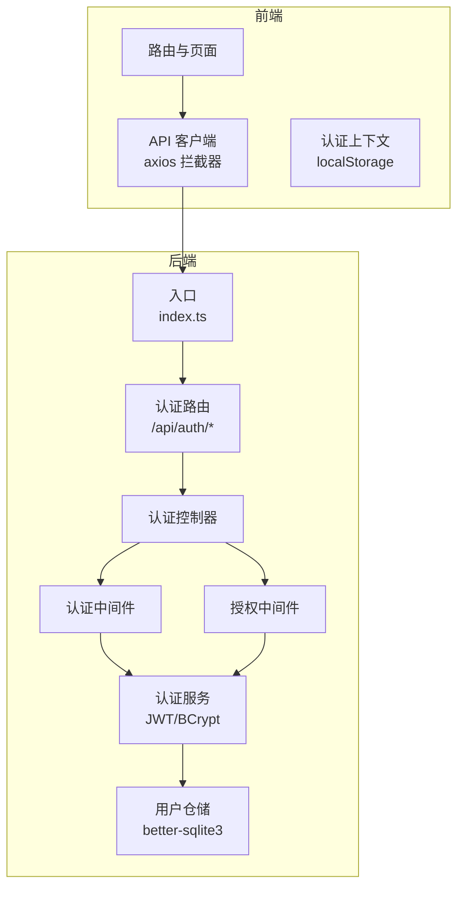
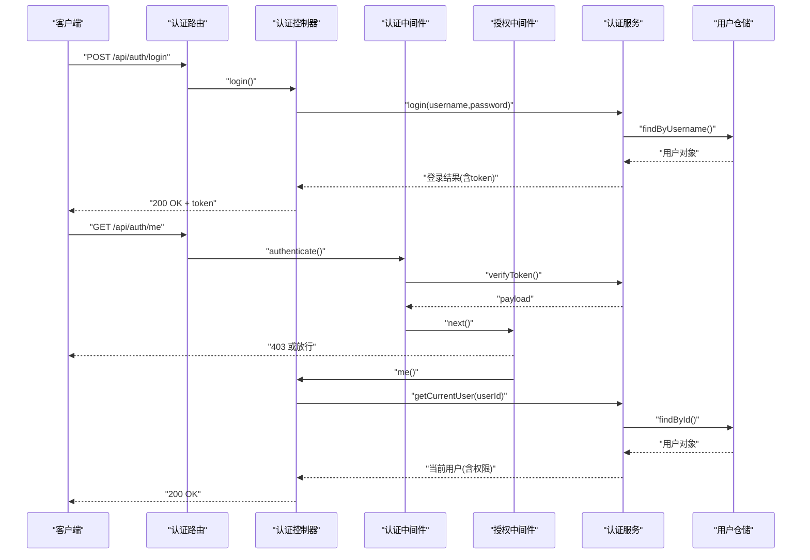
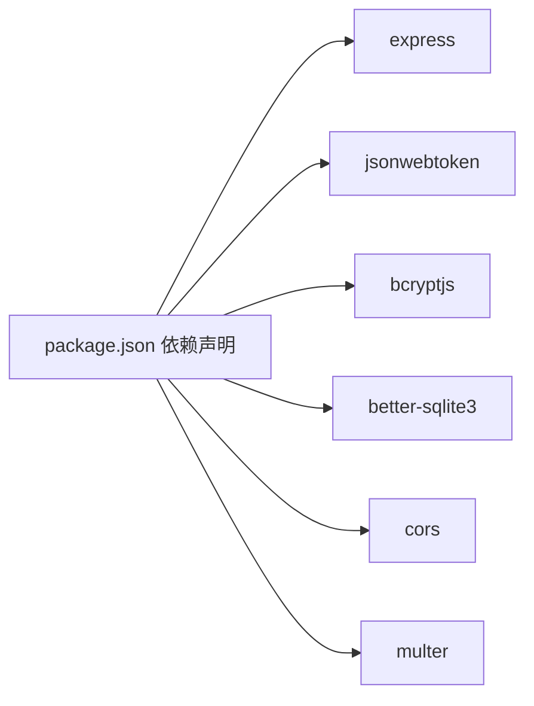

# 安全加固

<cite>
**本文引用的文件**
- [backend/src/controllers/authController.ts](file://backend/src/controllers/authController.ts)
- [backend/src/middlewares/auth.ts](file://backend/src/middlewares/auth.ts)
- [backend/src/middlewares/authorize.ts](file://backend/src/middlewares/authorize.ts)
- [backend/src/services/AuthService.ts](file://backend/src/services/AuthService.ts)
- [backend/src/models/UserRepository.ts](file://backend/src/models/UserRepository.ts)
- [backend/src/routes/auth.ts](file://backend/src/routes/auth.ts)
- [backend/src/index.ts](file://backend/src/index.ts)
- [backend/package.json](file://backend/package.json)
- [shared/types.ts](file://shared/types.ts)
- [backend/src/utils/seedUsers.ts](file://backend/src/utils/seedUsers.ts)
- [frontend/src/hooks/useAuth.tsx](file://frontend/src/hooks/useAuth.tsx)
- [frontend/src/api/client.ts](file://frontend/src/api/client.ts)
- [frontend/vite.config.ts](file://frontend/vite.config.ts)
</cite>

## 目录
1. [简介](#简介)
2. [项目结构](#项目结构)
3. [核心组件](#核心组件)
4. [架构总览](#架构总览)
5. [详细组件分析](#详细组件分析)
6. [依赖分析](#依赖分析)
7. [性能考虑](#性能考虑)
8. [故障排除指南](#故障排除指南)
9. [结论](#结论)
10. [附录](#附录)

## 简介
本文件面向“安全加固”目标，系统梳理并补充本项目在应用层安全配置、中间件安全实现、输入验证与数据清理、文件上传限制、网络安全配置、漏洞扫描与安全审计、敏感数据保护以及安全事件响应等方面的最佳实践与改进建议。文档以现有代码为依据，结合安全工程方法论，提出可落地的增强方案。

## 项目结构
后端采用 Express + TypeScript 架构，按职责分层组织：控制器、中间件、服务、模型、路由与入口；前端基于 Vite + React，通过代理访问后端 API。共享类型定义位于 shared 目录，前后端统一使用。

图示来源
- [backend/src/index.ts:14-36](file://backend/src/index.ts#L14-L36)
- [backend/src/routes/auth.ts:10-16](file://backend/src/routes/auth.ts#L10-L16)
- [backend/src/controllers/authController.ts:16-43](file://backend/src/controllers/authController.ts#L16-L43)
- [backend/src/middlewares/auth.ts:26-55](file://backend/src/middlewares/auth.ts#L26-L55)
- [backend/src/middlewares/authorize.ts:16-46](file://backend/src/middlewares/authorize.ts#L16-L46)
- [backend/src/services/AuthService.ts:32-92](file://backend/src/services/AuthService.ts#L32-L92)
- [backend/src/models/UserRepository.ts:31-54](file://backend/src/models/UserRepository.ts#L31-L54)

章节来源
- [backend/src/index.ts:14-36](file://backend/src/index.ts#L14-L36)
- [backend/src/routes/auth.ts:10-16](file://backend/src/routes/auth.ts#L10-L16)
- [backend/src/controllers/authController.ts:16-43](file://backend/src/controllers/authController.ts#L16-L43)
- [backend/src/middlewares/auth.ts:26-55](file://backend/src/middlewares/auth.ts#L26-L55)
- [backend/src/middlewares/authorize.ts:16-46](file://backend/src/middlewares/authorize.ts#L16-L46)
- [backend/src/services/AuthService.ts:32-92](file://backend/src/services/AuthService.ts#L32-L92)
- [backend/src/models/UserRepository.ts:31-54](file://backend/src/models/UserRepository.ts#L31-L54)

## 核心组件
- 认证与授权
  - 认证控制器负责登录与获取当前用户信息，内置基础参数校验。
  - 认证中间件从请求头提取 Bearer Token 并校验有效性，失败返回 401。
  - 授权中间件基于角色-权限映射表校验用户是否具备所需权限，失败返回 403。
  - 认证服务封装 JWT 签发与校验、密码哈希、权限查询等逻辑。
  - 用户仓储基于 better-sqlite3 提供用户查询能力。
- 前端安全
  - API 客户端统一注入 Authorization 头，响应拦截器处理 401 自动登出。
  - 认证上下文持久化 token 与用户信息至 localStorage，并在初始化时恢复状态。
- CORS 与入口
  - 入口启用跨域中间件，默认允许来自任意源的请求，存在安全风险。

章节来源
- [backend/src/controllers/authController.ts:16-76](file://backend/src/controllers/authController.ts#L16-L76)
- [backend/src/middlewares/auth.ts:26-55](file://backend/src/middlewares/auth.ts#L26-L55)
- [backend/src/middlewares/authorize.ts:16-46](file://backend/src/middlewares/authorize.ts#L16-L46)
- [backend/src/services/AuthService.ts:32-125](file://backend/src/services/AuthService.ts#L32-L125)
- [backend/src/models/UserRepository.ts:31-54](file://backend/src/models/UserRepository.ts#L31-L54)
- [frontend/src/api/client.ts:10-52](file://frontend/src/api/client.ts#L10-L52)
- [frontend/src/hooks/useAuth.tsx:34-79](file://frontend/src/hooks/useAuth.tsx#L34-L79)
- [backend/src/index.ts:17](file://backend/src/index.ts#L17)

## 架构总览
下图展示认证与授权的关键交互流程，涵盖请求进入、中间件校验、服务处理与响应返回。

图示来源
- [backend/src/routes/auth.ts:12-16](file://backend/src/routes/auth.ts#L12-L16)
- [backend/src/controllers/authController.ts:16-76](file://backend/src/controllers/authController.ts#L16-L76)
- [backend/src/middlewares/auth.ts:26-55](file://backend/src/middlewares/auth.ts#L26-L55)
- [backend/src/middlewares/authorize.ts:16-46](file://backend/src/middlewares/authorize.ts#L16-L46)
- [backend/src/services/AuthService.ts:43-110](file://backend/src/services/AuthService.ts#L43-L110)
- [backend/src/models/UserRepository.ts:39-54](file://backend/src/models/UserRepository.ts#L39-L54)

## 详细组件分析

### 应用层安全配置
- JWT 令牌安全设置
  - 密钥来源：优先从环境变量读取，若未配置则使用默认密钥，存在泄露风险。
  - 过期时间：默认 8 小时，建议结合刷新令牌机制与短期访问令牌组合使用。
  - 载荷结构：包含用户标识、用户名、角色及可选机构名，避免携带敏感字段。
  - 建议
    - 强制设置安全的 JWT_SECRET，避免硬编码。
    - 引入刷新令牌（refresh token）与访问令牌（access token），刷新令牌单独存储与校验。
    - 在载荷中加入签发时间与受众等标准字段，提升抗攻击能力。
- 密码加密策略
  - 使用 bcrypt 对密码进行哈希处理，成本因子为 10，满足一般强度要求。
  - 建议
    - 将成本因子提升至更高范围（如 12+），以应对更强算力。
    - 新增密码历史与复杂度策略（长度、字符集、禁止常见弱口令）。
- 会话管理
  - 后端无服务端会话存储，采用无状态 JWT，降低横向扩展复杂度。
  - 建议
    - 引入黑名单（revocation list）或短期令牌以支持即时撤销。
    - 前端仅保存令牌与用户信息，避免在内存中长期持有敏感上下文。

章节来源
- [backend/src/services/AuthService.ts:11-15](file://backend/src/services/AuthService.ts#L11-L15)
- [backend/src/services/AuthService.ts:70-78](file://backend/src/services/AuthService.ts#L70-L78)
- [backend/src/services/AuthService.ts:85-92](file://backend/src/services/AuthService.ts#L85-L92)
- [backend/src/utils/seedUsers.ts:16](file://backend/src/utils/seedUsers.ts#L16)

### 中间件安全实现
- 认证中间件
  - 从 Authorization 头提取 Bearer Token，校验格式与有效性，失败返回 401。
  - 建议
    - 对空值与异常格式进行严格白名单校验，拒绝非标准头。
    - 记录认证失败次数并引入速率限制与账户锁定策略。
- 授权中间件
  - 基于角色-权限映射表校验用户是否具备所需权限，缺失权限返回 403。
  - 建议
    - 将权限映射集中化管理，支持动态更新与审计。
    - 对关键操作增加二次确认或审计日志。
- CORS 配置
  - 默认启用跨域，未限制来源，存在 CSRF 与跨站风险。
  - 建议
    - 明确指定可信来源，禁用通配符。
    - 严格控制暴露的头部与方法，仅开放必要项。

章节来源
- [backend/src/middlewares/auth.ts:26-55](file://backend/src/middlewares/auth.ts#L26-L55)
- [backend/src/middlewares/authorize.ts:16-46](file://backend/src/middlewares/authorize.ts#L16-L46)
- [backend/src/index.ts:17](file://backend/src/index.ts#L17)

### 输入验证与数据清理
- 控制器层
  - 登录接口对必填字段进行简单校验，建议扩展为结构化校验（如长度、字符集、空格处理）。
- 仓储层
  - 使用参数化查询（prepare + ? 占位符）有效防止 SQL 注入。
- 建议
  - 引入统一的输入校验器（如 Zod/JOI）对请求体与查询参数进行强约束。
  - 对文本输入执行最小化与标准化处理（去除多余空白、统一换行、HTML 转义）。
  - 对路径与文件名进行白名单校验，避免目录穿越。

章节来源
- [backend/src/controllers/authController.ts:19-26](file://backend/src/controllers/authController.ts#L19-L26)
- [backend/src/models/UserRepository.ts:40-53](file://backend/src/models/UserRepository.ts#L40-L53)

### 文件上传安全限制
- 现状
  - 项目未发现专用文件上传路由或中间件，未见类型检查、大小限制与恶意文件检测。
- 建议
  - 采用安全的上传中间件（如 multer 的存储引擎与限制配置）。
  - 严格限制文件类型（MIME 白名单）、大小上限与数量限制。
  - 对上传文件重命名并存储至隔离目录，禁止直接执行；扫描病毒与恶意特征。
  - 通过只读 URL 与鉴权访问控制下载。

章节来源
- [backend/package.json:20](file://backend/package.json#L20)

### 网络安全配置
- HTTPS 强制
  - 本地开发使用 HTTP，生产环境需启用 HTTPS 并强制跳转。
- 安全头设置
  - 建议启用并配置典型安全头（如 Content-Security-Policy、Strict-Transport-Security、X-Frame-Options、X-Content-Type-Options、Referrer-Policy）。
- 防火墙规则
  - 仅开放必要端口，限制来源 IP，对 /api/health 等健康检查接口也应进行访问控制。

章节来源
- [backend/src/index.ts:32-35](file://backend/src/index.ts#L32-L35)

### 漏洞扫描与安全审计
- 工具与流程建议
  - 依赖扫描：定期运行依赖安全扫描（如 npm audit 或 Snyk），修复高危与严重漏洞。
  - 代码审计：静态分析（ESLint 安全规则、SonarQube）与手动审计相结合。
  - 动态测试：对认证、授权与关键业务接口进行自动化渗透测试。
  - 日志与监控：记录认证失败、权限拒绝与异常访问，建立告警机制。
- 测试覆盖
  - 增加针对认证中间件、授权中间件与控制器的单元与集成测试，覆盖边界条件与异常路径。

章节来源
- [backend/package.json:10-12](file://backend/package.json#L10-L12)

### 敏感数据保护
- 传输加密
  - 生产环境必须启用 TLS，禁用明文传输。
- 存储加密
  - 密码采用 bcrypt 哈希存储，建议对数据库连接启用 SSL/TLS。
- 最小暴露
  - JWT 载荷避免包含敏感字段；日志中避免输出完整令牌与用户凭据。

章节来源
- [backend/src/services/AuthService.ts:112-124](file://backend/src/services/AuthService.ts#L112-L124)
- [backend/src/index.ts:32-35](file://backend/src/index.ts#L32-L35)

### 安全事件响应与应急处理
- 响应流程建议
  - 事件分类分级（弱、中、高、严重），明确处置时限与责任人。
  - 快速隔离受影响资源（封禁账户、撤销令牌、临时关闭接口）。
  - 回溯日志与审计，定位攻击路径与影响范围。
  - 修复与验证后发布补丁公告，持续监控。
- 应急预案
  - 制定备份与恢复计划，确保在数据泄露或服务中断后快速恢复。
  - 建立媒体与合规沟通机制，按法规要求上报与通知。

## 依赖分析
后端依赖包括 Express、JWT、BCrypt、better-sqlite3、CORS、Multer 等。其中 CORS 默认开启，需收紧；JWT 与 BCrypt 为认证与密码安全的核心。

图示来源
- [backend/package.json:14-22](file://backend/package.json#L14-L22)

章节来源
- [backend/package.json:14-22](file://backend/package.json#L14-L22)

## 性能考虑
- 认证性能
  - bcrypt 成本因子与令牌签发/校验开销需平衡安全与性能，建议基准测试后调整。
- 数据库性能
  - 使用参数化查询与索引优化用户查询；对高频接口增加缓存（如用户权限与令牌元数据）。
- 前端性能
  - 减少不必要的重定向与重复请求，利用拦截器统一处理错误与登出。

## 故障排除指南
- 401 未认证
  - 检查请求头 Authorization 是否为 Bearer 格式；确认 token 未过期；核对密钥一致性。
- 403 权限不足
  - 核对用户角色与所需权限；确认权限映射正确；检查授权中间件是否正确注入用户信息。
- CORS 跨域失败
  - 确认后端 CORS 配置的来源白名单；浏览器开发者工具查看实际请求与响应头。
- 前端自动登出
  - 检查响应拦截器逻辑与路由跳转；确认 localStorage 中 token 与用户信息一致性。

章节来源
- [backend/src/middlewares/auth.ts:29-35](file://backend/src/middlewares/auth.ts#L29-L35)
- [backend/src/middlewares/auth.ts:44-50](file://backend/src/middlewares/auth.ts#L44-L50)
- [backend/src/middlewares/authorize.ts:20-26](file://backend/src/middlewares/authorize.ts#L20-L26)
- [backend/src/middlewares/authorize.ts:36-42](file://backend/src/middlewares/authorize.ts#L36-L42)
- [frontend/src/api/client.ts:29-38](file://frontend/src/api/client.ts#L29-L38)

## 结论
本项目已具备基础的 JWT 认证与权限控制框架，但存在 CORS 默认放开、密钥配置风险、缺少输入校验与文件上传安全限制等问题。建议按本文逐项加固：收紧 CORS、强制安全密钥、完善输入校验、引入文件上传安全策略、强化网络与传输安全、建立漏洞扫描与安全审计流程、加强敏感数据保护与事件响应机制。通过这些改进，可显著提升系统的整体安全性与稳定性。

## 附录
- 前端代理与本地开发
  - Vite 代理将 /api 转发至后端 3000 端口，便于本地联调。
- 类型与常量
  - 共享类型定义了角色、权限、状态等关键枚举，有助于前后端一致的校验与权限控制。

章节来源
- [frontend/vite.config.ts:14-19](file://frontend/vite.config.ts#L14-L19)
- [shared/types.ts:8-102](file://shared/types.ts#L8-L102)