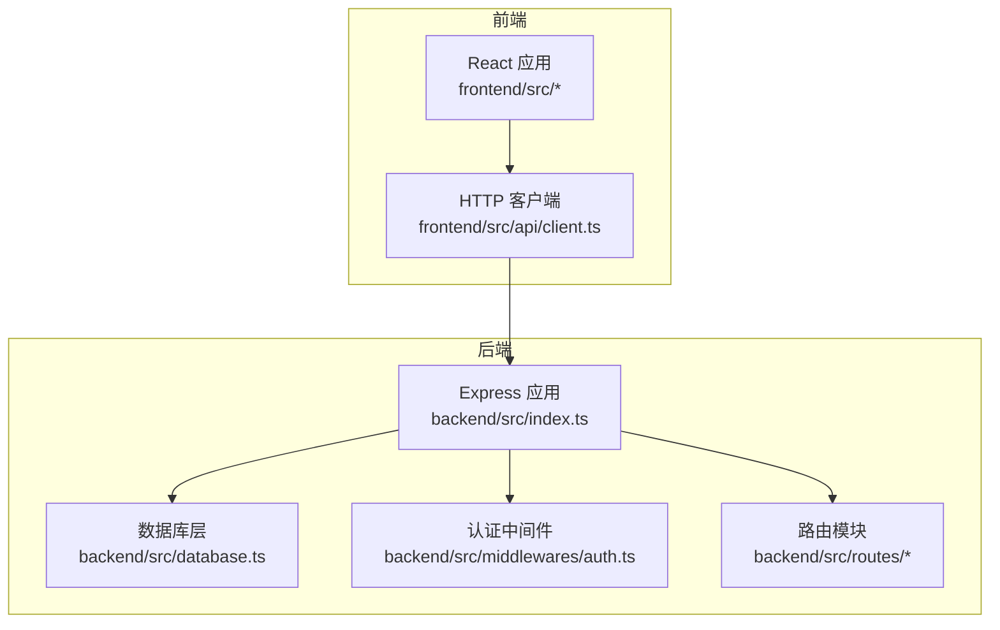
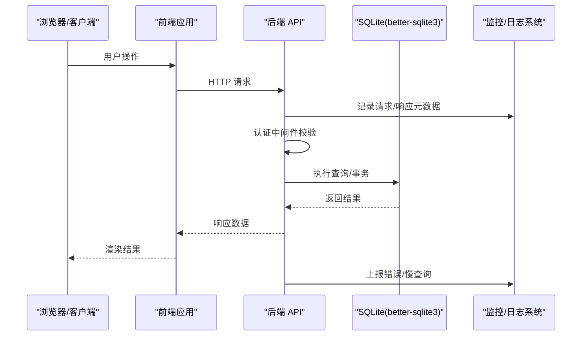
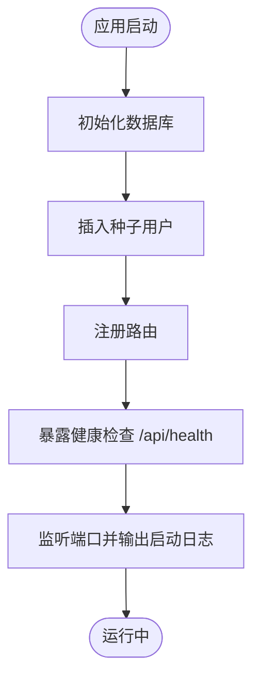
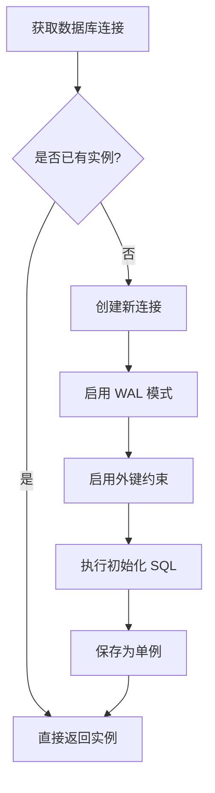
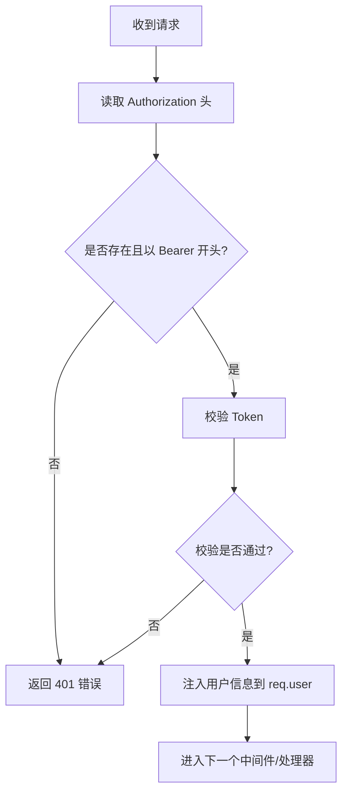
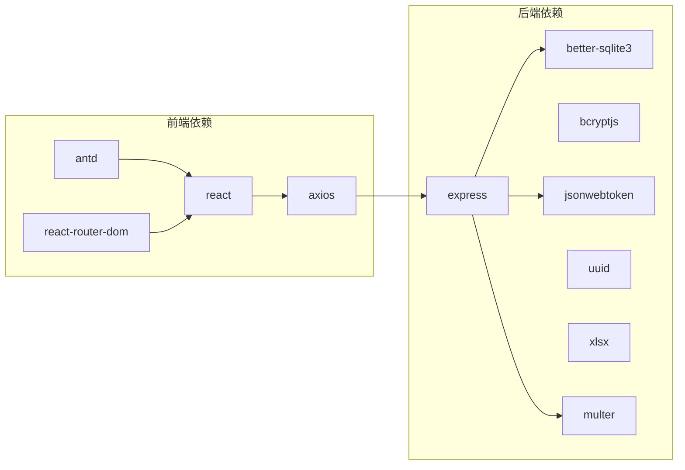

# 监控与日志

<cite>
**本文档引用的文件**
- [backend/src/index.ts](file://backend/src/index.ts)
- [backend/package.json](file://backend/package.json)
- [backend/src/database.ts](file://backend/src/database.ts)
- [backend/src/middlewares/auth.ts](file://backend/src/middlewares/auth.ts)
- [backend/vitest.config.ts](file://backend/vitest.config.ts)
- [backend/tsconfig.json](file://backend/tsconfig.json)
- [frontend/package.json](file://frontend/package.json)
</cite>

## 目录
1. [简介](#简介)
2. [项目结构](#项目结构)
3. [核心组件](#核心组件)
4. [架构总览](#架构总览)
5. [详细组件分析](#详细组件分析)
6. [依赖分析](#依赖分析)
7. [性能考虑](#性能考虑)
8. [故障排查指南](#故障排查指南)
9. [结论](#结论)
10. [附录](#附录)

## 简介
本文件面向“监控与日志”主题，结合当前代码库现状，系统性地梳理后端 Express 应用的健康检查、数据库性能基础配置、API 路由与中间件现状，以及前端性能监控与错误上报的可扩展点。同时，提供第三方监控服务（如 Sentry、DataDog、Prometheus）的集成建议与日志聚合（ELK Stack）的落地思路，帮助在现有基础上逐步完善可观测性体系。

## 项目结构
后端采用 Express + better-sqlite3 架构，提供认证、档案与 OCR 相关接口；前端基于 React + Vite，使用 axios 发起 HTTP 请求。当前仓库未内置专门的日志库或监控中间件，但具备良好的扩展点以接入各类监控与日志方案。

图表来源
- [backend/src/index.ts:14-36](file://backend/src/index.ts#L14-L36)
- [backend/src/database.ts:25-52](file://backend/src/database.ts#L25-L52)
- [backend/src/middlewares/auth.ts:26-55](file://backend/src/middlewares/auth.ts#L26-L55)

章节来源
- [backend/src/index.ts:14-36](file://backend/src/index.ts#L14-L36)
- [backend/src/database.ts:25-52](file://backend/src/database.ts#L25-L52)
- [backend/src/middlewares/auth.ts:26-55](file://backend/src/middlewares/auth.ts#L26-L55)

## 核心组件
- 健康检查端点：后端提供 /api/health 快速探测服务状态，便于外部监控系统拉取。
- 数据库连接：better-sqlite3 单例连接，启用 WAL 模式与外键约束，适合中小规模数据与高并发读写场景。
- 认证中间件：从请求头解析 Bearer Token，校验失败返回统一错误结构，便于统一日志与告警。
- 路由注册：认证、档案、OCR 三类路由按 /api/* 前缀挂载，便于后续统一接入监控中间件。

章节来源
- [backend/src/index.ts:28-30](file://backend/src/index.ts#L28-L30)
- [backend/src/database.ts:41-48](file://backend/src/database.ts#L41-L48)
- [backend/src/middlewares/auth.ts:29-50](file://backend/src/middlewares/auth.ts#L29-L50)

## 架构总览
下图展示从浏览器到后端服务的关键链路，以及可插入监控与日志的位置。

图表来源
- [backend/src/index.ts:24-26](file://backend/src/index.ts#L24-L26)
- [backend/src/middlewares/auth.ts:26-55](file://backend/src/middlewares/auth.ts#L26-L55)
- [backend/src/database.ts:25-52](file://backend/src/database.ts#L25-L52)

## 详细组件分析

### 后端健康检查与启动流程
- 启动阶段：应用初始化数据库与种子用户，随后注册路由并监听端口。
- 健康检查：提供 /api/health 探针，返回服务状态，便于容器编排与外部监控系统使用。
- 日志现状：启动日志输出至标准输出，无结构化日志与级别区分。

图表来源
- [backend/src/index.ts:21-36](file://backend/src/index.ts#L21-L36)

章节来源
- [backend/src/index.ts:21-36](file://backend/src/index.ts#L21-L36)

### 数据库连接与性能基线
- 连接管理：单例模式复用连接，避免频繁打开/关闭带来的开销。
- WAL 模式：开启 WAL 提升并发读写能力，降低锁竞争。
- 外键约束：启用外键保证数据一致性。
- 性能现状：未内置查询耗时统计与慢查询日志，建议通过中间件或拦截器增强。

图表来源
- [backend/src/database.ts:25-52](file://backend/src/database.ts#L25-L52)

章节来源
- [backend/src/database.ts:25-52](file://backend/src/database.ts#L25-L52)

### 认证中间件与统一错误
- 请求头解析：从 Authorization 中提取 Bearer Token。
- 校验失败：返回统一错误结构，便于统一记录与告警。
- 用户注入：校验成功后将用户信息注入 req.user，供后续处理使用。

图表来源
- [backend/src/middlewares/auth.ts:26-55](file://backend/src/middlewares/auth.ts#L26-L55)

章节来源
- [backend/src/middlewares/auth.ts:26-55](file://backend/src/middlewares/auth.ts#L26-L55)

### 前端性能监控与错误上报
- 技术栈：React + Vite + axios。
- 性能采集点：可在 axios 拦截器中埋点请求耗时、状态码分布；在路由切换处记录页面停留时长。
- 错误上报：对 4xx/5xx 统一捕获并上报；对前端异常（window.onerror）进行兜底上报。
- 建议：引入性能 API（Navigation Timing、Resource Timing、Paint Timing）与错误追踪 SDK（如 Sentry）。

章节来源
- [frontend/package.json:12-18](file://frontend/package.json#L12-L18)

## 依赖分析
- 后端依赖：Express、better-sqlite3、bcryptjs、jsonwebtoken、uuid、xlsx、multer 等。
- 前端依赖：React、axios、antd、react-router-dom 等。
- 测试与构建：TypeScript、Vitest、ESLint、Vite。

图表来源
- [backend/package.json:14-22](file://backend/package.json#L14-L22)
- [frontend/package.json:12-18](file://frontend/package.json#L12-L18)

章节来源
- [backend/package.json:14-22](file://backend/package.json#L14-L22)
- [frontend/package.json:12-18](file://frontend/package.json#L12-L18)

## 性能考虑
- 后端
  - 使用 better-sqlite3 的单例连接与 WAL 模式，适合中小规模并发。
  - 建议在路由处理前后增加中间件，记录请求耗时、状态码、URL、方法等维度，便于后续接入 Prometheus 或自建指标系统。
  - 对数据库操作增加超时控制与重试策略，避免阻塞主线程。
- 前端
  - 在 axios 拦截器中记录请求耗时与错误码，结合浏览器性能 API（PerformanceNavigationTiming、PerformanceResourceTiming）采集页面性能指标。
  - 对关键交互（如导入、OCR）增加埋点上报，便于定位性能瓶颈。

## 故障排查指南
- 健康检查
  - 通过 /api/health 判断服务可用性；若不可用，检查数据库初始化与种子用户插入是否成功。
- 认证问题
  - 若出现 401，确认 Authorization 头格式是否为 Bearer Token；检查 Token 是否过期或签名无效。
- 数据库问题
  - WAL 模式与外键约束已在初始化时启用；若出现约束冲突，检查业务逻辑或数据初始化脚本。
- 日志与告警
  - 当前仅输出启动日志；建议接入结构化日志与统一告警平台，将认证失败、数据库异常、慢查询等事件纳入告警。

章节来源
- [backend/src/index.ts:28-30](file://backend/src/index.ts#L28-L30)
- [backend/src/middlewares/auth.ts:29-50](file://backend/src/middlewares/auth.ts#L29-L50)
- [backend/src/database.ts:41-48](file://backend/src/database.ts#L41-L48)

## 结论
当前代码库具备清晰的后端入口、数据库连接与认证中间件结构，但尚未内置专门的日志与监控设施。建议在现有路由与中间件之上快速接入统一日志、指标与错误追踪方案，并在前端引入性能与错误上报能力，形成完整的可观测性闭环。

## 附录

### 后端监控与日志配置建议（无代码示例）
- 结构化日志
  - 使用 pino 或 winston 输出 JSON 格式日志，包含时间戳、级别、服务名、请求 ID、URL、方法、耗时、状态码等字段。
- 日志级别
  - info：常规请求与业务事件
  - warn：认证失败、参数异常
  - error：数据库异常、未捕获异常
- 日志轮转
  - 使用 logrotate 或 Winston 的文件轮转策略，按大小或时间切分日志文件。
- 指标采集
  - 在路由中间件中统计请求耗时（直方图）、请求数（计数器）、错误率（比率），导出到 Prometheus。
- 错误追踪
  - 全局异常捕获中间件统一处理未捕获异常，结合 Sentry 上报堆栈与上下文信息。
- 健康检查
  - 保持 /api/health 端点稳定，确保容器编排与外部监控系统可正常拉取。

### 前端性能监控与错误上报建议
- 性能指标
  - 页面加载时间（First Paint、First Contentful Paint、DOMContentLoaded、Load）
  - 资源加载耗时（JS/CSS/Image 等）
  - 用户交互延迟（点击、跳转、表单提交）
- 错误上报
  - 捕获 axios 异常与前端运行时错误，上报到统一平台（如 Sentry）
  - 包含用户会话、页面 URL、设备信息、网络环境等上下文

### 第三方监控服务集成思路
- Sentry
  - 后端：在全局异常捕获中间件中集成 Sentry，上报错误与上下文
  - 前端：在入口处初始化 SDK，自动捕获未处理异常与资源错误
- DataDog
  - 后端：通过官方 APM Agent 采集指标与分布式追踪
  - 前端：使用 DataDog Browser SDK 上报性能与错误
- Prometheus
  - 后端：暴露 /metrics 端点，导出自定义指标（请求耗时、错误数、队列长度等）
  - 前端：通过自建网关或服务端代理上报性能指标

### 日志聚合与分析（ELK Stack）
- 收集：在后端输出结构化日志，前端通过网关或服务端代理转发
- 索引：Logstash/Fluentd/Vector 将日志标准化并索引到 Elasticsearch
- 展示：Kibana 可视化日志与指标，建立告警规则
- 建议：为不同服务与环境（dev/stage/prod）分别建立索引策略与保留周期