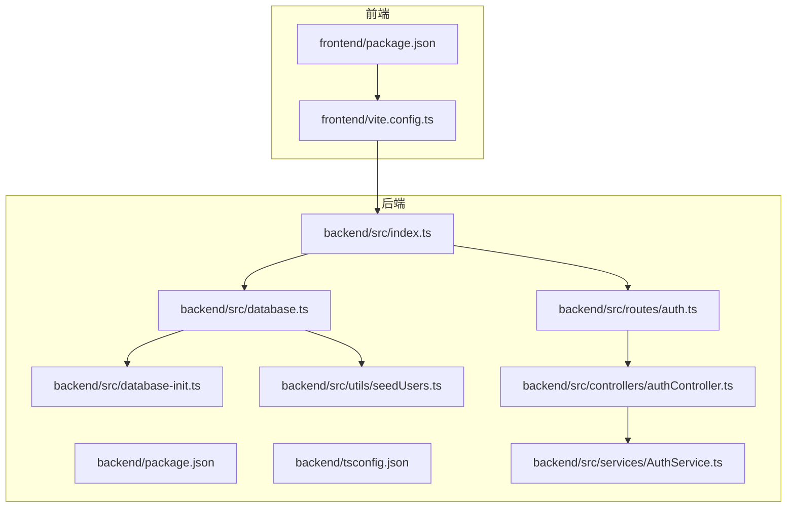
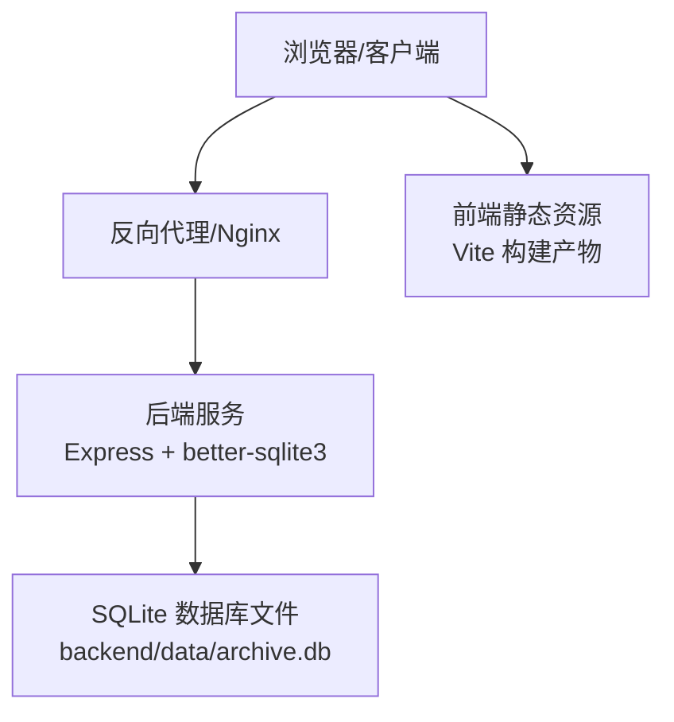
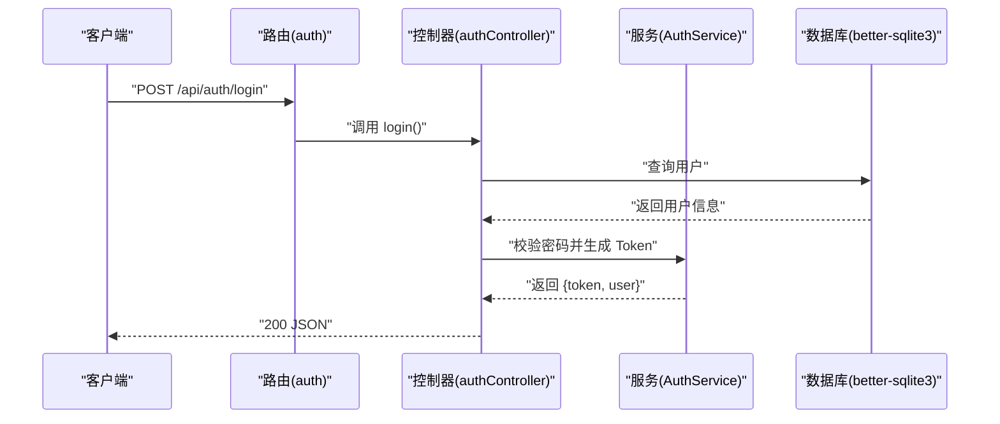
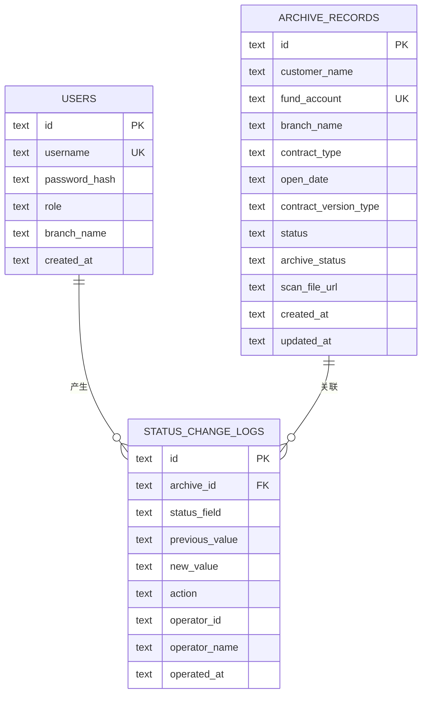
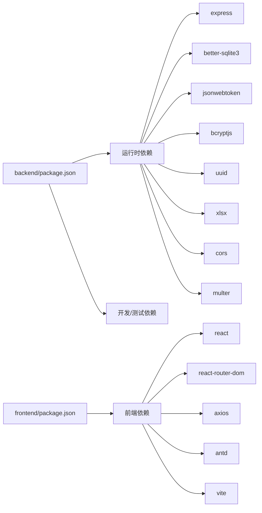

# 部署与运维

<cite>
**本文档引用的文件**
- [backend/package.json](file://backend/package.json)
- [backend/tsconfig.json](file://backend/tsconfig.json)
- [backend/src/index.ts](file://backend/src/index.ts)
- [backend/src/database.ts](file://backend/src/database.ts)
- [backend/src/database-init.ts](file://backend/src/database-init.ts)
- [backend/src/utils/seedUsers.ts](file://backend/src/utils/seedUsers.ts)
- [backend/src/services/AuthService.ts](file://backend/src/services/AuthService.ts)
- [backend/src/controllers/authController.ts](file://backend/src/controllers/authController.ts)
- [backend/src/routes/auth.ts](file://backend/src/routes/auth.ts)
- [frontend/package.json](file://frontend/package.json)
- [frontend/vite.config.ts](file://frontend/vite.config.ts)
- [start.sh](file://start.sh)
- [start.ps1](file://start.ps1)
</cite>

## 目录
1. [简介](#简介)
2. [项目结构](#项目结构)
3. [核心组件](#核心组件)
4. [架构总览](#架构总览)
5. [详细组件分析](#详细组件分析)
6. [依赖分析](#依赖分析)
7. [性能考量](#性能考量)
8. [故障排除指南](#故障排除指南)
9. [结论](#结论)
10. [附录](#附录)

## 简介
本文件面向生产环境的部署与运维，围绕档案管理系统后端与前端的整体能力，提供从服务器要求、环境变量、依赖安装、容器化与镜像构建、CI/CD流水线、监控与日志、备份与灾备、扩展与负载均衡、安全加固、运维工具与脚本、以及故障排除与应急响应的完整操作文档。内容基于仓库中的实际代码与配置文件整理而成，确保可落地、可验证。

## 项目结构
系统由前后端分离架构组成：
- 后端采用 Node.js + Express + better-sqlite3，提供 REST API 与健康检查接口。
- 前端采用 Vite + React，通过代理访问后端 API。
- 开发阶段提供一键启动脚本，便于本地联调。

**图表来源**
- [frontend/package.json:1-35](file://frontend/package.json#L1-L35)
- [frontend/vite.config.ts:1-22](file://frontend/vite.config.ts#L1-L22)
- [backend/package.json:1-41](file://backend/package.json#L1-L41)
- [backend/tsconfig.json:1-25](file://backend/tsconfig.json#L1-L25)
- [backend/src/index.ts:1-39](file://backend/src/index.ts#L1-L39)
- [backend/src/database.ts:1-87](file://backend/src/database.ts#L1-L87)
- [backend/src/database-init.ts:1-65](file://backend/src/database-init.ts#L1-L65)
- [backend/src/utils/seedUsers.ts:1-20](file://backend/src/utils/seedUsers.ts#L1-L20)
- [backend/src/services/AuthService.ts:1-126](file://backend/src/services/AuthService.ts#L1-L126)
- [backend/src/controllers/authController.ts:1-77](file://backend/src/controllers/authController.ts#L1-L77)
- [backend/src/routes/auth.ts:1-19](file://backend/src/routes/auth.ts#L1-L19)

**章节来源**
- [frontend/package.json:1-35](file://frontend/package.json#L1-L35)
- [frontend/vite.config.ts:1-22](file://frontend/vite.config.ts#L1-L22)
- [backend/package.json:1-41](file://backend/package.json#L1-L41)
- [backend/tsconfig.json:1-25](file://backend/tsconfig.json#L1-L25)
- [backend/src/index.ts:1-39](file://backend/src/index.ts#L1-L39)

## 核心组件
- 后端入口与路由
  - 入口文件负责初始化 Express、CORS、JSON 解析、数据库与种子用户、注册路由并提供健康检查。
  - 路由模块注册认证、档案、OCR 等接口。
- 数据层
  - better-sqlite3 单例连接，自动创建数据库文件、启用 WAL 模式与外键约束，并执行初始化 SQL。
  - 初始化脚本定义三张核心表及索引，包含用户、档案记录与状态变更日志。
  - 种子用户脚本在首次启动时写入测试账户。
- 认证服务
  - 基于 JWT 的登录与令牌校验；权限按角色映射；支持密码哈希。
- 前端开发与代理
  - Vite 代理将 /api 请求转发至后端本地端口，便于本地联调。

**章节来源**
- [backend/src/index.ts:1-39](file://backend/src/index.ts#L1-L39)
- [backend/src/database.ts:1-87](file://backend/src/database.ts#L1-L87)
- [backend/src/database-init.ts:1-65](file://backend/src/database-init.ts#L1-L65)
- [backend/src/utils/seedUsers.ts:1-20](file://backend/src/utils/seedUsers.ts#L1-L20)
- [backend/src/services/AuthService.ts:1-126](file://backend/src/services/AuthService.ts#L1-L126)
- [backend/src/controllers/authController.ts:1-77](file://backend/src/controllers/authController.ts#L1-L77)
- [backend/src/routes/auth.ts:1-19](file://backend/src/routes/auth.ts#L1-L19)
- [frontend/vite.config.ts:1-22](file://frontend/vite.config.ts#L1-L22)

## 架构总览
下图展示生产部署的关键交互：客户端经反向代理访问后端服务，后端通过 better-sqlite3 访问 SQLite 数据库文件；前端静态资源由 Web 服务器提供，开发时通过 Vite 代理访问后端。

**图表来源**
- [backend/src/index.ts:1-39](file://backend/src/index.ts#L1-L39)
- [backend/src/database.ts:1-87](file://backend/src/database.ts#L1-L87)
- [frontend/vite.config.ts:1-22](file://frontend/vite.config.ts#L1-L22)

## 详细组件分析

### 后端服务组件
- 入口与健康检查
  - 提供 /api/health 健康检查端点，便于探活与编排。
- 数据库初始化与 WAL 模式
  - 首次启动自动创建数据库文件与表结构，启用 WAL 提升并发读写性能。
- 认证与权限
  - 登录成功返回 JWT，后续接口可通过中间件校验；权限按角色映射。

**图表来源**
- [backend/src/routes/auth.ts:1-19](file://backend/src/routes/auth.ts#L1-L19)
- [backend/src/controllers/authController.ts:1-77](file://backend/src/controllers/authController.ts#L1-L77)
- [backend/src/services/AuthService.ts:1-126](file://backend/src/services/AuthService.ts#L1-L126)
- [backend/src/database.ts:1-87](file://backend/src/database.ts#L1-L87)

**章节来源**
- [backend/src/index.ts:1-39](file://backend/src/index.ts#L1-L39)
- [backend/src/database.ts:1-87](file://backend/src/database.ts#L1-L87)
- [backend/src/database-init.ts:1-65](file://backend/src/database-init.ts#L1-L65)
- [backend/src/services/AuthService.ts:1-126](file://backend/src/services/AuthService.ts#L1-L126)
- [backend/src/controllers/authController.ts:1-77](file://backend/src/controllers/authController.ts#L1-L77)
- [backend/src/routes/auth.ts:1-19](file://backend/src/routes/auth.ts#L1-L19)

### 数据模型与初始化
- 表结构与索引
  - users：用户主键、唯一用户名、密码哈希、角色、所属机构、创建时间。
  - archive_records：主键、客户名、资金账号唯一、机构名、合同类型、开立日期、合同版本类型、双状态字段、扫描文件链接、创建/更新时间。
  - status_change_logs：主键、关联档案、状态字段、前值、新值、动作、操作人ID/姓名、操作时间。
- 索引覆盖常用查询维度，提升检索效率。

**图表来源**
- [backend/src/database-init.ts:1-65](file://backend/src/database-init.ts#L1-L65)

**章节来源**
- [backend/src/database.ts:1-87](file://backend/src/database.ts#L1-L87)
- [backend/src/database-init.ts:1-65](file://backend/src/database-init.ts#L1-L65)

### 前端开发与代理
- 代理规则将 /api 请求转发至后端本地端口，便于本地联调。
- 生产构建产物位于前端 dist 目录，建议由 Nginx 提供静态托管。

**章节来源**
- [frontend/vite.config.ts:1-22](file://frontend/vite.config.ts#L1-L22)
- [frontend/package.json:1-35](file://frontend/package.json#L1-L35)

## 依赖分析
- 后端运行时依赖
  - Express、CORS、better-sqlite3、bcryptjs、jsonwebtoken、multer、uuid、xlsx。
- 开发与测试依赖
  - TypeScript、ts-node、vitest、@vitest/coverage-v8、eslint 等。
- 前端依赖
  - React、React DOM、Ant Design、axios、react-router-dom、xlsx、Vite、ESLint 等。

**图表来源**
- [backend/package.json:1-41](file://backend/package.json#L1-L41)
- [frontend/package.json:1-35](file://frontend/package.json#L1-L35)

**章节来源**
- [backend/package.json:1-41](file://backend/package.json#L1-L41)
- [frontend/package.json:1-35](file://frontend/package.json#L1-L35)

## 性能考量
- 数据库性能
  - WAL 模式提升并发读写吞吐；外键约束保障数据一致性；为档案记录表建立多维索引以优化查询。
- 缓存与会话
  - 建议在网关层引入缓存（如 Redis）存储热点数据与会话，降低数据库压力。
- 并发与线程
  - 后端为单进程架构，建议通过反向代理实现多实例横向扩展，结合负载均衡分发请求。
- 日志与指标
  - 启用结构化日志与关键指标埋点（请求量、响应时间、错误率），结合监控平台统一采集。

[本节为通用性能建议，不直接分析具体文件，故无“章节来源”]

## 故障排除指南
- 健康检查失败
  - 检查后端是否监听正确端口，确认 /api/health 返回正常。
- 数据库无法初始化
  - 确认数据目录可写，数据库文件路径是否存在；查看 WAL 与外键启用是否成功。
- 登录失败
  - 核对用户名与密码；确认 JWT 密钥配置；检查用户是否存在且密码哈希匹配。
- 前端代理异常
  - 确认 Vite 代理目标端口与后端一致；检查跨域与 Origin 配置。

**章节来源**
- [backend/src/index.ts:1-39](file://backend/src/index.ts#L1-L39)
- [backend/src/database.ts:1-87](file://backend/src/database.ts#L1-L87)
- [backend/src/services/AuthService.ts:1-126](file://backend/src/services/AuthService.ts#L1-L126)
- [frontend/vite.config.ts:1-22](file://frontend/vite.config.ts#L1-L22)

## 结论
本部署与运维文档基于仓库现有代码与配置，给出了生产可用的部署路径、容器化思路、CI/CD 推荐、监控与日志、备份与灾备、扩展与安全加固、运维脚本与故障排除流程。建议在实际上线前补充 Docker 化与 CI/CD 流水线配置文件，并完善生产环境的密钥与网络策略。

[本节为总结性内容，不直接分析具体文件，故无“章节来源”]

## 附录

### A. 生产环境部署配置清单
- 服务器要求
  - 操作系统：Linux（推荐 Ubuntu 20.04+/CentOS Stream）。
  - CPU/内存：根据业务规模评估，建议至少 2核4GB起步。
  - 存储：预留 SQLite 数据目录空间与日志容量。
- 环境变量
  - 后端
    - PORT：服务监听端口（默认 3000）。
    - JWT_SECRET：JWT 密钥（生产必须自定义且保密）。
  - 前端
    - 通过构建时注入或运行时由反向代理提供 API 地址。
- 依赖安装
  - 安装 Node.js（建议使用 nvm）、构建工具链与数据库驱动。
  - 后端：安装依赖并构建；前端：安装依赖并构建静态资源。
- 启动方式
  - 使用 systemd 或 Docker 管理后端进程；使用 Nginx 提供前端静态托管与反向代理。

**章节来源**
- [backend/src/index.ts:1-39](file://backend/src/index.ts#L1-L39)
- [backend/src/services/AuthService.ts:1-126](file://backend/src/services/AuthService.ts#L1-L126)
- [backend/package.json:1-41](file://backend/package.json#L1-L41)
- [frontend/package.json:1-35](file://frontend/package.json#L1-L35)

### B. Docker 容器化与镜像构建
- 构建步骤
  - 前端：使用多阶段构建，先安装依赖并构建，再复制到最小化运行镜像。
  - 后端：安装依赖并构建，打包 dist 与数据目录（注意持久化卷）。
- 镜像组织
  - 前端镜像：Nginx + 前端 dist。
  - 后端镜像：Node.js 运行时 + 后端 dist + 数据目录挂载。
- 持久化
  - 将 SQLite 数据库目录映射为持久卷，避免容器重建丢失数据。
- 健康检查
  - 在容器中暴露 /api/health，配合编排平台进行探活。

**章节来源**
- [frontend/package.json:1-35](file://frontend/package.json#L1-L35)
- [backend/package.json:1-41](file://backend/package.json#L1-L41)
- [backend/src/index.ts:1-39](file://backend/src/index.ts#L1-L39)
- [backend/src/database.ts:1-87](file://backend/src/database.ts#L1-L87)

### C. CI/CD 流水线与自动化部署
- 构建阶段
  - 前端：安装依赖 -> 编译 -> 生成 dist。
  - 后端：安装依赖 -> 编译 -> 运行测试。
- 容器化
  - 构建前端与后端镜像，推送至私有镜像仓库。
- 部署阶段
  - 使用编排平台（如 Kubernetes 或 Docker Compose）拉起服务，挂载持久化卷。
- 发布策略
  - 蓝绿/金丝雀发布，结合健康检查与回滚机制。

[本节为通用流水线建议，不直接分析具体文件，故无“章节来源”]

### D. 监控与日志管理最佳实践
- 性能监控
  - 指标：请求量、P95/P99 延迟、错误率、数据库锁等待、WAL 文件大小。
  - 工具：Prometheus + Grafana 或云监控平台。
- 错误追踪
  - 结构化日志输出，包含 trace-id、用户标识、操作上下文。
  - 集成 APM（如 OpenTelemetry）进行分布式追踪。
- 日志聚合
  - 使用集中式日志系统（如 ELK/EFK 或云日志服务）收集后端与前端日志。

[本节为通用监控建议，不直接分析具体文件，故无“章节来源”]

### E. 备份策略与灾难恢复
- 备份
  - 数据库文件定期快照；保留多个时间点的增量备份。
  - 配置与密钥单独加密备份。
- 恢复
  - 制定恢复演练流程；验证备份可恢复性；最小化 RTO/RPO。
- 灾备
  - 异地容灾与多活部署策略，结合负载均衡与自动切换。

[本节为通用灾备建议，不直接分析具体文件，故无“章节来源”]

### F. 扩展性与负载均衡
- 横向扩展
  - 多实例后端 + 反向代理；共享数据库或读写分离。
- 负载均衡
  - 使用 L7 负载均衡器（Nginx/Tengine/云 LB）分发请求。
- 会话与缓存
  - 使用外部缓存（Redis）存放会话与热点数据。

[本节为通用扩展建议，不直接分析具体文件，故无“章节来源”]

### G. 安全加固与漏洞防护
- 密钥与配置
  - JWT_SECRET 等敏感参数通过环境变量注入，避免硬编码。
- 网络与边界
  - 反向代理开启 HTTPS、限制来源 IP、启用 WAF。
- 输入校验与权限
  - 严格校验请求参数；RBAC 权限控制；最小权限原则。
- 依赖审计
  - 定期扫描依赖漏洞，及时升级。

**章节来源**
- [backend/src/services/AuthService.ts:1-126](file://backend/src/services/AuthService.ts#L1-L126)

### H. 运维工具与脚本使用指南
- 一键启动脚本
  - Linux：启动后端与前端并行进程，打印访问地址与测试账号。
  - Windows：在新 PowerShell 窗口中分别启动后端与前端。
- 生产脚本建议
  - systemd 服务单元、日志切割、健康检查钩子、自动重启策略。

**章节来源**
- [start.sh:1-35](file://start.sh#L1-L35)
- [start.ps1:1-29](file://start.ps1#L1-L29)

### I. 应急响应流程
- 快速定位
  - 查看健康检查、日志与指标告警。
- 临时处置
  - 降级非关键功能、隔离问题实例、回滚最近变更。
- 根因分析
  - 收集日志、追踪链路、复盘问题并修复。
- 复盘与改进
  - 更新应急预案、完善监控阈值与自动化处置。

[本节为通用应急流程，不直接分析具体文件，故无“章节来源”]