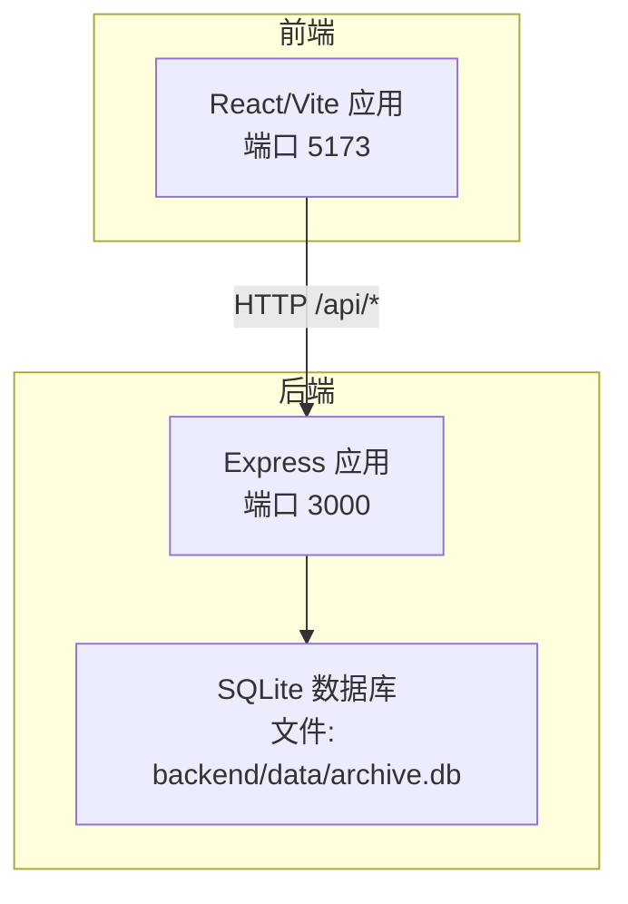
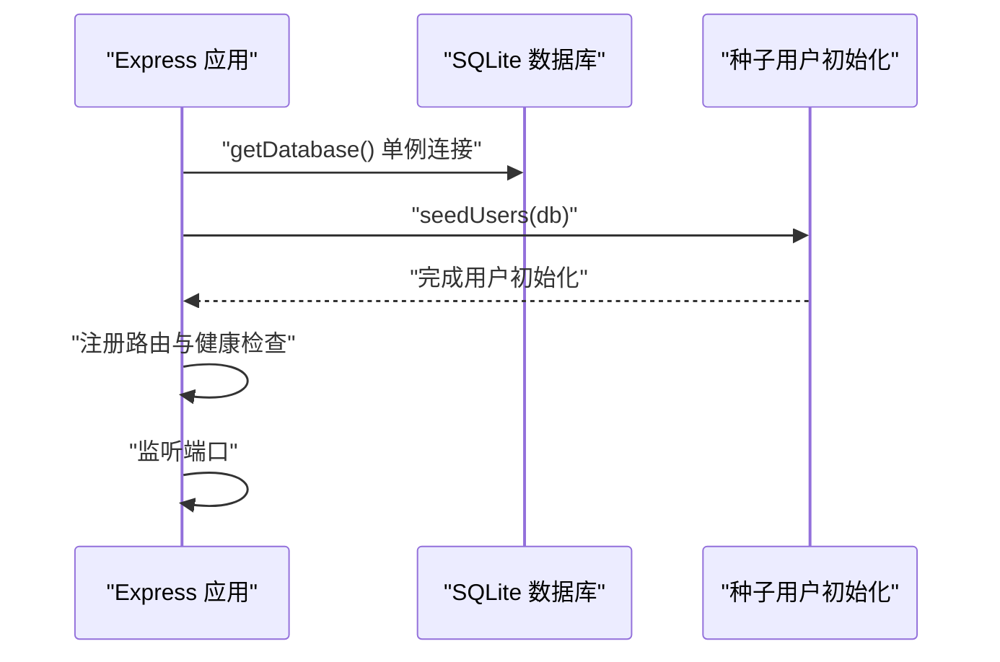
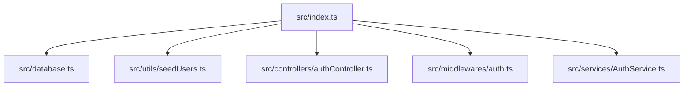

# 部署配置

<cite>
**本文档引用的文件**
- [backend/package.json](file://backend/package.json)
- [backend/src/index.ts](file://backend/src/index.ts)
- [backend/src/database.ts](file://backend/src/database.ts)
- [backend/src/utils/seedUsers.ts](file://backend/src/utils/seedUsers.ts)
- [backend/src/services/AuthService.ts](file://backend/src/services/AuthService.ts)
- [backend/src/controllers/authController.ts](file://backend/src/controllers/authController.ts)
- [backend/src/middlewares/auth.ts](file://backend/src/middlewares/auth.ts)
- [frontend/vite.config.ts](file://frontend/vite.config.ts)
- [start.sh](file://start.sh)
- [start.ps1](file://start.ps1)
</cite>

## 目录
1. [简介](#简介)
2. [项目结构](#项目结构)
3. [核心组件](#核心组件)
4. [架构总览](#架构总览)
5. [详细组件分析](#详细组件分析)
6. [依赖关系分析](#依赖关系分析)
7. [性能考虑](#性能考虑)
8. [故障排查指南](#故障排查指南)
9. [结论](#结论)
10. [附录](#附录)

## 简介
本文件面向生产环境部署，提供档案管理系统的服务器要求、硬件配置建议、环境变量与配置项说明、Docker 容器化部署方案、前后端分离部署差异与注意事项、Nginx 反向代理与 SSL 配置示例、PM2 进程管理配置与启动脚本，以及 CI/CD 流水线的配置思路与参考模板。

## 项目结构
系统采用前后端分离架构：
- 后端基于 Node.js + Express，使用 better-sqlite3 作为本地数据库，提供 REST API。
- 前端基于 React + Vite，开发时通过代理将 /api 请求转发至后端。
- 开发阶段提供一键启动脚本，同时启动前端与后端服务。

图表来源
- [backend/src/index.ts:14-36](file://backend/src/index.ts#L14-L36)
- [frontend/vite.config.ts:14-19](file://frontend/vite.config.ts#L14-L19)
- [backend/src/database.ts:14](file://backend/src/database.ts#L14)

章节来源
- [backend/src/index.ts:14-36](file://backend/src/index.ts#L14-L36)
- [frontend/vite.config.ts:14-19](file://frontend/vite.config.ts#L14-L19)
- [backend/src/database.ts:14](file://backend/src/database.ts#L14)

## 核心组件
- 后端入口与路由注册：监听端口，初始化数据库与种子用户，注册 /api/auth、/api/archives、/api/ocr 路由，并提供健康检查接口。
- 数据库模块：以单例方式管理 better-sqlite3 连接，自动创建数据目录与数据库文件，启用 WAL 模式与外键约束。
- 认证服务：基于 JWT 的登录与 Token 校验；支持从环境变量读取密钥；定义角色与权限映射。
- 认证中间件：从 Authorization 头解析 Bearer Token，校验并通过后注入用户信息到请求上下文。
- 前端代理：开发时将 /api 请求代理至后端 3000 端口。

章节来源
- [backend/src/index.ts:14-36](file://backend/src/index.ts#L14-L36)
- [backend/src/database.ts:25-52](file://backend/src/database.ts#L25-L52)
- [backend/src/services/AuthService.ts:11-125](file://backend/src/services/AuthService.ts#L11-L125)
- [backend/src/middlewares/auth.ts:26-55](file://backend/src/middlewares/auth.ts#L26-L55)
- [frontend/vite.config.ts:14-19](file://frontend/vite.config.ts#L14-L19)

## 架构总览
后端服务启动流程与数据库初始化顺序如下：

图表来源
- [backend/src/index.ts:21-36](file://backend/src/index.ts#L21-L36)
- [backend/src/database.ts:25-52](file://backend/src/database.ts#L25-L52)
- [backend/src/utils/seedUsers.ts:11-19](file://backend/src/utils/seedUsers.ts#L11-L19)

## 详细组件分析

### 环境变量与配置项
- JWT 密钥
  - 用途：生成与校验 JWT Token。
  - 默认值：代码中提供默认密钥（不建议用于生产）。
  - 生产建议：务必通过环境变量设置，长度足够且随机。
  - 位置参考：[backend/src/services/AuthService.ts:11-12](file://backend/src/services/AuthService.ts#L11-L12)

- 端口
  - 后端默认监听端口来自环境变量，未设置时使用 3000。
  - 位置参考：[backend/src/index.ts:15](file://backend/src/index.ts#L15)

- 数据库文件路径
  - 默认路径：backend/data/archive.db。
  - 位置参考：[backend/src/database.ts:14](file://backend/src/database.ts#L14)

- 健康检查
  - 接口：GET /api/health。
  - 位置参考：[backend/src/index.ts:28-30](file://backend/src/index.ts#L28-L30)

- 文件上传路径
  - 项目中使用 multer，但未在仓库中发现显式的上传目录配置与路由实现。
  - 建议：如需文件上传，请在后端明确指定存储目录并通过中间件配置，确保持久化与权限正确。
  - 位置参考：[backend/package.json:20](file://backend/package.json#L20)

- CORS
  - 已启用跨域中间件，开发时前端代理可绕过跨域问题。
  - 位置参考：[backend/src/index.ts:17](file://backend/src/index.ts#L17)

章节来源
- [backend/src/services/AuthService.ts:11-12](file://backend/src/services/AuthService.ts#L11-L12)
- [backend/src/index.ts:15](file://backend/src/index.ts#L15)
- [backend/src/database.ts:14](file://backend/src/database.ts#L14)
- [backend/src/index.ts:28-30](file://backend/src/index.ts#L28-L30)
- [backend/package.json:20](file://backend/package.json#L20)
- [backend/src/index.ts:17](file://backend/src/index.ts#L17)

### Docker 容器化部署
- 基础镜像与运行时
  - 建议使用官方 Node.js 镜像作为基础镜像，安装生产依赖并构建后端。
  - 位置参考：[backend/package.json:6-12](file://backend/package.json#L6-L12)

- 构建步骤
  - 安装依赖：npm ci
  - 编译 TypeScript：npm run build
  - 启动命令：npm run start
  - 位置参考：[backend/package.json:6-12](file://backend/package.json#L6-L12)

- 持久化卷
  - 将 backend/data 映射到宿主机持久化目录，确保数据库文件持久化。
  - 位置参考：[backend/src/database.ts:14](file://backend/src/database.ts#L14)

- 端口暴露
  - 暴露后端监听端口（默认 3000），并在反向代理层统一对外暴露。
  - 位置参考：[backend/src/index.ts:15](file://backend/src/index.ts#L15)

- 健康检查
  - 在容器编排中调用 /api/health 进行健康探针。
  - 位置参考：[backend/src/index.ts:28-30](file://backend/src/index.ts#L28-L30)

- 前端静态资源
  - 建议将前端构建产物 dist 部署于 Nginx 或反向代理，后端仅暴露 API。
  - 位置参考：[frontend/vite.config.ts:1-22](file://frontend/vite.config.ts#L1-L22)

- Dockerfile 示例（思路）
  - 基于 node:alpine
  - 设置工作目录与环境变量（如 JWT_SECRET）
  - 复制 package*.json 并安装依赖
  - 复制源码并构建
  - 暴露端口 3000
  - 健康检查 /api/health
  - CMD 启动命令

- docker-compose.yml 示例（思路）
  - 服务：backend
  - 环境变量：JWT_SECRET
  - 挂载：backend/data -> /app/backend/data
  - 端口：3000:3000
  - 依赖：无（或与数据库服务解耦）

- 镜像构建流程（思路）
  - 构建后端镜像
  - 启动容器
  - 验证 /api/health
  - 配置 Nginx 反代前端与 API

说明：以上为通用容器化部署思路，具体镜像与 compose 文件请结合实际环境编写。

章节来源
- [backend/package.json:6-12](file://backend/package.json#L6-L12)
- [backend/src/database.ts:14](file://backend/src/database.ts#L14)
- [backend/src/index.ts:15](file://backend/src/index.ts#L15)
- [backend/src/index.ts:28-30](file://backend/src/index.ts#L28-L30)
- [frontend/vite.config.ts:1-22](file://frontend/vite.config.ts#L1-L22)

### 前后端分离部署
- 前端部署
  - 构建产物：dist 目录
  - 静态托管：Nginx/Apache/CDN
  - 跨域：通过反向代理解决，避免开发时代理

- 后端部署
  - 运行 Node.js 应用，监听 3000 端口
  - 通过反向代理统一暴露 API
  - 数据库存放在持久化卷

- 注意事项
  - 生产环境必须设置 JWT_SECRET
  - 确保 /api/* 请求被正确反代至后端
  - 前端构建时的 API 地址应指向反代域名

章节来源
- [frontend/vite.config.ts:14-19](file://frontend/vite.config.ts#L14-L19)
- [backend/src/index.ts:15](file://backend/src/index.ts#L15)

### Nginx 反向代理与 SSL
- 反向代理示例（思路）
  - 前端静态资源：/ 代理至前端静态目录
  - API：/api/* 代理至 http://backend:3000
  - 健康检查：/api/health 透传至后端

- SSL 证书
  - 建议使用 Let’s Encrypt 自动签发
  - 强制 HTTPS，开启 HSTS
  - 使用安全的 TLS 版本与加密套件

- 优化建议
  - Gzip/Br 压缩
  - 缓存策略
  - 限流与 WAF（可选）

说明：以上为通用 Nginx 配置思路，具体配置请根据实际域名与证书路径调整。

章节来源
- [backend/src/index.ts:28-30](file://backend/src/index.ts#L28-L30)

### PM2 进程管理
- 启动脚本
  - 使用 PM2 启动后端服务，设置名称、日志与重启策略
  - 环境变量：JWT_SECRET、PORT
  - 健康检查：/api/health

- 健康检查（思路）
  - PM2 内置健康检查或自定义脚本轮询 /api/health

- 日志与监控（建议）
  - stdout/stderr 日志收集
  - 错误告警与自动重启

说明：以上为 PM2 使用思路，具体配置请结合部署环境编写。

章节来源
- [backend/src/index.ts:15](file://backend/src/index.ts#L15)
- [backend/src/index.ts:28-30](file://backend/src/index.ts#L28-L30)

### CI/CD 流水线
- GitHub Actions（思路）
  - 触发条件：push 到 main/master
  - 步骤：安装依赖、类型检查、单元测试、构建后端、构建前端、打包镜像、推送镜像、部署（可选）

- GitLab CI（思路）
  - stages：install、test、build、package、deploy
  - 变量：JWT_SECRET（在项目设置中配置）

- 最佳实践
  - 分环境（dev/stage/prod）分支保护
  - 安全扫描（依赖漏洞、代码质量）
  - 自动化部署（配合 PM2 或容器编排）

说明：以上为通用流水线思路，具体 YAML 请根据团队规范编写。

章节来源
- [backend/package.json:6-12](file://backend/package.json#L6-L12)

## 依赖关系分析
后端启动与数据库初始化的依赖关系如下：

图表来源
- [backend/src/index.ts:21-26](file://backend/src/index.ts#L21-L26)
- [backend/src/database.ts:25-52](file://backend/src/database.ts#L25-L52)
- [backend/src/utils/seedUsers.ts:11-19](file://backend/src/utils/seedUsers.ts#L11-L19)
- [backend/src/controllers/authController.ts:16-43](file://backend/src/controllers/authController.ts#L16-L43)
- [backend/src/middlewares/auth.ts:26-55](file://backend/src/middlewares/auth.ts#L26-L55)
- [backend/src/services/AuthService.ts:32-37](file://backend/src/services/AuthService.ts#L32-L37)

章节来源
- [backend/src/index.ts:21-26](file://backend/src/index.ts#L21-L26)
- [backend/src/database.ts:25-52](file://backend/src/database.ts#L25-L52)
- [backend/src/utils/seedUsers.ts:11-19](file://backend/src/utils/seedUsers.ts#L11-L19)
- [backend/src/controllers/authController.ts:16-43](file://backend/src/controllers/authController.ts#L16-L43)
- [backend/src/middlewares/auth.ts:26-55](file://backend/src/middlewares/auth.ts#L26-L55)
- [backend/src/services/AuthService.ts:32-37](file://backend/src/services/AuthService.ts#L32-L37)

## 性能考虑
- 数据库
  - WAL 模式提升并发读写性能，外键约束保证数据一致性。
  - 建议：生产环境使用 SSD 存储，合理规划磁盘空间与备份策略。
  - 位置参考：[backend/src/database.ts:42-45](file://backend/src/database.ts#L42-L45)

- 应用
  - 使用 PM2 多进程或集群模式（如需），并结合负载均衡。
  - 前端静态资源缓存与压缩，减少带宽占用。
  - 位置参考：[frontend/vite.config.ts:1-22](file://frontend/vite.config.ts#L1-L22)

- 网络
  - 反向代理开启 Gzip/Br 压缩，合理设置超时与缓冲区。
  - 位置参考：[backend/src/index.ts:17](file://backend/src/index.ts#L17)

章节来源
- [backend/src/database.ts:42-45](file://backend/src/database.ts#L42-L45)
- [frontend/vite.config.ts:1-22](file://frontend/vite.config.ts#L1-L22)
- [backend/src/index.ts:17](file://backend/src/index.ts#L17)

## 故障排查指南
- 认证失败
  - 检查 JWT_SECRET 是否正确设置。
  - 确认 Token 格式与有效期。
  - 位置参考：[backend/src/services/AuthService.ts:11-12](file://backend/src/services/AuthService.ts#L11-L12)，[backend/src/middlewares/auth.ts:26-55](file://backend/src/middlewares/auth.ts#L26-L55)

- 数据库无法初始化
  - 检查 backend/data 目录权限与磁盘空间。
  - 确认 WAL 模式与外键约束是否启用。
  - 位置参考：[backend/src/database.ts:30-51](file://backend/src/database.ts#L30-L51)

- 健康检查失败
  - 访问 /api/health 确认服务状态。
  - 位置参考：[backend/src/index.ts:28-30](file://backend/src/index.ts#L28-L30)

- 开发启动异常
  - 使用一键启动脚本确认前后端端口占用。
  - 位置参考：[start.sh:1-35](file://start.sh#L1-L35)，[start.ps1:1-29](file://start.ps1#L1-L29)

章节来源
- [backend/src/services/AuthService.ts:11-12](file://backend/src/services/AuthService.ts#L11-L12)
- [backend/src/middlewares/auth.ts:26-55](file://backend/src/middlewares/auth.ts#L26-L55)
- [backend/src/database.ts:30-51](file://backend/src/database.ts#L30-L51)
- [backend/src/index.ts:28-30](file://backend/src/index.ts#L28-L30)
- [start.sh:1-35](file://start.sh#L1-L35)
- [start.ps1:1-29](file://start.ps1#L1-L29)

## 结论
本部署文档提供了从服务器要求、环境变量、Docker 容器化、前后端分离、反向代理与 SSL、PM2 进程管理到 CI/CD 流水线的完整配置思路。生产部署时请务必设置强密钥、启用持久化存储、完善健康检查与监控，并结合企业安全策略与合规要求进行加固。

## 附录
- 开发一键启动
  - Linux/macOS：bash 脚本同时启动前端与后端。
  - Windows：PowerShell 脚本在新窗口启动前端与后端。
  - 位置参考：[start.sh:1-35](file://start.sh#L1-L35)，[start.ps1:1-29](file://start.ps1#L1-L29)

章节来源
- [start.sh:1-35](file://start.sh#L1-L35)
- [start.ps1:1-29](file://start.ps1#L1-L29)