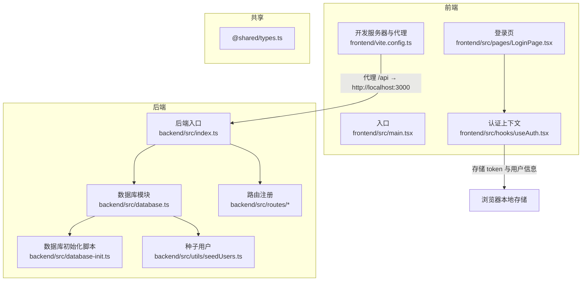
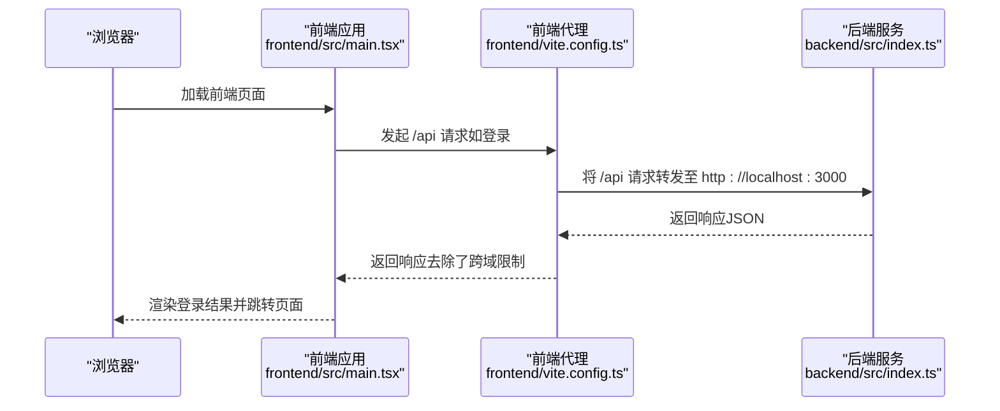

# 快速开始

<cite>
**本文引用的文件**
- [start.sh](file://start.sh)
- [start.ps1](file://start.ps1)
- [backend/package.json](file://backend/package.json)
- [frontend/package.json](file://frontend/package.json)
- [backend/src/index.ts](file://backend/src/index.ts)
- [backend/src/database.ts](file://backend/src/database.ts)
- [backend/src/database-init.ts](file://backend/src/database-init.ts)
- [backend/src/utils/seedUsers.ts](file://backend/src/utils/seedUsers.ts)
- [frontend/vite.config.ts](file://frontend/vite.config.ts)
- [frontend/src/main.tsx](file://frontend/src/main.tsx)
- [backend/src/routes/auth.ts](file://backend/src/routes/auth.ts)
- [backend/src/controllers/authController.ts](file://backend/src/controllers/authController.ts)
- [frontend/src/pages/LoginPage.tsx](file://frontend/src/pages/LoginPage.tsx)
- [frontend/src/hooks/useAuth.tsx](file://frontend/src/hooks/useAuth.tsx)
</cite>

## 目录
1. [简介](#简介)
2. [项目结构](#项目结构)
3. [前置条件](#前置条件)
4. [安装与启动](#安装与启动)
5. [开发与生产配置](#开发与生产配置)
6. [核心功能与使用示例](#核心功能与使用示例)
7. [架构概览](#架构概览)
8. [依赖关系分析](#依赖关系分析)
9. [性能与资源建议](#性能与资源建议)
10. [故障排除](#故障排除)
11. [结语](#结语)

## 简介
本指南面向首次接触“档案管理系统”的用户，帮助你在约 30 分钟内完成环境准备、系统启动与基础使用。系统采用前后端分离架构：后端基于 Node.js + Express + better-sqlite3，前端基于 React + Vite，通过本地 SQLite 数据库存储数据；提供一键启动脚本，覆盖 Linux/macOS 的 Bash 脚本与 Windows 的 PowerShell 脚本。

## 项目结构
系统由三个主要部分组成：
- 后端服务：提供认证、档案导入、OCR、状态流转等接口
- 前端应用：提供登录、导入、查询、审核、归档等功能页面
- 共享类型：前后端共享的数据类型定义

图表来源
- [backend/src/index.ts:1-39](file://backend/src/index.ts#L1-L39)
- [backend/src/database.ts:1-87](file://backend/src/database.ts#L1-L87)
- [backend/src/database-init.ts:1-65](file://backend/src/database-init.ts#L1-L65)
- [backend/src/utils/seedUsers.ts:1-20](file://backend/src/utils/seedUsers.ts#L1-L20)
- [frontend/src/main.tsx:1-18](file://frontend/src/main.tsx#L1-L18)
- [frontend/vite.config.ts:1-22](file://frontend/vite.config.ts#L1-L22)
- [frontend/src/pages/LoginPage.tsx:1-81](file://frontend/src/pages/LoginPage.tsx#L1-L81)
- [frontend/src/hooks/useAuth.tsx:1-90](file://frontend/src/hooks/useAuth.tsx#L1-L90)

章节来源
- [backend/src/index.ts:1-39](file://backend/src/index.ts#L1-L39)
- [frontend/src/main.tsx:1-18](file://frontend/src/main.tsx#L1-L18)

## 前置条件
- 操作系统：支持 Linux、macOS、Windows
- Node.js 版本：请确保安装 Node.js（推荐使用长期支持版本 LTS），以便正确运行后端与前端的构建与开发工具链
- 数据库：无需额外数据库服务，系统使用本地 SQLite 文件（better-sqlite3），首次启动会自动创建数据库文件与表结构
- 权限：确保当前用户对项目目录具有读写权限，以便创建数据库文件与临时构建产物

章节来源
- [backend/package.json:1-41](file://backend/package.json#L1-L41)
- [frontend/package.json:1-35](file://frontend/package.json#L1-L35)
- [backend/src/database.ts:1-87](file://backend/src/database.ts#L1-L87)

## 安装与启动
以下提供跨平台的一键启动方式，均会在本地同时启动后端与前端服务：

- Linux/macOS
  - 使用脚本：在仓库根目录执行启动脚本
  - 后端默认监听端口：3000
  - 前端默认监听端口：5173
  - 脚本会自动启动两个子进程，并在终端输出访问地址与测试账号信息
  - 停止服务：在终端按 Ctrl+C，脚本会统一终止两个子进程

- Windows
  - 使用脚本：在仓库根目录以 PowerShell 运行启动脚本
  - 脚本会在新 PowerShell 窗口中分别启动后端与前端
  - 后端默认监听端口：3000
  - 前端默认监听端口：5173
  - 脚本会输出访问地址与测试账号信息

启动后，打开浏览器访问前端地址即可进入系统。

章节来源
- [start.sh:1-35](file://start.sh#L1-L35)
- [start.ps1:1-29](file://start.ps1#L1-L29)
- [backend/src/index.ts:14-36](file://backend/src/index.ts#L14-L36)
- [frontend/vite.config.ts:13-21](file://frontend/vite.config.ts#L13-L21)

## 开发与生产配置
- 开发模式
  - 后端：使用 TypeScript 源码直接运行，便于调试
  - 前端：Vite 提供热更新与代理，代理规则将 /api 请求转发至后端 3000 端口
  - 代理配置：前端开发服务器通过代理解决跨域问题

- 生产模式
  - 后端：先编译 TypeScript 到 JavaScript，再以 Node.js 运行生成的 dist 包
  - 前端：先进行类型检查，再打包构建，产出静态资源
  - 数据库：生产环境仍使用本地 SQLite 文件，无需额外数据库服务

章节来源
- [backend/package.json:6-12](file://backend/package.json#L6-L12)
- [frontend/package.json:6-11](file://frontend/package.json#L6-L11)
- [frontend/vite.config.ts:13-21](file://frontend/vite.config.ts#L13-L21)

## 核心功能与使用示例
- 登录与角色
  - 系统内置测试账号（密码均为 123456）：运营人员、分支机构（上海营业部）、综合部
  - 登录后会根据角色跳转到对应的默认首页

- 前端页面与路由
  - 登录页：输入用户名与密码进行登录
  - 导入页：支持导入相关业务数据
  - 查询与审核：支持档案记录的查询与审核流程
  - 归档与 OCR：支持档案归档与 OCR 文字识别相关操作
  - 发运页：支持档案发运相关流程

- 后端接口
  - 认证接口：登录与获取当前用户信息
  - 档案接口：档案导入、查询、状态流转等
  - OCR 接口：OCR 相关处理

- 数据库初始化
  - 首次启动时会自动创建数据库文件与表结构，并插入种子用户

章节来源
- [frontend/src/pages/LoginPage.tsx:10-22](file://frontend/src/pages/LoginPage.tsx#L10-L22)
- [frontend/src/pages/LoginPage.tsx:36-59](file://frontend/src/pages/LoginPage.tsx#L36-L59)
- [backend/src/routes/auth.ts:12-16](file://backend/src/routes/auth.ts#L12-L16)
- [backend/src/controllers/authController.ts:16-43](file://backend/src/controllers/authController.ts#L16-L43)
- [backend/src/database.ts:25-52](file://backend/src/database.ts#L25-L52)
- [backend/src/database-init.ts:8-64](file://backend/src/database-init.ts#L8-L64)
- [backend/src/utils/seedUsers.ts:11-19](file://backend/src/utils/seedUsers.ts#L11-L19)

## 架构概览
系统采用前后端分离架构，前端通过代理访问后端 API，后端使用 better-sqlite3 管理本地 SQLite 数据库。

图表来源
- [frontend/src/main.tsx:1-18](file://frontend/src/main.tsx#L1-L18)
- [frontend/vite.config.ts:13-21](file://frontend/vite.config.ts#L13-L21)
- [backend/src/index.ts:14-36](file://backend/src/index.ts#L14-L36)

## 依赖关系分析
- 后端依赖
  - Web 框架：Express
  - 数据库：better-sqlite3（本地 SQLite）
  - 认证：jsonwebtoken（JWT）
  - 工具：bcryptjs（密码加密）、uuid（生成 ID）、multer（文件上传）、xlsx（Excel 处理）
  - 开发工具：TypeScript、ts-node、Vitest（测试）

- 前端依赖
  - 框架：React、React Router DOM
  - UI：Ant Design（Antd）
  - 网络：Axios
  - 构建：Vite、TypeScript、ESLint

- 代理与路由
  - 前端开发服务器通过代理将 /api 请求转发至后端 3000 端口
  - 后端注册认证、档案、OCR 等路由

章节来源
- [backend/package.json:14-39](file://backend/package.json#L14-L39)
- [frontend/package.json:12-33](file://frontend/package.json#L12-L33)
- [frontend/vite.config.ts:13-21](file://frontend/vite.config.ts#L13-L21)
- [backend/src/routes/auth.ts:1-19](file://backend/src/routes/auth.ts#L1-L19)

## 性能与资源建议
- SQLite 适合小中型数据量与单机部署，若并发较高或需要更强扩展性，可考虑迁移到关系型数据库（需调整后端适配层）
- 建议在开发阶段使用默认 WAL 模式与外键约束，以获得更好的并发与数据一致性
- 前端开发服务器仅用于本地开发，生产环境应使用构建后的静态资源

[本节为通用建议，不涉及具体文件分析]

## 故障排除
- 启动后端或前端报错
  - 确认 Node.js 版本满足要求
  - 在后端与前端目录分别执行安装依赖命令，确保 node_modules 正常
  - 若端口被占用，可在后端入口中修改监听端口

- 登录失败或提示未认证
  - 确认后端已启动且健康（可通过健康检查接口确认）
  - 确认前端代理已正确转发 /api 请求至后端 3000 端口
  - 检查浏览器控制台是否有跨域或网络错误

- 数据库相关问题
  - 首次启动会自动创建数据库文件与表结构；若出现权限问题，请检查项目目录写入权限
  - 如需重置数据，可删除本地数据库文件后重启服务，系统会重新初始化

- Windows 启动脚本无法执行
  - 确保以管理员身份运行 PowerShell 或调整执行策略
  - 脚本会在新窗口中分别启动后端与前端，注意查看新窗口输出

章节来源
- [backend/src/index.ts:28-35](file://backend/src/index.ts#L28-L35)
- [frontend/vite.config.ts:13-21](file://frontend/vite.config.ts#L13-L21)
- [backend/src/database.ts:32-52](file://backend/src/database.ts#L32-L52)
- [start.ps1:1-29](file://start.ps1#L1-L29)

## 结语
按照本指南，你可以在 30 分钟内完成环境准备、系统启动与基础使用。若需进一步定制开发或部署到生产环境，可参考各模块的配置文件与脚本，按需调整端口、代理与构建流程。