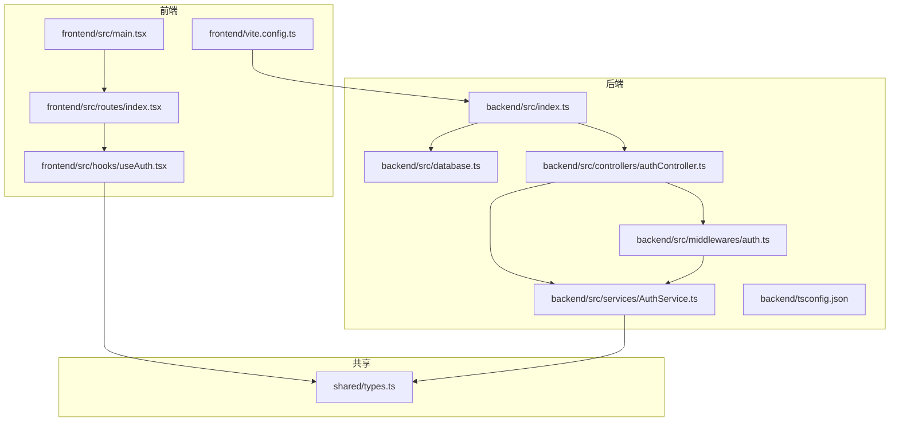
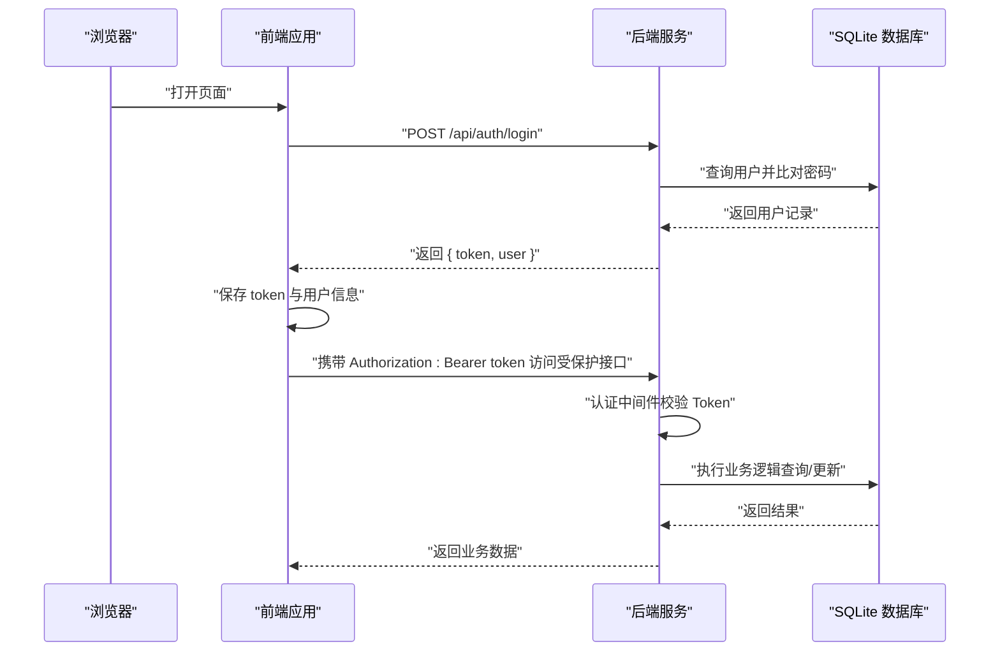
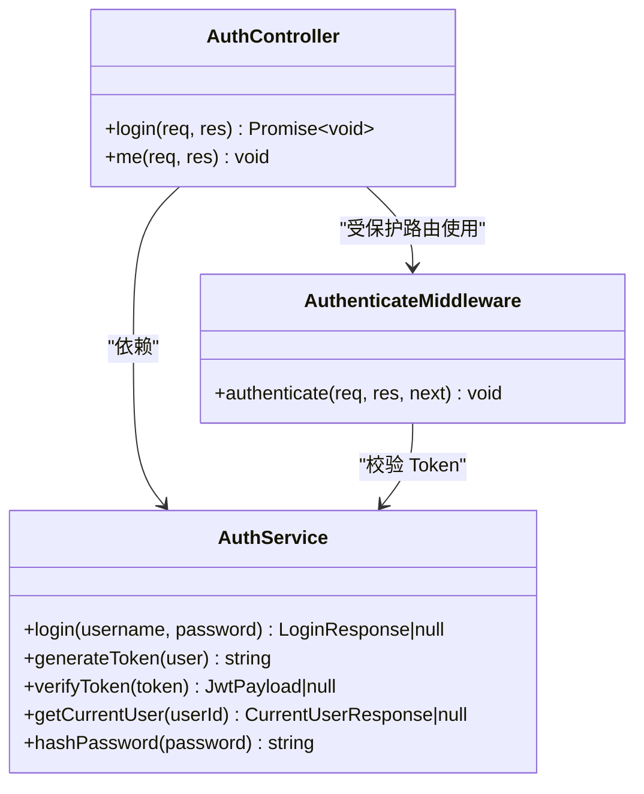
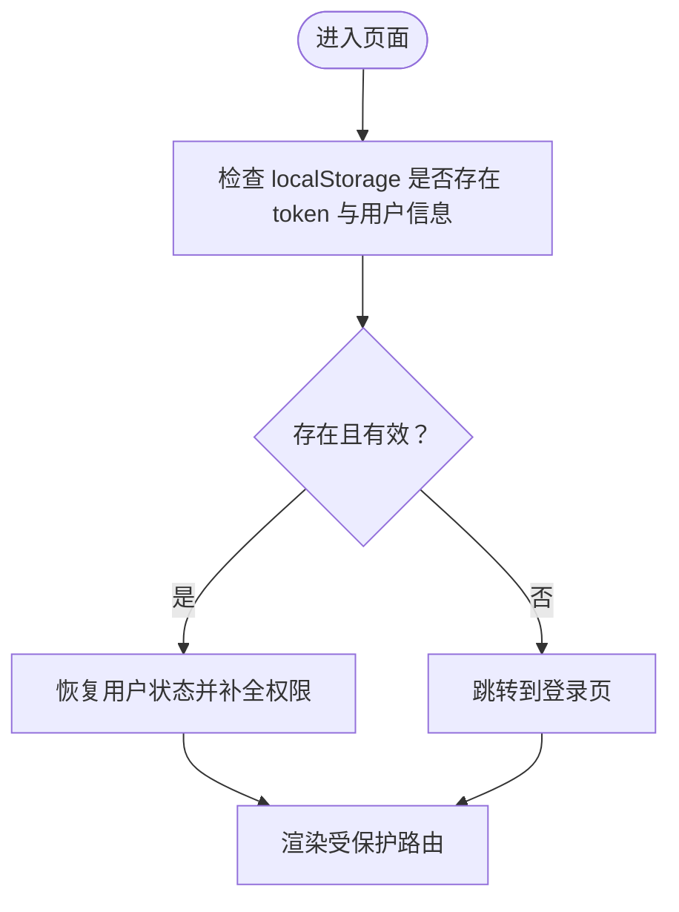
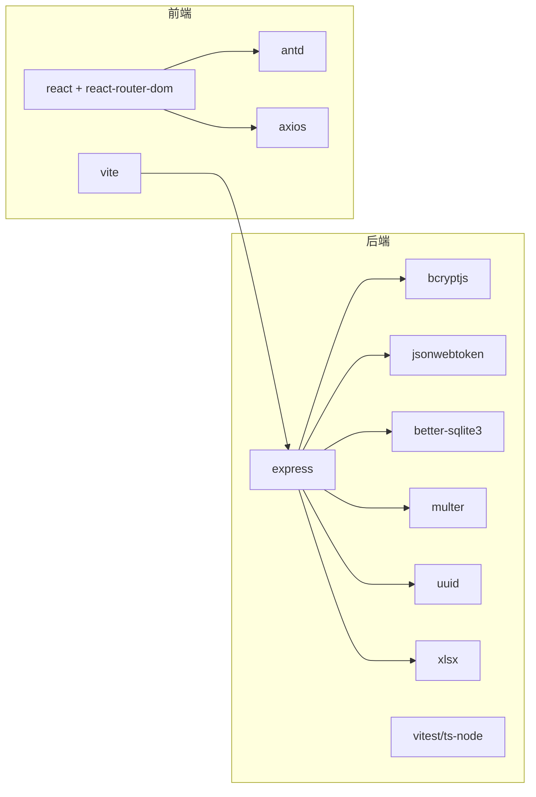

# 技术栈概览

<cite>
**本文引用的文件**
- [backend/package.json](file://backend/package.json)
- [frontend/package.json](file://frontend/package.json)
- [backend/tsconfig.json](file://backend/tsconfig.json)
- [frontend/tsconfig.json](file://frontend/tsconfig.json)
- [backend/src/index.ts](file://backend/src/index.ts)
- [frontend/src/main.tsx](file://frontend/src/main.tsx)
- [backend/vitest.config.ts](file://backend/vitest.config.ts)
- [frontend/vite.config.ts](file://frontend/vite.config.ts)
- [backend/src/database.ts](file://backend/src/database.ts)
- [frontend/src/routes/index.tsx](file://frontend/src/routes/index.tsx)
- [shared/types.ts](file://shared/types.ts)
- [backend/src/controllers/authController.ts](file://backend/src/controllers/authController.ts)
- [backend/src/services/AuthService.ts](file://backend/src/services/AuthService.ts)
- [frontend/src/hooks/useAuth.tsx](file://frontend/src/hooks/useAuth.tsx)
- [backend/src/middlewares/auth.ts](file://backend/src/middlewares/auth.ts)
</cite>

## 目录
1. [简介](#简介)
2. [项目结构](#项目结构)
3. [核心组件](#核心组件)
4. [架构总览](#架构总览)
5. [详细组件分析](#详细组件分析)
6. [依赖关系分析](#依赖关系分析)
7. [性能考量](#性能考量)
8. [故障排查指南](#故障排查指南)
9. [结论](#结论)
10. [附录](#附录)

## 简介
本文件为“文件管理系统”的技术栈概览文档，系统性介绍后端 Node.js + Express + TypeScript 技术组合与前端 React 19 + TypeScript + Vite 技术栈的整体架构与实现要点。文档覆盖核心依赖库的作用与选型理由、版本兼容性与升级路径建议、关键概念解释（如 TypeScript 类型系统、React 组件化开发、Express 中间件机制），并提供面向初学者的入门级说明。

## 项目结构
该项目采用前后端分离架构，后端位于 backend 目录，前端位于 frontend 目录，共享类型定义位于 shared/types.ts，便于前后端统一数据契约。

- 后端采用 Express 框架，使用 TypeScript 编写，通过 better-sqlite3 访问 SQLite 数据库，提供 REST 接口。
- 前端采用 React 19，使用 TypeScript 与 Vite 构建，通过 axios 与后端交互，使用 antd 作为 UI 组件库。
- 通过 Vite 的代理能力将 /api 前缀转发至后端本地服务，实现跨域开发调试。

图表来源
- [frontend/src/main.tsx:1-18](file://frontend/src/main.tsx#L1-L18)
- [frontend/src/routes/index.tsx:1-98](file://frontend/src/routes/index.tsx#L1-L98)
- [frontend/src/hooks/useAuth.tsx:1-90](file://frontend/src/hooks/useAuth.tsx#L1-L90)
- [frontend/vite.config.ts:1-22](file://frontend/vite.config.ts#L1-L22)
- [backend/src/index.ts:1-39](file://backend/src/index.ts#L1-L39)
- [backend/src/database.ts:1-87](file://backend/src/database.ts#L1-L87)
- [backend/src/controllers/authController.ts:1-77](file://backend/src/controllers/authController.ts#L1-L77)
- [backend/src/services/AuthService.ts:1-126](file://backend/src/services/AuthService.ts#L1-L126)
- [backend/src/middlewares/auth.ts:1-56](file://backend/src/middlewares/auth.ts#L1-L56)
- [shared/types.ts:1-289](file://shared/types.ts#L1-L289)

章节来源
- [backend/src/index.ts:1-39](file://backend/src/index.ts#L1-L39)
- [frontend/src/main.tsx:1-18](file://frontend/src/main.tsx#L1-L18)
- [frontend/vite.config.ts:1-22](file://frontend/vite.config.ts#L1-L22)
- [backend/src/database.ts:1-87](file://backend/src/database.ts#L1-L87)
- [frontend/src/routes/index.tsx:1-98](file://frontend/src/routes/index.tsx#L1-L98)
- [shared/types.ts:1-289](file://shared/types.ts#L1-L289)

## 核心组件
- 后端入口与路由注册：后端在入口文件中初始化 Express、CORS、JSON 解析、数据库与种子用户，随后注册认证、档案、OCR 三类路由，并提供健康检查接口。
- 数据层：通过 better-sqlite3 实现数据库连接单例，启用 WAL 模式与外键约束，首次访问自动初始化表结构。
- 认证与授权：后端提供登录接口与当前用户信息接口；认证中间件从请求头解析 Bearer Token 并注入用户信息；服务层负责密码比对与 JWT 签发；前端通过自定义 Hook 管理登录态与权限。
- 前端路由与布局：使用 React Router v7 的 createBrowserRouter，结合受保护路由组件实现基于角色的权限控制；通过 Ant Design 提供 UI 组件与主题样式。

章节来源
- [backend/src/index.ts:14-36](file://backend/src/index.ts#L14-L36)
- [backend/src/database.ts:25-52](file://backend/src/database.ts#L25-L52)
- [backend/src/controllers/authController.ts:16-43](file://backend/src/controllers/authController.ts#L16-L43)
- [backend/src/middlewares/auth.ts:26-55](file://backend/src/middlewares/auth.ts#L26-L55)
- [backend/src/services/AuthService.ts:43-65](file://backend/src/services/AuthService.ts#L43-L65)
- [frontend/src/routes/index.tsx:21-97](file://frontend/src/routes/index.tsx#L21-L97)
- [frontend/src/hooks/useAuth.tsx:34-80](file://frontend/src/hooks/useAuth.tsx#L34-L80)

## 架构总览
下图展示了前后端交互与认证流程的关键节点，体现从浏览器到后端数据库的完整链路。

图表来源
- [frontend/src/main.tsx:1-18](file://frontend/src/main.tsx#L1-L18)
- [backend/src/controllers/authController.ts:16-43](file://backend/src/controllers/authController.ts#L16-L43)
- [backend/src/middlewares/auth.ts:26-55](file://backend/src/middlewares/auth.ts#L26-L55)
- [backend/src/database.ts:25-52](file://backend/src/database.ts#L25-L52)

## 详细组件分析

### 后端入口与路由注册
- 初始化 Express、CORS、JSON 解析。
- 通过数据库模块创建/获取数据库实例并执行初始化脚本。
- 注册认证、档案、OCR 路由。
- 提供健康检查接口，监听端口并输出提示信息。

章节来源
- [backend/src/index.ts:14-36](file://backend/src/index.ts#L14-L36)

### 数据库模块（better-sqlite3）
- 单例模式管理数据库连接，避免重复连接。
- 自动创建数据库目录与文件，启用 WAL 模式与外键约束。
- 支持测试专用的独立连接（可选内存数据库）。

章节来源
- [backend/src/database.ts:25-52](file://backend/src/database.ts#L25-L52)
- [backend/src/database.ts:71-86](file://backend/src/database.ts#L71-L86)

### 认证控制器与服务
- 控制器：处理登录与当前用户信息接口，进行基础参数校验与错误处理。
- 服务：封装 JWT 签发与校验、密码哈希与比对、角色到权限映射、用户信息查询。
- 中间件：从 Authorization 头提取 Bearer Token，校验后将用户信息注入请求上下文。

图表来源
- [backend/src/controllers/authController.ts:16-76](file://backend/src/controllers/authController.ts#L16-L76)
- [backend/src/services/AuthService.ts:43-125](file://backend/src/services/AuthService.ts#L43-L125)
- [backend/src/middlewares/auth.ts:26-55](file://backend/src/middlewares/auth.ts#L26-L55)

章节来源
- [backend/src/controllers/authController.ts:16-76](file://backend/src/controllers/authController.ts#L16-L76)
- [backend/src/services/AuthService.ts:43-125](file://backend/src/services/AuthService.ts#L43-L125)
- [backend/src/middlewares/auth.ts:26-55](file://backend/src/middlewares/auth.ts#L26-L55)

### 前端路由与认证上下文
- 路由：使用 React Router v7 的 createBrowserRouter，按角色划分子路由，统一使用受保护路由包装。
- 认证上下文：提供登录、登出、持久化存储（localStorage）、权限计算与暴露给组件使用。

图表来源
- [frontend/src/routes/index.tsx:21-97](file://frontend/src/routes/index.tsx#L21-L97)
- [frontend/src/hooks/useAuth.tsx:39-79](file://frontend/src/hooks/useAuth.tsx#L39-L79)

章节来源
- [frontend/src/routes/index.tsx:21-97](file://frontend/src/routes/index.tsx#L21-L97)
- [frontend/src/hooks/useAuth.tsx:34-80](file://frontend/src/hooks/useAuth.tsx#L34-L80)

### 共享类型定义
- 定义用户角色、状态枚举、权限集合、API 请求/响应接口等，确保前后端一致的数据契约。
- 包含主流程状态、归档状态、状态流转动作等业务关键枚举与接口。

章节来源
- [shared/types.ts:8-289](file://shared/types.ts#L8-L289)

## 依赖关系分析
- 后端依赖
  - Express：Web 框架，提供路由与中间件机制。
  - better-sqlite3：高性能 SQLite 驱动，适合中小型项目与开发环境。
  - bcryptjs：密码哈希与校验。
  - jsonwebtoken：JWT 令牌签发与校验。
  - multer：文件上传（如导入 Excel）。
  - uuid/xlsx：通用工具与 Excel 处理。
  - Vitest + ts-node：测试与构建工具链。
- 前端依赖
  - React 19 + react-router-dom：组件化与路由管理。
  - antd：企业级 UI 组件库。
  - axios：HTTP 客户端。
  - Vite：构建与开发服务器，配合代理解决跨域问题。

图表来源
- [backend/package.json:14-39](file://backend/package.json#L14-L39)
- [frontend/package.json:12-33](file://frontend/package.json#L12-L33)

章节来源
- [backend/package.json:14-39](file://backend/package.json#L14-L39)
- [frontend/package.json:12-33](file://frontend/package.json#L12-L33)

## 性能考量
- 数据库层面
  - WAL 模式提升并发读写性能，适合多用户并发场景。
  - 外键约束保证数据一致性，减少脏数据风险。
- 服务层面
  - 认证中间件仅做 Token 校验与注入，避免重复查询用户信息。
  - 前端登录态持久化于 localStorage，减少重复登录成本。
- 构建与测试
  - Vite 提供快速冷启动与热更新，提升开发体验。
  - Vitest 配置包含覆盖率统计，有助于持续改进质量。

章节来源
- [backend/src/database.ts:41-45](file://backend/src/database.ts#L41-L45)
- [backend/src/middlewares/auth.ts:26-55](file://backend/src/middlewares/auth.ts#L26-L55)
- [frontend/src/hooks/useAuth.tsx:39-79](file://frontend/src/hooks/useAuth.tsx#L39-L79)
- [frontend/vite.config.ts:13-20](file://frontend/vite.config.ts#L13-L20)
- [backend/vitest.config.ts:14-18](file://backend/vitest.config.ts#L14-L18)

## 故障排查指南
- 启动失败
  - 检查后端端口占用与数据库文件权限。
  - 确认环境变量 JWT_SECRET 是否设置（若未设置，服务会使用默认密钥）。
- 认证失败
  - 确认请求头 Authorization 是否为 Bearer Token 格式。
  - 校验 Token 是否过期或被篡改。
  - 检查用户是否存在且密码正确。
- 跨域与代理
  - 确认 Vite 代理配置指向后端地址。
  - 浏览器网络面板查看 /api 请求是否被代理到后端。
- 数据库初始化
  - 首次启动会自动创建数据库文件与表结构，若失败请检查目录权限与磁盘空间。

章节来源
- [backend/src/index.ts:32-35](file://backend/src/index.ts#L32-L35)
- [backend/src/middlewares/auth.ts:26-55](file://backend/src/middlewares/auth.ts#L26-L55)
- [frontend/vite.config.ts:14-19](file://frontend/vite.config.ts#L14-L19)
- [backend/src/database.ts:32-48](file://backend/src/database.ts#L32-L48)

## 结论
该技术栈以“轻量、清晰、易维护”为目标：后端使用 Express + TypeScript + better-sqlite3，具备良好的开发效率与性能表现；前端采用 React 19 + TypeScript + Vite，结合 antd 提供一致的用户体验。通过共享类型定义与严格的中间件/权限控制，系统在可扩展性与安全性方面具备良好基础。建议后续根据业务增长逐步引入缓存、分布式锁与更完善的监控体系。

## 附录

### 版本兼容性与升级路径
- Node.js 与包管理器
  - 使用 npm/yarn/pnpm 时，请确保 Node.js 版本满足各包的最低要求。
- 后端
  - Express 4.x：保持与 Node.js LTS 兼容。
  - TypeScript 5.x：注意严格模式下的编译选项与类型推断变化。
  - better-sqlite3 12.x：注意原生模块编译与不同平台的二进制兼容。
  - jsonwebtoken 9.x：注意密钥长度与算法变更策略。
- 前端
  - React 19：关注新特性与废弃 API 的迁移。
  - Vite 8.x：留意插件生态与配置项的演进。
  - antd 6.x：遵循设计规范与组件 API 的更新。
- 升级建议
  - 采用分阶段升级策略，先在开发环境验证，再在测试环境灰度。
  - 利用类型系统与单元测试尽早发现兼容性问题。

章节来源
- [backend/package.json:14-39](file://backend/package.json#L14-L39)
- [frontend/package.json:12-33](file://frontend/package.json#L12-L33)
- [backend/tsconfig.json:2-11](file://backend/tsconfig.json#L2-L11)
- [frontend/tsconfig.json:1-8](file://frontend/tsconfig.json#L1-L8)

### 关键技术概念入门（面向初学者）
- TypeScript 类型系统
  - 通过接口与枚举定义数据结构，提供编译期类型检查，降低运行时错误。
  - 在共享类型文件中集中定义，前后端复用，避免数据契约不一致。
- React 组件化开发
  - 页面与功能拆分为可复用组件，通过 props 传递数据，通过状态管理处理交互。
  - 使用 React Router 进行页面级导航，结合受保护路由实现权限控制。
- Express 中间件机制
  - 中间件是请求/响应的处理器函数，可实现认证、日志、错误处理等功能。
  - 认证中间件从请求头提取 Token 并校验，通过后将用户信息注入请求对象，供后续路由使用。

章节来源
- [shared/types.ts:46-83](file://shared/types.ts#L46-L83)
- [frontend/src/routes/index.tsx:30-90](file://frontend/src/routes/index.tsx#L30-L90)
- [backend/src/middlewares/auth.ts:26-55](file://backend/src/middlewares/auth.ts#L26-L55)