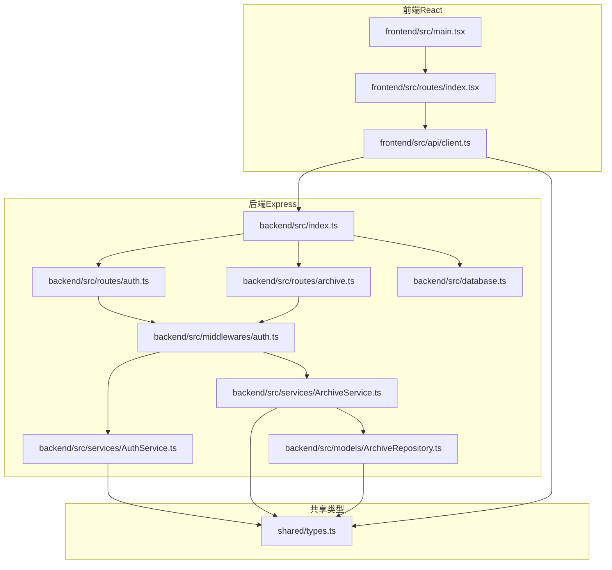
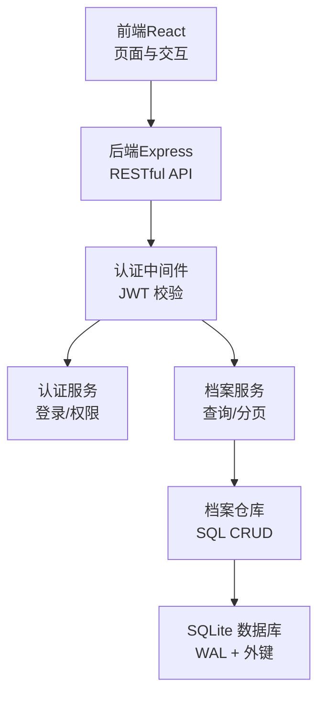
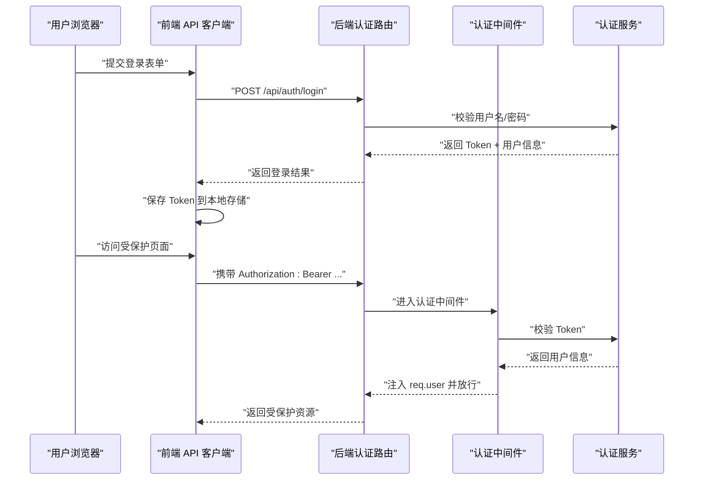
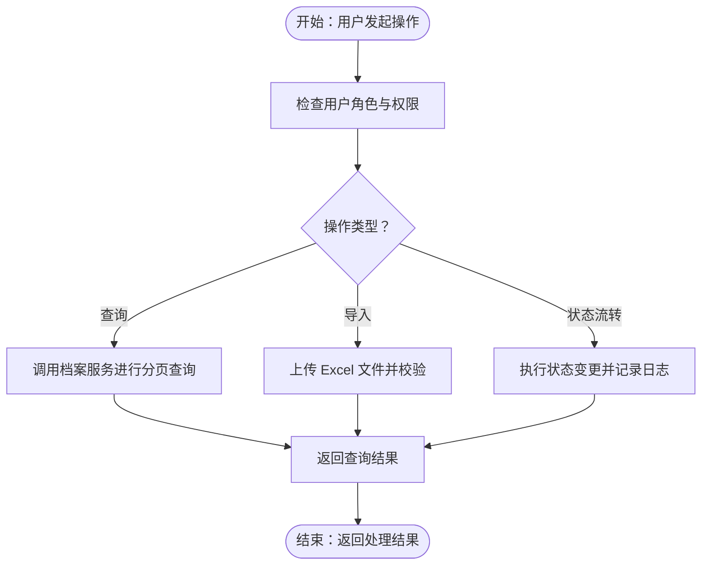
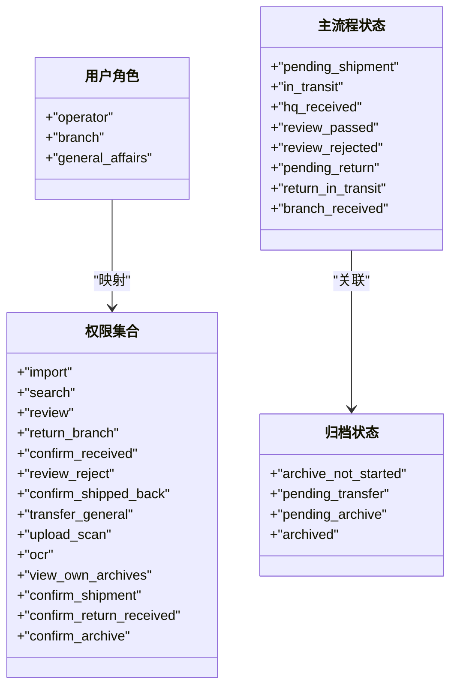
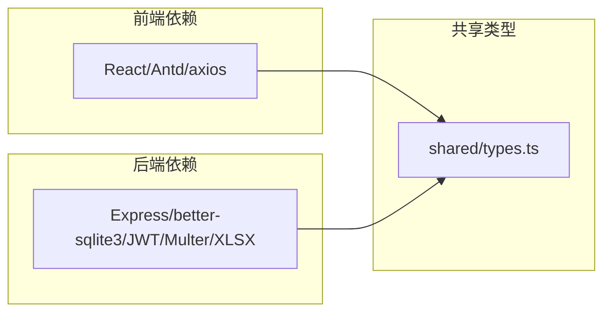

# 系统总览

<cite>
**本文引用的文件**
- [backend/package.json](file://backend/package.json)
- [frontend/package.json](file://frontend/package.json)
- [backend/src/index.ts](file://backend/src/index.ts)
- [backend/src/database.ts](file://backend/src/database.ts)
- [backend/src/routes/auth.ts](file://backend/src/routes/auth.ts)
- [backend/src/controllers/authController.ts](file://backend/src/controllers/authController.ts)
- [backend/src/services/AuthService.ts](file://backend/src/services/AuthService.ts)
- [backend/src/middlewares/auth.ts](file://backend/src/middlewares/auth.ts)
- [backend/src/routes/archive.ts](file://backend/src/routes/archive.ts)
- [backend/src/models/ArchiveRepository.ts](file://backend/src/models/ArchiveRepository.ts)
- [backend/src/services/ArchiveService.ts](file://backend/src/services/ArchiveService.ts)
- [frontend/src/main.tsx](file://frontend/src/main.tsx)
- [frontend/src/api/client.ts](file://frontend/src/api/client.ts)
- [frontend/src/routes/index.tsx](file://frontend/src/routes/index.tsx)
- [shared/types.ts](file://shared/types.ts)
</cite>

## 目录
1. [引言](#引言)
2. [项目结构](#项目结构)
3. [核心组件](#核心组件)
4. [架构总览](#架构总览)
5. [详细组件分析](#详细组件分析)
6. [依赖关系分析](#依赖关系分析)
7. [性能与扩展性](#性能与扩展性)
8. [故障排查指南](#故障排查指南)
9. [结论](#结论)
10. [附录](#附录)

## 引言
本文件面向不同技术背景的读者，系统性地介绍文件管理系统的总体架构与运行机制。系统采用前后端分离设计，前端使用 React 技术栈，后端基于 Express 框架，数据持久化采用 SQLite（better-sqlite3）。系统围绕“用户登录认证—档案管理—状态流转—数据导入”等核心业务流程构建，具备清晰的三层架构：表现层（前端）、服务层（后端）、数据层（SQLite）。本文将从宏观视角阐述系统边界、通信机制、业务流程与性能特性，并提供可视化图示帮助理解。

## 项目结构
系统采用“根仓库 + 子目录”的组织方式，分别存放前端、后端与共享类型定义：
- frontend：React 前端应用，负责用户界面与交互，通过 axios 统一发起 API 请求。
- backend：Express 后端服务，提供 RESTful API，包含路由、控制器、服务层、数据访问层与中间件。
- shared：前后端共享的 TypeScript 类型定义，确保前后端契约一致。
- 根目录脚本：提供一键启动开发环境的能力。

图表来源
- [frontend/src/main.tsx:1-18](file://frontend/src/main.tsx#L1-L18)
- [frontend/src/routes/index.tsx:1-98](file://frontend/src/routes/index.tsx#L1-L98)
- [frontend/src/api/client.ts:1-55](file://frontend/src/api/client.ts#L1-L55)
- [backend/src/index.ts:1-39](file://backend/src/index.ts#L1-L39)
- [backend/src/routes/auth.ts:1-19](file://backend/src/routes/auth.ts#L1-L19)
- [backend/src/routes/archive.ts:1-42](file://backend/src/routes/archive.ts#L1-L42)
- [backend/src/middlewares/auth.ts:1-56](file://backend/src/middlewares/auth.ts#L1-L56)
- [backend/src/services/AuthService.ts:1-126](file://backend/src/services/AuthService.ts#L1-L126)
- [backend/src/services/ArchiveService.ts:1-71](file://backend/src/services/ArchiveService.ts#L1-L71)
- [backend/src/models/ArchiveRepository.ts:1-307](file://backend/src/models/ArchiveRepository.ts#L1-L307)
- [backend/src/database.ts:1-87](file://backend/src/database.ts#L1-L87)
- [shared/types.ts:1-289](file://shared/types.ts#L1-L289)

章节来源
- [backend/package.json:1-41](file://backend/package.json#L1-L41)
- [frontend/package.json:1-35](file://frontend/package.json#L1-L35)
- [backend/src/index.ts:1-39](file://backend/src/index.ts#L1-L39)
- [frontend/src/main.tsx:1-18](file://frontend/src/main.tsx#L1-L18)

## 核心组件
- 前端应用（React）
  - 路由与布局：基于 react-router-dom 的受保护路由体系，按角色展示不同页面。
  - API 客户端：基于 axios 的统一客户端，内置请求/响应拦截器，自动注入 Token 并处理 401 等错误。
- 后端服务（Express）
  - 路由层：划分认证、档案、OCR 等子路由，统一暴露 RESTful 接口。
  - 中间件：认证中间件从请求头解析并校验 JWT，失败时返回 401。
  - 服务层：封装业务逻辑，如认证服务、档案查询服务等。
  - 数据访问层：基于 better-sqlite3 的仓库类，提供 CRUD 与分页查询。
  - 数据库：SQLite 单机存储，启用 WAL 模式与外键约束，首次启动初始化表结构。
- 共享类型（shared/types.ts）
  - 定义用户角色、状态枚举、权限集合、API 请求/响应接口等，保证前后端契约一致。

章节来源
- [frontend/src/routes/index.tsx:1-98](file://frontend/src/routes/index.tsx#L1-L98)
- [frontend/src/api/client.ts:1-55](file://frontend/src/api/client.ts#L1-L55)
- [backend/src/routes/auth.ts:1-19](file://backend/src/routes/auth.ts#L1-L19)
- [backend/src/routes/archive.ts:1-42](file://backend/src/routes/archive.ts#L1-L42)
- [backend/src/middlewares/auth.ts:1-56](file://backend/src/middlewares/auth.ts#L1-L56)
- [backend/src/services/AuthService.ts:1-126](file://backend/src/services/AuthService.ts#L1-L126)
- [backend/src/services/ArchiveService.ts:1-71](file://backend/src/services/ArchiveService.ts#L1-L71)
- [backend/src/models/ArchiveRepository.ts:1-307](file://backend/src/models/ArchiveRepository.ts#L1-L307)
- [backend/src/database.ts:1-87](file://backend/src/database.ts#L1-L87)
- [shared/types.ts:1-289](file://shared/types.ts#L1-L289)

## 架构总览
系统采用三层架构与前后端分离：
- 表现层（前端 React）：负责页面渲染、用户交互与 API 调用。
- 服务层（后端 Express）：负责路由编排、权限校验、业务处理与数据访问。
- 数据层（SQLite）：持久化存储，支持并发读写优化与外键一致性。

图表来源
- [frontend/src/main.tsx:1-18](file://frontend/src/main.tsx#L1-L18)
- [backend/src/index.ts:1-39](file://backend/src/index.ts#L1-L39)
- [backend/src/middlewares/auth.ts:1-56](file://backend/src/middlewares/auth.ts#L1-L56)
- [backend/src/services/AuthService.ts:1-126](file://backend/src/services/AuthService.ts#L1-L126)
- [backend/src/services/ArchiveService.ts:1-71](file://backend/src/services/ArchiveService.ts#L1-L71)
- [backend/src/models/ArchiveRepository.ts:1-307](file://backend/src/models/ArchiveRepository.ts#L1-L307)
- [backend/src/database.ts:1-87](file://backend/src/database.ts#L1-L87)

## 详细组件分析

### 认证与授权流程
- 前端通过 axios 客户端向后端发起登录请求；登录成功后将 Token 存入本地存储并在后续请求中自动附加。
- 后端认证中间件从请求头提取 Bearer Token，调用认证服务进行校验；校验失败返回 401。
- 认证服务根据用户角色派生权限集合，供上层业务与页面进行细粒度控制。

图表来源
- [frontend/src/api/client.ts:1-55](file://frontend/src/api/client.ts#L1-L55)
- [backend/src/routes/auth.ts:1-19](file://backend/src/routes/auth.ts#L1-L19)
- [backend/src/controllers/authController.ts:1-77](file://backend/src/controllers/authController.ts#L1-L77)
- [backend/src/middlewares/auth.ts:1-56](file://backend/src/middlewares/auth.ts#L1-L56)
- [backend/src/services/AuthService.ts:1-126](file://backend/src/services/AuthService.ts#L1-L126)

章节来源
- [frontend/src/api/client.ts:1-55](file://frontend/src/api/client.ts#L1-L55)
- [backend/src/routes/auth.ts:1-19](file://backend/src/routes/auth.ts#L1-L19)
- [backend/src/controllers/authController.ts:1-77](file://backend/src/controllers/authController.ts#L1-L77)
- [backend/src/middlewares/auth.ts:1-56](file://backend/src/middlewares/auth.ts#L1-L56)
- [backend/src/services/AuthService.ts:1-126](file://backend/src/services/AuthService.ts#L1-L126)

### 档案管理与状态流转
- 档案查询：支持多条件分页查询，分支机构用户自动按所属营业部过滤。
- 档案导入：Excel 批量导入，结合权限控制与模板下载。
- 状态流转：支持单条与批量状态变更，记录状态变更历史，保障审计可追溯。

图表来源
- [backend/src/routes/archive.ts:1-42](file://backend/src/routes/archive.ts#L1-L42)
- [backend/src/services/ArchiveService.ts:1-71](file://backend/src/services/ArchiveService.ts#L1-L71)
- [backend/src/models/ArchiveRepository.ts:1-307](file://backend/src/models/ArchiveRepository.ts#L1-L307)
- [shared/types.ts:143-216](file://shared/types.ts#L143-L216)

章节来源
- [backend/src/routes/archive.ts:1-42](file://backend/src/routes/archive.ts#L1-L42)
- [backend/src/services/ArchiveService.ts:1-71](file://backend/src/services/ArchiveService.ts#L1-L71)
- [backend/src/models/ArchiveRepository.ts:1-307](file://backend/src/models/ArchiveRepository.ts#L1-L307)
- [shared/types.ts:143-216](file://shared/types.ts#L143-L216)

### 数据模型与状态枚举
系统通过共享类型定义了用户角色、状态枚举、权限集合与 API 接口，确保前后端一致性。

图表来源
- [shared/types.ts:8-102](file://shared/types.ts#L8-L102)
- [shared/types.ts:143-216](file://shared/types.ts#L143-L216)

章节来源
- [shared/types.ts:8-102](file://shared/types.ts#L8-L102)
- [shared/types.ts:143-216](file://shared/types.ts#L143-L216)

## 依赖关系分析
- 前端依赖
  - React 生态：react、react-router-dom、antd 等。
  - HTTP 客户端：axios。
- 后端依赖
  - Web 框架：express。
  - 数据库：better-sqlite3。
  - 安全与工具：bcryptjs（密码哈希）、jsonwebtoken（JWT）、multer（文件上传）、uuid（ID 生成）、xlsx（Excel 处理）。
- 共享类型
  - 前后端通过 shared/types.ts 统一类型定义，避免接口漂移。

图表来源
- [frontend/package.json:1-35](file://frontend/package.json#L1-L35)
- [backend/package.json:1-41](file://backend/package.json#L1-L41)
- [shared/types.ts:1-289](file://shared/types.ts#L1-L289)

章节来源
- [frontend/package.json:1-35](file://frontend/package.json#L1-L35)
- [backend/package.json:1-41](file://backend/package.json#L1-L41)
- [shared/types.ts:1-289](file://shared/types.ts#L1-L289)

## 性能与扩展性
- 性能特点
  - 数据库：启用 WAL 模式以提升并发读写性能；开启外键约束保障数据一致性。
  - 传输：后端提供健康检查接口，便于容器化部署与负载均衡探测。
  - 前端：统一拦截器减少重复逻辑，提升用户体验与错误处理一致性。
- 扩展性考虑
  - 模块化：路由、中间件、服务、仓库职责清晰，便于新增功能与维护。
  - 权限与角色：通过角色-权限映射实现细粒度访问控制，适配未来权限扩展。
  - 数据层：SQLite 适合中小规模数据与快速迭代；若业务增长，可评估迁移到关系型数据库或引入缓存层。

章节来源
- [backend/src/database.ts:1-87](file://backend/src/database.ts#L1-L87)
- [backend/src/index.ts:28-30](file://backend/src/index.ts#L28-L30)
- [frontend/src/api/client.ts:1-55](file://frontend/src/api/client.ts#L1-L55)

## 故障排查指南
- 常见问题与定位
  - 401 未认证：检查前端是否正确保存 Token，请求头是否包含 Authorization；确认后端 JWT 密钥与过期策略配置。
  - 403 权限不足：检查用户角色与权限映射，确认页面/接口的受保护配置。
  - 400/409 业务错误：查看后端返回的错误码与消息，结合前端提示进行修正。
  - 数据库初始化失败：确认数据目录可写、WAL 与外键配置生效。
- 建议流程
  - 在前端拦截器中捕获 401，清空本地凭证并跳转登录页。
  - 在后端中间件中集中校验 Token，失败时返回标准错误格式。
  - 在服务层对关键业务（导入、状态流转）增加日志与异常捕获，便于追踪。

章节来源
- [frontend/src/api/client.ts:19-52](file://frontend/src/api/client.ts#L19-L52)
- [backend/src/middlewares/auth.ts:26-55](file://backend/src/middlewares/auth.ts#L26-L55)
- [backend/src/controllers/authController.ts:16-43](file://backend/src/controllers/authController.ts#L16-L43)

## 结论
本系统以清晰的三层架构与前后端分离设计，实现了从用户认证到档案管理、状态流转与数据导入的完整业务闭环。通过共享类型定义与中间件统一校验，系统在可维护性与一致性方面具备良好基础。SQLite 的轻量化与 WAL 优化满足初期性能需求；随着业务发展，可在保持现有接口稳定性的前提下平滑演进至更高性能的数据层方案。

## 附录
- 系统边界与外部集成点
  - 内部：前端、后端、SQLite 数据库。
  - 外部：Excel 文件（导入/导出）、OCR 服务（预留路由）。
- 启动与运行
  - 后端：启动时初始化数据库与种子用户，注册路由并监听端口。
  - 前端：通过 Vite 开发服务器运行，生产环境构建后由后端静态资源提供。

章节来源
- [backend/src/index.ts:20-36](file://backend/src/index.ts#L20-L36)
- [backend/src/database.ts:25-52](file://backend/src/database.ts#L25-L52)
- [frontend/src/main.tsx:1-18](file://frontend/src/main.tsx#L1-L18)