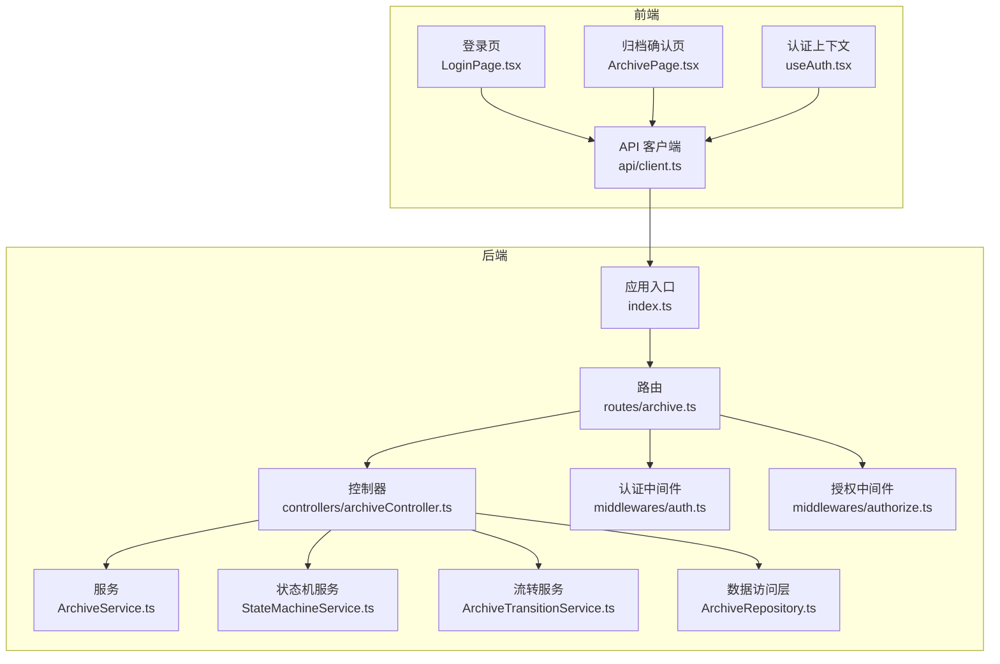
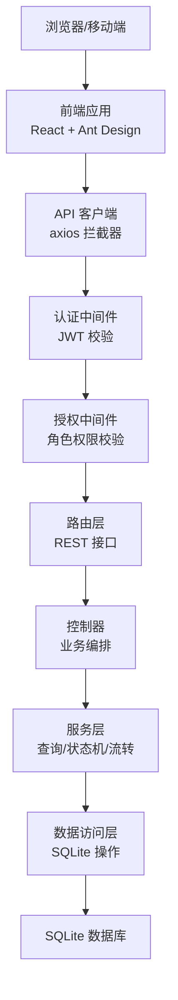
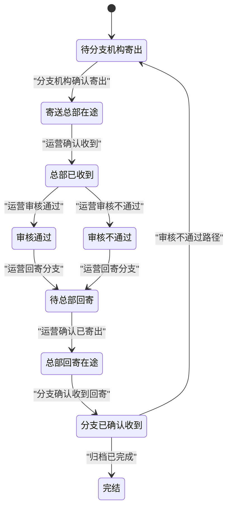
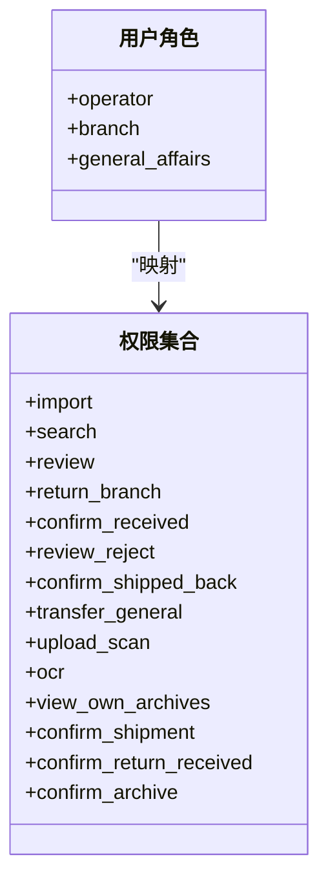
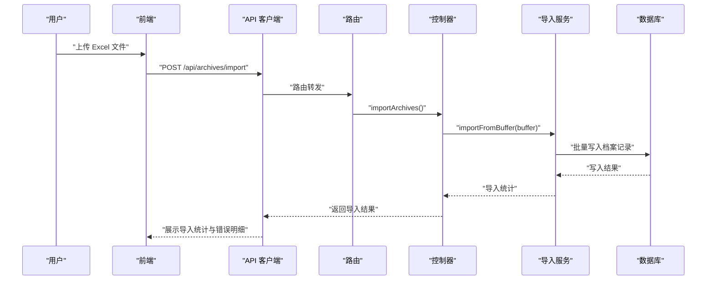
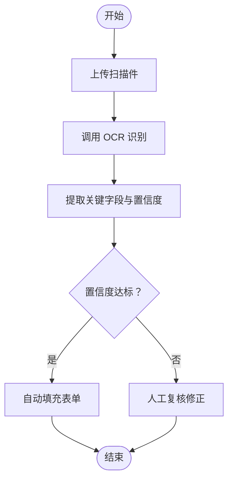
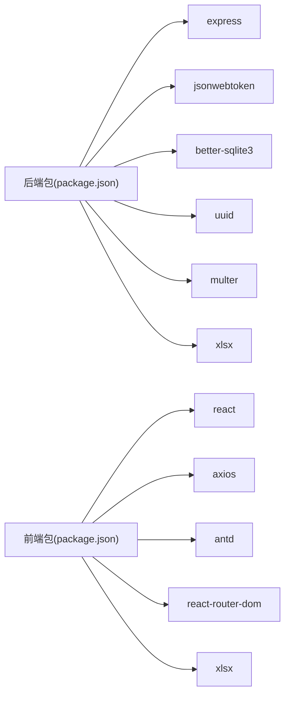

# 项目介绍

<cite>
**本文引用的文件**
- [backend/src/index.ts](file://backend/src/index.ts)
- [shared/types.ts](file://shared/types.ts)
- [backend/src/models/ArchiveRepository.ts](file://backend/src/models/ArchiveRepository.ts)
- [backend/src/services/ArchiveService.ts](file://backend/src/services/ArchiveService.ts)
- [backend/src/controllers/archiveController.ts](file://backend/src/controllers/archiveController.ts)
- [backend/src/services/StateMachineService.ts](file://backend/src/services/StateMachineService.ts)
- [backend/src/services/ArchiveTransitionService.ts](file://backend/src/services/ArchiveTransitionService.ts)
- [backend/src/middlewares/auth.ts](file://backend/src/middlewares/auth.ts)
- [backend/src/middlewares/authorize.ts](file://backend/src/middlewares/authorize.ts)
- [backend/src/routes/archive.ts](file://backend/src/routes/archive.ts)
- [backend/package.json](file://backend/package.json)
- [frontend/src/pages/ArchivePage.tsx](file://frontend/src/pages/ArchivePage.tsx)
- [frontend/src/pages/LoginPage.tsx](file://frontend/src/pages/LoginPage.tsx)
- [frontend/src/hooks/useAuth.tsx](file://frontend/src/hooks/useAuth.tsx)
- [frontend/src/api/client.ts](file://frontend/src/api/client.ts)
- [frontend/package.json](file://frontend/package.json)
</cite>

## 目录
1. [引言](#引言)
2. [项目结构](#项目结构)
3. [核心组件](#核心组件)
4. [架构总览](#架构总览)
5. [详细组件分析](#详细组件分析)
6. [依赖关系分析](#依赖关系分析)
7. [性能考虑](#性能考虑)
8. [故障排查指南](#故障排查指南)
9. [结论](#结论)
10. [附录](#附录)

## 引言
本项目是一套面向金融机构分支机构与运营综合部门的“档案管理系统”，旨在以数字化手段高效管理纸质与电子两类合同的全生命周期。系统通过状态机驱动的业务流程、严格的多角色权限控制、OCR智能识别与Excel批量导入能力，实现从“分支机构寄送—总部审核—回寄—综合部归档”的闭环管理，并对电子合同提供“创建即完结”的快速通道。

系统的核心价值在于：
- 解决纸质合同管理效率低、易丢失、跨部门协同困难的问题；
- 通过状态机确保流程合规与可追溯；
- 降低人工录入与重复劳动，提升整体运营效率；
- 为管理层提供可视化统计与审计依据。

## 项目结构
系统采用前后端分离架构：
- 后端基于 Express + TypeScript，使用 better-sqlite3 作为本地数据库，提供 REST API；
- 前端基于 React + Ant Design，通过 axios 统一客户端与后端交互；
- 共享类型定义位于 shared/types.ts，保证前后端数据契约一致；
- 通过中间件实现认证与授权，路由层统一暴露业务接口。

图表来源
- [backend/src/index.ts:1-39](file://backend/src/index.ts#L1-L39)
- [backend/src/routes/archive.ts:1-42](file://backend/src/routes/archive.ts#L1-L42)
- [backend/src/controllers/archiveController.ts:1-448](file://backend/src/controllers/archiveController.ts#L1-L448)
- [backend/src/services/ArchiveService.ts:1-71](file://backend/src/services/ArchiveService.ts#L1-L71)
- [backend/src/services/StateMachineService.ts:1-253](file://backend/src/services/StateMachineService.ts#L1-L253)
- [backend/src/services/ArchiveTransitionService.ts:1-156](file://backend/src/services/ArchiveTransitionService.ts#L1-L156)
- [backend/src/models/ArchiveRepository.ts:1-307](file://backend/src/models/ArchiveRepository.ts#L1-L307)
- [backend/src/middlewares/auth.ts:1-56](file://backend/src/middlewares/auth.ts#L1-L56)
- [backend/src/middlewares/authorize.ts:1-47](file://backend/src/middlewares/authorize.ts#L1-L47)
- [frontend/src/pages/LoginPage.tsx:1-81](file://frontend/src/pages/LoginPage.tsx#L1-L81)
- [frontend/src/pages/ArchivePage.tsx:1-181](file://frontend/src/pages/ArchivePage.tsx#L1-L181)
- [frontend/src/api/client.ts:1-55](file://frontend/src/api/client.ts#L1-L55)
- [frontend/src/hooks/useAuth.tsx:1-90](file://frontend/src/hooks/useAuth.tsx#L1-L90)

章节来源
- [backend/src/index.ts:1-39](file://backend/src/index.ts#L1-L39)
- [backend/package.json:1-41](file://backend/package.json#L1-L41)
- [frontend/package.json:1-35](file://frontend/package.json#L1-L35)

## 核心组件
- 共享类型与枚举：统一定义用户角色、合同版本类型、主流程状态、归档子状态、状态流转动作、权限集合以及各接口的数据结构，确保前后端一致性与强约束。
- 数据访问层（ArchiveRepository）：封装档案记录的增删改查与分页查询，支持多条件组合筛选与时间范围查询。
- 服务层：
  - ArchiveService：负责查询参数标准化、分页与数据隔离（分支机构用户仅可见本营业部数据）。
  - StateMachineService：实现主流程与归档状态的合法转换矩阵，内置前置保护（电子版合同不可变、完结记录不可变）与联动副作用。
  - ArchiveTransitionService：整合状态机校验、记录更新与状态变更日志写入，支持单条与批量状态流转。
- 控制器（archiveController）：承接 Excel 导入、模板下载、档案查询、详情展示、状态流转与批量流转、创建与编辑档案等业务。
- 中间件：认证中间件从请求头提取并校验 JWT；授权中间件基于角色计算权限集合进行细粒度校验。
- 路由：集中注册与鉴权，明确每个接口的访问要求与权限边界。
- 前端页面与交互：登录页、归档确认页、API 客户端与认证上下文，提供角色化导航与操作入口。

章节来源
- [shared/types.ts:1-289](file://shared/types.ts#L1-L289)
- [backend/src/models/ArchiveRepository.ts:1-307](file://backend/src/models/ArchiveRepository.ts#L1-L307)
- [backend/src/services/ArchiveService.ts:1-71](file://backend/src/services/ArchiveService.ts#L1-L71)
- [backend/src/services/StateMachineService.ts:1-253](file://backend/src/services/StateMachineService.ts#L1-L253)
- [backend/src/services/ArchiveTransitionService.ts:1-156](file://backend/src/services/ArchiveTransitionService.ts#L1-L156)
- [backend/src/controllers/archiveController.ts:1-448](file://backend/src/controllers/archiveController.ts#L1-L448)
- [backend/src/middlewares/auth.ts:1-56](file://backend/src/middlewares/auth.ts#L1-L56)
- [backend/src/middlewares/authorize.ts:1-47](file://backend/src/middlewares/authorize.ts#L1-L47)
- [backend/src/routes/archive.ts:1-42](file://backend/src/routes/archive.ts#L1-L42)
- [frontend/src/pages/ArchivePage.tsx:1-181](file://frontend/src/pages/ArchivePage.tsx#L1-L181)
- [frontend/src/pages/LoginPage.tsx:1-81](file://frontend/src/pages/LoginPage.tsx#L1-L81)
- [frontend/src/api/client.ts:1-55](file://frontend/src/api/client.ts#L1-L55)
- [frontend/src/hooks/useAuth.tsx:1-90](file://frontend/src/hooks/useAuth.tsx#L1-L90)

## 架构总览
系统采用“路由-控制器-服务-数据访问层-数据库”的分层设计，配合中间件实现认证与授权。前端通过 axios 统一请求，自动注入 Token 并处理 401/403 等错误。

图表来源
- [backend/src/middlewares/auth.ts:1-56](file://backend/src/middlewares/auth.ts#L1-L56)
- [backend/src/middlewares/authorize.ts:1-47](file://backend/src/middlewares/authorize.ts#L1-L47)
- [backend/src/routes/archive.ts:1-42](file://backend/src/routes/archive.ts#L1-L42)
- [backend/src/controllers/archiveController.ts:1-448](file://backend/src/controllers/archiveController.ts#L1-L448)
- [backend/src/services/ArchiveService.ts:1-71](file://backend/src/services/ArchiveService.ts#L1-L71)
- [backend/src/services/StateMachineService.ts:1-253](file://backend/src/services/StateMachineService.ts#L1-L253)
- [backend/src/services/ArchiveTransitionService.ts:1-156](file://backend/src/services/ArchiveTransitionService.ts#L1-L156)
- [backend/src/models/ArchiveRepository.ts:1-307](file://backend/src/models/ArchiveRepository.ts#L1-L307)
- [frontend/src/api/client.ts:1-55](file://frontend/src/api/client.ts#L1-L55)

## 详细组件分析

### 状态机驱动的业务流程
系统围绕“主流程状态”和“综合部归档状态”两条主线构建状态机，确保每一步操作都有明确的前置条件与角色权限要求。状态机还内置联动与自动判断逻辑，例如审核通过自动激活归档流程、回寄确认后根据归档状态决定后续走向。

图表来源
- [backend/src/services/StateMachineService.ts:29-54](file://backend/src/services/StateMachineService.ts#L29-L54)
- [backend/src/services/StateMachineService.ts:144-203](file://backend/src/services/StateMachineService.ts#L144-L203)
- [backend/src/services/StateMachineService.ts:205-243](file://backend/src/services/StateMachineService.ts#L205-L243)

章节来源
- [shared/types.ts:14-43](file://shared/types.ts#L14-L43)
- [backend/src/services/StateMachineService.ts:1-253](file://backend/src/services/StateMachineService.ts#L1-L253)

### 多角色权限控制
系统定义三类角色与对应的权限集合，前端根据角色自动填充权限，后端在路由层与控制器层进行严格校验，确保操作边界清晰。

图表来源
- [shared/types.ts:8-102](file://shared/types.ts#L8-L102)
- [frontend/src/hooks/useAuth.tsx:27-32](file://frontend/src/hooks/useAuth.tsx#L27-L32)

章节来源
- [shared/types.ts:87-102](file://shared/types.ts#L87-L102)
- [frontend/src/hooks/useAuth.tsx:27-32](file://frontend/src/hooks/useAuth.tsx#L27-L32)

### Excel 批量导入
系统提供导入模板下载与批量导入能力，支持标准字段校验与错误明细返回，便于快速建立档案基础数据。

图表来源
- [backend/src/routes/archive.ts:23-24](file://backend/src/routes/archive.ts#L23-L24)
- [backend/src/controllers/archiveController.ts:43-71](file://backend/src/controllers/archiveController.ts#L43-L71)

章节来源
- [backend/src/controllers/archiveController.ts:25-92](file://backend/src/controllers/archiveController.ts#L25-L92)

### OCR 智能识别（概念示意）
系统预留 OCR 能力接口，支持从扫描件中抽取关键字段并给出置信度，辅助人工复核与数据补全。该能力可与 Excel 导入结合，形成“识别+导入”的双通道。

图表来源
- [shared/types.ts:218-238](file://shared/types.ts#L218-L238)

章节来源
- [shared/types.ts:218-238](file://shared/types.ts#L218-L238)

### 多角色工作场景与收益
- 分支机构员工
  - 场景：寄送合同、确认回寄、查看自身数据。
  - 收益：减少纸质传递成本，提升寄送与回寄确认效率，避免遗漏与纠纷。
- 运营人员
  - 场景：审核合同、回寄分支、转交综合部、批量确认、导入与查询。
  - 收益：统一审核标准，降低人为错误，提高跨部门协作效率。
- 综合部员工
  - 场景：确认入库、查看归档状态、生成报表。
  - 收益：简化归档流程，保障档案完整性与可追溯性。

章节来源
- [shared/types.ts:8-102](file://shared/types.ts#L8-L102)
- [frontend/src/pages/ArchivePage.tsx:64-93](file://frontend/src/pages/ArchivePage.tsx#L64-L93)

## 依赖关系分析
后端依赖包括 Web 框架、数据库、JSON Web Token、UUID、Excel 处理与文件上传等；前端依赖包括 UI 组件库、路由与 HTTP 客户端。

图表来源
- [backend/package.json:14-22](file://backend/package.json#L14-L22)
- [frontend/package.json:12-18](file://frontend/package.json#L12-L18)

章节来源
- [backend/package.json:1-41](file://backend/package.json#L1-L41)
- [frontend/package.json:1-35](file://frontend/package.json#L1-L35)

## 性能考虑
- 数据库层：使用 better-sqlite3，具备高性能与轻量部署优势；建议在高频查询字段上建立索引（如资金账号、创建时间）。
- 查询优化：ArchiveRepository 的分页查询已支持多条件组合与排序，建议结合实际业务对常用查询建立复合索引。
- 状态机与日志：每次状态变更均写入日志，建议定期清理历史日志或按月归档，避免日志表膨胀。
- 前端渲染：表格分页加载与懒加载详情弹窗，减少首屏压力；建议对大列表启用虚拟滚动与缓存策略。

## 故障排查指南
- 认证失败（401）
  - 检查请求头是否包含有效的 Bearer Token；确认 Token 未过期；确认前端已正确保存与注入 Token。
- 权限不足（403）
  - 检查当前用户角色是否具备所需权限；确认路由与控制器上的权限注解是否正确。
- 状态流转失败
  - 核对当前状态与允许的操作是否匹配；确认电子版合同与完结记录不可变更；检查联动副作用是否触发。
- Excel 导入异常
  - 确认文件格式为 .xlsx/.xls；检查模板列头与数据类型；查看返回的错误明细定位问题行。

章节来源
- [backend/src/middlewares/auth.ts:26-55](file://backend/src/middlewares/auth.ts#L26-L55)
- [backend/src/middlewares/authorize.ts:16-46](file://backend/src/middlewares/authorize.ts#L16-L46)
- [backend/src/controllers/archiveController.ts:190-258](file://backend/src/controllers/archiveController.ts#L190-L258)
- [backend/src/controllers/archiveController.ts:43-71](file://backend/src/controllers/archiveController.ts#L43-L71)

## 结论
本项目以状态机为核心，结合多角色权限与数据隔离，构建了覆盖纸质与电子合同全生命周期的数字化档案管理体系。通过 Excel 批量导入与 OCR 能力，系统显著降低了人工成本并提升了准确性；通过严格的流程控制与日志记录，实现了合规与可追溯。对于分支机构、运营与综合部而言，系统在效率、质量与成本方面均带来明显收益。

## 附录
- 业务背景与应用场景
  - 背景：传统纸质合同管理存在传递慢、易丢失、跨部门协作困难等问题。
  - 应用场景：分支机构合同寄送、总部审核与回寄、综合部归档入库、电子合同快速完结。
- 预期收益
  - 效率：缩短合同流转周期，减少重复录入与人工核对。
  - 成本：降低纸质与快递成本，减少差错导致的返工。
  - 合规：全流程留痕，满足审计与监管要求。
- 创新点与竞争优势
  - 创新点：状态机驱动的业务流程、角色化权限与数据隔离、Excel 批量导入、OCR 字段抽取。
  - 竞争优势：前后端分离、共享类型约束、中间件统一安全控制、简洁的部署与运维成本。