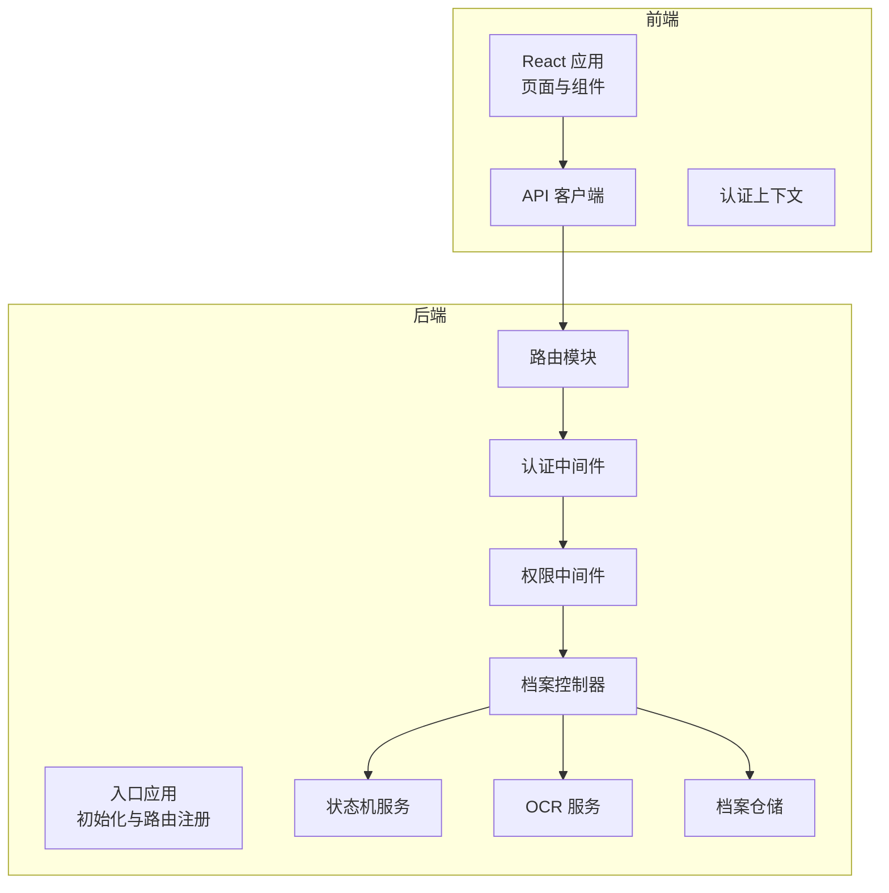
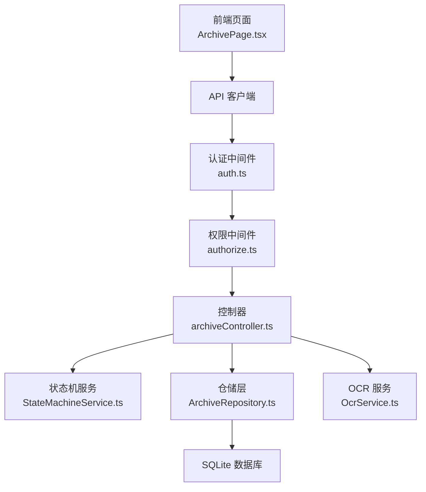
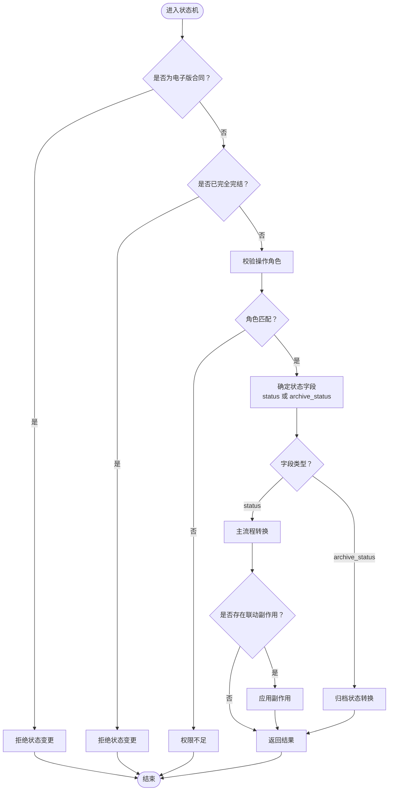
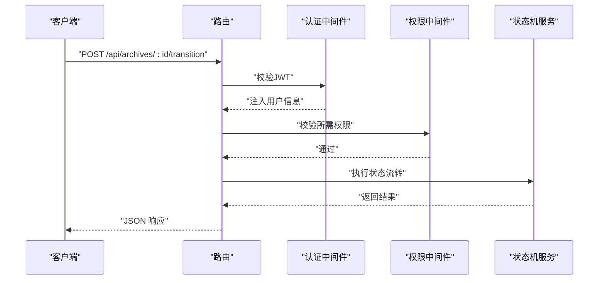
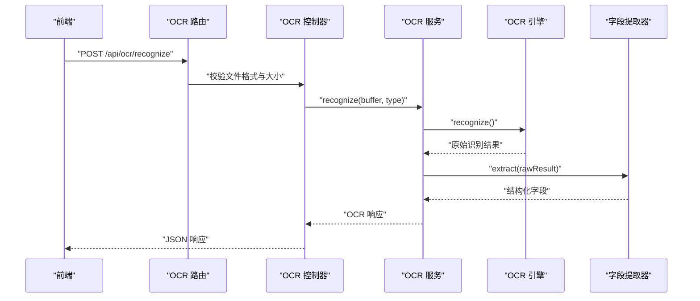
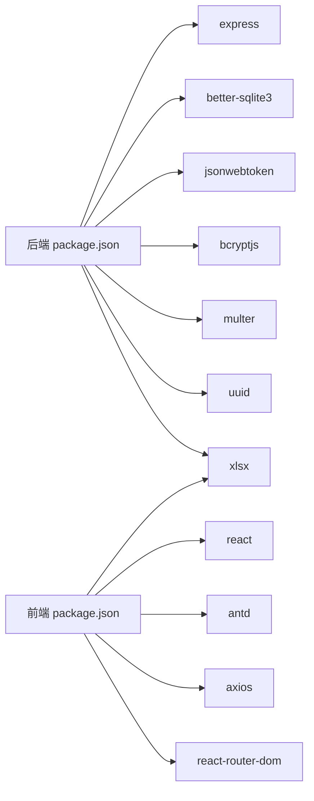

# 项目概述

<cite>
**本文引用的文件**
- [backend/package.json](file://backend/package.json)
- [frontend/package.json](file://frontend/package.json)
- [backend/src/index.ts](file://backend/src/index.ts)
- [shared/types.ts](file://shared/types.ts)
- [backend/src/services/StateMachineService.ts](file://backend/src/services/StateMachineService.ts)
- [backend/src/controllers/archiveController.ts](file://backend/src/controllers/archiveController.ts)
- [backend/src/models/ArchiveRepository.ts](file://backend/src/models/ArchiveRepository.ts)
- [backend/src/routes/archive.ts](file://backend/src/routes/archive.ts)
- [backend/src/services/OcrService.ts](file://backend/src/services/OcrService.ts)
- [backend/src/controllers/ocrController.ts](file://backend/src/controllers/ocrController.ts)
- [backend/src/middlewares/auth.ts](file://backend/src/middlewares/auth.ts)
- [backend/src/middlewares/authorize.ts](file://backend/src/middlewares/authorize.ts)
- [frontend/src/pages/ArchivePage.tsx](file://frontend/src/pages/ArchivePage.tsx)
- [frontend/src/hooks/useAuth.tsx](file://frontend/src/hooks/useAuth.tsx)
</cite>

## 目录
1. [引言](#引言)
2. [项目结构](#项目结构)
3. [核心组件](#核心组件)
4. [架构总览](#架构总览)
5. [详细组件分析](#详细组件分析)
6. [依赖关系分析](#依赖关系分析)
7. [性能考虑](#性能考虑)
8. [故障排除指南](#故障排除指南)
9. [结论](#结论)
10. [附录](#附录)

## 引言
本项目是一个基于前后端分离架构的文件管理系统，专注于纸质合同与电子合同的全生命周期管理。系统采用状态机驱动的业务流程，确保合同状态流转的合法性与可追溯性；通过多角色权限模型实现精细化的访问控制；集成OCR智能识别能力，辅助扫描件字段抽取与导入。后端使用Express.js + TypeScript构建REST API，前端采用React + Ant Design实现交互界面，二者通过HTTP API通信。

系统目标：
- 提供统一的合同档案管理平台，覆盖纸质与电子两类合同。
- 以状态机为核心，规范主流程与归档流程的状态转换。
- 通过JWT认证与权限中间件保障数据安全与操作合规。
- 提供OCR识别能力，提升扫描件处理效率与准确性。
- 通过前后端分离设计，提升开发效率与可维护性。

## 项目结构
项目采用典型的前后端分离布局：
- backend：Express后端服务，包含控制器、服务层、数据访问层、中间件、路由与数据库初始化。
- frontend：React前端应用，包含页面组件、API客户端、认证上下文与路由配置。
- shared：前后端共享的类型定义与常量，保证接口一致性。
- start.ps1/start.sh：一键启动脚本，便于本地开发与测试。

图表来源
- [backend/src/index.ts:1-39](file://backend/src/index.ts#L1-L39)
- [backend/src/routes/archive.ts:1-42](file://backend/src/routes/archive.ts#L1-L42)
- [backend/src/middlewares/auth.ts:1-56](file://backend/src/middlewares/auth.ts#L1-L56)
- [backend/src/middlewares/authorize.ts:1-47](file://backend/src/middlewares/authorize.ts#L1-L47)
- [backend/src/controllers/archiveController.ts:1-448](file://backend/src/controllers/archiveController.ts#L1-L448)
- [backend/src/services/StateMachineService.ts:1-253](file://backend/src/services/StateMachineService.ts#L1-L253)
- [backend/src/models/ArchiveRepository.ts:1-307](file://backend/src/models/ArchiveRepository.ts#L1-L307)
- [backend/src/services/OcrService.ts:1-192](file://backend/src/services/OcrService.ts#L1-L192)

章节来源
- [backend/src/index.ts:1-39](file://backend/src/index.ts#L1-L39)
- [backend/src/routes/archive.ts:1-42](file://backend/src/routes/archive.ts#L1-L42)
- [frontend/package.json:1-35](file://frontend/package.json#L1-L35)
- [backend/package.json:1-41](file://backend/package.json#L1-L41)

## 核心组件
- 状态机服务：负责主流程状态与归档状态的合法转换，内置角色-动作映射与联动副作用处理。
- 档案控制器：提供Excel导入、模板下载、查询、详情、单条/批量状态流转、创建与编辑等接口。
- 档案仓储：封装SQL查询与更新，支持多条件分页查询与唯一性约束校验。
- OCR服务：抽象引擎与字段提取器，提供默认Mock实现，便于替换真实OCR服务。
- 认证与权限中间件：JWT解码与校验，角色到权限映射，细粒度权限控制。
- 前端页面与认证上下文：提供归档确认页面、状态标签展示、登录状态持久化与权限判定。

章节来源
- [backend/src/services/StateMachineService.ts:1-253](file://backend/src/services/StateMachineService.ts#L1-L253)
- [backend/src/controllers/archiveController.ts:1-448](file://backend/src/controllers/archiveController.ts#L1-L448)
- [backend/src/models/ArchiveRepository.ts:1-307](file://backend/src/models/ArchiveRepository.ts#L1-L307)
- [backend/src/services/OcrService.ts:1-192](file://backend/src/services/OcrService.ts#L1-L192)
- [backend/src/middlewares/auth.ts:1-56](file://backend/src/middlewares/auth.ts#L1-L56)
- [backend/src/middlewares/authorize.ts:1-47](file://backend/src/middlewares/authorize.ts#L1-L47)
- [frontend/src/pages/ArchivePage.tsx:1-181](file://frontend/src/pages/ArchivePage.tsx#L1-L181)
- [frontend/src/hooks/useAuth.tsx:1-90](file://frontend/src/hooks/useAuth.tsx#L1-L90)

## 架构总览
系统采用经典的三层架构：
- 表现层（前端React）：负责UI渲染、用户交互与API调用。
- 业务层（后端Express）：处理业务规则、状态机校验、权限控制与数据编排。
- 数据层（better-sqlite3）：提供轻量级本地数据库支持，满足中小规模数据管理需求。

图表来源
- [frontend/src/pages/ArchivePage.tsx:1-181](file://frontend/src/pages/ArchivePage.tsx#L1-L181)
- [backend/src/middlewares/auth.ts:1-56](file://backend/src/middlewares/auth.ts#L1-L56)
- [backend/src/middlewares/authorize.ts:1-47](file://backend/src/middlewares/authorize.ts#L1-L47)
- [backend/src/controllers/archiveController.ts:1-448](file://backend/src/controllers/archiveController.ts#L1-L448)
- [backend/src/services/StateMachineService.ts:1-253](file://backend/src/services/StateMachineService.ts#L1-L253)
- [backend/src/models/ArchiveRepository.ts:1-307](file://backend/src/models/ArchiveRepository.ts#L1-L307)
- [backend/src/services/OcrService.ts:1-192](file://backend/src/services/OcrService.ts#L1-L192)

## 详细组件分析

### 状态机驱动的业务流程
系统围绕两条状态线：
- 主流程状态（8个状态值）：从“待分支机构寄出”到“完结”，贯穿运营与分支协作。
- 综合部归档状态（4个状态值）：从“归档待启动”到“已归档-完结”，体现行政归档环节。

状态机特性：
- 合法转换表：明确每个状态下允许的动作及其目标状态。
- 角色-动作映射：不同动作需要特定角色执行，防止越权操作。
- 联动副作用：如“审核通过”自动激活归档流程；“回寄确认”根据归档状态决定后续路径或完结。

图表来源
- [backend/src/services/StateMachineService.ts:96-253](file://backend/src/services/StateMachineService.ts#L96-L253)

章节来源
- [backend/src/services/StateMachineService.ts:1-253](file://backend/src/services/StateMachineService.ts#L1-L253)
- [shared/types.ts:14-43](file://shared/types.ts#L14-L43)

### 多角色权限控制
- 角色定义：operator（运营）、branch（分支）、general_affairs（综合部）。
- 权限映射：每个角色具备一组权限，控制器通过authorize中间件进行校验。
- 数据隔离：分支用户只能看到本营业部的数据，由服务层在查询时注入过滤条件。

图表来源
- [backend/src/routes/archive.ts:1-42](file://backend/src/routes/archive.ts#L1-L42)
- [backend/src/middlewares/auth.ts:1-56](file://backend/src/middlewares/auth.ts#L1-L56)
- [backend/src/middlewares/authorize.ts:1-47](file://backend/src/middlewares/authorize.ts#L1-L47)
- [backend/src/services/StateMachineService.ts:96-253](file://backend/src/services/StateMachineService.ts#L96-L253)

章节来源
- [backend/src/middlewares/auth.ts:1-56](file://backend/src/middlewares/auth.ts#L1-L56)
- [backend/src/middlewares/authorize.ts:1-47](file://backend/src/middlewares/authorize.ts#L1-L47)
- [frontend/src/hooks/useAuth.tsx:27-32](file://frontend/src/hooks/useAuth.tsx#L27-L32)

### OCR智能识别功能
- 接口职责：接收扫描件（JPG/PNG/PDF），校验格式与大小，调用OCR服务返回结构化字段。
- 服务设计：IOcrEngine与IOcrFieldExtractor接口解耦引擎与字段提取逻辑，支持替换真实OCR实现。
- 默认实现：Mock引擎返回固定文本，字段提取器通过正则匹配与置信度评估输出结果。

图表来源
- [backend/src/controllers/ocrController.ts:1-94](file://backend/src/controllers/ocrController.ts#L1-L94)
- [backend/src/services/OcrService.ts:157-192](file://backend/src/services/OcrService.ts#L157-L192)

章节来源
- [backend/src/controllers/ocrController.ts:1-94](file://backend/src/controllers/ocrController.ts#L1-L94)
- [backend/src/services/OcrService.ts:1-192](file://backend/src/services/OcrService.ts#L1-L192)

### 前后端分离与MVC架构
- MVC模式：
  - Model：ArchiveRepository封装数据访问与查询。
  - View：React页面组件负责展示与交互。
  - Controller：Express控制器处理请求、调用服务与返回响应。
- 前端职责：页面渲染、状态管理、API调用、权限判定与本地存储。
- 后端职责：认证鉴权、权限校验、业务规则（状态机）、数据持久化与接口暴露。

章节来源
- [backend/src/models/ArchiveRepository.ts:1-307](file://backend/src/models/ArchiveRepository.ts#L1-L307)
- [frontend/src/pages/ArchivePage.tsx:1-181](file://frontend/src/pages/ArchivePage.tsx#L1-L181)
- [backend/src/controllers/archiveController.ts:1-448](file://backend/src/controllers/archiveController.ts#L1-L448)

## 依赖关系分析
- 技术栈：
  - 后端：Express、better-sqlite3、bcryptjs、jsonwebtoken、multer、uuid、xlsx。
  - 前端：React、Ant Design、axios、react-router-dom、xlsx。
- 关键依赖：
  - JWT：用于用户认证与会话管理。
  - better-sqlite3：轻量级数据库，适合中小规模部署。
  - multer：处理文件上传（Excel与扫描件）。
  - xlsx：Excel导入导出与模板生成。
- 前后端共享类型：通过shared/types.ts统一状态、权限、接口定义，降低耦合。

图表来源
- [backend/package.json:14-22](file://backend/package.json#L14-L22)
- [frontend/package.json:12-18](file://frontend/package.json#L12-L18)

章节来源
- [backend/package.json:1-41](file://backend/package.json#L1-L41)
- [frontend/package.json:1-35](file://frontend/package.json#L1-L35)

## 性能考虑
- 数据库优化：仓储层使用索引友好字段（如资金账号、营业部、状态、日期范围）进行查询，建议在生产环境为高频查询字段建立索引。
- 分页策略：查询接口支持分页，避免一次性加载大量数据。
- 文件上传：对Excel与扫描件进行格式、大小校验，减少无效请求带来的资源消耗。
- 状态机计算：状态转换逻辑简单直接，性能开销极小；批量操作建议前端合并请求，减少网络往返。
- 前端渲染：表格组件按需渲染，分页切换时清空选择状态，降低DOM压力。

## 故障排除指南
常见问题与定位思路：
- 未提供认证令牌或令牌无效：检查Authorization头是否以Bearer开头，确认令牌未过期。
- 权限不足：确认用户角色是否具备所需权限，或是否满足分支数据隔离条件。
- 状态流转失败：检查当前记录状态是否允许该动作，确认合同版本类型与完结状态保护。
- Excel导入失败：确认文件扩展名为.xlsx或.xls，字段顺序与模板一致。
- OCR识别失败：检查文件格式（JPG/PNG/PDF）、大小限制与清晰度。

章节来源
- [backend/src/middlewares/auth.ts:26-55](file://backend/src/middlewares/auth.ts#L26-L55)
- [backend/src/middlewares/authorize.ts:16-46](file://backend/src/middlewares/authorize.ts#L16-L46)
- [backend/src/controllers/archiveController.ts:208-258](file://backend/src/controllers/archiveController.ts#L208-L258)
- [backend/src/controllers/ocrController.ts:43-93](file://backend/src/controllers/ocrController.ts#L43-L93)

## 结论
本项目以状态机为核心，结合多角色权限与OCR能力，构建了覆盖纸质与电子合同全生命周期的管理方案。前后端分离与清晰的MVC分层使系统易于扩展与维护。通过共享类型定义与严格的中间件校验，保障了接口一致性与安全性。建议在生产环境中进一步完善数据库索引、引入缓存与异步任务队列，并替换Mock OCR为稳定可靠的第三方服务。

## 附录

### 快速开始指南
- 环境要求
  - Node.js（后端）
  - 浏览器（前端）
- 安装步骤
  - 后端：进入backend目录，安装依赖并启动开发服务器。
  - 前端：进入frontend目录，安装依赖并启动开发服务器。
- 基本使用示例
  - 登录：使用提供的测试账号（密码均为123456）进行登录。
  - 导入：在档案页面下载模板，填写后上传Excel批量导入。
  - 归档：在“归档确认”页面勾选待入库记录，点击“确认入库”。

章节来源
- [backend/src/index.ts:22-36](file://backend/src/index.ts#L22-L36)
- [frontend/src/pages/ArchivePage.tsx:44-58](file://frontend/src/pages/ArchivePage.tsx#L44-L58)

### 关键概念解释（面向初学者）
- 状态机：一种数学模型，描述对象在不同状态之间的转换规则。本项目用它严格控制合同状态流转的合法性。
- JWT认证：基于令牌的无状态认证方式，后端验证令牌有效性并将用户信息注入请求上下文。
- MVC架构：Model（数据模型）、View（视图/界面）、Controller（控制器）分层，职责清晰，便于维护与扩展。

### 最佳实践（面向有经验开发者）
- 将真实OCR服务接入OcrService接口，确保字段提取的稳定性与准确率。
- 在仓储层增加事务与并发控制，保证批量状态流转的一致性。
- 对外暴露的接口增加速率限制与防刷机制，提升系统抗压能力。
- 使用覆盖率工具与单元测试持续完善测试矩阵，尤其是状态机与权限中间件。