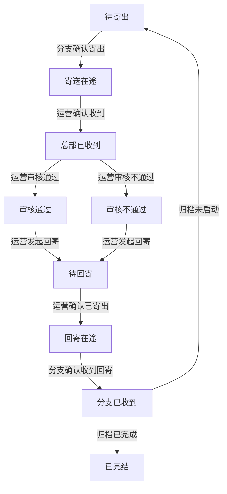

# 档案管理系统

## 一、系统简介

本系统用于管理金融机构**客户开户合同**的全生命周期，涵盖合同从创建、寄送、审核、归档到完结的完整业务流程。

### 业务背景

- 客户在营业部开户后会签署开户合同
- **纸质合同**需要从分支机构寄送到总部进行审核，审核后回寄并归档
- **电子合同**线上签署，无需物理流转，创建即完结
- 系统需要追踪每一份合同的流转状态，记录所有操作历史

---

## 二、用户角色

系统涉及三类用户角色，各司其职：

| 角色 | 部门 | 主要职责 |
|------|------|----------|
| **运营人员** | 总部运营部 | 数据录入、收件确认、合同审核、回寄操作、转交归档、OCR 识别 |
| **分支机构** | 各地营业部 | 寄出合同、接收回寄的合同 |
| **综合部** | 总部综合部 | 纸质档案入库归档 |

### 数据可见范围

| 角色 | 可查看的数据 |
|------|--------------|
| 运营人员 | 全部档案 |
| 分支机构 | **仅本营业部**的档案 |
| 综合部 | 全部档案（主要关注待归档的） |

---

## 三、档案记录字段

每条档案记录包含以下信息：

| 字段 | 说明 | 示例 |
|------|------|------|
| 客户姓名 | 开户客户的姓名 | 张三 |
| 资金账号 | 客户唯一标识，**系统内不可重复** | 6001234567 |
| 营业部 | 客户开户的营业部 | 上海营业部 |
| 合同类型 | 业务类型 | 股票开户、融资融券 |
| 开户日期 | 客户开户的日期 | 2026-03-01 |
| 合同版本类型 | **电子版**或**纸质版** | 纸质版 |
| 主流程状态 | 当前所处的流转阶段 | 待寄出、审核通过等 |
| 归档状态 | 综合部归档进度 | 待转交、已归档等 |

---

## 四、合同版本类型

系统区分两种合同版本，处理方式完全不同：

### 电子版合同

- 线上签署的电子合同
- **无需物理流转**，不涉及寄送、审核、回寄
- 创建时直接标记为"已归档"状态，**创建即完结**
- 仅作为存档记录保留

### 纸质版合同

- 线下签署的纸质合同
- 需要经历完整的**寄送 → 审核 → 回寄 → 归档**流程
- 涉及分支机构、运营人员、综合部三方协作
- 详见下文"业务流程"章节

---

## 五、业务流程（纸质版合同）

纸质版合同需要经历两个并行的流程：

### 5.1 主流程（物理流转）

追踪合同的**物理位置**，从分支寄出到总部再回到分支。



**状态说明：**

| 状态 | 含义 | 合同物理位置 |
|------|------|--------------|
| 待寄出 | 等待分支机构寄出 | 分支机构 |
| 寄送在途 | 已寄出，快递运输中 | 快递途中（→总部） |
| 总部已收到 | 运营确认收到，待审核 | 总部运营 |
| 审核通过 | 审核无误 | 总部运营 |
| 审核不通过 | 审核发现问题，需退回修改 | 总部运营 |
| 待回寄 | 审核完成，准备回寄 | 总部运营 |
| 回寄在途 | 已寄出，快递运输中 | 快递途中（→分支） |
| 分支已收到 | 分支确认收到回寄 | 分支机构 |
| 已完结 | 流程全部结束 | 分支机构 |

---

### 5.2 归档流程（内部流转）

追踪合同在**总部内部**的归档进度，从运营转交到综合部入库。


**状态说明：**

| 状态 | 含义 | 下一步操作 |
|------|------|------------|
| 归档待启动 | 尚未进入归档流程 | 等待审核通过 |
| 待转交 | 审核通过，等待运营转交 | 运营执行"转交综合部" |
| 待入库 | 已转交，等待综合部入库 | 综合部执行"确认入库" |
| 已归档 | 归档完成 | 无 |

---

### 5.3 两个流程的关联

主流程和归档流程**相互独立但有联动**：

| 触发条件 | 联动效果 |
|----------|----------|
| 运营"审核通过" | 归档状态自动从"归档待启动"变为"待转交" |
| 分支"确认收到回寄" + 归档状态="已归档" | 主流程状态自动变为"已完结" |
| 分支"确认收到回寄" + 归档状态="归档待启动" | 主流程状态自动回退到"待寄出"（审核不通过路径） |

---

## 六、操作权限

### 6.1 各角色可执行的操作

| 操作 | 运营人员 | 分支机构 | 综合部 |
|------|:--------:|:--------:|:------:|
| 导入档案数据 | ✓ | | |
| 新建档案 | ✓ | | |
| 编辑档案 | ✓ | | |
| 确认寄出 | | ✓ | |
| 确认收到（总部收件） | ✓ | | |
| 审核通过 | ✓ | | |
| 审核不通过 | ✓ | | |
| 发起回寄 | ✓ | | |
| 确认已寄出（回寄） | ✓ | | |
| 确认收到回寄 | | ✓ | |
| 转交综合部 | ✓ | | |
| 确认入库 | | | ✓ |
| OCR 识别 | ✓ | | |

### 6.2 操作前置条件

每个操作只能在特定状态下执行：

| 操作 | 要求的当前状态 | 执行后状态 |
|------|----------------|------------|
| 确认寄出 | 待寄出 | 寄送在途 |
| 确认收到 | 寄送在途 | 总部已收到 |
| 审核通过 | 总部已收到 | 审核通过 |
| 审核不通过 | 总部已收到 | 审核不通过 |
| 发起回寄 | 审核通过 或 审核不通过 | 待回寄 |
| 确认已寄出 | 待回寄 | 回寄在途 |
| 确认收到回寄 | 回寄在途 | 分支已收到（或自动流转） |
| 转交综合部 | 归档状态=待转交 | 归档状态=待入库 |
| 确认入库 | 归档状态=待入库 | 归档状态=已归档 |

---

## 七、典型业务场景

### 场景一：纸质合同正常流程（审核通过）

```
1. 运营人员导入一批档案数据
   → 状态：待寄出 | 归档待启动

2. 分支机构将合同寄出，在系统中"确认寄出"
   → 状态：寄送在途 | 归档待启动

3. 总部收到快递，运营人员"确认收到"
   → 状态：总部已收到 | 归档待启动

4. 运营人员审核合同，"审核通过"
   → 状态：审核通过 | 待转交（自动联动）

5. 运营人员将合同原件"转交综合部"
   → 状态：审核通过 | 待入库

6. 综合部收到合同，"确认入库"
   → 状态：审核通过 | 已归档

7. 运营人员"发起回寄"（寄回合同副本给分支）
   → 状态：待回寄 | 已归档

8. 运营人员将合同副本寄出，"确认已寄出"
   → 状态：回寄在途 | 已归档

9. 分支收到回寄，"确认收到回寄"
   → 状态：已完结 | 已归档（因归档已完成，自动完结）
```

### 场景二：纸质合同审核不通过流程

```
1. 运营人员导入档案数据
   → 状态：待寄出 | 归档待启动

2. 分支机构"确认寄出"
   → 状态：寄送在途 | 归档待启动

3. 运营人员"确认收到"
   → 状态：总部已收到 | 归档待启动

4. 运营人员发现问题，"审核不通过"
   → 状态：审核不通过 | 归档待启动（归档流程未启动）

5. 运营人员"发起回寄"
   → 状态：待回寄 | 归档待启动

6. 运营人员"确认已寄出"
   → 状态：回寄在途 | 归档待启动

7. 分支收到回寄，"确认收到回寄"
   → 状态：待寄出 | 归档待启动（因归档未启动，自动回退重新开始）

8. 分支修改合同后重新寄出，循环上述流程...
```

### 场景三：电子版合同

```
1. 运营人员导入/新建电子版档案
   → 状态：无（电子版无主流程） | 已归档

2. 流程结束，仅作为存档记录
```

---

## 八、功能模块

### 8.1 数据导入（运营人员）

- **下载模板**：获取标准 Excel 模板
- **上传导入**：批量导入档案数据
- **导入校验**：
  - 必填字段完整性检查
  - 合同版本类型值域检查（电子版/纸质版）
  - 资金账号唯一性检查（文件内 + 数据库）
- **导入结果**：显示成功数、失败数及具体错误原因

### 8.2 审核分发（运营人员）

- **档案查询**：多条件组合搜索（客户姓名、资金账号、状态等）
- **新建档案**：手动创建单条档案记录
- **编辑档案**：修改档案基本信息
- **批量操作**：
  - 批量确认收到
  - 批量审核通过/不通过
  - 批量发起回寄
  - 批量确认已寄出
  - 批量转交综合部
- **查看详情**：查看档案完整信息及状态变更历史

### 8.3 OCR 识别（运营人员）

- **上传扫描件**：支持图片格式
- **自动识别**：提取客户姓名、资金账号、营业部等字段
- **人工复核**：对低置信度字段进行修正
- **保存为档案**：确认后创建档案记录

### 8.4 寄送确认（分支机构）

- **查看本营业部档案**：仅显示本营业部的数据
- **批量确认寄出**：选择"待寄出"状态的档案，确认已寄出
- **批量确认收到回寄**：选择"回寄在途"状态的档案，确认已收到

### 8.5 档案入库（综合部）

- **查看待归档档案**：显示"待入库"状态的档案
- **批量确认入库**：选择档案，确认已入库归档

---

## 九、操作审计

系统自动记录所有状态变更操作：

| 记录内容 | 说明 |
|----------|------|
| 操作时间 | 精确到秒 |
| 操作人 | 执行操作的用户 |
| 操作类型 | 确认寄出、审核通过等 |
| 状态变更 | 从什么状态变为什么状态 |

在档案详情页面可查看完整的状态变更历史，按时间倒序排列。

---

## 十、业务规则汇总

### 10.1 电子版合同限制

- 电子版合同**不可执行任何状态流转操作**
- 创建时自动设为完结状态

### 10.2 已完结档案限制

- 已完结的档案**不可执行任何状态流转操作**
- 已完结的档案**不可编辑**

### 10.3 资金账号唯一性

- 资金账号在系统内**全局唯一**
- 导入时校验：文件内不可重复 + 数据库不可重复
- 编辑时校验：修改后的资金账号不可与其他记录冲突

### 10.4 分支机构数据隔离

- 分支机构用户登录后，**只能看到本营业部**的档案
- 查询条件自动附加营业部过滤

---

## 附录：测试账号

| 用户名 | 密码 | 角色 | 所属营业部 |
|--------|------|------|------------|
| operator | 123456 | 运营人员 | - |
| branch | 123456 | 分支机构 | 上海营业部 |
| general | 123456 | 综合部 | - |
